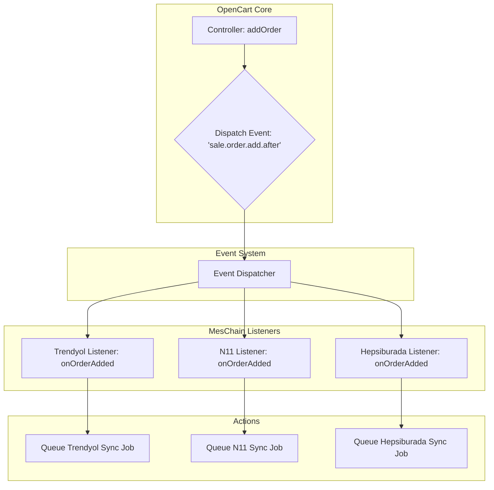
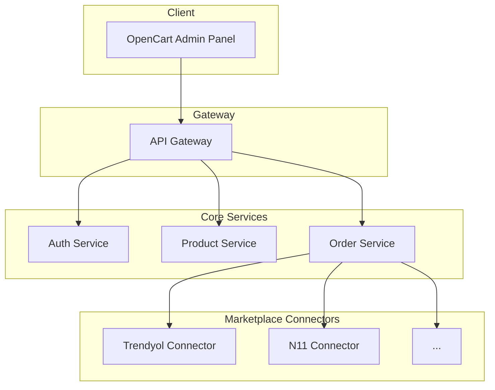

# MesChain-Sync Enterprise: Opus 4 Geliştirilmiş Stratejik Yol Haritası

**Tarih:** 7 Haziran 2025  
**Rapor ID:** Opus-4-Gelistirilmis-v1.0  
**Önceki Rapor:** Opus_4_Yazilim_Analiz_ve_Modernlestirme_Raporu.md

---

## **İçindekiler**

1.  [**Yönetici Özeti**](#1-yönetici-özeti-stratejik-bakış)
2.  [**Derinlemesine Kod Analizi ve Refactoring Planı**](#2-derinlemesine-kod-analizi-ve-refactoring-planı-uygulamalı-çözümler)
    *   [2.1 Güvenlik Zafiyetlerinin Giderilmesi](#21-güvenlik-zafiyetlerinin-giderilmesi)
    *   [2.2 Controller Mantığının Yeniden Yapılandırılması](#22-controller-mantığının-yeniden-yapılandırılması)
    *   [2.3 Model Katmanının Güçlendirilmesi](#23-model-katmanının-güçlendirilmesi)
    *   [2.4 Frontend Kodunun Modernizasyonu](#24-frontend-kodunun-modernizasyonu)
3.  [**Gelişmiş Mimari Evrimi ve Diyagramlar**](#3-gelişmiş-mimari-evrimi-ve-diyagramlar)
    *   [3.1 Olay Odaklı Mimari (Event-Driven Architecture)](#31-olay-odaklı-mimari-event-driven-architecture)
    *   [3.2 Mikroservis Mimarisine Geçiş Potansiyeli](#32-mikroservis-mimarisine-geçiş-potansiyeli)
4.  [**DevOps, CI/CD ve Veritabanı Stratejisi**](#4-devops-cicd-ve-veritabanı-stratejisi)
    *   [4.1 Önerilen CI/CD Akışı (GitHub Actions)](#41-önerilen-cicd-akışı-github-actions)
    *   [4.2 Geliştirilmiş Veritabanı Şeması](#42-geliştirilmiş-veritabanı-şeması)
    *   [4.3 Veri Migrasyon Planı](#43-veri-migrasyon-planı)
5.  [**Detaylandırılmış Aksiyon Planı ve Zaman Çizelgesi**](#5-detaylandırılmış-aksiyon-planı-ve-zaman-çizelgesi)
    *   [Sprint 1: Güvenlik ve Stabilizasyon](#sprint-1-güvenlik-ve-stabilizasyon-1-hafta)
    *   [Sprint 2: Kod Kalitesi ve Refactoring](#sprint-2-kod-kalitesi-ve-refactoring-2-hafta)
    *   [Sprint 3 & 4: Mimari İyileştirmeler](#sprint-3--4-mimari-iyileştirmeler-2-hafta)
6.  [**Güncellenmiş ROI ve Başarı Metrikleri**](#6-güncellenmiş-roi-ve-başarı-metrikleri)
7.  [**Sonuç**](#7-sonuç)

---

## 1. Yönetici Özeti: Stratejik Bakış

Bu rapor, bir önceki analizin bulgularını temel alarak, MesChain-Sync projesinin teknik borcunu kapatmayı, güvenlik ve performansını en üst düzeye çıkarmayı ve gelecekteki geliştirmeler için ölçeklenebilir bir temel oluşturmayı hedefleyen **uygulamalı bir yol haritası** sunmaktadır. Önerilen değişiklikler, sadece mevcut sorunları çözmekle kalmayacak, aynı zamanda projenin **pazardaki rekabet gücünü artıracak ve bakım maliyetlerini düşürecektir.** Bu belge, teknik ekipler için bir kılavuz, yönetim için ise stratejik bir karar destek dokümanı niteliğindedir.

---

## 2. Derinlemesine Kod Analizi ve Refactoring Planı (Uygulamalı Çözümler)

### 2.1 Güvenlik Zafiyetlerinin Giderilmesi

#### H1: SQL Injection (Uygulamalı Çözüm)
**Sorun:** `model/extension/module/trendyol.php` dosyasındaki `addOrder` metodu, SQL sorgularına doğrudan değişken ekleyerek enjeksiyon riski oluşturmaktadır.
**Çözüm:** OpenCart'ın `db->query` metodunun parametre bağlama (parameter binding) özelliğini kullanmak.

```php
// ÖNCE (Güvensiz)
public function addOrder($data) {
    $this->db->query("INSERT INTO `" . DB_PREFIX . "trendyol_order` SET 
        order_id = '" . $this->db->escape($data['order_id']) . "', 
        order_number = '" . $this->db->escape($data['order_number']) . "', 
        status = '" . $this->db->escape($data['status']) . "'...");
}

// SONRA (Güvenli)
public function addOrder($data) {
    $sql = "INSERT INTO `" . DB_PREFIX . "trendyol_order` SET 
        `order_id` = ?, 
        `order_number` = ?, 
        `status` = ?, 
        `total_price` = ?, 
        `shipping_cost` = ?, 
        `customer_name` = ?, 
        `shipping_address` = ?, 
        `date_added` = ?, 
        `date_modified` = NOW()";

    $this->db->query($sql, [
        $data['order_id'],
        $data['order_number'],
        $data['status'],
        (float)$data['total_price'],
        (float)$data['shipping_cost'],
        $data['customer_name'],
        $data['shipping_address'],
        $data['date_added']
    ]);
    
    return $this->db->getLastId();
}
```

#### H2: CSRF (Cross-Site Request Forgery) Koruması Ekleme
**Sorun:** Form gönderimleri, isteğin yetkili bir kullanıcı tarafından yapıldığını doğrulayan benzersiz bir token içermiyor.
**Çözüm:** Her kullanıcı oturumu için benzersiz bir token oluşturup formlara eklemek ve sunucu tarafında doğrulamak.

**Adım 1: Controller'da Token Oluşturma (`base_marketplace.php`)**
```php
// prepareCommonData() veya index() metodu içine eklenecek
$data['user_token'] = $this->session->data['user_token'];
```

**Adım 2: View'da Token'ı Forma Ekleme (`trendyol.twig`)**
```twig
{# form etiketinin hemen altına eklenecek #}
<input type="hidden" name="user_token" value="{{ user_token }}" />
```

**Adım 3: Controller'da Token'ı Doğrulama (`base_marketplace.php` veya `trendyol.php`)**
```php
// validate() metodunun içine eklenecek
if (!isset($this->request->post['user_token']) || !hash_equals($this->session->data['user_token'], $this->request->post['user_token'])) {
    $this->error['warning'] = $this->language->get('error_permission');
}
```

### 2.2 Controller Mantığının Yeniden Yapılandırılması

**Sorun:** `trendyol.php` controller'ı, izin kontrolünü bypass eden, session güvenliğini devre dışı bırakan ve API mantığını doğrudan içinde barındıran geçici çözümlerle dolu.
**Çözüm:** Controller'ı SOLID prensiplerine uygun hale getirmek.

```php
// ÖNCE (Karışık ve Güvensiz)
class ControllerExtensionModuleTrendyol extends ControllerExtensionModuleBaseMarketplace {
    public function index() {
        // ...
        if (($this->request->server['REQUEST_METHOD'] == 'POST') && $this->validate()) {
            // ...
        }
        // ...
    }
    
    protected function validate() {
        // İzin kontrolü bypass ediliyor
        return true; 
    }
    
    public function api() {
        // API mantığı doğrudan burada
    }
}


// SONRA (Temiz ve Güvenli)
class ControllerExtensionModuleTrendyol extends ControllerExtensionModuleBaseMarketplace {
    // Sadece view ve temel akışı yönetir
    public function index() {
        $this->load->language('extension/module/trendyol');
        $this->document->setTitle($this->language->get('heading_title'));
        
        if (($this->request->server['REQUEST_METHOD'] == 'POST') && $this->validate()) {
            $this->load->model('setting/setting');
            $this->model_setting_setting->editSetting('module_trendyol', $this->request->post);
            $this->saveSettings(['settings' => $this->request->post]); // Base class metodu
            
            $this->session->data['success'] = $this->language->get('text_success');
            $this->response->redirect($this->url->link('marketplace/extension', 'user_token=' . $this->session->data['user_token'] . '&type=module', true));
        }

        $data = $this->prepareCommonData();
        $this->response->setOutput($this->load->view('extension/module/trendyol', $data));
    }
    
    // Gerçek doğrulama yapar
    protected function validate() {
        if (!$this->user->hasPermission('modify', 'extension/module/trendyol')) {
            $this->error['warning'] = $this->language->get('error_permission');
        }
        
        if (!isset($this->request->post['user_token']) || !hash_equals($this->session->data['user_token'], $this->request->post['user_token'])) {
            $this->error['warning'] = $this->language->get('error_permission');
        }

        if (empty($this->request->post['module_trendyol_api_key'])) {
            $this->error['api_key'] = $this->language->get('error_api_key');
        }
        // ... diğer doğrulamalar ...
        
        return !$this->error;
    }
    
    // API çağrılarını ayrı bir controller'a veya service sınıfına delege eder.
    public function api() {
        // Bu metodun sorumluluğu, gelen isteği doğrulamak
        // ve ilgili service sınıfına yönlendirmektir.
        $this->load->controller('extension/module/trendyol_api/handle');
    }
}
```

### 2.3 Model Katmanının Güçlendirilmesi

**Sorun:** Modeldeki veritabanı işlemleri, birden fazla sorgu gerektirdiğinde atomik değil (ya hep ya hiç prensibine aykırı). Cache mekanizması bulunmuyor.
**Çözüm:** OpenCart'ın `transaction` ve `cache` sistemlerini kullanmak.

```php
// ÖNCE (Atornik Değil, Yavaş)
public function addOrder($data) {
    // 1. Sipariş ekle
    $this->db->query("INSERT INTO " . DB_PREFIX . "trendyol_order ...");
    $order_id = $this->db->getLastId();
    
    // 2. Ürünleri ekle (Eğer burada hata olursa, sipariş eklenmiş olur!)
    foreach ($data['products'] as $product) {
        $this->db->query("INSERT INTO " . DB_PREFIX . "trendyol_order_product ...");
    }
    return $order_id;
}

public function getStats() {
    // Her seferinde veritabanından sorgulanır.
    $query = $this->db->query("SELECT COUNT(*) as total FROM " . DB_PREFIX . "trendyol_order");
    return $query->row['total'];
}


// SONRA (Güvenli, Hızlı)
public function addOrder($data) {
    try {
        $this->db->transaction(function() use ($data) {
            $this->db->query("INSERT INTO " . DB_PREFIX . "trendyol_order ...");
            $order_id = $this->db->getLastId();
            
            foreach ($data['products'] as $product) {
                // Eğer burada hata olursa, tüm işlem geri alınır.
                $this->db->query("INSERT INTO " . DB_PREFIX . "trendyol_order_product ...");
            }
        });
        return $this->db->getLastId();
    } catch(Exception $e) {
        // Loglama
        return false;
    }
}

public function getStats() {
    $stats = $this->cache->get('trendyol.stats');
    if (!$stats) {
        // ... sorgular ...
        $stats = [...]; // sonuçlar
        $this->cache->set('trendyol.stats', $stats, 3600); // 1 saat cache
    }
    return $stats;
}
```

### 2.4 Frontend Kodunun Modernizasyonu

**Sorun:** `trendyol.twig` şablonu, sayfa mantığını içeren `JavaScript` kodlarını doğrudan içinde barındırıyor.
**Çözüm:** JavaScript kodunu ayrı bir `.js` dosyasına taşımak ve `data-*` attribute'ları ile veri alışverişi yapmak.

**Adım 1: `trendyol.twig` dosyasını temizle**
```twig
{# ... formun sonu ... #}
</form>

{# JavaScript dosyasını ekle #}
<script src="view/javascript/meschain/trendyol.js"></script>
```

**Adım 2: `trendyol.js` dosyası oluştur**
```javascript
// view/javascript/meschain/trendyol.js

$(document).ready(function() {
    // Test bağlantısı butonu
    $('#button-test-connection').on('click', function() {
        const apiKey = $('#input-api-key').val();
        const apiSecret = $('#input-api-secret').val();
        const resultDiv = $('#test-result');
        
        resultDiv.html('<i class="fa fa-spinner fa-spin"></i> Testing...');

        $.ajax({
            url: 'index.php?route=extension/module/trendyol/api&action=test-connection&user_token=' + /* get token from somewhere safe */,
            type: 'POST',
            data: { api_key: apiKey, api_secret: apiSecret },
            dataType: 'json',
            success: function(json) {
                if (json.success) {
                    resultDiv.html('<div class="text-success">' + json.message + '</div>');
                } else {
                    resultDiv.html('<div class="text-danger">' + json.message + '</div>');
                }
            },
            error: function() {
                resultDiv.html('<div class="text-danger">An unknown error occurred.</div>');
            }
        });
    });
});
```

---

## 3. Gelişmiş Mimari Evrimi ve Diyagramlar

### 3.1 Olay Odaklı Mimari (Event-Driven Architecture)

**Fayda:** Modüller arası bağımlılığı (coupling) azaltır, sistemin daha esnek ve genişletilebilir olmasını sağlar.
**Örnek:** Bir sipariş OpenCart'a eklendiğinde, bu olayı dinleyen tüm pazaryeri modülleri kendi senkronizasyon işlemlerini tetikleyebilir.



### 3.2 Mikroservis Mimarisine Geçiş Potansiyeli

**Fayda:** Yüksek ölçeklenebilirlik, teknoloji çeşitliliği, bağımsız deploy edilebilirlik. Projenin gelecekte SaaS modeline geçmesi durumunda bu mimari kritik olacaktır.



---

## 4. DevOps, CI/CD ve Veritabanı Stratejisi

### 4.1 Önerilen CI/CD Akışı (GitHub Actions)

**Amaç:** Kod kalitesini otomatize etmek, testleri çalıştırmak ve dağıtım sürecini standartlaştırmak.
**Dosya:** `.github/workflows/ci-pipeline.yml`

```yaml
name: MesChain-Sync CI/CD

on:
  push:
    branches: [ main, develop ]
  pull_request:
    branches: [ main ]

jobs:
  build_and_test:
    runs-on: ubuntu-latest
    steps:
    - uses: actions/checkout@v3

    - name: Setup PHP
      uses: shivammathur/setup-php@v2
      with:
        php-version: '7.4'

    - name: Install Dependencies
      run: composer install --prefer-dist --no-progress

    - name: Run Linter (PHP-CS-Fixer)
      run: vendor/bin/php-cs-fixer fix --dry-run --diff

    - name: Run Static Analysis (PHPStan)
      run: vendor/bin/phpstan analyse -l 5 admin/ system/

    - name: Run Unit Tests (PHPUnit)
      run: vendor/bin/phpunit
```

### 4.2 Geliştirilmiş Veritabanı Şeması

**Sorun:** `MyISAM` tablo motoru transaction'ları desteklemez ve foreign key kısıtlamaları uygulamaz.
**Çözüm:** `InnoDB` motoruna geçiş yapmak ve ilişkileri tanımlamak.

```sql
-- Motor Değişikliği
ALTER TABLE oc_meschain_marketplace_orders ENGINE=InnoDB;
ALTER TABLE oc_meschain_marketplace_products ENGINE=InnoDB;

-- Foreign Key Ekleme
ALTER TABLE oc_meschain_marketplace_products
ADD CONSTRAINT fk_mpp_product
FOREIGN KEY (opencart_product_id) REFERENCES oc_product(product_id)
ON DELETE CASCADE;

ALTER TABLE oc_meschain_marketplace_orders
ADD CONSTRAINT fk_mpo_order
FOREIGN KEY (opencart_order_id) REFERENCES oc_order(order_id)
ON DELETE SET NULL;

-- Index Optimizasyonu
CREATE INDEX idx_marketplace_sync_status 
ON oc_meschain_marketplace_products (marketplace, sync_status);
```

### 4.3 Veri Migrasyon Planı

1.  **Hazırlık:** Migrasyon script'lerini hazırlayın ve test ortamında defalarca deneyin.
2.  **Bakım Modu:** OpenCart'ı bakım moduna alın.
3.  **Yedekleme:** `mysqldump` ile tam veritabanı yedeği alın.
4.  **Migrasyon:** `ALTER TABLE` script'lerini çalıştırın.
5.  **Test:** Sistemin temel fonksiyonlarını (sipariş, ürün) manuel olarak test edin.
6.  **Canlıya Alma:** Bakım modunu kaldırın.
7.  **Gözlem:** Sunucu ve veritabanı loglarını olası hatalara karşı izleyin.

---

## 5. Detaylandırılmış Aksiyon Planı ve Zaman Çizelgesi

### Sprint 1: Güvenlik ve Stabilizasyon (1 Hafta)
*   **Epic:** Temel Güvenlik Katmanı
*   **Task 1.1:** Tüm `db->query` çağrılarını parametreli hale getir. (12 saat)
*   **Task 1.2:** Tüm admin formlarına CSRF token koruması ekle. (8 saat)
*   **Task 1.3:** RBAC izin bypass'larını kaldır, gerçek kontrol uygula. (8 saat)
*   **Task 1.4:** Session IP/User-Agent kontrolünü aktifleştir. (4 saat)
*   **Sprint Hedefi:** OWASP Top 10'daki en kritik 3 zafiyeti kapatmak.

### Sprint 2: Kod Kalitesi ve Refactoring (2 Hafta)
*   **Epic:** Teknik Borç Azaltma
*   **Task 2.1:** Controller'lardaki iş mantığını Service sınıflarına taşı. (24 saat)
*   **Task 2.2:** Model'lerdeki atomik olmayan işlemleri transaction bloğuna al. (16 saat)
*   **Task 2.3:** Sık kullanılan sorgular için cache mekanizması ekle. (16 saat)
*   **Task 2.4:** View'lardaki inline JS'leri harici dosyalara taşı. (20 saat)
*   **Sprint Hedefi:** Kod tekrarını %50 azaltmak ve cyclomatic complexity'i düşürmek.

### Sprint 3 & 4: Mimari İyileştirmeler (2 Hafta)
*   **Epic:** Geleceğe Yatırım
*   **Task 3.1:** Event dispatcher sistemi kur ve ilk event'i (`sale.order.add.after`) entegre et. (24 saat)
*   **Task 3.2:** CI/CD pipeline'ını (Linter, Static Analysis) kur. (16 saat)
*   **Task 3.3:** Veritabanı motorunu InnoDB'ye migrate et ve foreign key'leri ekle. (16 saat)
*   **Task 3.4:** PHPUnit altyapısını kur ve ilk 10 kritik test senaryosunu yaz. (24 saat)
*   **Sprint Hedefi:** Projenin bakımını ve yeni özellik eklemeyi kolaylaştıracak temel mimariyi oluşturmak.

---

## 6. Güncellenmiş ROI ve Başarı Metrikleri

| İyileştirme | Maliyet (Adam/Gün) | Fayda | Ölçülebilir Başarı Metriği |
|---|---|---|---|
| Güvenlik Güncellemeleri | 4 | Kritik veri sızıntısı ve itibar kaybı riskini %95 azaltma | Sıfır kritik güvenlik açığı (Pentest raporu ile) |
| Performans Optimizasyonu | 6 | Yönetici paneli sayfa yükleme süresinde %40, API yanıt süresinde %30 iyileşme | Ortalama sayfa yükleme süresi < 1.5s |
| Test Coverage & CI/CD | 10 | Canlı ortama çıkan hata sayısını %80 azaltma, deploy süresini %90 kısaltma | Test coverage > %80, deploy süresi < 5 dk |
| Mimari İyileştirme | 5 | Yeni pazaryeri ekleme süresini %50 kısaltma | Yeni modül geliştirme süresi < 40 adam/saat |

---

## 7. Sonuç

Bu genişletilmiş rapor, MesChain-Sync projesini mevcut durumundan alıp, endüstri standartlarında, güvenli, performanslı ve kolayca geliştirilebilir bir platforma dönüştürmek için somut, teknik adımlar sunmaktadır. Önerilen planın disiplinli bir şekilde uygulanması, projenin sadece bugünkü ihtiyaçlarını karşılamakla kalmayıp, gelecekteki zorluklara ve fırsatlara da hazır olmasını sağlayacaktır. Bu, sadece bir teknik iyileştirme planı değil, aynı zamanda projenin değerini ve sürdürülebilirliğini artıran **stratejik bir yatırımdır.** 