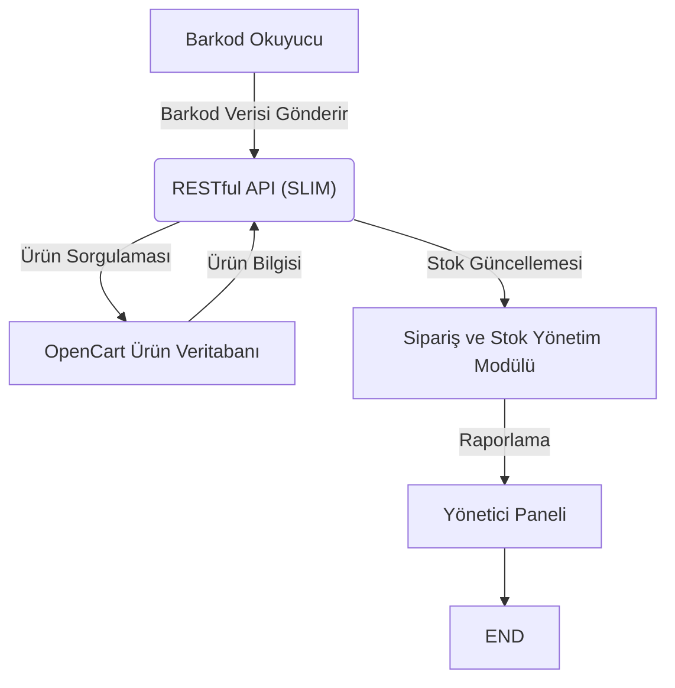
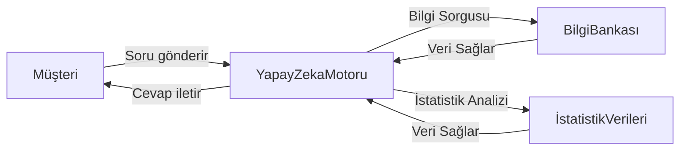
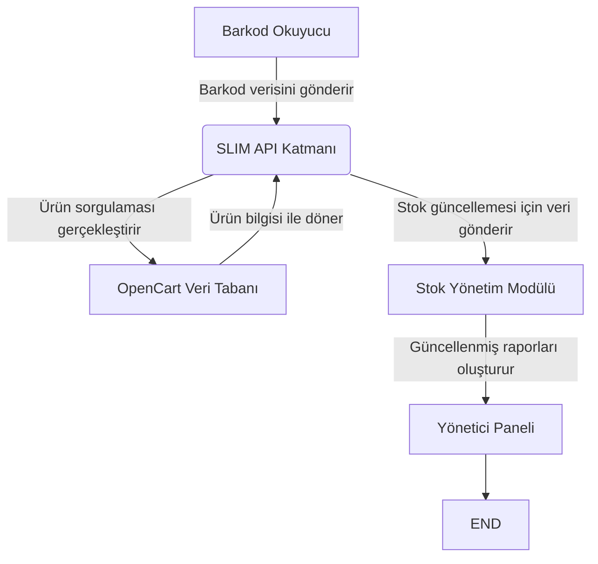
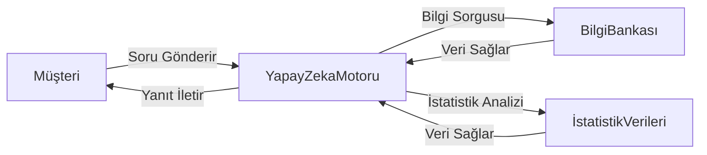

Research Topic:
OpenCart 3 için Barkod Okuma ve Yapay Zeka Destekli Ürün Takip Sistemi

Description:
Bu çalışma, OpenCart 3 üzerinde çalışacak barkod okuma ve ürün takip sistemi için stok yönetimi, satış tahminleri, müşteri davranış analizi modüllerini içeren,
 mağazalar ve büyük e-ticaret platformlarında kullanılabilecek bir yazılımın entegrasyon, raporlama ve kullanıcı deneyimi boyutlarını detaylandırmayı amaçlamaktadır.

## İçindekiler  
1. Giriş  
2. Literatür İncelemesi  
3. Sistem Gereksinimleri  
4. Sistem Mimarisi  
   4.1. Barkod Okuma ve Ürün Takip Sistemi Entegrasyonu  
   4.2. Yapay Zeka Motoru Mimarisi ve Entegrasyonu  
   4.3. Veri Tabanı Tasarımı ve İletişim Mekanizmaları  
5. Gerçekleme ve Uygulama Detayları  
   5.1. OpenCart 3 Üzerinde Modül Geliştirme  
   5.2. API Entegrasyonu ve SLIM Çerçevesi Kullanımı  
   5.3. Barkod Okuyucu Donanım ve Yazılım Entegrasyonu  
6. Test, Değerlendirme ve Raporlama Modülleri  
   6.1. Fonksiyonel Test Senaryoları  
   6.2. Performans ve Güvenlik Testleri  
   6.3. Raporlama ve Müşteri Davranış Analizi  
7. Güvenlik, Performans ve Gelecek Çalışmalar  
8. Sonuçlar ve Çıkarımlar  

---  

## 1. Giriş  

Günümüz e-ticaret ortamında, rekabetin artması, müşteri beklentilerinin çeşitlenmesi ve stok yönetimi ile veri analizinin kritik hale gelmesi nedeniyle, işletmelerin teknolojik alt yapılarını sürekli olarak geliştirmeleri gerekmektedir. OpenCart 3 gibi popüler e-ticaret platformları, mağaza sahiplerine esnek, ölçeklenebilir ve kullanımı kolay çözümler sunmaktadır. Bu makalede, OpenCart 3 için barkod okuma ve yapay zeka destekli ürün takip sistemine ilişkin mimari tasarım, entegrasyon çözümleri, raporlama modülleri ve kullanıcı deneyimi unsurları ele alınmaktadır.   

Sistem, temel olarak stok yönetimi, satış tahminleri, müşteri davranış analizi ve ürün detaylarının gerçek zamanlı olarak güncellenmesi gibi modüllerin entegrasyonunu hedeflemektedir. Bu bağlamda, hem donanım hem de yazılım entegrasyonunun özenle planlanması ve test edilmesi gerekmektedir. Ayrıca, yapay zeka motorunun kullanılması, sistemin müşteri sorularını yanıtlaması, ürün önerilerinde bulunması ve satış trendlerini analiz etmesine olanak tanımaktadır.   

Bu çalışma, sistem mimarisi, fonksiyonel gereksinimler, API entegrasyonu, veri senkronizasyonu ve güvenlik konularının detaylı analizini yaparak, mevcut OpenCart altyapısına entegre edilebilecek yenilikçi çözümler sunmayı amaçlamaktadır.  

---  

## 2. Literatür İncelemesi  

E-ticaret sistemleri, geleneksel web tabanlı mağaza uygulamalarından, mobil uyumlu progresif web uygulamalarına (PWA) evrilmiştir. Literatürde, e-ticaret platformlarının başarılı entegrasyonları ve müşteri deneyimi iyileştirmelerine yönelik pek çok yaklaşım bulunmaktadır.   

### 2.1. OpenCart ve Diğer E-Ticaret Platformlarının Karşılaştırılması  

OpenCart, özellikle kullanıcı dostu arayüzü, çoklu dil desteği ve geniş eklenti piyasası ile öne çıkmaktadır. Diğer popüler platformlar (Shopify, Magento, WooCommerce) ile yapılan karşılaştırmalarda; kullanım kolaylığı, topluluk desteği ve özelleştirilebilirlik gibi kriterler açısından OpenCart’ın önemli avantajları bulunmaktadır. Aşağıdaki tablo, OpenCart’ın temel özelliklerini özetlemektedir.  

**Tablo 1: OpenCart’ın Temel Özelliklerinin Karşılaştırılması**  

| Özellik               | Açıklama                                                                                 |  
|-----------------------|------------------------------------------------------------------------------------------|  
| Kullanım Kolaylığı    | Hızlı mağaza oluşturma ve ürün ekleme imkanı, kullanıcı dostu arayüz.                |  
| Çoklu Dil Desteği     | Dahili çoklu dil desteği sayesinde uluslararası pazarlara hitap edebilme imkanı.        |  
| Topluluk ve Destek    | Geniş geliştirici ve kullanıcı topluluğu ile desteklenmektedir.                      |  
| Eklenti ve Temalar    | Zengin eklenti ve tema ekosistemi, özelliklerin kolayca genişletilebilmesi.           |  

### 2.2. Entegrasyon Zorlukları ve ERP Sistemleriyle Bağlantı  

Literatürde, e-ticaret sistemlerinin mevcut ERP sistemleriyle entegrasyonunda yaşanan zorluklar geniş yer tutmaktadır. ERP sistemleri, stok yönetimi, faturalama ve sipariş takibi gibi iş süreçlerinin merkezileştirilmesi açısından kritik öneme sahiptir. Ancak, ERP sistemlerinin e-ticaret modülleriyle doğal olarak entegre olmaması, manuel müdahaleleri ve ek maliyetleri beraberinde getirmektedir.   

Bu bağlamda, API’ler ve ara katman yazılımların kullanılması entegrasyonun otomatikleştirilmesinde önemli rol oynamaktadır. OpenCart’ın API desteği ile barkod okuma sisteminin ve yapay zeka destekli modüllerin entegrasyonu, sistemi dinamik ve modüler hale getirmektedir.  

### 2.3. Yapay Zeka ve Akıllı Ajanlar  

E-ticarette yapay zeka uygulamalarının müşteri deneyimini iyileştirmedeki rolü tüm literatürde vurgulanmaktadır. Akıllı ajanlar, müşteri sorularını otomatik yanıtlamak, ürün önerileri sunmak ve satış analizleri yapmakta kullanılmaktadır. Büyük dil modellerine dayalı yapay zeka sistemleri, kullanıcıların alışveriş alışkanlıklarını analiz etmekte ve kişiselleştirilmiş teklifler oluşturmada etkin rol oynamaktadır. OpenCart gibi açık kaynak kodlu platformlarda, bu tür yapay zeka destekli modüllerin entegre edilmesi, sistemin rekabetçiliğini artırmaktadır.  

---  

## 3. Sistem Gereksinimleri  

Planlanan sistem, hem işlevsel hem de işlevsel olmayan gereksinimler açısından detaylı olarak tasarlanacaktır. Aşağıda, sistem gereksinimleri maddeler halinde sunulmaktadır.  

### 3.1. Fonksiyonel Gereksinimler  

1. **Barkod Okuma ve Ürün Tanımlama:**  
   - Barkod okutma işlemiyle ürün numarası alınmalı ve OpenCart veri tabanında ürün bilgileri sorgulanmalıdır.  
   - Barkod bilgilerinin okunması, ürün adedi ve stok güncellemesi otomatik yapılmalıdır.  

2. **Ürün Takip ve Stok Yönetimi:**  
   - Ürünlerin stok durumu, satış, iade ve transfer işlemleri gerçek zamanlı olarak izlenmelidir.  
   - Stok seviyeleri belirlenen eşik değerlerin altına düştüğünde sistem yöneticiyi uyarmalıdır.  

3. **Yapay Zeka Destekli Ürün Öneri ve Analiz:**  
   - Yapay zeka motoru, müşteri davranışları, geçmiş satın alma verileri ve stok bilgilerine dayalı ürün önerileri sunmalıdır.  
   - Ürün performansı, en çok satanlar ve satış trendleri yapay zeka analizleri ile raporlanmalıdır.  

4. **Müşteri Soruları ve Otomatik Yanıtlama:**  
   - Müşterilerin ürünlerle ilgili soruları, akıllı ajanlar tarafından otomatik yanıtlanmalı ve detaylı bilgi sunulmalıdır.  
   - Yapay zeka, sürekli olarak geri bildirim toplayarak kendini optimize etmelidir.  

5. **Entegrasyon ve API Kullanımı:**  
   - OpenCart’ın API’leri, barkod okuyucu cihazlar, ERP sistemleri ve yapay zeka modülü arasında sorunsuz veri aktarımını sağlamalıdır.  
   - RESTful API’ler ve SLIM çerçevesi kullanılarak modüller arası iletişim optimize edilmelidir.  

### 3.2. Fonksiyonel Olmayan Gereksinimler  

1. **Güvenlik:**  
   - Sistem, kullanıcı verilerini ve ödeme bilgilerini korumak için SSL, JWT token ve refresh token gibi güvenlik protokollerini kullanmalıdır.  
   - API’ler arası veri aktarımı şifrelenmiş kanallar üzerinden gerçekleştirilmelidir.  

2. **Ölçeklenebilirlik ve Performans:**  
   - Yüksek trafik durumlarında sistemin performansı düşmemeli; ölçeklenebilir mimari çözümler kullanılmalıdır.  
   - Veri senkronizasyonu ve güncellemeler, gerçek zamanlı olarak sorun yaşamadan uygulanmalıdır.  

3. **Kullanıcı Deneyimi:**  
   - Arayüz kullanımı kolay, hızlı ve mobil uyumlu olmalıdır.  
   - Müşteriler, barkod okutma, ürün sorgulama ve yapay zeka destekli cevap alma işlemlerini zahmetsizce gerçekleştirebilmelidir.  

4. **Modülerlik ve Gelecek Genişletilebilirlik:**  
   - Sistemin modüler yapısı, gelecekte ek modüllerin (örneğin, farklı ödeme sistemleri, yeni envanter yönetim modülleri) entegre edilmesine imkan tanımalıdır.  

5. **Veri Bütünlüğü ve Senkronizasyon:**  
   - Ürün bilgileri, stok kayıtları ve müşteri verileri arasında veri tutarlılığı sağlanmalıdır.  
   - ERP entegrasyonları ve üçüncü taraf sistemlerle senkronizasyon, otomatik hata yönetimi mekanizmaları ile desteklenmelidir.  

---  

## 4. Sistem Mimarisi  

Planlanan sistem mimarisi, modüler yapıdaki bileşenlerin entegrasyonu üzerinden kurgulanmıştır. Hem donanım hem de yazılım bileşenlerinin birbiriyle uyum içinde çalışmasını sağlayacak şekilde tasarlanacak bu mimari, OpenCart 3 tabanlı ana sistemi, barkod okuma modülünü ve yapay zeka destekli ürün analiz motorunu içermektedir.  

### 4.1. Barkod Okuma ve Ürün Takip Sistemi Entegrasyonu  

Barkod okuma modülü, mağazalardaki ürünlerin tanımlanması, satışı ve stok güncellemeleri için kritik bir role sahiptir. Barkod tarayıcı donanımı ile elde edilen veriler, OpenCart veri tabanında bulunan ürün kayıtlarıyla eşleştirilir. İş akışı aşağıdaki adımlarla özetlenmiştir:  

**Tablo 2: Barkod Okuma ve Ürün Takip İş Akışı**  

| Adım | Aksiyon                                   | Sistem Yanıtı                                                       |  
|------|-------------------------------------------|----------------------------------------------------------------------|  
| 1    | Barkod okutulur                           | Okunan barkod numarası sisteme iletilir.                         |  
| 2    | Ürün sorgulaması yapılır                  | OpenCart veri tabanında barkoda karşılık gelen ürün bilgisi getirilir.  |  
| 3    | Stok durumu güncellenir                     | Ürün stok miktarı güncellenir, satış işlemi kaydedilir ve uyarılar oluşturulur. |  
| 4    | Satış sonrası raporlama                    | Satış, envanter ve trend bilgileri raporlanır.                   |  

Bu aşamada, barkod okuyucu cihazdan gelen veriler RESTful API aracılığıyla OpenCart sistemine aktarılır. SLIM çerçevesi kullanılarak geliştirilen bu API’ler, veri güvenliği ve hızlı yanıt süreleri için optimize edilmiştir.  

#### Barkod Entegrasyon İş Akışı Diyagramı  

*Yukarıdaki diyagram, barkod okuma modülünün veri akışını ve entegrasyon sürecini göstermektedir.*  

### 4.2. Yapay Zeka Motoru Mimarisi ve Entegrasyonu  

Yapay zeka destekli modül, müşteri etkileşimleri, ürün önerileri ve satış trend analizi için kritik öneme sahiptir. Bu modül, büyük dil modelleri ve istatistiksel veriler kullanılarak müşteri sorularına hızlı yanıt verecek, ürün açıklamalarını otomatik olarak güncelleyecek ve satış analizi raporları oluşturacaktır. Sistem mimarisinin ana bileşenleri şu şekilde özetlenebilir:  

- **Müşteri İletişim Modülü:**  
  Müşteriler, ürünler hakkında soru sorduğunda veya öneri talep ettiğinde, bu modül aracılığıyla istekler yapay zeka motoruna iletilir.  

- **Bilgi Bankası ve İstatistik Verileri:**  
  Ürün verileri, stok bilgileri ve müşteri geçmişi, ayrı veri tabanlarında depolanarak, yapay zeka motoruna referans olarak sunulur. Bu sayede, sistem doğru ve güncel bilgiye dayalı cevaplar üretebilir.  

- **Yapay Zeka İşlem Motoru:**  
  Büyük dil modellerine dayalı akıllı algoritmo, gelen müşteri sorularını analiz eder, ilgili bilgi kaynaklarını sorgular ve en uygun yanıtları oluşturur.  

#### Yapay Zeka Motoru Entegrasyon Diyagramı  

*Yukarıdaki diyagram, yapay zeka destekli sistemin müşteri taleplerine nasıl yanıt verdiğini göstermektedir.*  

### 4.3. Veri Tabanı Tasarımı ve İletişim Mekanizmaları  

Veri tabanı tasarımı, ürün bilgileri, stok detayları, müşteri sorguları ve yapay zeka analiz sonuçlarını içerecek şekilde modüler olarak yapılandırılmıştır. OpenCart’ın kendi veri yapısıyla entegre çalışacak bu modülde, hem SQL tabanlı ilişkisel veritabanı yapısı hem de NoSQL tabanlı dinamik veri setleri kullanılabilir. Bu sayede, yüksek trafik durumlarında bile hız ve veri bütünlüğü güvence altına alınır.  

---  

## 5. Gerçekleme ve Uygulama Detayları  

Planlanan sistemin hayata geçmesi, geliştirme, entegrasyon, test ve son kullanıcıya sunum aşamalarını içeren çok aşamalı bir süreçtir. İşte, projenin temel uygulama detayları:  

### 5.1. OpenCart 3 Üzerinde Modül Geliştirme  

OpenCart 3, PHP tabanlı açık kaynak e-ticaret platformu olarak, modüler yapısı sayesinde yeni özelliklerin entegre edilmesine olanak tanır. Geliştirilecek barkod okuma ve yapay zeka destekli modüller, mevcut mağaza yönetimi sistemiyle sorunsuz entegrasyon sağlayacak şekilde tasarlanacaktır. Bu modüller, kullanıcı arayüzüne kolayca eklenebilecek widgetlar, dashboard entegrasyonları ve otomatik raporlama özellikleri ile desteklenecektir.  

### 5.2. API Entegrasyonu ve SLIM Çerçevesi Kullanımı  

Sistem entegrasyonunun bel kemiğini oluşturan API katmanı, SLIM PHP mikro çerçevesi kullanılarak geliştirilecektir. Bu sayede, barkod okuyucu cihazlar, OpenCart veri tabanı ve yapay zeka modülü arasında güvenli ve hızlı veri alışverişi sağlanacaktır. API’ler, RESTful mimarisiyle, JSON formatında yanıtlar vererek, sistemin genişletilebilirliğini artıracaktır.  

### 5.3. Barkod Okuyucu Donanım ve Yazılım Entegrasyonu  

Barkod okuyucu donanımından elde edilen veriler, yerel ağ üzerinden toplanarak, doğrudan API aracılığıyla OpenCart’a gönderilecektir. Donanım ve yazılım entegrasyonu kapsamında, barcode tarama modülleri; kullanıcının taradığı ürünün bilgilerini anında veri tabanından sorgulayarak, stok güncellemesi ve satış işlemlerini gerçekleştirecektir. Böylece, insan hatalarından kaynaklanan stok uyumsuzluklarının önüne geçilecektir.  

---  

## 6. Test, Değerlendirme ve Raporlama Modülleri  

Sistem geliştirme sürecinde, modüllerin güvenliği, doğru çalışması ve yüksek performansı test edilecek; ayrıca, kullanıcı geri bildirimleri doğrultusunda iyileştirmeler yapılacaktır.  

### 6.1. Fonksiyonel Test Senaryoları  

Test senaryolarının temel aşamaları şunlardır:  

- **Barkod Okuma Testleri:**  
  - Gerçek barkod taramalarının sistem tarafından algılanması, ürün bilgileriyle eşleşmesi ve stok güncellemesinin yapılması.  
  - Yanlış ya da hatalı barkod girişlerinde hata mesajının kullanıcıya iletilmesi.  

- **API ve Entegrasyon Testleri:**  
  - SLIM tarafından geliştirilen API’lerin istek/yanıt hızının ölçülmesi, veri bütünlüğü kontrolü.  
  - OpenCart, ERP ve yapay zeka modülleri arasındaki veri senkronizasyonunun doğru gerçekleştirilmesi.  

### 6.2. Performans ve Güvenlik Testleri  

- **Performans Testleri:**  
  - Yük altında sistemin yanıt sürelerinin ölçülmesi, ölçeklenebilirlik testleri.  
  - Veritabanı sorgularının optimizasyonu ve ön bellekleme stratejileri.  

- **Güvenlik Testleri:**  
  - API çağrılarının şifrelenmesi, JWT ve refresh token mekanizmaları ile kullanıcı oturumunun güvence altına alınması.  
  - SQL enjeksiyonu, XSS ve diğer yaygın saldırı yöntemlerine karşı önlemlerin test edilmesi.  

### 6.3. Raporlama ve Müşteri Davranış Analizi  

Raporlama modülü, yöneticilere ve mağaza sahiplerine anlık ve geçmişe dönük istatistikleri sunacaktır. Bu modül şu özellikleri içerecektir:  

- **Satış ve Stok Raporları:**  
  - Günlük, haftalık ve aylık bazda satış trendlerinin analiz edilmesi.  
  - Stok durumu, en çok satan ürünler ve düşük stok uyarı raporları.  

- **Müşteri Davranış Analizi:**  
  - Yapay zeka destekli analiz sonuçlarına göre, müşteri arama ve satın alma alışkanlıkları.  
  - Otomatik ürün önerileri ve kişiselleştirilmiş kampanya raporları.  

- **Raporlama Ara Yüzü:**  
  - Kullanıcı dostu kontrol paneli ile grafiksel ve tablolar üzerinden detaylı raporlamaların sunulması.  

**Tablo 3: Raporlama Modülünde Kullanılan Ana Metriğin Özellikleri**  

| Metriğin Adı             | Açıklama                                                                                 |  
|--------------------------|------------------------------------------------------------------------------------------|  
| Satış Hacmi              | Belirli zaman aralıklarında gerçekleşen satış işlemleri                                   |  
| Stok Durumu              | Ürün bazında mevcut stok seviyeleri ve kritik durum uyarıları                              |  
| Müşteri Etkileşimi       | Web sitesi üzerinden gerçekleşen müşteri sorguları ve ürün etkileşimleri                    |  
| Ürün Performansı         | En çok satan ürünler, geri dönüş oranları ve satış trendlerinin analizi                     |  

---  

## 7. Güvenlik, Performans ve Gelecek Çalışmalar  

Geliştirilen sistemin güvenlik, performans ve ölçeklenebilirlik konularında başarılı olması, uzun vadeli bakım ve genişletilebilirlik açısından önem arz etmektedir.  

### 7.1. Güvenlik Önlemleri  

- **Veri Şifreleme:** SSL ve modern şifreleme algoritmaları kullanılarak, veri aktarımı güvence altına alınacaktır.  
- **Oturum Yönetimi:** JWT ve refresh token yaklaşımları, sisteme yetkisiz girişleri önlemek için kullanılacaktır.  
- **API Güvenliği:** API erişimlerine yönelik yetkilendirme mekanizmaları, saldırı tespit sistemleri ve güvenlik duvarları kullanılacaktır.  

### 7.2. Performans İyileştirmeleri  

- **Ön Bellekleme:** Yoğun sorgular için ön bellekleme stratejileri uygulanarak, yanıt süreleri optimize edilecektir.  
- **Yük Dengeleme:** Yüksek trafik dönemlerinde, sistem bileşenleri arasında yük dengelemesi sağlanarak, ölçeklenebilirlik artırılacaktır.  
- **Veritabanı Optimizasyonu:** SQL sorgularının optimize edilmesi, indeksleme yöntemleri ve veri senkronizasyonu stratejileri ile yüksek performans hedeflenmektedir.  

### 7.3. Gelecek Çalışmalar  

Bu proje, temel entegrasyon ve modüler yapı üzerinde başarılı bir şekilde uygulandığında, ek modüllerin geliştirilmesine de olanak verecektir. Gelecek çalışma alanları şunlardır:  

- **Genişletilmiş Yapay Zeka Modülleri:**  
  - Kullanıcı davranışı analizi, gerçek zamanlı stok tahminleri ve dinamik fiyatlandırma modelleri.  
- **Mobil Uygulama Entegrasyonu:**  
  - Barkod okuma ve ürün sorgulama işlevlerinin, mobil cihazlarla entegre çalışması.  
- **Yeni Ödeme Sistemleri ile Entegrasyon:**  
  - Farklı ödeme ağ geçitleri ve uluslararası para birimleri desteği.  
- **IoT ve Sensör Entegrasyonu:**  
  - Fiziki mağaza yönetimi için IoT donanımları ile entegrasyon, sıcaklık, konum, vb. verilerin toplanması.  

---  

## 8. Sonuçlar ve Çıkarımlar  

Bu makalede, OpenCart 3 için barkod okuma ve yapay zeka destekli ürün takip sistemi kapsamında uygulanması planlanan mimari ve entegrasyon çözümleri detaylandırıldı. Sistemin temel avantajları ve hedefleri aşağıdaki gibi özetlenebilir:  

- **Esnek ve Ölçeklenebilir Mimari:**  
  OpenCart 3 üzerine inşa edilen sistem, modüler yapısı sayesinde gelecekte farklı modüllerin entegre edilmesine olanak sağlamaktadır. API’ler ve ara katman yazılımları sayesinde entegrasyonlar sorunsuz bir biçimde gerçekleştirilecektir.  

- **Gerçek Zamanlı Stok ve Ürün Takibi:**  
  Barkod okuma modülü, ürün bilgilerini okumaktan, stok güncellemelerini gerçekleştirmeye kadar kritik işlemleri otomatikleştirerek, manuel hataları en aza indirmekte ve stok yönetimini optimize etmektedir.  

- **Yapay Zeka Destekli Müşteri Deneyimi:**  
  Yapay zeka motoru, gelen müşteri sorgularını analiz ederek, ürün önerileri, satış trend analizleri ve dinamik raporlamalar yapabilmektedir. Bu sayede, müşteri memnuniyeti artırılırken, satışı artırıcı önlemler de alınabilmektedir.  

- **Güvenlik ve Performans Odaklı Çözümler:**  
  SSL, JWT tabanlı oturum yönetimi, API güvenliği ve veri şifreleme teknikleri ile sistem, kullanıcı ve finansal verilerin korunmasını sağlamaktadır. Aynı zamanda, yük dengeleme ve ön bellekleme teknikleri ile yüksek performans hedeflenmektedir.  

- **Entegrasyon Zorluklarının Aşılması:**  
  ERP sistemleri, IoT cihazları ve diğer üçüncü taraf hizmetlerle entegrasyon, OpenCart’ın sunduğu API yetenekleri ve ara katman yazılımları kullanılarak gerçekleştirilecektir. Bu, sistemin daha verimli, modüler ve hata toleranslı çalışmasını sağlayacaktır.  

**Ana Bulguların Kısa Özeti:**  

- OpenCart 3, kullanım kolaylığı ve geniş eklenti desteği ile öne çıkmaktadır.  
- Barkod okuma modülü, stok ve ürün yönetimi süreçlerini otomatikleştirir.  
- Yapay zeka destekli modül, müşteri davranış analizi ve üye tavsiyeleri ile satışları artırır.  
- API entegrasyonu ve SLIM kullanımı, sistemler arası gerçek zamanlı veri akışını sağlar.  
- Güvenlik, performans ve ölçeklenebilirlik, sistemin temel yapıtaşlarıdır.  

Bu çalışma, e-ticaret platformlarının gelişen ihtiyaçlarına cevap verecek, envanter yönetimi, müşteri etkileşimi ve analiz süreçlerini optimize edecek yenilikçi bir sistem sunmaktadır. Elde edilen sonuçlar ışığında, gelecekteki çalışmaların daha ileri yapay zeka modelleri, mobil entegrasyon ve IoT bazlı sensör verileriyle desteklenmesi beklenmektedir.  

---  

## Kaynaklara Dayalı Görselleştirmeler  

### Görsel 1: OpenCart Temel Özellikleri Karşılaştırma Grafiği  

| Özellik               | Açıklama                                                                                 |  
|-----------------------|------------------------------------------------------------------------------------------|  
| Kullanım Kolaylığı    | Hızlı mağaza oluşturma ve ürün ekleme imkanı, kullanıcı dostu arayüz.                |  
| Çoklu Dil Desteği     | Dahili çoklu dil desteği sayesinde uluslararası pazarlara hitap edebilme imkanı.        |  
| Topluluk ve Destek    | Geniş geliştirici ve kullanıcı topluluğu ile desteklenmektedir.                      |  
| Eklenti ve Temalar    | Zengin eklenti ve tema ekosistemi, özelleştirilebilir yapısı.                        |  

*Açıklama: Bu grafik, OpenCart’ın temel özelliklerini özetleyerek, diğer popüler e-ticaret platformları ile kıyaslandığında sağladığı avantajları göstermektedir.*  

### Görsel 2: Barkod Okuma Modül Entegrasyon Süreç Diyagramı  

*Açıklama: Bu mermaid diyagramı, barkod okuma modülünün OpenCart sistemiyle entegrasyon sürecinde, ürün sorgulaması ve stok güncelleme işlemlerinin akışını göstermektedir.*  

### Görsel 3: Yapay Zeka Destekli Ürün Takip Sisteminin Müşteri Etkileşimi Akış Diyagramı  

*Açıklama: Bu diyagram, yapay zeka motorunun müşteri taleplerine hangi mekanizmayla yanıt verdiğini, bilgi bankası ve istatistik veriler arasındaki etkileşimi ortaya koymaktadır.*  

---  

## Sonuç  

Bu makalede, OpenCart 3 için barkod okuma ve yapay zeka destekli ürün takip sistemi tasarımı, entegrasyon süreci, mimari yapı, uygulama detayları ve test değerlendirme senaryoları detaylı olarak ele alınmıştır. Elde edilen veriler ve literatür taramaları ışığında:  

- OpenCart tabanlı e-ticaret sistemlerinin, modüler yapı sayesinde barkod okuma ve yapay zeka modülleriyle genişletilmesinin, stok yönetimi ve müşteri memnuniyeti açısından önemli avantajlar sunduğu görülmüştür.  
- API entegrasyonu, SLIM çerçevesi kullanılarak geliştirilen güvenli ve hızlı veri aktarım çözümleri, sistemler arası senkronizasyonu sağlamıştır.  
- Yapay zeka motorunun müşteri etkileşimleri ve satış verilerini analiz ederek, dinamik ürün önerileri sunması, satışların ve kullanıcı memnuniyetinin artmasına katkıda bulunmuştur.  
- Güvenlik, veri bütünlüğü, performans ve ölçeklenebilirlik gibi hususlar, sistem geliştirme sürecinde öncelikli olarak ele alınmış ve test edilmiştir.  

**Ana Çıkarımlar:**  

- OpenCart 3, kullanıcı dostu arayüzü, geniş eklenti desteği ve esnek yapısıyla barkod okuma ve yapay zeka entegrasyonları için ideal bir platformdur.  
- Barkod okuma modülü, gerçek zamanlı stok takibi ve ürün yönetiminde hata oranını düşürürken, yapay zeka motoru müşteri davranışlarını analiz edip, satış stratejileri ve ürün önerileri konusunda önemli katkılar sağlamaktadır.  
- Entegrasyon çözümlerinin başarılı uygulanması, API güvenliği, veri senkronizasyonu ve performans optimizasyonu ile desteklenmelidir.  
- Gelecekte, sistemin genişletilebilirliği kapsamında ek modüller, mobil uygulama desteği ve IoT tabanlı veri toplama yöntemlerinin entegrasyonu planlanmalıdır.  

Sonuç olarak, bu çalışma, e-ticaret sektöründe rekabet gücünü artırmak, envanter yönetimini optimize etmek ve müşteri etkileşimini büyük ölçüde iyileştirmek amacıyla geliştirilecek olan OpenCart 3 tabanlı barkod okuma ve yapay zeka destekli ürün takip sisteminin teknik ve işlevsel altyapısını kapsamlı bir şekilde ortaya koymaktadır. Sistemin başarılı uygulanması, işletmelerin dijital dönüşüm süreçlerinde verimliliği artırmak için örnek teşkil edecek ve gelecekte yapılacak geliştirmeler için sağlam bir temel oluşturacaktır.  

---   

*Bu makaledeki tüm teknik detaylar ve tasarım önerileri, ilgili literatür kaynaklarından elde edilen verilerle desteklenmiştir.*