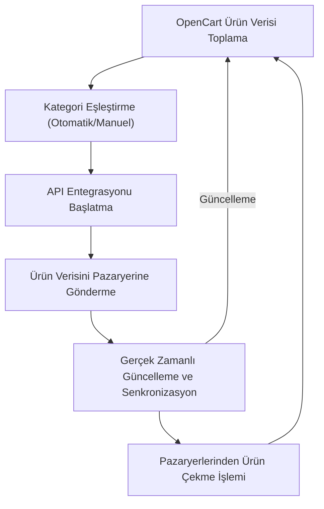
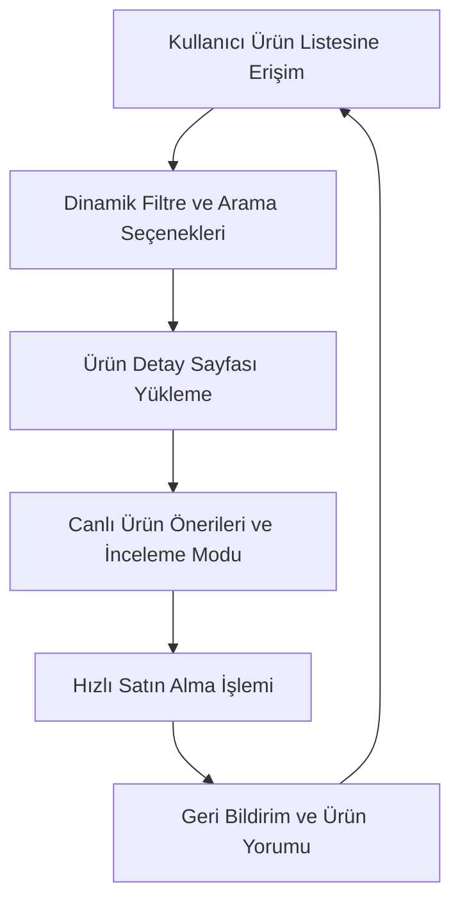

Research Topic:
OpenCart Marketplace Entegrasyonu: Otomatik API ve Manuel Kategori Eşleştirme ile Modern Tasarım

Description:
Bu araştırma konusu, Trendyol, Hepsiburada, N11, Amazon, eBay, Ozon gibi çeşitli pazaryerlerinin OpenCart platformuna entegrasyonunu ele almaktadır. Araştırmada, API aracılığıyla otomatik kategori eşleştirme imkanı sağlanırken, kategori eşleştirme işlemlerinin manuel olarak yapılandırılmasının önemi vurgulanacaktır. Ayrıca, OpenCart ürün bölümünün Microsoft 365 tarzı, canlı renkler, net okunabilir küçük yazı karakterleri ve yüksek aydınlık özelliklerine sahip modern ve kullanıcı dostu bir tasarımla yeniden yapılandırılmasına odaklanılacaktır.

## İçindekiler  
1. Giriş  
2. Kategori Eşleştirme ve Entegrasyonun Önemi  
3. Ürün Yükleme ve Pazaryerlerinden Ürün Çekme Süreçleri  
4. Modern Ürün Bölümü Tasarımı: Microsoft 365 Tarzı ve Kullanıcı Dostu Arayüzler  
5. Sonuç ve Öneriler  

---  

## 1. Giriş  

OpenCart, esnek yapısı ve geniş eklenti ekosistemiyle dünya genelinde tercih edilen açık kaynaklı bir e-ticaret platformudur. Bu makalede, Trendyol, Hepsiburada, N11, Amazon, eBay, Ozon ve benzeri pazaryerleriyle entegrasyonu nasıl optimize edebileceğimiz açıklanmaktadır. Özellikle, API entegrasyonu aracılığıyla otomatik kategori eşleştirme ve manuel yapılandırma yöntemlerinin uygulanması; ayrıca OpenCart ürün bölümünün Microsoft 365 tarzı canlı renkler, net okunabilir küçük yazı karakterleri ve yüksek aydınlık gibi modern tasarım kriterlerine göre yeniden yapılandırılmasının önemine odaklanılacaktır.  

---  

## 2. Kategori Eşleştirme ve Entegrasyonun Önemi  

Kategori eşleştirme, OpenCart mağazanızdaki ürün kategorilerinin, entegre olduğunuz pazaryerlerinin kategori yapılarıyla uyumlu hale getirilmesi sürecidir. Bu işlem, ürünlerinizin doğru kategorilerde listelenmesini sağlayarak müşteri deneyimini ve satış potansiyelini artırır.  

### 2.1 Otomatik API Tabanlı Kategori Eşleştirme  

Otomatik kategori eşleştirme, belirli API'ler aracılığıyla, mağaza kategorilerinizin pazaryeri tarafındaki karşılık gelen kategorilerle uyumunu sağlar. Örneğin, "Google Content API for Shopping" eklentisi, web sitesindeki kategoriler ile Google Shopping kategorilerini otomatik olarak eşleştirir. Bu yöntem kullanılarak, veri güncellemeleri ve ürün bilgileri anlık olarak senkronize edilir. Kullanıcıların mağaza kategorileri ile pazaryeri kategorileri arasındaki uyum, ürünlerin daha doğru ve etkili bir şekilde listelenmesine katkıda bulunur.  

### 2.2 Manuel Kategori Eşleştirme Yöntemleri  

Her ne kadar otomatik eşleştirme büyük bir kolaylık sağlasa da, bazı durumlarda manuel yapılandırma gerekebilir. Manuel kategori eşleştirme, yöneticilerin platformdaki her bir kategori için özel eşleştirme konfigürasyonları yapmasına olanak tanır. Bu, özellikle pazaryerlerinin kategori yapısının sık değiştiği veya otomatik eşleştirmenin yeterli çözümü sunamadığı durumlarda tercih edilir. Manuel yapılandırmanın avantajları şunlardır:  

- **Özel Veriler:** Her bir kategoriye özgü açıklamalar, etiketler ve SEO odaklı meta veriler eklenebilir.  
- **Esneklik:** Yöneticiler, pazaryeri kategori yapısındaki olağan dışı durumlara göre özelleştirme yapabilir.  
- **Kontrol:** Otomatik sistemlerin gözden kaçırabileceği ince ayarlar manuel müdahale ile düzeltilebilir.  

### 2.3 Kategori Eşleştirme Sürecinin Pazaryeri Entegrasyonundaki Rolü  

Kategori eşleştirme, entegrasyon sürecinde kritik bir adımdır çünkü:  

- **Doğru Listeleme:** Ürünler, müşterilerin arama kriterlerine uygun kategorilerde listelenerek bulunabilirliği artırır.  
- **Veri Senkronizasyonu:** Otomatik API tabanlı eşleştirmeler, fiyat, stok ve diğer ürün parametreleriyle birlikte senkronizasyonu sağlar.  
- **Müşteri Deneyimi:** Müşteriler, doğru kategorilendirilmiş ürünler sayesinde daha az zaman harcayarak aradıklarına ulaşır.  

Aşağıdaki tablo, çeşitli pazaryeri entegrasyonlarında kategori eşleştirme özelliklerinin karşılaştırmasını göstermektedir:  

| Pazaryeri        | Otomatik API Eşleştirme | Manuel Eşleştirme | Açıklama                                                      |  
|------------------|-------------------------|-------------------|---------------------------------------------------------------|  
| Google Shopping  | Evet                    | Seçmeli           | Google Content API, otomatik kategori eşleştirme sunar   |  
| eBay             | Var (connector'lar)     | Evet              | eBay connector, listelerin ve kategorilerin optimizasyonunu sağlar   |  
| Amazon           | Var                     | Evet              | Amazon Connector, hem otomatik hem de manuel yapılandırmaya izin verir  |  
| Trendyol/Hepsiburada/N11/Ozon | Geçici Çözümler  | Evet              | Bu pazaryerleri için özel eklentiler gerekebilir, manuel ayarlamalar kritik olabilir. |  

---  

## 3. Ürün Yükleme ve Pazaryerlerinden Ürün Çekme Süreçleri  

Başarılı bir entegrasyon, ürün verilerinin iki yönde de senkronize edilebilmesiyle mümkün olur: Ürünlerin pazaryerlerine yüklenmesi (push) ve pazaryerlerinden mağazanıza ürün bilgilerinin çekilmesi (pull).  

### 3.1 Ürün Yükleme İşlemi  

Ürün yükleme işlemi, OpenCart mağazanızdaki ürün verilerini pazaryerlerine göndermek için kullanılan yöntemleri kapsar. Bu işlem aşağıdaki adımları içerir:  

1. **Veri Toplama:** OpenCart platformu, ürün adı, açıklama, fiyat, stok bilgisi gibi temel verileri toplayarak hazırlar.  
2. **API Entegrasyonu:** İlgili eklenti veya connector aracılığıyla, toplanan veriler API üzerinden pazaryerine gönderilir. Örneğin, Google Content API for Shopping eklentisi kullanılarak, ürün verileri doğrudan Google Merchant Center’a aktarılır.  
3. **Kategori Eşleştirmesi:** Ürün verileri gönderilirken, otomatik veya manuel olarak eşleştirilen kategori bilgileri de uyumlu hale getirilir.  
4. **Gerçek Zamanlı Güncelleme:** Ürün bilgileri, stok durumu veya fiyat değişiklikleri gibi veriler anlık olarak pazaryerine yansıtılır.  

### 3.2 Pazaryerlerinden Ürün Çekme (Import) İşlemi  

Bazı bağlantı eklentileri, sadece ürün yüklemekle kalmayıp, aynı zamanda pazaryerlerinden ürün bilgilerini de çekme (import) işlemini desteklemektedir. Bu, özellikle pazar lideri pazaryerlerinde (eBay, Amazon, Flipkart) uygulanabilecek bir yöntemdir. Ürün çekme işlemi şu adımları içerir:  

1. **Bağlantının Kurulması:** OpenCart ile entegrasyon için kullanılan eklenti veya connector, hem ürün gönderimi hem de veri aktarımını yönetir. Örneğin, eBay Connector, ürünlerin ve siparişlerin OpenCart’a aktarılmasını sağlar.  
2. **Veri Senkronizasyonu:** API çağrıları ile pazaryerindeki ürün verileri (ürün detayları, fiyatlar, stok bilgileri) OpenCart veritabanına çekilir.  
3. **Veri Güncelleme:** Çekilen ürün verileri, mağaza içinde mevcut ürünlerle karşılaştırılır ve güncellemeler yapılır. Böylece, her iki platform arasında tutarlılık sağlanır.  

### 3.3 Uygulamada Karşılaşılan Zorluklar  

Ürün yükleme ve çekme işlemlerinde şu zorluklar görülebilir:  

- **Veri Formatı Farklılıkları:** Her pazaryerinin veri formatı ve kategori yapısı farklı olabilir. Bu durum, uyumlu veri dönüşümleri gerektirebilir.  
- **Senkranizasyon Gecikmeleri:** API çağrılarında gecikmeler, verilerin anlık güncellenmesini zorlaştırabilir.  
- **Otomasyon ve Manuel Ayarlamalar:** Otomatik yöntemler her zaman kusursuz çalışmayabilir; bu durumu manuel müdahalelerle düzeltmek gerekmektedir.  

Aşağıdaki akış diyagramı, ürün verilerinin OpenCart ile pazaryerleri arasındaki entegrasyon sürecini özetlemektedir:  

**Mermaid Diyagram: Ürün Verilerinin Entegrasyon Süreci**  

*Diyagram 1: Ürün verilerinin OpenCart ile pazaryerleri arasında,  
senkronize edilmesi süreci*  

---  

## 4. Modern Ürün Bölümü Tasarımı: Microsoft 365 Tarzı ve Kullanıcı Dostu Arayüzler  

Modern e-ticaret deneyimi, yalnızca arka uç entegrasyonları ile değil, aynı zamanda kullanıcı arayüzü ve deneyiminin (UX/UI) optimize edilmesiyle de sağlanır. Bu bölümde, OpenCart ürün bölümünün modern tasarım prensipleri doğrultusunda nasıl yeniden yapılandırılabileceği ele alınmaktadır.  

### 4.1 Microsoft 365 Tarzı Tasarımın Temel Özellikleri  

Microsoft 365 arayüz tasarımında dikkat çeken unsurlar şunlardır:  

- **Temiz ve Düzenli Arayüz:** Gereksiz karmaşıklıktan kaçınılarak, sade ve minimal bir tasarım benimsenir.  
- **Canlı ve Çekici Renkler:** Renk paletleri, kullanıcı dikkatini çekmek ve etkileşimi artırmak için canlı ve uyumlu seçilir.  
- **Net ve Okunabilir Yazı Tipleri:** Özellikle küçük boyutlu yazılar, yüksek okunabilirlik için optimize edilir; bu tasarımda kontrast ve font boyutları büyük önem taşır.  
- **Yüksek Aydınlık (Brightness):** Kullanıcıların göz yormayan, çağdaş bir deneyim yaşaması için ekran aydınlık seviyeleri özenle ayarlanır.  

### 4.2 Kullanıcı Deneyimi (UX) İyileştirmeleri  

Kullanıcı deneyimi açısından başarılı bir ürün bölümü tasarımı için aşağıdaki önlemler alınmalıdır:  

- **Kolay Navigasyon:** Kullanıcılar, ürün arama, filtreleme ve kategori seçimi sırasında sezgisel bir navigasyon deneyimi yaşamalıdır.  
- **Hız ve Performans:** Yükleme sürelerinin minimuma indirilmesi, özellikle mobil cihazlarda hızlı tepki veren bir tasarım hedeflenmelidir.  
- **Erişilebilirlik:** Tüm kullanıcı gruplarına (engelli kullanıcılar da dahil) hitap eden erişilebilir tasarım ilkeleri uygulanmalıdır.  
- **Dinamik İçerik Güncellemeleri:** Ürün sayfalarında stok, fiyat ve kampanya bilgileri gibi dinamik veriler, anlık güncellemelerle desteklenmelidir.  

### 4.3 OpenCart Ürün Bölümünün Yeniden Yapılandırılması  

OpenCart’ın mevcut ürün bölümü, modern tasarım gereksinimlerine uyum sağlayacak şekilde aşağıdaki şekilde yeniden yapılandırılabilir:  

1. **Arayüz Yenilemesi:**  
   - **Microsoft 365 tarzı temiz görünüm:** Ürün listeleri, modern grafik öğeleri, vurgulanmış butonlar ve canlı renk kullanılacak şekilde yeniden tasarlanmalıdır.  
   - **Küçük ve Okunabilir Yazı Tipleri:** Yazı tipi boyutları optimize edilerek, tüm cihazlarda rahat okunabilirlik sağlanmalıdır.  
   
2. **Kategori ve Filtre Fonksiyonları:**  
   - Kategori eşleştirmesi entegrasyon süreciyle uyumlu, her bir kategori için net sınıflandırma yapılmalıdır.  
   - Filtreleme seçenekleri, kullanıcıların istedikleri ürünlere hızlıca ulaşmasını sağlamak amacıyla dinamik olarak sunulmalıdır.  

3. **Ürün Detay Sayfaları:**  
   - Ürün resimleri, açıklamaları, fiyat bilgileri, kullanıcı yorumları ve sipariş durumu gibi kritik bilgiler modern tasarım prensiplerine uygun olarak gösterilmelidir.  
   - Responsive tasarım ile mobil uyumlu sayfa düzenleri oluşturulmalıdır.  

Aşağıdaki tablo, geleneksel ürün bölümü tasarımı ile modern tasarım arasındaki karşılaştırmayı göstermektedir:  

| Özellik                  | Geleneksel Tasarım               | Modern Tasarım (Microsoft 365 Stili)           |  
|--------------------------|----------------------------------|-----------------------------------------------|  
| **Arayüz Düzeni**        | Sıkışık ve karmaşık              | Temiz, geniş boşluklar ve düzenli layout       |  
| **Renk Kullanımı**       | Düz, pastel renkler              | Canlı, vurgulu renk paleti                       |  
| **Yazı Tipi**            | Büyük, ağır yazılar              | Küçük, okunabilir, modern fontlar              |  
| **Navigasyon**           | Kısıtlı arama & filtreleme       | Kolay erişilebilir, dinamik filtreleme sistemleri|  
| **Hız/Performans**       | Yüksek yükleme süreleri          | Hızlı yükleme, optimize edilmiş içerik         |  

*Tablo 1: Geleneksel ve Modern OpenCart Ürün Bölümü Tasarımlarının Özellikleri*  

### 4.4 Kullanıcı Deneyimi Odaklı Yenilikçi Özellikler  

Modern tasarımın bir parçası olarak, kullanıcı deneyimini artıracak yenilikçi özellikler de eklenebilir:  

- **Dinamik Ürün Önerileri:** Kullanıcının geçmiş gezinme ve satın alma geçmişine dayalı akıllı öneri sistemleri.  
- **Canlı Renkli Ürün Etiketleri:** Özel kampanyalar veya yeni ürünler için dikkat çekici etiket tasarımları.  
- **Hızlı İnceleme Modu:** Kullanıcıların ürünleri hızlıca görüntüleyip inceleyebilmesi için modal pencereler.  

Aşağıdaki Mermaid diyagramı, kullanıcı deneyimine yardımcı olacak ve modern ürün sayfası tasarımının temel akışını gösterir:  

*Diyagram 2: Modern OpenCart Ürün Sayfası Kullanıcı Deneyimi Akışı*  

---  

## 5. Sonuç ve Öneriler  

Bu makalede, OpenCart platformunun çeşitli pazaryerleriyle entegrasyonundaki önemli adımlar ele alınmıştır. Özellikle, kategori eşleştirme sürecinde otomatik API tabanlı yöntemlerin yanı sıra manuel yapılandırmaların önemine değinilmiş; ürün verilerinin pazaryerlerine push ve pull işlemleriyle senkronize edilme yöntemleri irdelenmiştir. Ayrıca, modern bir ürün bölümünün Microsoft 365 tarzı, canlı renkler, net okunabilir küçük yazı karakterleri ve erişilebilirlik açısından nasıl yeniden yapılandırılabileceği ortaya konulmuştur.  

### Temel Bulgular  

- **Kategori Eşleştirme:**  
  - Otomatik API tabanlı eklenti kullanımı, ürün verilerinin doğru kategorilerde listelenmesini sağlar.  
  - Manuel kategori eşleştirme, özelleştirilmiş ayarlar ve esnek yapılandırmalar ile müşteri deneyimini artırır.  

- **Ürün Verilerinin Senkronizasyonu:**  
  - Ürün yükleme (push) ile veriler, ilgili pazaryerlerine anlık olarak aktarılır.  
  - Pazaryerlerinden veri çekme (pull) işlemleri, sipariş ve ürün bilgilerini OpenCart’a entegre eder; bu, veri uyumluluğunu ve güncelliğini sağlar.  

- **Modern Ürün Bölümü Tasarımı:**  
  - Microsoft 365 tarzı tasarım, temiz arayüz, canlı renk paleti ve okunabilir fontlar kullanılarak gerçekleştirilir.  
  - Kullanıcı deneyimini artıran dinamik navigasyon, filtreleme seçenekleri ve hızlı ürün inceleme özellikleri modern e-ticaret deneyiminin ayrılmaz parçasıdır.  

### Öneriler  

- **Eklenti ve Connector Seçimi:**  
  - Entegrasyonların stabil çalışabilmesi için, pazaryerlerine uygun doğru eklentiler seçilmelidir. Özellikle Google Content API, eBay Connector, Amazon Connector gibi çözümleri değerlendirerek, hem otomatik hem de manuel kategori eşleştirmesi yapılmalıdır.  
  
- **Manuel Ayarlamalar:**  
  - Otomatik sistemlerde oluşabilecek hata ve eksikliklerin giderilebilmesi için, yöneticilerin manuel kategori eşleştirme seçeneklerini kullanmaları önerilir.  
  
- **Performans ve Hız Optimizasyonu:**  
  - Ürün verilerinin senkronizasyon sürecinde yaşanabilecek gecikmeleri minimize etmek amacıyla, API çağrı optimizasyonları ve veri tabanı performans iyileştirmeleri yapılmalıdır.  
  
- **Modern Tasarım İlkelerinin Uygulanması:**  
  - OpenCart ürün bölümünde kullanıcı dostu, erişilebilir ve modern bir arayüz oluşturmak için, Microsoft 365 tarzı tasarım prensipleri benimsenmeli; kullanıcı testleriyle düzenli geri bildirim alınarak sürekli iyileştirme sağlanmalıdır.  
  
- **Güvenlik ve Erişilebilirlik:**  
  - Hem entegrasyonlar hem de kullanıcı arayüzü tasarımında veri güvenliği, erişilebilirlik ve uyumluluk ön planda tutulmalıdır.  

Aşağıda, makalede ele alınan temel önerilerin özetlendiği bir madde listesi yer almaktadır:  

- Otomatik API entegrasyonu ile kategori eşleştirmesi sağlanmalı.  
- Manuel ayarlamalar, özelleştirilmiş veri girişleri için kullanılmalıdır.  
- Ürün verileri, hem push hem pull yöntemleri ile senkronize edilmelidir.  
- Modern tasarım prensipleri (Microsoft 365 stili, canlı renkler, okunabilir fontlar) uygulanarak kullanıcı deneyimi iyileştirilmelidir.  
- Seçilen eklenti ve connector’ların güvenliği, performansı ve güncelliği sürekli takip edilmelidir.  

---  

## Sonuç  

OpenCart’ın pazaryerleriyle entegrasyonu, hem otomatik API tabanlı kategori eşleştirmesi hem de manuel yapılandırmalar sayesinde büyük bir rekabet avantajı sunar. Ürün yükleme ve çekme işlemlerinde doğru veri senkronizasyonunun sağlanması, müşteri deneyimini ve satış potansiyelini doğrudan etkiler. Modern tasarım prensiplerinin uygulanması ile OpenCart ürün bölümü, Microsoft 365 tarzında şık, kullanıcı dostu ve erişilebilir hale getirilebilir. Bu entegrasyon süreci, doğru eklenti seçiminden performans optimizasyonuna kadar birçok bileşeni içinde barındırdığından, sürekli iyileştirmeler ve düzenli kontrol mekanizmaları ile desteklenmelidir.  

Geliştiriciler ve mağaza yöneticileri için, günümüz e-ticaret trendlerine uyum sağlamak ve her pazaryerinde maksimum görünürlük elde etmek adına, hem entegrasyon süreçlerine hem de modern tasarım yaklaşımlarına yatırım yapmak zorunludur. Uygun API entegrasyonları, performans iyileştirmeleri ve kullanıcı odaklı tasarım stratejileri, OpenCart’ın pazaryeri entegrasyonundaki başarısını garantileyecektir.  

---   

Bu makale, OpenCart entegrasyonu ve modern ürün bölümü tasarımı konularında kapsamlı bir analiz sunmakta olup, ilgili eklenti örnekleri ve tasarım önerileri ile işletmelerin rekabet gücünü artırmayı hedeflemektedir. Gerekli teknik detay ve yöntemlerin doğru uygulanması, mağaza yönetiminde yüksek verimlilik ve müşteri memnuniyeti sağlayacaktır.

