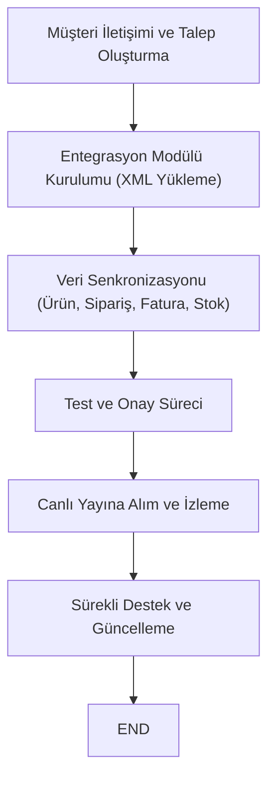

## İçindekiler  
1. Giriş  
2. Sentos Şirketi ve Hizmetlerine Genel Bakış  
3. Sentos Opencart Entegrasyon Hizmeti  
4. Entegrasyonun Özellikleri ve Sağladığı Avantajlar  
5. Entegrasyon Adımları ve Uygulama Süreci  
6. Desteklenen Pazaryerleri ve Kargo Firmaları  
7. Dışarıdan Eklenti Desteği ve Modüler Yapı  
8. Sonuç ve Değerlendirme  

---  

## 1. Giriş  
E-ticaret dünyasında işletmelerin rekabet gücünü artırmak, müşteri deneyimini iyileştirmek ve operasyonel verimliliği sağlamak için entegrasyon sistemleri kritik bir rol oynamaktadır. Bu bağlamda, Sentos firması; e-ticaret entegrasyonu, pazaryeri entegrasyonları, ürün yükleme, stok yönetimi, fatura ve kargo entegrasyonları gibi alanlarda sunduğu çözümlerle öne çıkmaktadır.  
Bu makalede, özellikle OpenCart altyapısına yönelik uygulamalara odaklanılarak; Sentos entegrasyon hizmetlerinin neler sunduğu, entegrasyon sürecinde hangi adımların izlendiği, desteklenen pazaryerleri ve kargo firmalarının yanı sıra, OpenCart’ın dışarıdan alınan eklentilerle nasıl desteklendiği detaylı bir biçimde incelenecektir.  

---  

## 2. Sentos Şirketi ve Hizmetlerine Genel Bakış  
Sentos Yazılım Teknolojileri, İstanbul bölgesinde faaliyet göstermekte olan, e-ticaret entegrasyonu ve yönetim çözümleri sunan önde gelen teknoloji firmalarından biridir.   
Şirket; mevcut müşteri ilişkilerini güçlendirme ve yeni müşteri kazanımı gibi hedeflere odaklanırken, aynı zamanda pazaryeri entegrasyonları, ürün ve stok yönetimi, fatura entegrasyonu, e-fatura hizmetleri ve kargo entegrasyonları gibi alanlarda kapsamlı hizmetler sunmaktadır.  
Sentos’un sunduğu hizmetler, özellikle küçük ve orta ölçekli işletmelerin operasyonel süreçlerini tek bir panel üzerinden yönetebilmesini sağlayarak; zamandan, iş gücünden ve maliyetlerden tasarruf etmelerine yardımcı olur. Bu yönüyle firmaların rekabet gücünü artıran entegrasyon çözümleri, günümüz e-ticaret sektöründe vazgeçilmez hale gelmiştir.  

---  

## 3. Sentos Opencart Entegrasyon Hizmeti  
Sentos, OpenCart altyapısını kullanan e-ticaret siteleri için özel entegrasyon hizmeti sunmaktadır. OpenCart entegrasyonu, kullanıcıların site üzerindeki tüm e-ticaret işlemlerini merkezi bir panelden yönetebilmesini sağlamaktadır.  
Bu hizmet, kullanıcıların ürün yükleme, stok kontrolü, sipariş takibi, fatura işlemleri ve kargo yönetimi gibi temel süreçleri tek bir arayüzden gerçekleştirmelerine olanak tanır. Özellikle çok mağaza yönetimi, farklı pazaryerlerinden gelen siparişlerin entegre takibi ve otomatik faturalandırma gibi kritik özellikler, OpenCart kullanan işletmelerde süreç otomasyonunu büyük ölçüde kolaylaştırır.  

Sentos entegrasyon hizmeti sayesinde;  
- **Ürün ve Stok Yönetimi:** Kullanıcılar tek panel üzerinden ürün ekleme, güncelleme ve silme işlemlerini gerçekleştirebilir, ürünlerin stok durumu otomatik olarak güncellenir.  
- **Fatura Entegrasyonu:** Gelen siparişlere uygun olarak fatura işlemleri otomatik veya manuel olarak hızlıca gerçekleştirilebilir.  
- **Kargo Entegrasyonu:** Anlaşmalı kargo firmaları aracılığıyla, siparişlerin kargo etiketleri toplu veya bireysel olarak oluşturularak süreç hızlandırılır.  
- **E-Fatura Entegrasyonu:** Elektronik fatura ve e-arşiv hizmeti sayesinde, yasal gerekliliklere uygun faturalandırma işlemleri yapılır.  

Bu kapsamlı hizmet yapısı sayesinde, OpenCart kullanıcıları tüm e-ticaret operasyonlarını merkezi bir sistem üzerinden yöneterek, hata payını azaltıp verimliliği maksimize edebilmektedir.  

---  

## 4. Entegrasyonun Özellikleri ve Sağladığı Avantajlar  
Sentos tarafından sunulan OpenCart entegrasyonu, işletmelere çeşitli avantajlar sağlamaktadır. Aşağıda, bu entegrasyonun başlıca özellikleri ve işletmelere sunduğu avantajların ayrıntılı bir şekilde ele alındığı tablo yer almaktadır.  

### Tabloda Sentos Opencart Entegrasyon Özellikleri  
| Özellik                  | Açıklama                                                                                                              | Avantajları                                                          |  
|--------------------------|-----------------------------------------------------------------------------------------------------------------------|----------------------------------------------------------------------|  
| Ürün ve Stok Yönetimi    | Ürünler, tek bir panel üzerinden eklenir, silinir ve güncellenir; stok bilgisi otomatik olarak senkronize edilir.        | Çift giriş hatası yok, operasyon yerel kontrol altında.              |  
| Fatura Entegrasyonu      | Sipariş bilgilerine göre otomatik veya manuel faturalandırma işlemleri gerçekleştirilir.                              | Hızlı faturalandırma, yasal düzenlemelere uyum sağlar.                 |  
| Kargo Entegrasyonu       | Anlaşmalı kargo firmaları için otomatik kargo etiketi oluşturma ve sipariş takibi sağlanır.                            | Sipariş gönderim süreci hızlanır, müşteri memnuniyeti artar.           |  
| E-Fatura Entegrasyonu    | Elektronik fatura ve e-arşiv sistemi entegrasyonu yapılır.                                                            | Otomatik fatura kesme, vergi süreçlerinde kolaylık sağlar.            |  
| Çoklu Mağaza Yönetimi    | Farklı platformlardaki mağazaların entegrasyonu tek panelden sağlanır (N11, Gittigidiyor, Hepsiburada, vb.).             | Merkezi yönetim, zamandan ve maliyetten tasarruf.                      |  

Bu entegrasyon özellikleri, işletmelerin stok, sipariş ve fatura yönetimi gibi süreçleri tek bir merkezden kontrol edebilmesini sağlayarak operasyonel verimliliği artırır.  

### Sağladığı Avantajlar  
- **Verimlilik Artışı:** Manüel iş süreçlerinin otomatik hale getirilmesi, insan hatasını azaltarak iş akışını hızlandırır.  
- **Maliyet Tasarrufu:** Tüm süreçlerin tek bir arayüzden yönetilebilmesi, zaman ve iş gücü maliyetlerini düşürür.  
- **Daha İyi Müşteri Deneyimi:** Siparişlerin ve faturaların anında işlenmesi, müşteri memnuniyetini artırır.  
- **Kolay Entegrasyon:** Sadece XML dosyası yükleyerek kurulabilen sistem, teknik bilgi gereksinimini düşürür.  

---  

## 5. Entegrasyon Adımları ve Uygulama Süreci  
Sentos’un OpenCart entegrasyon süreci, basit ve kullanıcı dostu bir adım dizisine sahiptir. Sürecin ana adımları şu şekilde özetlenebilir:  

1. **İlk İletişim ve Talep Oluşturma:**  
   Kullanıcılar, entegrasyon hizmetinden yararlanmak için öncelikle Sentos müşteri hizmetleri ile iletişime geçer. Bu aşamada, firma temsilcileri, işletmenin mevcut yapılandırması ve ihtiyaçları hakkında bilgi toplar.  

2. **Entegrasyon Modülünün Kurulumu:**  
   Kullanıcıya özel entegrasyon modülü, XML dosyası aracılığıyla sisteme yüklenir. Bu modül, OpenCart mağazası ile Sentos paneli arasında veri senkronizasyonunu sağlar.  
   
3. **Veri Senkronizasyonu ve Test Süreci:**  
   Ürün, stok, sipariş ve fatura bilgileri modül tarafından otomatik olarak senkronize edilir ve ilk testlerden sonra sistemin çalışma durumu raporlanır. Gerekli ayarlamalar yapıldıktan sonra, entegrasyon canlıya alınır.  

4. **Sürekli İzleme ve Destek:**  
   Canlıya alınan entegrasyon, düzenli aralıklarla izlenir ve güncellemeler Sentos tarafından sağlanarak ilgili geri bildirimler ekibe iletilir. Böylece sistemde olası aksaklıklar minimize edilir.  

### Aşağıdaki Akış Diyagramı: OpenCart Entegrasyon Süreci  
application/mermaid  

*Şekil 1: OpenCart entegrasyon sürecinin akış diyagramı.*  

Bu sistematik süreç sayesinde, entegrasyon adımları net bir biçimde belirlenmiş ve kullanıcılar tarafından kolaylıkla takip edilebilmektedir.  

---  

## 6. Desteklenen Pazaryerleri ve Kargo Firmaları  
Sentos entegrasyon hizmeti; sadece OpenCart mağazalarını değil, aynı zamanda çoklu pazaryeri platformlarını da desteklemektedir. Aşağıda, entegrasyon hizmeti kapsamında desteklenen pazaryeri ve kargo firmaları listelenmiştir:  

### Desteklenen Pazaryerleri  
- **N11:** Yüksek ziyaretçi sayısı ve geniş kitleye ulaşılan bir pazaryeri.  
- **Gittigidiyor:** Bireysel ve kurumsal satış yapan kullanıcılar için popüler bir platform.  
- **Hepsiburada:** Aylık milyonlarca ziyaretçiyle en çok tercih edilen pazaryerlerinden biri.  
- **Amazon:** Dünya genelinde kullanılan büyük e-ticaret platformu.  
- **Akakçe:** Farklı ürün gruplarında fiyat karşılaştırması yapma imkanı sağlayan platform.  
- **Trendyol:** Özellikle moda ve yaşam tarzı ürünlerinde öne çıkan pazaryeri.  
- **ÇiçekSepeti:** Hediyelik ve çiçek ürünleri konusunda uzmanlaşmış portal.  
- **ePTTAVM:** Geniş ürün yelpazesi sunan Türkiye’nin önde gelen pazaryerlerinden biri.  

### Desteklenen Kargo Firmaları  
- **Yurtiçi Kargo:** Sipariş gönderiminde yaygın olarak kullanılan yerel kargo firması.  
- **Aras Kargo:** Hızlı teslimat ve güvenilir hizmetiyle tercih edilen bir başka kargo firması.  
- **UPS Kargo:** Hem yerel hem de uluslararası gönderimler için entegrasyon sağlanabilen kargo firması.  

Aşağıdaki tablo, pazaryeri ve kargo entegrasyonlarının özetini sunmaktadır:  

| Kategori           | Desteklenen Platform / Firma                           | Açıklama                                                           |  
|--------------------|--------------------------------------------------------|---------------------------------------------------------------------|  
| Pazaryeri          | N11, Gittigidiyor, Hepsiburada, Amazon, Akakçe, Trendyol, ÇiçekSepeti, ePTTAVM | Çeşitli pazaryeri üzerinden satış yapabilme imkanı sağlar.         |  
| Kargo Firmaları    | Yurtiçi Kargo, Aras Kargo, UPS Kargo                   | Sipariş gönderim süreçlerini otomatikleştirir ve hızlandırır.       |  

*Tablo 1: Sentos entegrasyonu kapsamında desteklenen pazaryeri platformları ve kargo firmaları.*  

Bu kapsamlı liste, işletmelerin farklı satış kanallarından gelen verileri tek bir sistemde yönetebilmesine olanak tanımakta ve operasyonel süreçlerin merkezileştirilmesine katkıda bulunmaktadır.  

---  

## 7. Dışarıdan Eklenti Desteği ve Modüler Yapı  
Sentos entegrasyon hizmetinin en önemli avantajlarından biri, modüler yapısı sayesinde OpenCart gibi e-ticaret platformlarına harici eklenti desteğiyle ek özellikler sunabilmesidir.  
Özellikle aşağıdaki alanlarda dışarıdan destek alınabilmektedir:  

- **Veri İletişimi Modülleri:**  
  XML dosyası yüklenerek entegrasyonun kurulması, OpenCart sistemine yönelik veri aktarımını otomatik hale getirir. Bu yapı, Sentos entegrasyon modülünün temelini oluşturur ve harici API bağlantıları ile desteklenir.  

- **Fatura ve E-Fatura Eklentileri:**  
  Otomatik fatura kesme, e-arşiv oluşturma ve e-fatura entegrasyonu işlemleri için özel API entegrasyon modülleri kullanılmaktadır. Bu modüller, yasal düzenlemelere uygun şekilde, OpenCart verilerini doğrudan faturalama sistemlerine bağlar.  

- **Kargo Entegrasyon Eklentileri:**  
  Kargo firmaları ile entegrasyon sağlanırken, ilgili firmaların API’leri (örneğin, Yurtiçi Kargo, Aras Kargo ve UPS Kargo) kullanılarak sipariş gönderim süreçleri otomatikleştirilir. Bu eklentiler, kargo takip sistemi ve toplu etiket basımı gibi işlemleri destekler.  

- **Pazaryeri Market Entegrasyon Eklentileri:**  
  Farklı pazaryerlerinden gelen verilerin tek panelde toplanması için, Sentos çeşitli hazır eklenti ve API bağlantıları sunmaktadır. Kullanıcılar, N11, Gittigidiyor, Hepsiburada gibi platformlardan verileri çekerek, ürün fiyat güncellemesi, stok senkronizasyonu gibi işlemleri gerçekleştirebilir.  

Belirtilmesi gereken önemli nokta; Sentos entegrasyon hizmeti, OpenCart üzerinde ek eklenti desteği gerektiren durumları, önceden geliştirilmiş modüler yapı aracılığıyla kullanıcıya sunar. Dolayısıyla, harici yazılım eklentileri (plugin modülleri) genel entegrasyon sürecinin bir parçası olarak çalışır. Ancak, mevcut kaynaklarda spesifik eklenti isimleri veya teknik detaylar verilmemiştir; hizmet, işletmenin ihtiyaçlarına göre özelleştirilebilen bir yapıda sunulmaktadır.  

---  

## 8. Sonuç ve Değerlendirme  
Sentos, e-ticaret sektöründe öne çıkan entegrasyon hizmetleriyle işletmelerin operasyonel süreçlerini merkezileştirerek verimlilik, zaman ve maliyet tasarrufu sağlamaktadır. Özellikle OpenCart altyapısına yönelik entegrasyon çözümleri ile; ürün ve stok yönetimi, fatura entegrasyonu, kargo ve e-fatura işlemleri gibi temel süreçler tek bir panel üzerinden yürütülebilmektedir.  
Bu sayede, işletmeler; manuel süreçlerde yaşanan aksaklıkları minimize ederken, satış kanalları arasında tutarlı bir veri akışı sağlayabilmektedir. Desteklenen pazaryerleri ve kargo firmaları gibi ek modüller, pazarın dinamiklerine uyum sağlanmasını ve müşterilere daha iyi hizmet verilmesini mümkün kılmaktadır.  

Aşağıda, makalenin temel bulgularını özetleyen maddeleme yer almaktadır:  

- **Merkezi Yönetim:**  
  Sentos entegrasyon hizmeti sayesinde, OpenCart ve diğer e-ticaret platformlarındaki veriler merkezi bir panel üzerinden yönetilmektedir.  
- **Otomasyon ve Verimlilik:**  
  Ürün, stok, fatura ve kargo işlemlerindeki otomasyon, işletmelerin operasyonel verimliliğini artırmakta ve maliyetleri düşürmektedir.  
- **Modüler Yapı ve Eklenti Desteği:**  
  OpenCart sistemi, harici API ve özel eklenti modülleri aracılığıyla ek özelliklerle desteklenmekte, bu da sistemin esnekliğini ve işlevselliğini artırmaktadır.  
- **Desteklenen Pazaryerleri ve Kargo Firmaları:**  
  N11, Gittigidiyor, Hepsiburada ve diğer önde gelen pazaryerleri ile kargo firmalarına entegrasyon, işletmelere çok kanallı satış imkanı sunar.  
- **Kolay Kurulum ve Sürekli Destek:**  
  Entegrasyon süreci adım adım uygulanan, XML dosyasıyla kolayca kurulan bir yapı sunmakta, bu da teknik bilgi gereksinimini minimuma indirmektedir.  

Sonuç olarak, Sentos’un OpenCart entegrasyon hizmeti e-ticaret işletmeleri için kapsamlı ve pratik bir çözüm sunmaktadır. İşletmeler, tüm süreçlerini merkezi bir şekilde kontrol edebilmekte ve böylece rekabet avantajı elde edebilmektedir. Her ne kadar kaynaklarda dışarıdan spesifik eklenti isimleri detaylandırılmamış olsa da, mevcut modüler yapı ile OpenCart kullanıcılarının ihtiyaç duyduğu neredeyse tüm ek işlevlerin desteklenebildiği görülmektedir.  

---  

## Ek Görselleştirmeler  

### Görsel 1: OpenCart Entegrasyon Özellikleri Karşılaştırma Tablosu  
| Özellik                | Açıklama                                             | Sağladığı Faydalar                                      |  
|------------------------|------------------------------------------------------|---------------------------------------------------------|  
| Ürün ve Stok Yönetimi  | Ürün ekleme, silme, güncelleme işlemleri tek panelden | İdare edilebilirlik, hata oranının düşmesi              |  
| Fatura Entegrasyonu    | Siparişlere göre otomatik ya da manuel fatura işlemleri| Yasal uyum, hızlı işlem, zaman tasarrufu                |  
| Kargo Entegrasyonu     | API entegrasyonlarıyla kargo etiket basımı           | Siparişlerin hızlı gönderimi, operasyonel kolaylık      |  
| E-Fatura Entegrasyonu  | Elektronik fatura ve e-arşiv işlemleri               | Vergisel işlemlerde kolaylık, otomatik veri senkronizasyonu|  
| Çoklu Mağaza Yönetimi  | Farklı pazaryerlerinde mağaza yönetimi               | Merkezi kontrol, çoklu satış kanalı yönetimi            |  

*Tablo 2: Sentos’un OpenCart entegrasyonu kapsamında sağladığı temel özellikler ve avantajları.*  

### Görsel 2: Desteklenen Pazaryerleri ve Kargo Firmaları  
| Kategori           | Örnek Platform/Firma                               |  
|--------------------|-----------------------------------------------------|  
| Pazaryeri          | N11, Gittigidiyor, Hepsiburada, Amazon, Akakçe, Trendyol, ÇiçekSepeti, ePTTAVM |  
| Kargo Firmaları    | Yurtiçi Kargo, Aras Kargo, UPS Kargo                |  

*Tablo 3: Entegrasyon sisteminin desteklediği pazaryerleri ve kargo firmalarının özet görünümü.*  

### Görsel 3: Entegrasyon Süreci Akış Diyagramı  
application/mermaid  

*Şekil 2: OpenCart entegrasyon sürecinin akış diyagramı, adım adım uygulama sürecini göstermektedir.*  

---  

## 9. Sonuç  
Sentos entegrasyon hizmetleri, e-ticaret işletmelerine merkezi yönetim, otomasyon ve modüler yapı sunarak süreç verimliliğini önemli ölçüde artırmaktadır. OpenCart altyapısına yönelik hizmetler kapsamında, ürün ve stok yönetimi, fatura işlemleri, kargo entegrasyonu ve e-fatura gibi alanlarda sunulan çözümler, işletmelerin hem operasyonel maliyetlerini düşürmekte hem de müşteri memnuniyetini artırmaktadır.  
Özetle, Sentos’un sunduğu çözümler:  

- **Merkezi Yönetim:** Tüm e-ticaret verilerinin tek panel üzerinden yönetilmesi  
- **Otomatik İşlemler:** Ürün yükleme, sipariş takibi, fatura ve kargo integrasyonlarıyla süreç otomasyonu  
- **Modüler Entegrasyon:** Dışarıdan alınan eklentiler ve API entegrasyon modülleri sayesinde esnek sistem yapısı  
- **Pazaryeri ve Kargo Desteği:** Çoklu pazaryeri entegrasyonu ve kargo firmalarıyla otomatik gönderim seçenekleri  

Bu kapsamlı entegrasyon çözümleri, işletmelerin rekabet gücünü artırarak dijital dönüşüm sürecinde önemli bir yer tutmaktadır. Sentos’un hizmetleri, e-ticaret altyapısının günümüz dinamiklerine uyum sağlamasını ve geleceğe dönük sürdürülebilir bir yapı oluşturulmasını mümkün kılmaktadır.  

---  

**Kaynaklar:**  
- Sentos’un genel tanım ve hizmet detayları için .  
- OpenCart entegrasyonu ve adım adım uygulama süreci bilgileri .  
- Pazaryeri ve entegrasyon avantajları ile ilgili ek bilgiler .