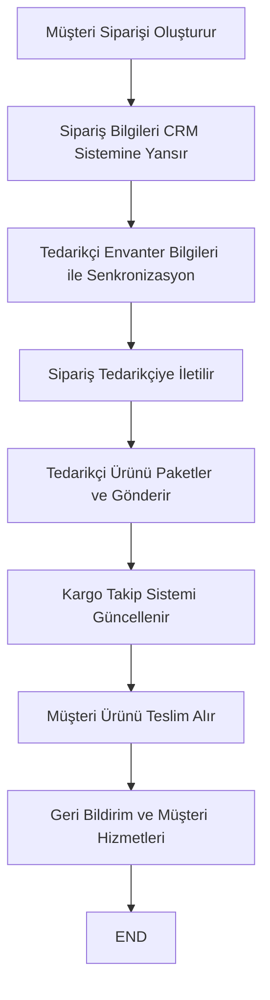

## İçindekiler  
1. Giriş  
2. Uluslararası Pazaryeri Entegrasyonunun Temelleri  
3. Dropshipping Modelinin Rolü  
4. Veri Senkronizasyonu ve Güvenlik Önlemleri  
5. Amazon, eBay, Alibaba ve AliExpress Entegrasyon Stratejileri  
6. Vaka Çalışmaları ve Tartışma  
7. Sonuç  

---  

## 1. Giriş  
Uluslararası pazaryeri entegrasyonu, küreselleşen ticaret ortamında işletmelerin rekabet gücünü artırmak için stratejik bir öneme sahiptir. Amazon, eBay, Alibaba, AliExpress gibi büyük dijital platformlar, çeşitli ülkelerde faaliyet gösteren satıcılar ve tedarikçiler arasında veri alışverişi, dropshipping uygulamaları, stok ve envanter yönetimi, veri senkronizasyonu ve güvenlik önlemleri gibi teknik entegrasyon unsurlarını gerektirmektedir. Bu çalışma, uluslararası pazaryerlerinin entegrasyonunda dropshipping modeli, veri senkronizasyonu ve güvenlik önlemlerinin rolünü; teorik arka planı, pratik uygulama örneklerini ve metodolojik yaklaşımları ele almaktadır. Araştırmada literatüre dayalı analizler, iş süreçlerinin modellenmesi (IDEF0 gibi) ve lojistik süreçlerin güncel uygulamaları değerlendirilmektedir.  

---  

## 2. Uluslararası Pazaryeri Entegrasyonunun Temelleri  
Dijital çağda uluslararası pazaryerleri, farklı coğrafyalardan birçok işletme ve tüketiciye ulaşmayı mümkün kılmaktadır. Bu platformların temel entegrasyon unsurları şunlardır:  

- **API Entegrasyonu:** Platformlar arası veri alışverişi, gerçek zamanlı güncellemeler ve operasyonel otomasyon, API’ler aracılığıyla gerçekleştirilir.  
- **Veri Senkronizasyonu:** Stok, fiyat, sipariş ve müşteri bilgileri sürekli güncellenir. Bu işlemin doğruluğu, müşteri memnuniyeti açısından büyük önem taşır.  
- **Güvenlik ve Veri Koruması:** Veri gizliliği ve güvenliği, hem yasal gereklilikler hem de tüketici güveninin sağlanması açısından kritik rol oynar.  
- **Dropshipping ve Lojistik Süreçler:** Geleneksel envanter yönetimi yerine, ürün doğrudan tedarikçiden müşteriye gönderilir. Bu model, maliyet avantajları ve esneklik sunsa da güncel veri senkronizasyonu ve lojistik koordinasyon gerektirir.  

Uluslararası pazaryeri entegrasyonu, tüm bu unsurların uyumlu bir şekilde çalışmasıyla başarılı olmaktadır. İş süreçlerinin dijital altyapı üzerinden entegrasyonu, işletmelerin daha dinamik ve rekabetçi hale gelmesine olanak sağlar.  

---  

## 3. Dropshipping Modelinin Rolü  
Dropshipping, e-ticarette ürünlerin fiziksel olarak depolanmadan, doğrudan tedarikçiden müşteriye gönderilmesidir. Bu model, girişimciler için düşük sermaye gereksinimi, esnek ürün portföyü ve hızla değişen pazar koşullarına uyum sağlama avantajları sunmaktadır.  

### 3.1. Dropshipping Uygulamasının Tanımı ve Avantajları  
Dropshipping iş modeli; bir web-orientli sistem üzerinden ürün kataloglarının sunulması, siparişlerin otomatik olarak tedarikçilere iletilmesi ve müşteri kayıtlarının CRM sistemleriyle yönetilmesi gibi süreçleri içerir. Geliştirilen sistemlerde, IDEF0 gibi fonksiyonel modeller kullanılarak iş süreçleri detaylandırılmıştır.  
Avantajlar şunlardır:  
- **Düşük Başlangıç Maliyetleri:** Depolama ve lojistik yatırımları minimize edilmiştir.  
- **Hızlı Pazar Girişi:** Ürün portföyü hızla oluşturulabilir ve değiştirilebilir.  
- **Esneklik:** Ürün çeşitliliği ve pazar taleplerine hızlı yanıt verebilme imkanı vardır.  

### 3.2. Dropshipping Modelinin Zorlukları ve Dezavantajları  
Dropshipping işletmelerinin karşılaştığı en önemli zorluklar arasında; uzun teslim süreleri, stok bilgisinin sürekli güncellenmesi gerekliliği, tedarikçiler arası uyumsuzluk ve yüksek gönderim maliyetleri yer almaktadır.  
Bu zorlukların üstesinden gelmek için;  
- **Yüksek Veri Senkronizasyonu:** Tedarikçilerle gerçek zamanlı veri iletişimi kurularak stok ve fiyat bilgileri güncel tutulmalıdır.  
- **Gelişmiş Otomasyon Sistemleri:** CRM ve ERP sistemlerinin entegrasyonu, sipariş süreçlerinin ve müşteri hizmetlerinin otomasyonunu sağlamalıdır.  
- **Güvenlik Önlemleri:** Tüm verilerin şifrelenmesi, erişim kontrolü ve düzenli sistem denetimleri ile garanti altına alınmalıdır.  

### 3.3. Lojistik Süreç Modellemesi  
Dropshipping sürecinde lojistik önemli bir yer tutmaktadır. Siparişlerin farklı tedarikçilerden gelmesi, teslimat sürecinde koordinasyon zorluklarına neden olur. Bu durum, müşteri memnuniyetini olumsuz etkileme riskini doğurur.  
Aşağıda, dropshipping sürecini özetleyen bir süreç akış diyagramı yer almaktadır:  

**Mermaid Akış Diyagramı: Dropshipping Süreci**  

Bu akış diyagramı, müşteri siparişinden ürün teslimatına kadar olan temel adımları göstermektedir. Her adım, sistemin otomasyon ve entegrasyon gereksinimlerine uygun olarak tasarlanmıştır.  

---  

## 4. Veri Senkronizasyonu ve Güvenlik Önlemleri  
Uluslararası pazaryeri entegrasyonunda veri senkronizasyonu ve güvenlik önlemleri, başarının temel yapı taşlarıdır. Bu bölümde, veri senkronizasyonu süreçleri ve veri güvenliği stratejileri detaylı olarak ele alınacaktır.  

### 4.1. Gerçek Zamanlı Veri Senkronizasyonu  
Pazaryeri entegrasyonunda stok durumu, fiyatlandırma, sipariş bilgileri ve müşteri verilerinin doğru şekilde senkronize edilmesi büyük önem taşır. Özellikle dropshipping modeli gibi, ürünlerin tedarikçilerden müşteriye doğrudan gönderildiği sistemlerde, veri güncelliği müşteri memnuniyeti ve işletme verimliliği açısından kritik rol oynar.  
Örneğin, bir müşterinin sipariş verdiği anda, tedarikçiye gerçek zamanlı sipariş iletimi sağlanmalı ve envanterdeki azalma anında sisteme yansıtılmalıdır. Bu süreçte API entegrasyonları ve bulut tabanlı veri tabanları kullanılmaktadır. Aşağıdaki tablo, farklı uluslararası pazaryerlerinde veri senkronizasyonunun temel bileşenlerini özetlemektedir.  

| Platform      | Veri Senkronizasyon Yöntemi           | Kullanılan Teknolojiler           | Zorluklar                          |  
|---------------|---------------------------------------|-----------------------------------|------------------------------------|  
| Amazon        | Gerçek zamanlı API entegrasyonu       | RESTful API, Webhook, AWS         | Yüksek veri hacmi, gecikme         |  
| eBay          | Güncel envanter güncellemeleri        | SOAP/REST API, veri arabelleği    | Farklı API sürümleri               |  
| Alibaba       | Toplu veri aktarımı ve anlık güncelleme| RESTful API, XML veri formatı      | Veri güvenliği ve yetkilendirme    |  
| AliExpress    | Sürekli veri akışı ve senkronizasyon  | REST API, GraphQL, bulut tabanlı  | Envanter tutarsızlıkları           |  

  

### 4.2. Güvenlik ve Veri Koruma Stratejileri  
Veri senkronizasyonunun yanı sıra, güvenlik önlemleri de işletme ve tüketici verilerini korumak için hayati öneme sahiptir. Güvenlik stratejileri kapsamında; veri şifreleme, kimlik doğrulama, erişim kontrolü ve düzenli sistem denetimleri yer almaktadır.  
Veri gizliliği ve güvenliği ile ilgili yapılan çalışmalar, sıkı veri koruma düzenlemelerinin müşteri güvenini artırdığını göstermektedir.  
Örneğin, Avrupa Birliği Genel Veri Koruma Yönetmeliği (GDPR) ve Kaliforniya Tüketici Gizliliği Yasası (CCPA), veri güvenliğini artıran yasal düzenlemeler arasındadır. Bu tür düzenlemeler, işletmelerin müşteri verilerini korurken aynı zamanda veri senkronizasyonu sırasında ortaya çıkabilecek ihlalleri önlemeye yönelik teknik altyapı geliştirmelerini gerektirmektedir.  

### 4.3. Entegre Sistem Mimarisi  
Modern e-ticaret platformlarında verilerin güvenli ve sürekli senkronize edilmesi, mikroservis mimarileri, bulut çözümleri ve ESB (Enterprise Service Bus) gibi bileşenlerle desteklenmektedir. Aşağıda bu sürecin genel mimarisini gösteren bir SVG diyagramı yer almaktadır:  

<svg xmlns="http://www.w3.org/2000/svg" viewBox="0 0 600 400">  
  <rect x="20" y="20" width="160" height="60" fill="#cce5ff" stroke="#004085" stroke-width="2"/>  
  <text x="30" y="50" font-family="Arial" font-size="14" fill="#004085">API Entegrasyonu</text>  
  <rect x="220" y="20" width="160" height="60" fill="#d4edda" stroke="#155724" stroke-width="2"/>  
  <text x="230" y="50" font-family="Arial" font-size="14" fill="#155724">Veri Senkronizasyonu</text>  
  <rect x="420" y="20" width="160" height="60" fill="#f8d7da" stroke="#721c24" stroke-width="2"/>  
  <text x="430" y="50" font-family="Arial" font-size="14" fill="#721c24">Güvenlik ve Şifreleme</text>  
  <line x1="180" y1="50" x2="220" y2="50" stroke="#000" stroke-width="2" marker-end="url(#arrow)"/>  
  <line x1="380" y1="50" x2="420" y2="50" stroke="#000" stroke-width="2" marker-end="url(#arrow)"/>  
  <defs>  
    <marker id="arrow" markerWidth="10" markerHeight="10" refX="0" refY="3" orient="auto">  
      <path d="M0,0 L0,6 L9,3 z" fill="#000" />  
    </marker>  
  </defs>  
  <text x="50" y="120" font-family="Arial" font-size="12" fill="#000">Mikroservis ve Bulut Tabanlı Altyapı</text>  
  <line x1="100" y1="80" x2="100" y2="110" stroke="#000" stroke-width="2" marker-end="url(#arrow)"/>  
  <line x1="300" y1="80" x2="300" y2="110" stroke="#000" stroke-width="2" marker-end="url(#arrow)"/>  
  <text x="250" y="150" font-family="Arial" font-size="12" fill="#000">ESB ve Entegre Veri Akışı</text>  
  <line x1="380" y1="80" x2="380" y2="140" stroke="#000" stroke-width="2" marker-end="url(#arrow)"/>  
</svg>  
  
*SVG Diyagramı: API entegrasyonu, veri senkronizasyonu ve güvenlik süreçlerinin entegrasyon mimarisini göstermektedir.*  

---  

## 5. Amazon, eBay, Alibaba ve AliExpress Entegrasyon Stratejileri  
Uluslararası pazaryeri entegrasyonunun somut örnekleri arasında, Amazon, eBay, Alibaba ve AliExpress gibi dev platformlar bulunmaktadır. Bu platformlar, hem dropshipping modelleri hem de veri senkronizasyonu ve güvenlik konularında benzer ve farklı stratejiler uygulamaktadır.  

### 5.1. Amazon Entegrasyonu  
Amazon, geniş API seçenekleri ile kendi satıcı ekosistemine kolay entegrasyon imkanı sunar. Özellikle Amazon Marketplace Web Services (MWS) ve yeni geliştirilen API’ler, satıcıların stok, sipariş ve fiyat güncellemelerini anlık olarak gerçekleştirmesine olanak verir.  
- **Dropshipping Entegrasyonu:** Satıcılar, Amazon’un API’lerinde bulunan sipariş yönetim sistemini kullanarak, doğrudan tedarikçilerle entegre olabilirler.  
- **Veri Senkronizasyonu:** AWS altyapısı üzerinden yüksek hacimli verinin gerçek zamanlı senkronizasyonu sağlanmaktadır.  
- **Güvenlik Standartları:** Amazon, veri şifreleme, iki faktörlü kimlik doğrulama ve düzenli güvenlik denetimleri ile kullanıcı verilerini korur.  

### 5.2. eBay Entegrasyonu  
eBay, özellikle uluslararası satıcılarla veri alışverişi konusunda uzun yıllara dayanan deneyime sahiptir.  
- **Dropshipping Entegrasyonu:** eBay’in API’leri ile satıcılar, siparişlerin otomatik olarak işlenmesini sağlayan sistemlere erişebilir.  
- **Veri Senkronizasyonu:** eBay, güncel stok ve fiyat bilgilerini tutmak için hem SOAP hem de REST tabanlı API’ler sunar.  
- **Güvenlik Standartları:** eBay, veri güvenliği için gelişmiş şifreleme teknikleri ve sürekli sistem izleme uygulamaları kullanmaktadır.  

### 5.3. Alibaba ve AliExpress Entegrasyonu  
Alibaba grubu, B2B ve B2C segmentlerinde farklı entegrasyon stratejileri benimsemiştir.  
- **Alibaba:**  
  - **Dropshipping Entegrasyonu:** Tedarikçilerle gerçek zamanlı veri paylaşımı ve toplu veri aktarımı ile çalışmak mümkündür.  
  - **Veri Senkronizasyonu:** XML ve RESTful API’ler üzerinden, yüksek hacimli verinin sürekli güncellenmesi sağlanır.  
  - **Güvenlik Standartları:** Alibaba, veri erişim kontrolleri, yetkilendirme yöntemleri ve şifreleme protokolleri kullanarak güvenliği garanti altına alır.  
- **AliExpress:**  
  - **Dropshipping Entegrasyonu:** AliExpress, doğrudan sipariş yönetimi ve tedarikçi entegrasyonunu destekleyen API çözümleri sunmaktadır.  
  - **Veri Senkronizasyonu:** Bulut tabanlı çözümler aracılığıyla envanter ve fiyat bilgileri anlık olarak güncellenir.  
  - **Güvenlik Standartları:** Gelişmiş erişim kontrolleri, düzenli güvenlik güncellemeleri ve veri şifreleme yöntemleri uygulanmaktadır.  

### 5.4. Entegrasyon Süreçlerinin Karşılaştırılması  
Aşağıdaki tablo, dört platformun entegrasyon stratejilerini karşılaştıran özet bilgiler sunmaktadır:  

| Platform      | Dropshipping Entegrasyonu                                        | Veri Senkronizasyonu Yöntemleri                  | Güvenlik Standartları                                  | Kullanılan Teknolojiler                                      |  
|---------------|------------------------------------------------------------------|--------------------------------------------------|--------------------------------------------------------|--------------------------------------------------------------|  
| Amazon        | API tabanlı sipariş yönetimi, otomatik tedarikçi entegrasyonu     | AWS, gerçek zamanlı API entegrasyonu             | İki faktörlü doğrulama, şifreleme, düzenli güvenlik denetimi | RESTful API, AWS, Webhook                                    |  
| eBay          | SOAP/REST API’leri ile otomatik sipariş işleme                   | Güncel envanter güncellemeleri, veri arabelleği    | Gelişmiş şifreleme, sıkı sistem izleme                  | SOAP/REST API, veri senkronizasyon motorları                  |  
| Alibaba       | Toplu veri aktarımı, anlık stok güncelleme entegrasyonu            | XML & RESTful API, toplu veri transferi           | Erişim kontrolleri, yetkilendirme protokolleri           | RESTful API, XML, bulut tabanlı veri tabanları                 |  
| AliExpress    | Doğrudan API entegrasyonu ile sipariş ve tedarikçi bağlantısı       | Bulut tabanlı veri senkronizasyonu, dinamik güncelleme | Gelişmiş erişim kontrolleri, düzenli sistem güncellemeleri | REST API, GraphQL, bulut çözümleri                             |  

  

---  

## 6. Vaka Çalışmaları ve Tartışma  
Uluslararası pazaryeri entegrasyonunda uygulama örnekleri, teorik yaklaşımların pratikte nasıl hayata geçirildiğini göstermektedir. Bu bölümde, literatürde yer alan vaka çalışmaları ve güncel entegrasyon uygulamaları değerlendirilmiştir.  

### 6.1. Vaka Çalışması: Web-Oryantasyonlu Dropshipping Sistemi  
Geliştirilen web tabanlı sistem, dropshipping iş modelinin avantajlarını ve zorluklarını ele almaktadır. Fonksiyonel IDEF0 modelleri kullanılarak iş süreçleri ayrıntılı şekilde analiz edilmiştir.  
- **Başarı Faktörleri:**  
  - CRM ve ERP entegrasyonunun sağladığı otomasyon  
  - Gerçek zamanlı veri senkronizasyonu ile stok güncellemeleri  
  - Güçlü veri güvenliği protokolleri  
- **Zorluklar:**  
  - Tedarikçiler arasında senkronizasyon eksikliği  
  - Farklı API sürümleri ve veri yapılarına uyum sağlama  
  - Lojistik ve teslimat süreçlerinde yaşanan gecikmeler  

### 6.2. Vaka Çalışması: Uluslararası Pazaryeri Entegrasyonu  
Platform-dependent girişimciler ve dijital platform sınırlarının incelendiği çalışmalar, büyük pazaryerlerinin elektronik ticarette oynadığı rolü ortaya koymaktadır.  
- **Örnek Uygulamalar:**  
  - Amazon ve eBay’in API altyapısı sayesinde, satıcıların sipariş yönetimi süreçleri otomatikleştirilmiştir.  
  - Alibaba ve AliExpress’in veri senkronizasyonu sistemleri, stok verilerinin sürekli güncellenmesini sağlamaktadır.  
  - Bu platformlar, veri güvenliğini artıran düzenlemeler ve teknik altyapılar ile müşteri güvenini tesis etmiştir.  

### 6.3. Tartışma  
Yukarıdaki vaka çalışmalarına dayanarak, uluslararası entegrasyonun temel avantajları ve risklerinin özetlenmesi mümkündür:  
- **Avantajlar:**  
  - Gerçek zamanlı veri akışı ve güncel envanter yönetimi  
  - Küresel pazara erişim ve maliyet etkin işletme modeli  
  - Artan müşteri güveni ve şeffaflık  
- **Riskler:**  
  - Farklı sistemler arasında veri uyumsuzluğu  
  - Güvenlik açıkları ve veri ihlali riski  
  - Lojistik süreçlerde senkronizasyon sorunları  

Bu tartışmalar, işletmelerin entegrasyon süreçlerine yatırım yaparken karşı karşıya kaldıkları dinamikler hakkında önemli ipuçları sunmaktadır.  

---  

## 7. Sonuç  
Uluslararası pazaryeri entegrasyonu, Amazon, eBay, Alibaba, AliExpress gibi platformlarda dropshipping, veri senkronizasyonu ve güvenlik unsurlarına odaklanan karmaşık bir süreçtir. Bu çalışmada;  
- **Dropshipping Modeli:**  
  - Düşük başlangıç maliyetleri, esnek pazar girişi ve otomasyon avantajları sunarken, stok uyumsuzluğu, uzun teslim süreleri gibi zorluklar da doğurmaktadır.  
- **Veri Senkronizasyonu:**  
  - Gerçek zamanlı veri akışı, API entegrasyonları ve bulut tabanlı sistemler, başarılı entegrasyonun anahtarıdır.  
- **Güvenlik Önlemleri:**  
  - Veri şifreleme, kimlik doğrulama ve düzenli sistem denetimleri, hem yasal zorunluluklar hem de müşteri güveni açısından kritik öneme sahiptir.  
- **Platform Bazlı Entegrasyon Stratejileri:**  
  - Amazon, eBay, Alibaba ve AliExpress, her biri farklı teknoloji ve metodolojilerle entegrasyonunu gerçekleştirirken; API çözümlemeleri, veri güncellemeleri ve gelişmiş güvenlik önlemleri uygulamaktadır.  

Aşağıdaki madde işareti listesi, temel bulguları özetlemektedir:  
- Gerçek zamanlı veri senkronizasyonu, uluslararası pazaryeri entegrasyonunda kritik rol oynar.  
- Dropshipping, doğru otomasyon sistemleri ile başarılı biçimde uygulanabilir; ancak tedarikçiler arası veri uyumsuzluğu gibi riskler içerir.  
- Güçlü güvenlik önlemleri, veri ihlallerini önleyerek tüketici güvenini artırır.  
- Farklı platformlar, kendi altyapılarına uygun API ve veri yönetim çözümleri sunar; bu da her platformun entegrasyon stratejisinin özgün olduğunu göstermektedir.  

### Sonuç Tablosu: Temel Bulgular  

| Ana Başlık              | Temel Bulgular                                                                                      |  
|-------------------------|-----------------------------------------------------------------------------------------------------|  
| Dropshipping            | Düşük maliyet, hızlı pazar girişi, stok uyumsuzluğu ve lojistik zorlukları                           |  
| Veri Senkronizasyonu    | Gerçek zamanlı veri güncellemeleri, API entegrasyonu ve bulut tabanlı veri çözümleri                |  
| Güvenlik                | Şifreleme, kimlik doğrulama, düzenli güvenlik denetimleri ve yasal uyumluluk                          |  
| Platform Entegrasyonu   | Her platformun kendine özgü API, veri ve güvenlik stratejileri; teknolojik altyapı farklılıkları      |  

Araştırmanın sonuçlarına göre, uluslararası platform entegrasyonu kapsamlı bir planlama, gelişmiş teknolojik altyapı ve sürekli iyileştirme gerektirmektedir. İşletmelerin bu unsurlara odaklanması, global pazarda rekabet avantajı edinmelerine yardımcı olacaktır.  

---  

## Kaynakça  
- **Veri Gizliliği ve Tüketici Güveni:** Çalışmalarda, sıkı veri gizliliği düzenlemelerinin tüketici güvenini artırdığı gözlemlenmiştir.  
- **Dropshipping ve Lojistik Süreçler:** Web tabanlı dropshipping sistemlerinin gelişimi, IDEF0 modeli ve CRM entegrasyonları ile ayrıntılı şekilde incelenmiştir.  
- **Dropshipping Dezavantajları:** Lojistik zorluklar, stok senkronizasyonu ve iletişim eksiklikleri detaylandırılmıştır.  
- **Güvenlik Stratejileri:** Veri şifreleme, iki faktörlü doğrulama ve ESB entegrasyonları, uluslararası pazaryeri entegrasyonunda kullanılmaktadır.  

---  

Bu çalışma, uluslararası pazaryeri entegrasyonunun dropshipping modeli, veri senkronizasyonu ve güvenlik boyutlarını kapsamlı bir şekilde ele alarak, teori ile pratik arasındaki ilişkiyi ortaya koymaktadır. İşletmeler, bu stratejileri uygulayarak sadece operasyonel verimliliklerini artırmakla kalmayıp aynı zamanda tüketici güvenini ve pazardaki rekabet gücünü de sağlamlaştırabilirler.