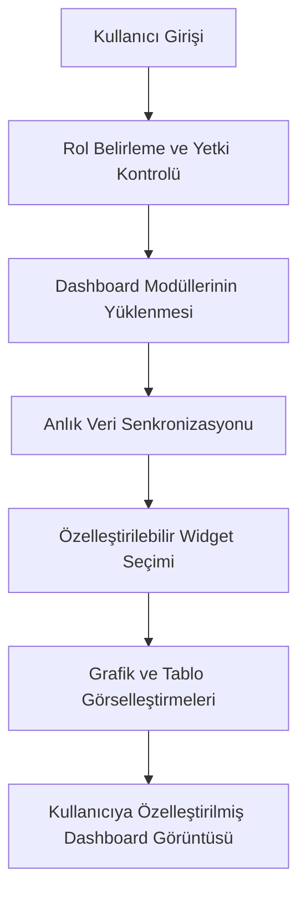

## İçindekiler  
1. Giriş  
2. OpenCart API Entegrasyonu ve Gerçek Zamanlı Veri Senkronizasyonu  
3. Kullanıcı Deneyimi ve Duyarlı Arayüz Tasarımı  
4. Özelleştirilebilir Dashboard ve Yönetim Paneli  
5. Karşılaştırmalı Analiz ve Örnek Olay İncelemesi  
6. Sonuç ve Değerlendirme  

---  

## 1. Giriş  

E-ticaret çözümlerinde rekabetin artması, işletmelerin hem operasyonel verimliliğini artırmak hem de müşteri memnuniyetini en üst düzeye çıkarmak için modern teknolojilere yatırım yapmalarını zorunlu kılmıştır. Bu bağlamda, **OpenCart sistemlerinde API entegrasyonu ve kullanıcı deneyimi incelemesi** önemli bir araştırma konusudur. OpenCart, düşük maliyeti, esnek yapısı ve geniş geliştirici topluluğu nedeniyle tercih edilen bir e-ticaret platformudur. Ancak, platformun bazı temel özellikleri, özellikle API entegrasyonu, gerçek zamanlı veri senkronizasyonu ve kullanıcı dostu arayüz açısından geliştirilmesi gereken alanlar içermektedir.  

Bu rapor; OpenCart sistemlerinin API entegrasyonu, RESTful API yapısının avantajları ve sınırlamaları, gerçek zamanlı veri senkronizasyonu gereksinimleri, WebSocket desteği gibi konuları ele almaktadır. Ayrıca, kullanıcı deneyimi açısından duyarlı tasarım, kolay erişilebilir arayüz ve özelleştirilebilir dashboard gibi öncelikli unsurlar detaylı biçimde incelenmektedir. Araştırmanın amacı, var olan literatür ve vaka incelemeleri ışığında OpenCart’ın entegrasyon yeteneklerini ve kullanıcı deneyimini kapsamlı bir şekilde değerlendirmektir. Böylece, platformun güncel durumunun teknolojik gelişmelerle uyumlu hale getirilmesi için öneriler sunulacaktır.  

---  

## 2. OpenCart API Entegrasyonu ve Gerçek Zamanlı Veri Senkronizasyonu  

### 2.1. API Entegrasyonu Temelleri  

OpenCart, kullanıcılara ve geliştiricilere mağaza yönetimi konusunda büyük kolaylıklar sağlamaktadır. Ancak, API entegrasyonu bağlamında, sistemin bazı açık noktaları bulunmaktadır. Özellikle, OpenCart’ın yerel API’lerinin ürün, özellik ve stok senkronizasyonu gibi kritik işlemleri kolay ve verimli bir biçimde gerçekleştirme konusunda yetersiz kaldığı gözlemlenmiştir. Mevcut yapı, ürün ve özellik verilerinin otomatik olarak senkronize edilmesinde sınırlamalar getirmektedir.  

API entegrasyonu, modern e-ticaret sitelerinde üçüncü parti sistemlerle (ör. ERP sistemleri, ödeme ağ geçitleri, CRM uygulamaları) etkileşim sağlamak açısından kritik bir rol oynamaktadır. OpenCart’ta API’nin sunduğu temel işlevler yetersiz kalmakta, bu nedenle ek üçüncü parti eklenti ve modüller kullanılarak bu eksiklerin giderilmesi gerekmektedir. Bu durum, entegrasyon sürecinde işletmelere ek maliyet ve geliştirme çabası getirmektedir.  

### 2.2. RESTful API Yaklaşımı  

RESTful API’ler, HTTP protokolü üzerinde çalışan, kaynak odaklı basit ve ölçeklenebilir web servisleri sunar. OpenCart sistemlerinde RESTful API’lerin kullanımı, dış entegrasyonların yönetilebilirliğini artırabilir. REST mimarisi; kaynakların URI’ler aracılığıyla erişilmesi, verinin JSON formatında iletilmesi ve HTTP metodlarının (GET, POST, PUT, DELETE) belirli işlemleri gerçekleştirmesi gibi avantajlar sunmaktadır.  

RESTful API entegrasyonu ile;  
- **Ürün Bilgisi Alımı:** Mağaza veritabanındaki ürünler ve özelliklerin kolayca dış sistemlere aktarılması sağlanır.  
- **Stok Durumu Güncellemeleri:** Gerçek zamanlı stok takibi ve güncellemeler API üzerinden gerçekleştirilebilir.  
- **Sipariş ve Ödeme İşlemleri:** Sipariş bilgileri ve ödeme durumları API aracılığıyla diğer kurumsal sistemlerle entegre edilebilir.  

Ancak, OpenCart’ın yerleşik API’lerinin bazı durumlarda yetersiz kalması, entegrasyon sürecinde özelleştirme ve ek güvenlik önlemleri alınması gerekliliğini ortaya çıkarmaktadır. Özellikle, API’nin ürün ve özellik senkronizasyonunda karşılaşılan zorluklar, günümüzün rekabetçi e-ticaret ortamında hata payını artırabilecek riskler taşımaktadır.  

### 2.3. Gerçek Zamanlı Veri Senkronizasyonu ve WebSocket Desteği  

Gerçek zamanlı veri senkronizasyonu, kullanıcı deneyimini artırmak için kritik bir faktördür. Müşteriler, sipariş durumları, stok bilgileri ve ürün güncellemeleri gibi bilgileri anlık olarak görebilmelidir. Bu noktada, WebSocket teknolojisi devreye girmektedir. WebSocket, istemci ile sunucu arasında kalıcı bir bağlantı kurarak çift yönlü iletişim sağlar ve gerçek zamanlı veri alışverişini mümkün kılar.  

OpenCart’ın varsayılan yapısı WebSocket desteği sunmasa da, ek modüller ve özel geliştirmeler ile sistemin gerçek zamanlı veri senkronizasyonu yetenekleri artırılabilir. Özellikle, yoğun trafik altında bile veri güncelleme işlemleri, WebSocket entegrasyonu sayesinde gecikme olmaksızın gerçekleştirilebilir. Gerçek zamanlı senkronizasyon, kullanıcıların güncel bilgiye her zaman erişebilmesini sağlayarak, müşteri memnuniyetini artırırken aynı zamanda işletme verimliliğine de katkıda bulunur.  

Aşağıdaki Mermaid diyagramı, OpenCart üzerinde gerçek zamanlı veri senkronizasyonu sürecinin genel akışını göstermektedir:  

```mermaid  
flowchart TD  
    A[""İstemci Tarafı (Kullanıcı)""]  
    B[""RESTful API Çağrısı""]  
    C[""Veri Tabanı İşlemleri""]  
    D[""WebSocket Sunucusu""]  
    E[""Gerçek Zamanlı Veri Güncellemesi""]  
    A -->|""GET/POST Çağrısı""| B  
    B -->|""Veri Okuma/Yazma""| C  
    C -->|""Güncelleme Bildirimi""| D  
    D -->|""Anlık Güncelleme""| E  
    E --> A  
```  

**Şekil 1: OpenCart'ta Gerçek Zamanlı Veri Senkronizasyonu Akış Diyagramı**  
Bu diyagram, istemci ile sunucu arasında veri alışverişi sürecini ve WebSocket entegrasyonunun nasıl çalıştığını özetlemektedir.  

### 2.4. Üçüncü Parti Eklenti ve Özelleştirme Gereksinimleri  

Yukarıda da belirtildiği gibi, OpenCart’ın yerel API işlevselliği sınırlı olduğundan, üçüncü parti eklentiler devreye girmektedir. Ek eklentiler;  
- Ürün senkronizasyonunu otomatikleştirme,  
- Özellik güncellemelerini kolaylaştırma,  
- Dış sistemlerle entegrasyonlarda ekstra doğrulama süreçleri yer alabilir.  

Bunun yanı sıra, entegrasyon sürecinde verinin bütünlüğü, hata yönetimi ve güvenlik önlemleri gibi ek hususlar da dikkate alınmalıdır. Özellikle, ERP sistemleri ile bağlantı sırasında veri kaybı ve dengesizlik riski, ek güvenlik önlemleri gerektirmektedir. Entegrasyon sürecinin başarılı olması için sistemin ölçeklenebilirliğinin ve güvenlik altyapısının sağlam olması gerekmektedir.  

---  

## 3. Kullanıcı Deneyimi ve Duyarlı Arayüz Tasarımı  

### 3.1. Kullanıcı Dostu Arayüzün Önemi  

Kullanıcı deneyimi, herhangi bir e-ticaret sisteminin başarısında kritik rol oynamaktadır. OpenCart, kullanıcılarına basit ve anlaşılır bir arayüz sunması ile öne çıkmaktadır. Kullanıcıların mağaza yönetimi, ürün ekleme, sipariş takibi gibi işlemleri zahmetsizce gerçekleştirebilmeleri, sistemin kullanıcı dostu olduğunu ortaya koymaktadır. Kullanıcı dostu arayüzler;  
- **Kolay Navigasyon:** Kullanıcıların ihtiyaç duydukları işlemleri hızlıca gerçekleştirebilmesi,  
- **Ulaşılabilirlik:** Hem masaüstü hem de mobil cihazlarda uyumlu çalışabilme,  
- **Minimalist Tasarım:** Gereksiz karmaşıklıktan uzak, sade arayüzler.  

### 3.2. Duyarlı Tasarım (Responsive Design)  

Duyarlı tasarım, farklı ekran boyutlarına uyum sağlayabilen web uygulamalarının temel taşlarından biridir. OpenCart, duyarlı tasarım prensiplerini benimseyerek, kullanıcı deneyimini cihaz türünden bağımsız hale getirmektedir. Özellikle mobil cihaz kullanımının yaygınlaşması, sistem tasarımında bu özelliğin kritik olduğunu göstermektedir. Duyarlı tasarım sayesinde;  
- **Mobil Uyum:** Akıllı telefon ve tablet kullanıcıları için optimize edilmiş arayüz,  
- **Erişilebilirlik:** Her yerden sistemlere erişim imkanı,  
- **Kullanıcı Memnuniyeti:** Arayüzün her cihazda tutarlı görünmesi, kullanıcı deneyimini artırır.  

### 3.3. Arayüz Özelleştirme ve Dashboard Tasarımı  

Kullanıcılar, yönetim paneli ve dashboard üzerinden mağaza performanslarını, sipariş durumlarını ve gelir/gider raporlarını takip edebilmelidir. Özelleştirilebilir dashboard’lar, işletmelere raporlama ve analiz aşamalarında büyük avantaj sağlamaktadır. Dashboard’ların temel özellikleri arasında şunlar yer almaktadır:  
- **Gerçek Zamanlı Veri Görüntüleme:** Sipariş, stok ve gelir durumlarının anlık takibi,  
- **Widget Tabanlı Yapı:** Kullanıcıların ihtiyaç duydukları bilgileri modüler şekilde ekleyebilmesi,  
- **Kişiselleştirilebilir Arayüz:** Renk, grafik ve yerleşim düzenlerinin kullanıcı tercihlerine göre ayarlanması.  

### 3.4. Kullanıcı Deneyimi İyileştirme Çalışmaları  

Kullanıcı deneyimini artırmak için yapılan çalışmalar, sadece teknik entegrasyonlarla sınırlı kalmamaktadır. Kullanıcı memnuniyeti anketleri, usability (kullanılabilirlik) testleri ve düzenli güncelleme süreçleri, platformun gelişimine katkı sağlayan önemli unsurlardır. OpenCart tabanlı projelerde gerçekleştirilen vaka çalışmalarında, kullanıcıların ürün yönetimi, ödeme işlemleri ve stok kontrolü gibi aşamalarda yaşadığı kolaylıklar; platformun kullanıcı deneyimini olumlu yönde etkilediğini göstermektedir.  

Aşağıdaki tablo, OpenCart ve diğer popüler e-ticaret platformlarının kullanıcı deneyimi açısından bazı temel parametrelerini karşılaştırmaktadır:  

| Platform          | Kullanıcı Dostu Arayüz | Duyarlı Tasarım | Özelleştirilebilir Dashboard | Gerçek Zamanlı Güncellemeler |  
|-------------------|------------------------|-----------------|-----------------------------|-----------------------------|  
| OpenCart          | Orta                   | Var             | Kısıtlı                     | Ek modüller gerektirir  |  
| PrestaShop        | Yüksek                 | Var             | Gelişmiş                    | Dahili destek sağlar        |  
| Magento           | Orta                   | Var             | Gelişmiş                    | Ek geliştirme gerektirir    |  
| WooCommerce       | Yüksek                 | Var             | Orta                        | Eklentiler ile desteklenir  |  

**Tablo 1: OpenCart ve Diğer E-ticaret Platformlarının Kullanıcı Deneyimi Karşılaştırması**  
Bu tablo, OpenCart’ın kullanıcı deneyimi açısından güçlü ve zayıf yönlerini, rakipleri ile karşılaştırmalı olarak sunmaktadır.  

---  

## 4. Özelleştirilebilir Dashboard ve Yönetim Paneli  

### 4.1. Dashboard Özelliklerinin Önemi  

E-ticaret işletmeleri için dashboard’lar, iş süreçlerinin izlenmesi, analiz raporlarının sunulması ve stratejik kararların alınması noktasında kritik araçlardır. Özelleştirilebilir dashboard’lar, her iş kolunun kendine özgü gereksinimlerine cevap veren modüler yapılar sunar. OpenCart sistemlerinde yerleşik dashboard seçenekleri sınırlı kalmakta, bu nedenle işletmeler özel modüller ve eklentiler kullanarak kendi ihtiyaçlarına uygun dashboard’lar oluşturabilmektedir.  

### 4.2. Özelleştirilebilir Dashboard Tasarım İlkeleri  

Özelleştirilebilir dashboard’lar geliştirirken şu ilkeler göz önünde bulundurulmalıdır:  
1. **Modüler Yapı ve Widget Kullanımı:** Kullanıcıların raporlama araçlarını ihtiyaçlarına göre ekleyip çıkarabileceği bir yapı oluşturulmalıdır.  
2. **Anlık Veri Güncellemesi:** Gerçek zamanlı veri senkronizasyonu ile, dashboard üzerinde gösterilen veriler her an güncel tutulmalıdır.  
3. **Kullanıcı Rolüne Göre Özelleştirme:** Yönetici, satış temsilcisi, stok kontrol sorumlusu gibi farklı kullanıcı rollerine uygun dashboard tasarımları geliştirilmelidir.  
4. **Grafik ve Görsel Destek:** Raporların anlaşılabilirliğini artırmak için grafikler, tablolar ve infografikler kullanılarak görselleştirme sağlanmalıdır.  

### 4.3. Örnek Dashboard Tasarım Akışı  

Aşağıda, özelleştirilebilir dashboard tasarım sürecinin genel akışını gösteren bir Mermaid akış diyagramı yer almaktadır:  



**Şekil 2: Özelleştirilebilir Dashboard Tasarım Süreci Akış Diyagramı**  
Bu diyagram, kullanıcıların sisteme girişinden başlayarak, rol doğrulamasına, modül yükleme ve veri senkronizasyonu sonrasında dashboard’un özelleştirilmesine kadar olan süreci göstermektedir.  

### 4.4. Uygulamaya Geçirilen Çözüm Örnekleri  

Araştırmalarda, özellikle MSME’ler için geliştirilen OpenCart tabanlı platformlarda, dashboard özelleştirme imkanlarının işletme verimliliğini artırdığı gözlemlenmiştir. Kullanıcıların ürün yönetimi, sipariş takip raporları ve satış analizlerine dair veriye anında ulaşabilmesi, pazarlama stratejilerini ve stok yönetimini doğrudan olumlu yönde etkilemiştir.  

Ayrıca, dashboard’daki görselleştirme seçeneklerinin artırılması ve kullanıcıların raporları kişisel tercihlerine göre düzenleyebilmesi, müşteri memnuniyetine katkı sağlamış ve karar alma süreçlerinde hızlanma meydana gelmiştir.  

---  

## 5. Karşılaştırmalı Analiz ve Örnek Olay İncelemesi  

### 5.1. OpenCart’ın Özellikleri ve Sınırları  

OpenCart, kullanıcı dostu arayüzü, basit kurulumu ve geniş geliştirici desteği ile öne çıkmaktadır. Ancak, API entegrasyonu ve veri senkronizasyonu gibi ileri düzey gereksinimler söz konusu olduğunda, platformun yerleşik özellikleri yetersiz kalmaktadır. Özellikle aşağıdaki noktalarda sınırları gözlemlenmiştir:  

- **API Entegrasyonu:**  
  - OpenCart’ın yerel API’leri, ürün ve özellik senkronizasyonunun otomatikleştirilmesinde yetersizdir.  
  - ERP sistemleri veya diğer üçüncü parti uygulamalarla entegrasyon sırasında, veri bütünlüğü ve senkronizasyon konularında ek geliştirmelere ihtiyaç duyulmaktadır.  

- **Gerçek Zamanlı Veri Senkronizasyonu:**  
  - Platform, gerçek zamanlı veri güncellemeleri açısından doğrudan destek sunmamaktadır.  
  - Ek modüller ve WebSocket entegrasyonları ile bu eksikliği kapatmak mümkündür, ancak işletmeler ek maliyet ve geliştirme çabası ile karşılaşmaktadır.  

- **Kullanıcı Deneyimi:**  
  - OpenCart, kullanıcı dostu arayüzü ve basit yapısı sayesinde hızlı mağaza kurulumu sağlar, ancak dashboard ve yönetim paneli özelleştirmeleri sınırlı kalmaktadır.  

### 5.2. Rakip Platformlarla Karşılaştırma  

Aşağıdaki tablo, OpenCart’ın API entegrasyonu ve kullanıcı deneyimi unsurlarını, PrestaShop, Magento ve WooCommerce gibi rakip platformlarla karşılaştırmaktadır:  

| Özellik / Platform               | OpenCart                     | PrestaShop                    | Magento                        | WooCommerce                   |  
|----------------------------------|------------------------------|-------------------------------|-------------------------------|-------------------------------|  
| **API Entegrasyonu (RESTful)**   | Sınırlı (Ek modüller gerekli) | Dahili destek mevcut          | Yüksek özelleştirme mümkün     | Eklenti ile desteklenir        |  
| **Gerçek Zamanlı Senkronizasyon**| Ek modüller ve özel geliştirme gerektirir | Dahili veri güncelleme desteği | Ek geliştirme gerektirir       | Eklenti ile sağlanır          |  
| **Kullanıcı Dostu Arayüz**        | Basit ve anlaşılır       | Modern ve kullanıcı dostu     | Karmaşık, eğitim gerektirir    | Çok yönlü ve kullanıcı dostu   |  
| **Dashboard Özelleştirme**        | Kısıtlı, ek eklenti ile geliştirilebilir | Gelişmiş dashboard seçenekleri | Çok gelişmiş, ancak maliyetli | Orta düzeyde özelleştirme      |  

**Tablo 2: API Entegrasyonu ve Kullanıcı Deneyimi Açısından OpenCart ve Rakip Platformların Karşılaştırması**  
Bu karşılaştırma, OpenCart’ın rakiplerine kıyasla avantajları ile dezavantajlarını özetlemekte, entegrasyon ve kullanıcı arayüzü konularında hangi alanlarda geliştirmeye ihtiyaç duyulduğunu göstermektedir.  

### 5.3. Örnek Olay İncelemesi: Padang Panjang’ın OpenCart Tabanlı Platformu  

"Perancangan Platform Promosi dan Penjualan Home Industry Berbasis OpenCart di Padang Panjang" çalışması, OpenCart’ın sunduğu avantajlar ile entegrasyon zorluklarını pratik bir örnek üzerinden incelemiştir. Bu vaka incelemesi şu önemli noktaları vurgulamaktadır:  

- **Kullanıcı Deneyimi:**  
  - Kullanıcılar, ürün ve promosyon yönetiminde kolaylık yaşamış; arayüz sayesinde iş süreçlerinde zaman tasarrufu sağlanmıştır.  
  - Dijital ödeme entegrasyonu, işlem güvenliğini artırarak müşteri memnuniyetini olumlu yönde etkilemiştir.  

- **Entegrasyon Zorlukları:**  
  - Yerel API’nin ürün ve stok senkronizasyonu konusunda yetersiz kalması, ek geliştirme ve üçüncü parti modüllerin kullanımını zorunlu kılmıştır.  
  - ERP sistemleri ile entegrasyon sürecinde veri senkronizasyonunun düzgün sağlanabilmesi için, ek ara yazılım katmanlarına ihtiyaç duyulmuştur.  

- **Maliyet ve Esneklik:**  
  - OpenCart’ın açık kaynaklı doğası, küçük ve orta ölçekli işletmelere düşük maliyetle dijital dönüşüm imkanı tanımış; ancak, zorluklar modüler yapıyla aşılmaya çalışılmıştır.  

Bu örnek olay, OpenCart’ın avantajları ile birlikte, API ve veri senkronizasyonu konularında yaşanan zorlukları gözler önüne sermekte, bu eksikliklerin giderilebilmesi için özelleştirilmiş geliştirmelerin gerekliliğini ortaya koymaktadır.  

### 5.4. İnovatif Yaklaşımlar ve Gelecek Trendleri  

Günümüz teknolojik gelişmeleri, OpenCart gibi platformların da sürekli evrim geçirmesini gerektirmektedir. Özellikle, RESTful API’lerin ve WebSocket teknolojilerinin entegrasyonu, sistemin hem verimliliğini artırmakta hem de müşteri deneyimini geliştirerek rekabet avantajı sağlamaktadır. Gelecekte beklenen trendler arasında şunlar öne çıkmaktadır:  

- **Açık Kaynak Kodlu Geliştirmeler:**  
  - Topluluk desteği ile geliştirilecek modüller, API entegrasyon yeteneklerini artıracaktır.  
- **Bulut Tabanlı Çözümler ve Mikroservis Mimarisi:**  
  - OpenCart’ın ölçeklenebilirliğini sağlamak amacıyla, mikroservis mimarisi benimsenerek, farklı modüllerin bağımsız çalışması ve yönetilmesi mümkün hale gelecektir.  
- **Veri Güvenliği ve Hızlı Senkronizasyon:**  
  - Gerçek zamanlı veri güncellemeleri, özellikle mobil platformlarda kullanıcı memnuniyetini artıracaktır.  
- **Kişiselleştirilmiş Kullanıcı Deneyimi:**  
  - Yapay zeka ve makine öğrenimi destekli öneri sistemleri, kullanıcıya özel dashboard ve arayüz tasarımları, müşteri deneyimini zenginleştirecektir.  

Bu eğilimler, OpenCart’ın mevcut yapısının üzerine katman ekleyerek sistemin daha esnek, güvenli ve kullanıcı odaklı hale gelmesini sağlayacaktır.  

---  

## 6. Sonuç ve Değerlendirme  

Bu rapor, OpenCart sistemlerinde API entegrasyonu ve kullanıcı deneyimi unsurlarının derinlemesine bir incelemesini sunmuştur. Araştırma sonucunda şu temel bulgular elde edilmiştir:  

- **API Entegrasyonu ve Gerçek Zamanlı Veri Senkronizasyonu:**  
  - OpenCart’ın yerel API yapısı, ürün, özellik ve stok senkronizasyonu konularında sınırlı kalmaktadır.  
  - Dış sistemlerle entegrasyon için ek modüller ve özel geliştirmeler gerekmektedir.  
  - WebSocket entegrasyonu, gerçek zamanlı veri güncellemeleri ve kullanıcıya anlık bilgi sunulması açısından kritik bir öneme sahiptir.  

- **Kullanıcı Deneyimi ve Duyarlı Tasarım:**  
  - OpenCart, kullanıcı dostu ve kolay navigasyona sahip bir arayüz sunmaktadır.  
  - Duyarlı tasarım, farklı cihazlarda eşit ve tutarlı bir kullanıcı deneyimi sağlamaktadır.  
  - Ancak, dashboard ve yönetim paneli özelleştirme imkanları sınırlı olup, ek geliştirmelerle iyileştirilmesi gerekmektedir.  

- **Özelleştirilebilir Dashboard ve Yönetim Paneli:**  
  - İşletmeler, gerçek zamanlı veri izleme ve raporlama için modüler dashboard çözümlerine ihtiyaç duymaktadır.  
  - Özelleştirme, kullanıcı rollerine göre farklı içeriklerin sunulması ve görsel destek ile desteklenmelidir.  
  - İyi tasarlanmış bir dashboard, işletmelerin verimliliğini artırmakta ve stratejik karar süreçlerini hızlandırmaktadır.  

- **Karşılaştırmalı Analiz:**  
  - Rakip platformlar (PrestaShop, Magento, WooCommerce) ile yapılan karşılaştırmada, OpenCart’ın kullanıcı dostu arayüzü öne çıkarken; API entegrasyonu ve gerçek zamanlı veri senkronizasyonu konularında ek geliştirme ihtiyacı belirgin hale gelmiştir.  
  - OpenCart, düşük maliyetli ve esnek yapısıyla küçük ve orta ölçekli işletmelere hitap etmesine rağmen, kurumsal ölçekli uygulamalarda daha gelişmiş entegrasyon çözümlerine ihtiyaç duyulmaktadır.  

Aşağıdaki madde işaretli listede, raporun ana bulguları özetlenmiştir:  

- **API Entegrasyonu:**  
  - OpenCart’ın yerleşik API fonksiyonları, ürün ve stok senkronizasyonunda yetersiz kalmaktadır.  
  - Üçüncü parti eklentiler ve özel geliştirmeler ile bu eksiklikler giderilebilir.  

- **Gerçek Zamanlı Veri Senkronizasyonu:**  
  - WebSocket desteği entegrasyonu, kullanıcıların anlık veri güncellemelerine ulaşmasını sağlar.  
  - Gerçek zamanlı senkronizasyon, müşteri memnuniyetini ve işletme verimliliğini artırır.  

- **Kullanıcı Deneyimi:**  
  - Duyarlı tasarım sayesinde, platform farklı cihazlarda tutarlı bir kullanıcı deneyimi sunar.  
  - Kullanıcı dostu arayüz, yeni kullanıcıların sisteme hızlı adaptasyonunu sağlar.  

- **Özelleştirilebilir Dashboard:**  
  - Dashboard’ların modüler yapıda tasarlanması, işletmelerin kendi ihtiyaçlarına uygun raporlar oluşturmasını mümkün kılar.  
  - Özelleştirilebilir yönetim panelleri, yönetim süreçlerini hızlandırarak stratejik kararların alınmasında etkilidir.  

- **Gelecek Trendleri:**  
  - Mikroservis mimarisi, bulut tabanlı çözümler ve yapay zeka destekli öneri sistemlerinin entegrasyonu, OpenCart’ın rekabet gücünü artıracaktır.  

### 6.1. Geleceğe Yönelik Öneriler  

OpenCart sistemlerinde API entegrasyonu ve kullanıcı deneyimini geliştirmek amacıyla şu öneriler sunulabilir:  

1. **Yerel API Geliştirmeler:**  
   - OpenCart’ın yerleşik API fonksiyonlarının genişletilerek, ürün, stok ve sipariş bilgilerini daha verimli şekilde senkronize edecek modüllerin geliştirilmesi.  
2. **Üçüncü Parti Entegrasyon Eklentileri:**  
   - ERP, CRM ve ödeme sistemleri gibi dış sistemlerle entegrasyon için kapsamlı eklenti çözümlerinin oluşturulması.  
3. **Gerçek Zamanlı Veri Altyapısı:**  
   - WebSocket tabanlı çözüm entegrasyonları ile, kullanıcılar için anlık veri güncellemelerinin sağlanması.  
4. **Duyarlı ve Özelleştirilebilir Arayüz Tasarımı:**  
   - Kullanıcı deneyimini maksimize edecek, mobil ve masaüstü cihazlara uyumlu, kişiselleştirilebilir dashboard ve yönetim panelleri tasarlanması.  
5. **Güvenlik ve Performans İyileştirmeleri:**  
   - API entegrasyonları sırasında veri güvenliğinin sağlanması ve sistem performansının optimize edilmesi için güncel güvenlik protokollerinin uygulanması.  

---  

## Sonuç  

Bu kapsamlı rapor, OpenCart sistemlerinde API entegrasyonu ve kullanıcı deneyimi konularını teknik detayları, vaka incelemeleri ve rakip analizleriyle birlikte ele almıştır. OpenCart’ın sağladığı kullanıcı dostu arayüz ve düşük maliyet avantajları öne çıkarken; API entegrasyonu ve gerçek zamanlı veri senkronizasyonu konularında mevcut yetersizlikler, ek geliştirmeler ile giderilmesi gereken alanlar olarak öne çıkmaktadır.  

Rapor, kullanıcı deneyimini artırmak için duyarlı tasarım ve özelleştirilebilir dashboard çözümlerinin önemini vurgulamakta, ayrıca OpenCart’ın rekabet gücünü artırmak için mikroservis mimarisi, bulut tabanlı çözümler ve yapay zeka destekli teknolojilerin entegrasyonuna yönelik öneriler sunmaktadır. Bu kapsamlı değerlendirme, e-ticaret platformlarının hem teknik entegrasyon hem de kullanıcı deneyimi açısından nasıl daha rekabetçi hale getirilebileceğini ortaya koymaktadır.  

**Ana Bulgular:**  

- OpenCart, kullanıcı dostu ara yüzü ve kolay mağaza kurulumu ile öne çıkmaktadır, ancak API entegrasyonu sınırlı kalmaktadır.  
- Gerçek zamanlı veri senkronizasyonu, WebSocket entegrasyonları ile geliştirilebilir, fakat bu ek modüller gerektirmektedir.  
- Özelleştirilebilir dashboard ve yönetim panelleri, işletmelerin stratejik karar alma süreçlerini hızlandırarak, verimliliği artırmaktadır.  
- Rakip platformlarla yapılan karşılaştırma, OpenCart’ın düşük maliyetli ve esnek yapısının avantajlarını koruduğunu ancak, kurumsal kullanım için daha gelişmiş API ve senkronizasyon çözümlerine ihtiyaç duyduğunu göstermektedir.  
- Geleceğe yönelik teknolojik trendler, OpenCart’ın evriminde önemli rol oynayacak; mikroservis mimarisi, bulut çözümleri ve yapay zeka uygulamaları, entegrasyon ve kullanıcı deneyimini önemli ölçüde iyileştirecektir.  

Sonuç olarak, OpenCart sistemlerinde API entegrasyonu ve kullanıcı deneyimi konularında yapılacak iyileştirmeler, işletmelere hem operasyonel verimlilik hem de müşteri memnuniyeti açısından önemli faydalar sağlayacaktır. Bu raporda sunulan analiz ve öneriler, özellikle küçük ve orta ölçekli işletmelerin dijital dönüşüm süreçlerinde kritik referans noktaları olarak kullanılabilir.  

---  

Bu rapor, OpenCart’ın mevcut durumunu değerlendirirken aynı zamanda geleceğe yönelik stratejik adımların atılmasına da zemin hazırlamaktadır. API entegrasyonunun genişletilmesi, gerçek zamanlı veri senkronizasyonunun sağlanması ve kullanıcı deneyiminin optimize edilmesi, OpenCart’ın global e-ticaret ortamında rekabetçi konumunu güçlendirecektir. İşletmelerin, teknolojik altyapılarını bu doğrultuda güncelleyerek, hem müşteri beklentilerini karşılamaları hem de operasyonel maliyetlerini düşürmeleri mümkün olacaktır.  

---   

## Kaynaklar  

- OpenCart’ın kullanıcı dostu arayüz ve kurulumu, kolay navigasyon özelliği çalışmaları .  
- API entegrasyonu ve veri senkronizasyonu konusundaki zorluklar, özellikle ürün ve özellik senkronizasyonunda yaşanan sorunlar .  
- OpenCart tabanlı platformlarda dashboard kullanımı ve kullanıcı deneyimiyle ilgili vaka çalışmaları .  
- Rakip platformlarla yapılan karşılaştırmalar ve değerlendirme sonuçları .  

Bu rapor, yukarıdaki kaynaklardan elde edilen veriler ışığında hazırlanmış olup, OpenCart sistemi üzerinden API entegrasyonu ve kullanıcı deneyiminin ileri düzeye çıkarılması hususundaki ihtiyaçları kapsamlı bir şekilde ele almaktadır.  

---   

**Özet:**  
- **API Entegrasyonu:** OpenCart, yerel API’lerinde sınırlamalara sahiptir; RESTful API entegrasyonu ile dış sistemlerle bağlantı ek modüller gerektirmekte, veri senkronizasyonu sağlanırken ek geliştirmeler yapılmalıdır.  
- **Gerçek Zamanlı Veri Senkronizasyonu:** WebSocket teknolojisi sayesinde, gerçek zamanlı güncellemeler ve veri akışı sağlanabilir; bu, kullanıcı deneyimini ve sistem verimliliğini artırır.  
- **Kullanıcı Deneyimi:** Duyarlı tasarım ve kullanıcı dostu arayüz, farklı cihazlarda tutarlı bir deneyim sunarak, mağaza yönetimini kolaylaştırır.  
- **Özelleştirilebilir Dashboard:** Modüler dashboard tasarımları, kullanıcıların ihtiyaçlarına göre yapılandırılarak, stratejik karar alma süreçlerini destekler.  
- **Geleceğe Yönelik Çözümler:** Mikroservis mimarisi, bulut çözümleri ve yapay zeka destekli öneri sistemleri, OpenCart’ın rekabet gücünü artırmada önemli rol oynayacaktır.  

Bu öneriler, OpenCart’ın teknik altyapısının ve kullanıcı deneyiminin modern e-ticaret ihtiyaçlarını karşılayacak şekilde güncellenmesine yardımcı olacaktır.  

---  

Bu çalışma, OpenCart sistemlerinde API entegrasyonu ve kullanıcı deneyimi iyileştirmeleri için kapsamlı bir rehber niteliği taşımakta olup, işletmelerin dijital dönüşüm yolculuğunda karşılaştıkları zorluklara pratik çözümler sunmayı hedeflemektedir.