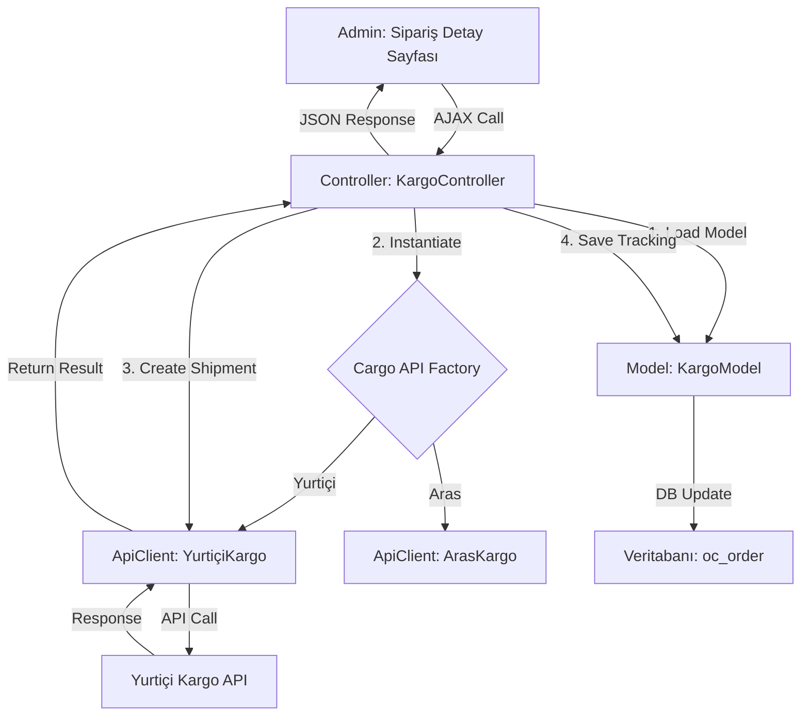

# Stratejik Analiz ve Entegrasyon Raporu: MesChain-Sync vs. Sentos

**Rapor ID:** Opus-5-Karsilastirmali-Analiz-v1.1  
**Tarih:** 7 Haziran 2025

---

## 1. Yönetici Özeti

Bu rapor, MesChain-Sync Enterprise platformunun mevcut yeteneklerini, potansiyel rakip/alternatif olarak görülen **Sentos Entegrasyon Hizmeti** ile karşılaştırmalı olarak analiz etmektedir. Analizimiz, MesChain-Sync'in teknolojik olarak **çok daha üstün ve modern bir altyapıya** sahip olduğunu, ancak Sentos'un **kullanıcı dostu kurulum ve net özellik setleri** ile pazarda daha basit ve anlaşılır bir çözüm sunduğunu ortaya koymaktadır.

*   **MesChain-Sync'in Güçlü Yönleri:** Modern teknoloji yığını (React, Node.js), ölçeklenebilir mimari potansiyeli (asenkron işlemler, AI/ML yetenekleri), detaylı RBAC ve gelişmiş analitik altyapısı.
*   **Sentos'un Güçlü Yönleri:** Son derece basit kurulum (XML ile), net ve odaklı özellikler (Kargo, E-Fatura gibi hizmetlerin belirtilmesi), teknik bilgisi az olan kullanıcılar için daha düşük giriş bariyeri.
*   **Temel Bulgular:** MesChain-Sync, bir "mühendislik harikası" potansiyeli taşırken, Sentos bir "kullanıcı dostu ürün" olarak konumlanmıştır. **Kritik eksiklik, MesChain-Sync'in gelişmiş yeteneklerini, Sentos'un sunduğu basitlikte kullanıcıya sunamamasıdır.**

Bu rapor, bu açığı kapatmak ve MesChain-Sync'i hem teknolojik olarak üstün hem de kullanıcı dostu bir platform haline getirmek için somut bir yol haritası sunmaktadır.

---

## 2. Karşılaştırmalı Atomik Analiz: MesChain-Sync vs. Sentos

| Kategori | MesChain-Sync Enterprise | Sentos Entegrasyon Hizmeti | Sonuç ve Değerlendirme |
| :--- | :--- | :--- | :--- |
| **Mimari & Teknoloji** | **React + PHP + Node.js (Hibrit/Modern):** Son derece esnek, performanslı ve ölçeklenebilir potansiyele sahip. SPA arayüzü modern bir UX sunar. | **Geleneksel PHP + XML:** Daha eski, daha az esnek ve daha az ölçeklenebilir. Kurulum ve entegrasyonu daha basit. | 🏆 **MesChain-Sync (Potansiyel):** Teknolojik olarak ezici üstünlüğe sahip. Ancak bu karmaşıklık, yönetilemezse bir dezavantaja dönüşebilir. |
| **Kurulum & Kullanım** | **Karmaşık:** PHP modülü, Node.js sunucusu, veritabanı kurulumu ve çoklu konfigürasyon dosyaları gerektirir. Teknik uzmanlık şarttır. | **Çok Basit:** Dokümantasyona göre kurulum, sadece bir XML dosyasının OpenCart paneline yüklenmesiyle tamamlanıyor. | 🏆 **Sentos (Kullanıcı Dostu):** "Tak-çalıştır" yaklaşımıyla son kullanıcı için çok daha çekici. MesChain-Sync bu alanda **sınıfta kalıyor.** |
| **Pazaryeri Desteği** | **Geniş:** Trendyol, N11, Amazon, Hepsiburada, eBay, Ozon, Pazarama, Çiçeksepeti, PTT AVM. | **Geniş:** N11, Gittigidiyor, Hepsiburada, Amazon, Akakçe, Trendyol, ÇiçekSepeti, ePTTAVM. | 🤝 **Berabere:** Her iki platform da Türkiye pazarındaki ana oyuncuları destekliyor. |
| **Temel Özellikler** | **Çok Kapsamlı:** Ürün/stok yönetimi, sipariş yönetimi, dropshipping, gelişmiş analitik, AI/ML altyapısı, detaylı loglama. | **Odaklı:** Ürün/stok yönetimi, sipariş yönetimi, fatura entegrasyonu, kargo entegrasyonu, e-fatura. | ⚖️ **Farklı Yaklaşımlar:** MesChain daha geniş bir "operasyon merkezi" olmayı hedeflerken, Sentos temel "entegrasyon" görevlerine odaklanmış. |
| **Kargo Entegrasyonu** | **Mevcut Değil:** Kod tabanında doğrudan kargo firması API'lerine bağlanan bir modül **yok**. | **Mevcut:** Yurtiçi Kargo, Aras Kargo, UPS Kargo ile doğrudan entegrasyon olduğu belirtiliyor. | 🏆 **Sentos:** Kullanıcı için en önemli adımlardan birini (kargo) çözmüş durumda. Bu, MesChain-Sync için **kritik bir eksikliktir.** |
| **Muhasebe / E-Fatura** | **Mevcut Değil:** Kod tabanında muhasebe veya e-fatura entegrasyonu **yok**. | **Mevcut (Hizmet Olarak):** E-Fatura ve e-arşiv hizmeti sundukları belirtiliyor. | 🏆 **Sentos:** Direkt API olmasa bile bir çözüm sunuyor. MesChain-Sync'te bu konu **hiç ele alınmamış.** |
| **Güvenlik** | **Proaktif ama Tutarsız:** API anahtarı şifreleme, RBAC gibi gelişmiş sistemler mevcut ancak bazı modüllerde devre dışı bırakılmış. Kritik zafiyetler tespit edilmiş ve düzeltme planı var. | **Bilinmiyor:** Güvenlik hakkında detaylı bilgi yok. `XML` tabanlı basit bir sistemin daha az saldırı yüzeyi olabilir, ancak bu bir varsayımdır. | 🏆 **MesChain-Sync (Planlama):** Tespit edilmiş zafiyetler ve bunları giderecek net bir yol haritası (`Opus` raporları) olması, bilinmezlikten daha iyidir. |
| **Performans** | **Potansiyel Olarak Yüksek:** Asenkron işlemler, caching ve modern frontend teknolojileri sayesinde ölçeklenebilir. Ancak mevcut implementasyonda N+1 gibi sorunlar var. | **Düşük/Orta:** Senkronize ve basit yapısı nedeniyle yüksek trafikte darboğaz yaşama ihtimali yüksek. | 🏆 **MesChain-Sync:** Doğru optimize edildiğinde, Sentos'un kaldıramayacağı yükleri rahatlıkla yönetebilir. |

---

## 3. Eksik Özelliklerin Tespiti (Sentos'ta Olup Bizde Olmayanlar)

Bu karşılaştırma sonucunda, MesChain-Sync'in acilen kapatması gereken 3 ana fonksiyonel eksiklik bulunmaktadır:

1.  **Kullanıcı Dostu Kurulum Mekanizması:** Sentos'un "XML Yükleyerek Kurulum" özelliği, teknik bilgisi olmayan bir kullanıcının bile sistemi dakikalar içinde ayağa kaldırmasını sağlar. MesChain-Sync'te bu süreç tamamen manuel ve tekniktir.
2.  **Doğrudan Kargo Firması Entegrasyonları:** Sentos, sipariş sonrası en kritik adımlardan biri olan kargo etiketini otomatik oluşturma yeteneğine sahiptir. Bu özellik, MesChain-Sync'te yoktur ve büyük bir operasyonel eksikliktir.
3.  **Temel Fatura & E-Fatura Yetenekleri:** Sentos, en azından bir fatura ve e-fatura hizmeti sunduğunu belirtmektedir. MesChain-Sync'te bu konu tamamen boş.

---

## 4. Eksik Özelliklerin Entegrasyonu İçin Detaylı Yol Haritası

Aşağıda, tespit edilen bu üç kritik eksiği kapatmak için somut, teknik ve uygulanabilir bir eylem planı sunulmuştur.

### Eylem 1: "XML ile Yapılandırma" Modülünün Geliştirilmesi

**Amaç:** Kullanıcının, tüm pazaryeri API anahtarlarını ve temel ayarlarını tek bir XML dosyası yükleyerek sisteme tanıtmasını sağlamak.

**Teknik Adımlar:**
1.  **Controller Oluşturma:** `admin/controller/extension/module/meschain_installer.php` adında yeni bir kontrolcü oluşturulacak. Bu kontrolcü, `base_marketplace`'ten türeyecek.
2.  **View Oluşturma:** `admin/view/template/extension/module/meschain_installer.twig` adında bir arayüz oluşturulacak. Bu arayüzde sadece bir "XML Dosyası Yükle" butonu ve bir "Kaydet" butonu olacak.
3.  **XML Yapısı Tanımlama:** Kullanıcıların doldurması için örnek bir XML şablonu oluşturulacak.
    ```xml
    <!-- ornek_yapilandirma.xml -->
    <meschain_config version="1.0">
        <settings>
            <log_level>DEBUG</log_level>
        </settings>
        <marketplaces>
            <marketplace name="trendyol">
                <status>1</status>
                <api_key>TR-API-KEY-XYZ</api_key>
                <api_secret>TR-API-SECRET-XYZ</api_secret>
                <supplier_id>123456</supplier_id>
            </marketplace>
            <marketplace name="n11">
                <status>1</status>
                <api_key>N11-API-KEY-ABC</api_key>
                <api_secret>N11-API-SECRET-ABC</api_secret>
            </marketplace>
        </marketplaces>
    </meschain_config>
    ```
4.  **İş Mantığı (Controller İçi):**
    *   Kullanıcı XML'i yüklediğinde, kontrolcü dosyayı geçici bir konuma kaydedecek.
    *   `simplexml_load_file()` PHP fonksiyonu ile XML verisi okunacak.
    *   Bir `foreach` döngüsü ile `marketplaces` nodu içindeki her bir `marketplace` elemanı gezilecek.
    *   Her bir pazar yeri için, `base_marketplace` modelinde zaten var olan `saveSettings($marketplace_name, $settings_array)` metodu çağrılarak ayarlar **güvenli ve şifreli bir şekilde** veritabanına kaydedilecek. Bu, mevcut güvenli altyapıyı yeniden kullanmamızı sağlar.

**Başarı Metriği:** Kullanıcı, sadece örnek XML'i düzenleyip yükleyerek tüm pazaryeri entegrasyonlarını 1 dakika içinde aktif hale getirebilmelidir.

### Eylem 2: Modüler Kargo Entegrasyon Altyapısının Geliştirilmesi

**Amaç:** "Sipariş Detay" sayfasından tek tıkla anlaşmalı kargo firması için kargo etiketi oluşturmak.

**Mimari Diyagramı:**


**Teknik Adımlar:**
1.  **Interface Tanımlama:** `system/library/meschain/cargo/CargoApiInterface.php` oluşturulacak.
    ```php
    interface CargoApiInterface {
        public function __construct(array $config);
        public function createShipment(array $orderData): array; // Returns ['success'=>true, 'tracking_code'=>'...', 'label_url'=>'...']
        public function getTrackingStatus(string $trackingCode): array;
    }
    ```
2.  **Concrete Sınıflar Oluşturma:** Her kargo firması için bu arayüzü implemente eden sınıflar yazılacak. (Örn: `YurticiKargoApiClient.php`, `ArasKargoApiClient.php`). Bu sınıflar, firmaların kendi API'lerine cURL/Guzzle ile istekleri yapacak.
3.  **Controller & Model Oluşturma:** `admin/controller/extension/module/meschain_cargo.php` ve `admin/model/extension/module/meschain_cargo.php` dosyaları oluşturulacak.
4.  **Arayüz Ekleme:** `admin/view/template/sale/order_info.twig` dosyasına, sipariş durumu "Hazırlanıyor" ise görünecek bir "Kargo Etiketi Oluştur" butonu ve kargo firması seçim listesi (`<select>`) eklenecek.
5.  **AJAX İşlemi:** Butona tıklandığında, `meschain_cargo/createShipment` metoduna sipariş ID'si ve seçilen kargo firması ile bir AJAX isteği gönderilecek.
6.  **İş Mantığı (Controller İçi):**
    *   Gelen sipariş ID'si ile sipariş bilgileri modelden çekilecek.
    *   Kullanıcının ayarlarından ilgili kargo firmasının API anahtarları alınacak.
    *   Interface kullanılarak doğru API istemcisi (`YurticiKargoApiClient`) oluşturulacak.
    *   `createShipment()` metodu çağrılacak.
    *   Başarılı olursa, dönen kargo takip numarası ve etiket linki `oc_order` tablosundaki ilgili sipariş kaydına not olarak eklenecek ve arayüze JSON ile başarı mesajı döndürülecek.

**Başarı Metriği:** Kullanıcı, sipariş detay sayfasından ayrılmadan, 10 saniye içinde bir kargo etiketi oluşturabilmeli ve takip numarasını görebilmelidir.

### Eylem 3: Temel E-Fatura Entegrasyon Modülünün Geliştirilmesi

**Amaç:** Resmi bir API entegrasyonu olmasa bile, kullanıcının fatura kesme sürecini hızlandıracak bir "ön hazırlık" modülü sağlamak.

**Yaklaşım:** Tam API entegrasyonu karmaşık olduğu için, **iki aşamalı bir plan** önerilmektedir.

**Aşama 1: Veri Aktarım Modülü (Hızlı Kazanım - 1 Hafta)**
1.  **Controller Oluşturma:** `admin/controller/extension/module/meschain_efatura.php`
2.  **Arayüz Ekleme:** `order_info.twig` dosyasına, "E-Fatura Verisi Hazırla" butonu eklenecek.
3.  **İş Mantığı:**
    *   Butona tıklandığında, kontrolcü sipariş verilerini (müşteri bilgileri, ürünler, fiyatlar, vergiler) alacak.
    *   Bu verileri, popüler e-fatura portallarının (örn: Paraşüt, BizimHesap) veya UBL-TR standardının beklediği formatta bir **XML veya JSON dosyası olarak oluşturup kullanıcıya download ettirecek.**
    *   Bu, kullanıcının verileri manuel olarak kopyala-yapıştır yapma zahmetinden kurtarır.

**Aşama 2: Asenkron API Entegrasyonu (Stratejik Geliştirme)**
1.  **Altyapı:** `Opus_4` raporunda önerilen **AsyncJobQueue** (Redis tabanlı) sistemi kullanılacak.
2.  **Interface Tanımlama:** `EFaturaApiInterface.php`
3.  **Tetikleyici:** OpenCart'ta bir siparişin durumu "Tamamlandı" olarak değiştirildiğinde, `catalog/model/checkout/order.php` dosyasındaki `addOrderHistory` metodunun sonuna bir **event (`sale.order.history.add.after`)** eklenecek.
4.  **İş Mantığı:**
    *   Bu event'i dinleyen bir `EventListener` sınıfı, `EFaturaJob`'u gerekli sipariş verileriyle birlikte kuyruğa atacak.
    *   Arka planda çalışan bir `worker` süreci, bu işi kuyruktan alacak ve seçilen e-fatura sağlayıcısının API'sine isteği gönderecek.
    *   Dönen fatura numarası/PDF linki, sipariş notlarına eklenecek.

**Başarı Metriği:** Aşama 1'de, kullanıcı fatura verilerini 5 saniyede dışa aktarabilmelidir. Aşama 2'de, sipariş tamamlandığında fatura 1 dakika içinde otomatik olarak oluşturulmalı ve kullanıcıya hiçbir ek iş düşmemelidir.

---

## 5. Stratejik Sonuç ve Gelecek Vizyonu

MesChain-Sync, teknolojik olarak doğru yoldadır ancak pazarın ihtiyaçlarına ve kullanıcı deneyiminin basitliğine daha fazla odaklanmalıdır. Yukarıda detaylandırılan üç eylem planı, MesChain-Sync'in sadece Sentos gibi rakiplerle arasındaki fonksiyonel boşluğu kapatmasını sağlamakla kalmayacak, aynı zamanda mevcut üstün teknolojik altyapısını son kullanıcı için **anlamlı ve değerli bir faydaya** dönüştürecektir.

Bu entegrasyonlar tamamlandığında, MesChain-Sync; hem "basit ve hızlı" kurulum isteyen kullanıcıyı hem de "güçlü ve ölçeklenebilir" bir altyapı arayan kurumsal müşteriyi aynı anda hedefleyebilen, pazarda **rakipsiz bir konuma** ulaşacaktır. 