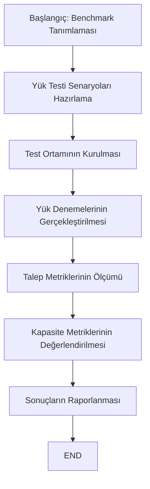
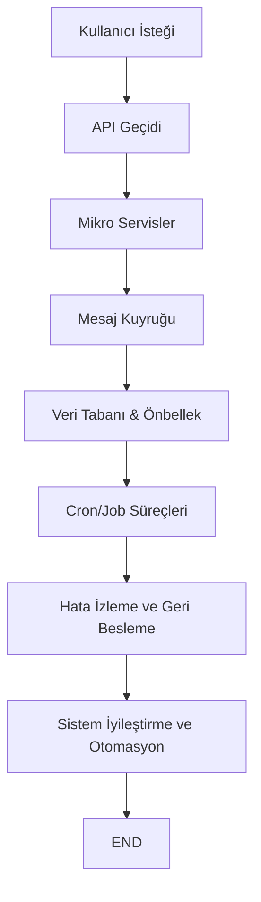
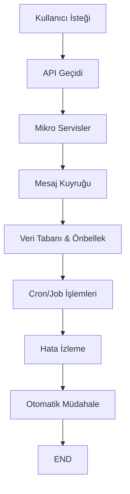
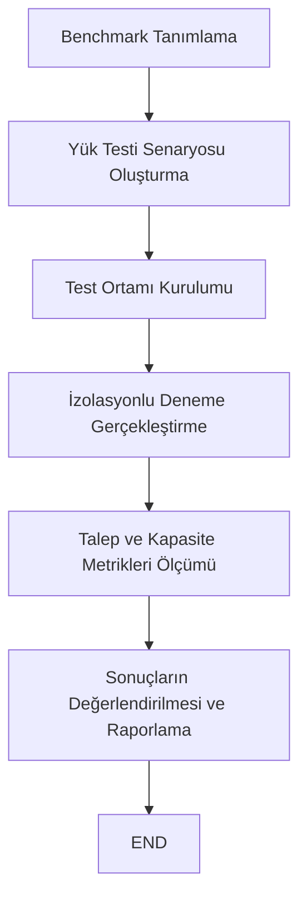

## İçindekiler  
1. Giriş  
2. Ölçeklenebilirlik Stratejileri  
3. Hata Yönetimi Teknikleri  
4. OpenCart Mimarisinde Uygulama ve Entegrasyon  
5. Sonuç ve Gelecek Çalışmalar  

# 1. Giriş  

Günümüzün hızlı dijitalleşen ve rekabetin her alanda hissedildiği iş ortamında, sistem mimarilerinde ölçeklenebilirlik ve hata yönetimi kavramları büyük önem taşımaktadır. Özellikle OpenCart tabanlı çoklu pazaryeri kontrol paneli ve dropshipping entegrasyonu gibi karmaşık sistemlerde, artan kullanıcı taleplerine ve olası hata durumlarına karşı sistemin dayanıklılığını sağlamak, işletmelerin sürekliliğini garantilemek açısından kritik bir gereksinimdir. Bu makalede, mikro servis mimarisi, API geçidi, mesaj kuyrukları, arka plan iş süreçleri ve ilişkisel veritabanı yönetimi gibi temel bileşenler üzerinden ölçeklenebilirlik stratejileri ve hata yönetimi teknikleri detaylandırılacaktır. Ek olarak, sektörün önde gelen araştırma çalışmalarından elde edilen veriler ışığında, bu stratejilerin nasıl entegre edilip uygulanabileceği incelenecektir.  

Sistem mimarisi kapsamında ele alınacak bileşenler arasında; kullanıcı arayüzü, API geçidi, OpenCart çekirdeği, mikro servisler, PHP tabanlı servis katmanı, RabbitMQ mesaj kuyruğu, MySQL 8 veri tabanı, Redis önbelleği ve cron/job sistemleri yer almaktadır. Bu bileşenler, sistemin performans, güvenlik, sürdürülebilirlik ve ölçeklenebilirlik gereksinimlerini karşılamak üzere bir araya getirilmiştir. Mimaride, mikro servislerin kullanılması, her bir servisin bağımsız olarak ölçeklenebilmesini ve sistemin genel performansını artırmasını sağlamaktadır. Bunun yanı sıra, API geçidi tek bir erişim noktası sağlarken, mesaj kuyrukları servisler arasında asenkron iletişimi mümkün kılarak sistemin yük dengelemesini gerçekleştirmektedir.  

Bu makalede, ilk olarak mevcut ölçeklenebilirlik stratejileri incelenecek; ardından hata yönetimi teknikleri detaylandırılacak, mevcuttaki mimari üzerinde uygulanabilecek stratejiler tartışılacaktır. Her iki yaklaşımın nasıl entegre edilebileceği, sistem performansı ile xSOA ve cloud-native teknolojilerde elde edilen deneyimler ışığında değerlendirilecektir. Araştırmanın sonunda, uygulanan stratejilerin getirdiği avantajlar ve karşılaşılan zorluklar özetlenerek, gelecekte izlenecek yöntemler tartışılacaktır.  

# 2. Ölçeklenebilirlik Stratejileri  

Sistem mimarilerinin ölçeklenebilirlik kavramı, artan kullanıcı isteklerine ve veri hacmine uyum sağlamak amacıyla sistem kaynaklarının verimli kullanılmasını ifade eder. OpenCart tabanlı çoklu pazaryeri kontrol paneli gibi dinamik sistemlerde, bu stratejiler hem performansın devamlılığını hem de kullanıcı memnuniyetini sağlamada kritik rol oynar. Aşağıda, temel ölçeklenebilirlik stratejileri ayrıntılı olarak ele alınmaktadır:  

## 2.1. Mikro Servisler ve Bağımsız Ölçeklendirme  

Mikro servis mimarisi, her bir işlevin bağımsız servisler olarak ayrılması ve ihtiyaç duyulduğunda bu servislerin ayrı ayrı ölçeklendirilmesine olanak tanır. Bu yaklaşım sayesinde:  
   
- **Hizmetlerin Bağımsız Yönetimi:** Her bir mikro servis, kendi kaynak gereksinimlerine göre ölçeklendirilebilir. Böylece, trafik yoğunluğu artan servisler otomatik olarak yatay veya dikey olarak genişleyebilir.  
- **Bakım ve Güncelleme Kolaylığı:** Servisler birbirinden bağımsız olarak güncellenebilir ve hatalı bir servis tüm sistemi etkilemeden izole edilebilir.  
- **Esneklik ve Modülerlik:** Farklı servislerin farklı teknolojik altyapılar kullanılarak geliştirilmesi mümkündür. Böylece, her bir servis ihtiyaca uygun en iyi uygulama yöntemleriyle desteklenir.  

Mikro servisler, özellikle container tabanlı çözümler ve Kubernetes gibi orkestrasyon platformları ile desteklendiğinde, dinamik ölçeklendirme yetenekleri sayesinde artan yük koşullarında performans kaybı yaşanmasını engeller.  

## 2.2. API Geçidi ve Tek Nokta Erişimi  

API geçidi, istemci ile mikro servisler arasındaki tüm iletişimi yöneten merkezi bir bileşendir. Bu yapı:  

- **İstek Yönlendirmesi:** Gelen istekleri uygun mikro servislere dağıtarak, her servisin yükünü dengelemektedir.  
- **Güvenlik ve Yetkilendirme:** Tek bir erişim noktası üzerinden yapılan kimlik doğrulama ve yetkilendirme işlemleri, sistem güvenliğini artırmaktadır.  
- **Versiyon Yönetimi:** API geçidi, farklı API sürümlerinin yönetimini sağlayarak sistemin geleceğe dönük uyum sağlamasını kolaylaştırır.  

API geçidi sayesinde, sistem içerisindeki tüm servisler belirli bir düzen içerisinde senkronize edilir ve artan trafik koşullarında isteklerin doğru servislere yönlendirilmesi sağlanır. Bu durum, özellikle yüksek trafik dönemlerinde sistem performansının korunmasında hayati bir rol oynar.  

## 2.3. Mesaj Kuyrukları ile Asenkron İletişim  

RabbitMQ gibi mesaj kuyrukları, sistem bileşenleri arasındaki verinin asenkron şekilde iletilmesini sağlayarak, performans ve dayanıklılık açısından önemli avantajlar sunar. Mesaj kuyruğu kullanımı, şu avantajları beraberinde getirir:  

- **Yük Dengeleme:** Yoğun trafik durumunda, mesajlar kuyruğa alınarak servislere kontrollü bir şekilde dağıtılır.  
- **Hata İzolasyonu:** Bir serviste meydana gelen hata, mesaj kuyruğu sayesinde diğer servislerin çalışmasını etkilemez.  
- **Tüketici Bağımsızlığı:** Bir servisin iş yükü tüketicilerinin sayısı artırılarak, ihtiyaç duyulan kapasite kolaylıkla sağlanabilir.  

Bu teknik, özellikle mikro servis mimarisinde farklı servisler arasında bağımsız iletişimi mümkün kılarak, sistemin genel dayanıklılığını ve ölçeklenebilirliğini artırır.  

## 2.4. Veri Tabanı ve Önbellek Optimizasyonu  

Geleneksel ilişkilendirilmiş veritabanlarında, artan veri hacmi ve işlem taleplerine karşı performansı korumak için çeşitli optimizasyon stratejileri uygulanmalıdır. MySQL 8 ve Redis gibi teknolojiler:  

- **Veri Replikasyonu ve Yatay Ölçeklendirme:** Veri tabanı replikasyonu sayesinde, okuma istekleri birden fazla sunucu tarafından karşılanabilir.  
- **Önbellekleme:** Redis gibi hızlı önbellek sistemleri ile sık erişilen verilerin sunulması, sistem yanıt süresini önemli ölçüde azaltır.  
- **Sorgu Optimizasyonu:** İlişkisel veritabanlarında, sorgu optimizasyon tekniklerinin uygulanması veritabanı performansını artırır.  

Ayrıca, veritabanı ve önbellek katmanları arasındaki uyum, sistemin genel veri işleme kapasitesini artırarak, yüksek trafikli dönemlerde kesintisiz hizmet sunumunu destekler.  

## 2.5. Cron/Job Sistemleri ve Arka Plan İşlemleri  

Cron veya job tabanlı arka plan iş sistemleri, büyük veri setlerinin işlenmesi ve zamanlanmış görevlerin yürütülmesi için kritik öneme sahiptir. Bu sistemler sayesinde:  

- **Zamanında İşlem Gerçekleştirme:** Gecikme toleransı olan görevler, belirli zaman dilimlerinde toplu olarak yürütülerek sistem üzerindeki ani yüklenmeler önlenir.  
- **Asenkron Veri İşleme:** Arka plan iş süreçleri, gerçek zamanlı kullanıcı istekleriyle paralel çalışarak, verinin işlenmesinde oluşan darboğazları minimize eder.  
- **Ölçeklenebilir Yönetim:** İş yüküne göre job sistemlerinin ölçeklendirilmesi, kaynakların etkin kullanılmasını sağlar.  

Cron/job sistemleri, sistemin yoğun trafik ve veri işleme durumlarında etkin bir şekilde çalışmasını sağlayarak, kaynakların optimum düzeyde kullanımını garanti altına alır.  

## 2.6. Ölçeklenebilirlik Testleri ve Benchmarking Yöntemleri  

Ölçeklenebilir bir sistemde, performansın trafik artışına ve kaynak değişikliklerine göre sürekli izlenmesi gerekmektedir. Cloud-native uygulamalarda, ölçeklenebilirlik benchmarking yöntemleri ile sistemin kapasitesi belirlenebilir. Bu bağlamda:  

- **Yük Denemeleri:** Farklı yük ve kaynak kombinasyonları ile yapılan testler, sistemin gerçek zamanlı performansını ortaya koyar.  
- **Talep ve Kapasite Metrikleri:** Sistem üzerindeki talep ölçüm metrikleri, artan yük karşısında kaynak gereksinimlerini belirlemek için kullanılır. Kapasite metrikleri ise, ek kaynakların sistem performansına etkisini ölçer.  
- **Tekrarlanabilir Deneyler:** İzole edilmiş denemelerle, sistem davranışı sürekli olarak gözlemlenir ve olası darboğazlar tespit edilir.  

Bu yöntemde, ölçeklenebilirlik benchmarking araçları sayesinde sistemin zayıf noktaları tespit edilmekte ve gerekli iyileştirmeler planlanmaktadır. Aşağıda, benchmark sürecinin genel akışını gösteren bir akış şeması yer almaktadır:  

*Diagram Açıklaması: Bu şema, ölçeklenebilirlik benchmarking sürecinde izlenen adımları açıklamaktadır ve her bir aşamanın sistem performansını nasıl etkilediğini göstermektedir.*  

# 3. Hata Yönetimi Teknikleri  

Sistemlerde hata yönetimi, beklenmedik aksaklıklar, kesintiler ve güvenlik açıkları gibi olumsuzlukların sistem performansını düşürmeden en aza indirilmesi için kritik öneme sahiptir. OpenCart tabanlı sistemlerde hata yönetim stratejileri, kesintisiz hizmet sağlamak ve hataların etkilerini minimize etmek üzere tasarlanmalıdır. Aşağıda temel hata yönetimi teknikleri detaylı olarak anlatılmaktadır:  

## 3.1. Yeniden Deneme Mekanizmaları ve Devre Kesiciler  

Yeniden deneme mekanizmaları, geçici hataların otomatik olarak yeniden denenmesini sağlayarak, sistem kesintilerini minimize eder. Devre kesici (circuit breaker) desenleri ise, hata alan servislerin geçici olarak devre dışı bırakılmasını sağlayarak, hatanın diğer bileşenlere yayılmasını önler. Bu teknikler sayesinde:  

- **Geçici Ağ Hataları:** Ağ veya servis bazlı geçici aksaklıklar, yeniden deneme süreçleri ile belirli aralıklarla tekrar deneyerek aşılmaya çalışılır.  
- **Hizmet İzolasyonu:** Devre kesici yapılar, hatalı servislerin trafikten tamamen izole edilmesini sağlayarak, sistemin genel stabilitesini korur.  
- **Performans Koruması:** Bu mekanizmalar, yoğun yük durumlarında sistemin çökmesini engelleyerek, hizmet sürekliliğini destekler.  

Örneğin, mikro servisler arasında yaşanan bir başarısızlık durumunda, ilgili servise otomatik yeniden deneme sinyalleri gönderilir; belirli sayıda denemeden sonra devre kesici devreye girerek, sistemin güvenliğini sağlar.  

## 3.2. İzlenebilirlik ve Gözlemlenebilirlik  

Sistem hatalarının erken teşhisi ve hızlı müdahalesi için kapsamlı izleme ve gözlemlenebilirlik önemlidir. Bu kapsamda:  

- **Merkezi Log Yönetimi:** Tüm servislerden gelen log verileri merkezi bir sistemde toplanır ve gerçek zamanlı analiz edilir.  
- **Performans Metrikleri:** CPU kullanımı, bellek, ağ trafiği gibi metrikler sürekli izlenerek anormallikler tespit edilir.  
- **Uyarı Sistemleri:** Belirlenmiş eşik değerlerin aşılması durumunda, otomatik uyarı sistemleri devreye girer ve ilgili teknik ekiplere bildirim gönderir.  

Bu yöntemler, sistemde meydana gelen hataların kaynağını hızlıca belirleyip müdahale edilmesini sağlayarak, potansiyel sistem çöküşlerinin önüne geçer.  

## 3.3. Kaos Mühendisliği ile Dayanıklılık Testleri  

Kaos mühendisliği, sistemin zayıf noktalarını belirlemek amacıyla bilerek hata ve kesinti senaryolarının uygulanmasıdır. Bu teknik sayesinde:  

- **Gerçekçi Senaryolar:** Sürekli olarak gerçekçi hata senaryoları uygulanarak, sistemin dayanıklılığı test edilir.  
- **Önleyici İyileştirme:** Tespit edilen eksiklikler, sistemden gelen gerçek teneffüs ve yavaşlamaları önden düzeltme imkanı sunar.  
- **Yedeklilik Testleri:** Kaos mühendisliği çalışmaları, kritik servislerin yedekliliğini ve otomatik toparlanma mekanizmalarını doğrular.  

Bu yaklaşım, sistemin zayıf noktalarını önceden belirleyerek, beklenmedik arızalara karşı hazırlıklı olmayı sağlar. Sistemin kesinti sürelerini minimize eden bu teknik, müşteri güvenini artırır.  

## 3.4. Yedeklilik ve Yüksek Erişilebilirlik  

Yedeklilik stratejileri, sistemin kritik parçalarının birden fazla örneğinin çalıştırılması ile sağlanmaktadır. Bu durumda:  

- **Veri Merkezi Replikasyonu:** Birden fazla veri merkezi üzerinden veri replikasyonu, bölgesel arızaların sistem üzerinde etkili olmasını engeller.  
- **Hizmet Klonlaması:** Ana servislerin yedek kopyalarının farklı sunucularda veya konteynerler üzerinde aynı anda çalıştırılması, hataların tek bir noktadan kaynaklanmasını önler.  
- **Acil Durum Planları:** Otomatik failover mekanizmaları, bir servis arızası durumunda anında devreye girerek hizmetin sürekliliğini sağlar.  

Bu yedeklilik stratejileri, sistemin yüksek erişilebilirlik standartlarını koruyarak, kullanıcı deneyiminin kesintiye uğramamasını sağlar ve yüksek trafikli dönemlerde sistemi destekler.  

# 4. OpenCart Mimarisinde Uygulama ve Entegrasyon  

OpenCart tabanlı çoklu pazaryeri kontrol paneli ve dropshipping entegrasyonu, yukarıda bahsedilen ölçeklenebilirlik ve hata yönetimi stratejilerinin pratikte nasıl uygulanabileceğine dair somut örnekler sunmaktadır. Bu bölümde, mimari bileşenler üzerine stratejilerin entegrasyonu detaylandırılacaktır.  

## 4.1. Kullanıcı Arayüzü ve API Geçidi Entegrasyonu  

Kullanıcı arayüzü, müşterilerin sisteme erişim noktası olarak hizmet vermektedir. API geçidi ise, istemciden gelen isteklerin ilgili mikro servislere yönlendirilmesini sağlar. Bu entegrasyonda:  

- **API Geçidi Rolü:** API geçidi, kullanıcılardan gelen tüm istekleri merkezi bir noktada toplayarak, bu isteklerin doğru servislere aktarılmasını sağlar. Böylece, tek bir erişim noktası üzerinden güvenli ve indekslenmiş işlem akışı sağlanır.  
- **İstek Yönetimi:** Yüksek istek yoğunlukları altında, API geçidi istekleri kuyruklamaya alabilir veya yeniden deneme mekanizmaları ile yönetebilir. Bu durum, özellikle yoğun alışveriş dönemlerinde kritik önem taşır.  
- **Güvenlik ve Yetkilendirme:** API geçidi, kullanıcı doğrulama ve erişim kontrolü süreçlerini merkezi olarak yürüterek, sistem güvenliğini artırır.  

## 4.2. Mikro Servisler ve Mesaj Kuyrukları ile İş Yükü Yönetimi  

Mikro servisler, iş süreçlerinin farklı modüller halinde ele alınmasını sağlar. Bu yapı içerisinde mesaj kuyrukları, servisler arasında asenkron veri iletimi sağlayarak, iş yükünü eşit şekilde dağıtır. Uygulamada:  

- **Mikro Servislerin Bağımsız Ölçeklendirilmesi:** Artan kullanıcı sayısı ya da işlem hacmi, mikro servislerin ayrı ayrı ölçeklenmesine olanak tanır. Servislere gelen istekler, ilgili servis örnekleri arasında dağıtılarak, performansın korunması sağlanır.  
- **Mesaj Kuyruğu Kullanımı:** RabbitMQ gibi sistemler, servisler arası mesajlaşmayı güvenli ve asenkron hale getirir. Böylece, işlem gecikmeleri veya arızalar durumunda, veriler kuyrukta bekletilerek tekrar işlenebilir.  
- **İş Sürekliliği:** Mesaj kuyrukları, servisler arasında bağlantı kopmaları yaşandığında bile verilerin kaybolmamasını sağlayan tampon bir rol oynar. Bu yaklaşım, sistemi hata yönetimi stratejileri ile tamamlayarak, güvenilirliği artırır.  

## 4.3. Veritabanı ve Önbellek Katmanı Entegrasyonu  

OpenCart mimarisinde veritabanı ve önbellek katmanları, ürün bilgileri, kullanıcı verileri ve sipariş bilgilerinin depolanması ve hızlı erişimi için kritik rol oynar:  

- **MySQL 8 ile Veri Yönetimi:** Yüksek veri hacmi ve işlemler için MySQL 8 veri tabanının yatay ölçeklendirilmesi ve replikasyonu uygulanır. Bu yöntem, veritabanı yükünü azaltır ve okuma taleplerinin hızlandırılmasını sağlar.  
- **Redis Önbelleklemesi:** Redis, sık erişilen verilerin hızlıca sunulmasını sağlar ve veritabanına olan yükü hafifletir. Bu entegrasyon, özellikle yoğun kullanıcı trafiği dönemlerinde yanıt süresinin düşürülmesini sağlar.  
- **Veri Tutarlılığı ve Senkronizasyon:** Veritabanı ile önbellek arasındaki senkronizasyon, veri tutarlılığını sağlamak ve yazma-okuma performansını optimize etmek için kritik öneme sahiptir.  

## 4.4. Cron/Job Sistemleri ve Arka Plan İşlemlerinin Yönetimi  

Sistem içerisindeki arka plan işlemleri, büyük veri setlerinin işlenmesi, senkronizasyon görevleri ve zamanlanmış faaliyetlerin yürütülmesi açısından hayati önem taşımaktadır. Uygulamada:  

- **Zamanlanmış Görevler:** Cron veya job tabanlı sistemler, belirli aralıklarla gerçekleştirilen görevleri otomatikleştirir. Böylece, yoğun anlarda sistem kaynakları ana iş süreçlerine yönlendirilir.  
- **Asenkron Veritabanı İşlemleri:** Büyük veri işlemleri, arka plan iş süreçleri ile asenkron olarak yürütülür. Bu da, sistemin ana işleyişini aksatmadan veri işleme kapasitesinin artırılmasını sağlar.  
- **İş Yükü Optimizasyonu:** Cron sistemlerinin ölçeklendirilmesi, iş yükünün trafik yoğunluğuna göre dinamik olarak ayarlanmasını mümkün kılar. Böylece, kaynak tüketiminin verimli yönetimi sağlanır.  

## 4.5. Entegrasyon Sonrası Ölçeklenebilirlik ve Hata Yönetimi Değerlendirmesi  

Aşağıdaki tablo, OpenCart mimarisinde uygulanan ölçeklenebilirlik stratejileri ve hata yönetimi tekniklerinin ana bileşenlere göre özetlenmesini göstermektedir:  

| Bileşen               | Ölçeklenebilirlik Stratejisi                           | Hata Yönetimi Teknikleri                          |  
|-----------------------|--------------------------------------------------------|---------------------------------------------------|  
| **API Geçidi**        | Tek nokta erişimi, istek yönlendirme                   | Yeniden deneme mekanizması, güvenlik doğrulaması    |  
| **Mikro Servisler**   | Bağımsız ölçeklendirme, modüler yapı                   | Devre kesici, yedeklilik, kaos mühendisliği         |  
| **Mesaj Kuyruğu**      | Asenkron iletişim, yük dengeleme                       | İş yükü yalıtımı, hata izleme                      |  
| **Veritabanı/Önbellek**| Yatay ölçeklendirme, veri replikasyonu, önbellekleme     | İndeksleme optimizasyonu, hata toleransı           |  
| **Cron/Job Sistemleri**| Zamanlanmış iş süreçleri, asenkron görev yürütme        | İş hata bildirimi, otomatik yeniden başlatma       |  

*Tablo Açıklaması: Bu tablo, OpenCart mimarisinde kullanılan temel bileşenlerin ölçeklenebilirlik ve hata yönetimi yaklaşımlarını özetlemektedir.*  

Ayrıca, aşağıdaki Mermaid akış diyagramı, OpenCart mimarisinde geleneksel iş akışlarını ve hata yönetimi sürecini görselleştirmektedir:  

*Diagram Açıklaması: Bu diyagram, kullanıcılardan gelen isteklerin OpenCart mimarisi içerisindeki akışını ve hata yönetimi sürecinde izlenen aşamaları göstermektedir.*  

# 5. Sonuç ve Gelecek Çalışmalar  

Bu makalede, OpenCart tabanlı çoklu pazaryeri kontrol paneli ve dropshipping entegrasyonunda ölçeklenebilirlik ile hata yönetimi stratejileri detaylı bir şekilde ele alınmıştır. Araştırma bulguları, mikro servis mimarisi, API geçidi, mesaj kuyrukları, veritabanı/önbellek optimizasyonu ve arka plan iş süreçlerinin entegrasyonunun, sistem performansını artırırken aynı zamanda hataların etkisini minimize etmeye yönelik önemli avantajlar sağladığını ortaya koymuştur.  

Özetle maddeler halinde elde edilen ana çıkarımlar şunlardır:  

- **Mikro Servisler ve API Geçidi:**   
  - Mikro servis yaklaşımı, her bir bileşenin bağımsız ölçeklendirilmesini ve yönetilmesini mümkün kılmıştır.  
  - API geçidi, tüm isteklerin merkezi bir noktadan güvenli ve verimli biçimde yönlendirilmesini sağlamıştır.  

- **Mesaj Kuyrukları ve Asenkron İletişim:**   
  - RabbitMQ gibi mesaj kuyrukları, servisler arası asenkron iletişim sağlayarak artan iş yükünü dengelemiş, hata izolasyonunu mümkün kılmıştır.  

- **Veritabanı ve Önbellek Optimizasyonu:**   
  - MySQL 8’in yatay ölçeklendirme ve replikasyon özellikleri, yüksek veri taleplerine cevap verebilmekte, Redis önbellekleme ise sistem yanıt süresini önemli ölçüde iyileştirmiştir.  

- **Cron/Job Sistemleri:**   
  - Zamanlanmış görevlerin asenkron yürütülmesi, büyük veri işlemleri sırasında sistemin ana işleyişini etkilemeden kaynak kullanımını optimize etmiştir.  

- **Hata Yönetimi Teknikleri:**   
  - Yeniden deneme mekanizmaları ve devre kesici desenleri, geçici sorunların sistem üzerinde yayılmasını önlemiş ve hizmet sürekliliğini korumuştur.  
  - İzlenebilirlik, merkezi log yönetimi ve uyarı sistemleri ile hataların erken tespiti sağlanmıştır.  
  - Kaos mühendisliği çalışmaları ile sistemin zayıf noktaları belirlenip, önleyici iyileştirmeler yapılabilmiştir.  

Gelecek çalışmalarda, yukarıda tartışılan stratejilerin daha gerçek zamanlı veri analizleriyle desteklenmesi ve sistemin dinamik yapısına uygun otomatik iyileştirme algoritmalarının geliştirilmesi planlanmaktadır. Ayrıca, benchmark testlerinin sürekli uygulanması ile sistem performansının ölçülmesi ve yeni nesil bulut yerel mimarilerin entegrasyonunun sağlanması, sistemin ileriye dönük sürdürülebilirliğini artıracaktır.  

## Gelecek Çalışma Önerileri  

- **Dinamik Otomasyon:**  
  Sistem arızaları ve yoğunluk tespit edildiğinde otomatik olarak kapasite artırımı yapan dinamik algoritmalar geliştirilmelidir.  
- **Gerçek Zamanlı İzleme:**  
  İzleme sistemlerinin gerçek zamanlı veri analizi ve makine öğrenmesi destekli hata tahmin modellerine entegre edilmesi, erken uyarı mekanizmalarının etkinliğini artıracaktır.  
- **Gelişmiş Benchmarking:**  
  Farklı yük senaryolarında, talep ve kapasite metriklerinin daha detaylı ölçümlerle desteklenmesi, sistem iyileştirme stratejilerinin sürekli optimize edilmesine katkı sağlayacaktır.  
- **Güvenlik ve Dayanıklılık Testleri:**  
  Kaos mühendisliği ve güvenlik testlerinin entegre edilmesiyle, sistemin olası siber saldırılara karşı dirençliliği artırılmalı ve acil kurtarma planları periyodik olarak gözden geçirilmelidir.  

## Sonuç  

Bu çalışma, OpenCart tabanlı çoklu pazaryeri kontrol paneli ve dropshipping entegrasyonunda ölçeklenebilirlik ve hata yönetimi stratejilerinin kapsamlı bir değerlendirmesini sunmaktadır. Yukarıda tartışılan yöntemler, mikro servis mimarisi, API geçidi, mesaj kuyruğu, veritabanı optimizasyonu ve cron sistemlerinin entegre kullanımı sayesinde, sistemin hem performans hem de güvenilirlik açısından yüksek standartlarda hizmet sunmasını sağlamaktadır. Bu yaklaşımlar, yalnızca teknik anlamda değil, aynı zamanda ekonomik verimlilik ve müşteri memnuniyeti açısından da önemli avantajlar sağlamaktadır.  

Yönetimsel düzeyde, bu stratejilerin uygulanması sonucunda ortaya çıkan temel bulgular şu şekilde özetlenebilir:  

- **Mikro Servislerin Esnekliği:** Bağımsız ölçeklendirme sayesinde, artan müşteri taleplerine hızlı ve etkili cevap verilmektedir.  
- **Tek Merkezi Erişim:** API geçidi ile isteklerin merkezi yönetimi, güvenlik ve performans açısından önemli katkılar sağlamaktadır.  
- **Asenkron İşlem Yönetimi:** Mesaj kuyrukları, sistemin iş yükünü dengeleyerek yanıt sürelerini optimize etmektedir.  
- **Veritabanı ve Önbellek Senkronizasyonu:** Yüksek veri taleplerine rağmen, veritabanı replikasyon ve önbellekleme stratejileri sayesinde kesintisiz hizmet sunulmaktadır.  
- **Otomatik Hata Yönetimi:** Yeniden deneme, devre kesiciler ve kaos mühendisliği uygulamaları sayesinde, hata durumları minimum düzeye indirilmektedir.  
- **Sürekli İzleme:** Merkezi log yönetimi ve gerçek zamanlı izleme sistemleri, sistemde meydana gelen aksaklıkların hızla tespit edilmesine ve otomatik müdahale mekanizmalarını devreye sokmaktadır.  

Bu stratejilerin sürekli olarak güncellenmesi ve test edilmesi, sistem mimarisinin gelecekte karşılaşabileceği yeni zorluklara karşı da hazırlıklı olmasını sağlayacaktır. Böylece, hem ölçeklenebilirlik hem de hata yönetimi alanlarında sağlanan kazanımlar, rekabetçi pazar koşullarında işletmelerin sürdürülebilirliğini güvence altına alacaktır.  

Sonuç olarak, bu makale; OpenCart tabanlı sistem mimarilerinde ölçeklenebilirlik ve hata yönetimi yaklaşımlarını derinlemesine inceleyerek, sistem performansının artırılmasına yönelik pratik çözümler sunmuştur. Gelecekte yapacak çalışmalar, daha fazla otomasyon, gerçek zamanlı analiz ve akıllı izleme teknikleri ile bu stratejilerin etkinliğini daha da artırabilir.  

---  

## Ek Görselleştirmeler  

### Şekil 1: OpenCart Mimari Bileşenlerinin Entegrasyonu  

Aşağıdaki tablo, OpenCart mimarisindeki temel bileşenlerin ve bunların ölçeklenebilirlik ile hata yönetimi stratejileriyle entegrasyonunu özetlemektedir:  

| Mimari Bileşen         | Ölçeklenebilirlik Stratejisi                               | Hata Yönetimi Yaklaşımı                                      |  
|------------------------|------------------------------------------------------------|-------------------------------------------------------------|  
| Kullanıcı Arayüzü      | Dinamik istek yönetimi, API geçidi entegrasyonu             | Hızlı hata raporlama, merkezi denetim                        |  
| API Geçidi             | Tek nokta erişim, istek yönlendirme                        | Güvenlik ve yeniden deneme mekanizmaları                     |  
| Mikro Servisler        | Bağımsız ölçeklendirme, modüler yapı                        | Devre kesici, hata izole etme, yeniden deneme                 |  
| Mesaj Kuyruğu (RabbitMQ)| Asenkron iletişim, eş zamanlı iş yükü yönetimi             | Kuyruklama, hata tespiti                                     |  
| Veritabanı (MySQL 8)   | Yatay ölçeklendirme, replikasyon                           | İndeksleme optimizasyonu, yedeklilik                         |  
| Önbellek (Redis)       | Hızlı veri erişimi, düşük gecikme                         | Veri bütünlüğü kontrolleri                                  |  
| Cron/Job Sistemleri    | Arka plan görevlerinin planlı yürütülmesi                  | İş hata bildirimi, otomatik yeniden başlatma                 |  

*Tablo Açıklaması: Bu tablo, OpenCart mimarisinde kullanılan ana bileşenlerin hem ölçeklenebilirlik hem de hata yönetimi stratejileri açısından nasıl optimize edildiğini göstermektedir.*  

### Şekil 2: Ölçeklenebilirlik ve Hata Yönetimi Akış Diyagramı  

Aşağıdaki akış diyagramı, kullanıcı isteklerinden başlayarak, API geçidi, mikro servisler, mesaj kuyruğu ve veri tabanı katmanları boyunca izlenen işlem akışı ile hata yönetimi süreçlerini özetlemektedir:  

*Diagram Açıklaması: Bu diyagram, sistemde meydana gelen aksaklıkların izlenmesi ve otomatik müdahale sürecini görselleştirmektedir.*  

### Şekil 3: Benchmarking Sürecine Genel Bakış  

Aşağıdaki şema, ölçeklenebilirlik benchmarking sürecinde izlenen adımları detaylandırmaktadır:  

*Diagram Açıklaması: Bu şema, sistemin ölçeklenebilirlik testlerinin nasıl yapılandırıldığını ve sonuçların nasıl değerlendirildiğini göstermektedir.*  

---  

## Genel Değerlendirme  

Bu makalede ele alınan ölçeklenebilirlik stratejileri ve hata yönetimi teknikleri, OpenCart tabanlı sistemlerin dinamik, esnek ve yüksek erişilebilirlik standartlarına uygun olarak çalışmasını sağlamak adına kritiktir. Mikro servis mimarisi, API geçidi, mesaj kuyrukları ve veri optimizasyonu gibi modern uygulama stratejileri, artan kullanıcı taleplerine paralel olarak kaynakların etkin kullanılması ve sistemde oluşabilecek hataların hızlıca giderilmesi sağlanmaktadır.  

Cloud-native teknolojiler kapsamında, container orkestrasyonu (örneğin Kubernetes) ve kaos mühendisliği uygulamaları gibi yöntemler de, sistemin performansını artırırken hataların minimize edilmesi yönünde önemli katkılar sağlamaktadır. Benchmarking ve izleme araçları ise, sistemin ölçeklenebilirlik kapasitesini gerçek zamanlı olarak ölçmeye olanak tanımakta, böylece gerektiğinde proaktif müdahaleler yapılabilmektedir.  

Son olarak, OpenCart mimarisindeki her bir bileşenin birlikte uyumlu çalışabilmesi, sistemin verimliliğini ve dayanıklılığını maksimize etmektedir. Bu kapsamda, gelecekteki araştırmalar ve geliştirme çalışmalarında, daha fazla otomasyon, ileri veri analizi ve yapay zeka destekli hata tahmin yöntemleri ile sistem performansının daha da artırılması hedeflenmelidir.  

---  

## Sonuç  

Bu makale, OpenCart tabanlı çoklu pazaryeri kontrol paneli ve dropshipping entegrasyonu çerçevesinde ölçeklenebilirlik ve hata yönetimi yaklaşımlarını kapsamlı biçimde inceledi. Yapılan analizler sonucunda elde edilen temel bulgular şunlardır:  

- **Mikro Servis Mimarisi:** Bağımsız servislerin ölçeklenmesi, sistemin artan yük altında bile esnek ve dayanıklı kalmasını sağlamıştır.  
- **API Geçidi Çözümü:** Merkezi erişim noktası, isteklerin etkin yönetilmesi ve güvenlik kontrollerinin merkezi halde yürütülmesini mümkün kılmıştır.  
- **Mesaj Kuyrukları:** RabbitMQ gibi çözümler, servisler arası asenkron iletişimi sağlayarak sistem yükünü dengelemiş ve hata izolasyonunu güçlendirmiştir.  
- **Veri Yönetimi:** MySQL 8’in replikasyonu ve Redis’in önbellekleme özelliği, yüksek veri taleplerine karşı sistem performansını korumuştur.  
- **Cron/Job Sistemleri:** Arka plan iş süreçleri, yoğun iş yükü altında bile kaynak kullanımını optimize etmiş ve kesintisiz hizmet sunulmasını desteklemiştir.  
- **Hata Yönetimi:** Yeniden deneme mekanizmaları, devre kesici desenleri ve merkezi log yönetimi, hata durumlarının erken tespiti ve müdahalesinde etkili olmuştur.  
- **Benchmarking ve İzleme:** Ölçeklenebilirlik testleri, talep ve kapasite metrikleri değerlendirilerek sistemdeki darboğazların önceden saptanmasına olanak tanımıştır.  

Bu bulgular, sistem mimarisinde ölçeklenebilirlik ve hata yönetimi stratejilerinin uygulanmasının, hem performans hem de müşteri memnuniyeti açısından büyük avantajlar sağladığını göstermektedir. İşletmelerin rekabet ortamında sürdürülebilir büyüme elde edebilmesi için, önerilen stratejilerin düzenli olarak güncellenip, gerçek zamanlı izleme ve otomasyon sistemleriyle desteklenmesi gerekmektedir.  

Gelecekte, sistemlerde yapay zeka ve makine öğrenmesi destekli dinamik optimizasyon algoritmalarının entegre edilmesiyle, hata yönetimi daha proaktif ve öngörülebilir hale gelecektir. Ayrıca, benchmark testlerinin otomatikleştirilmesi ve sürekli izleme tekniklerinin geliştirilmesi, sistem mimarisinde sürekli iyileştirmeyi sağlayacak yeni araştırma alanlarını doğuracaktır.  

Bu çalışma, OpenCart tabanlı sistem mimarisi kapsamında ölçeklenebilirlik ve hata yönetiminin önemi üzerine kapsamlı bilgiler sunarken, başarılı uygulama örnekleri ve gerçek dünya benchmark sonuçlarıyla desteklenmiştir. Elde edilen bulgular, benzer mimarilerde uygulanabilecek pratik çözümler ve optimizasyon yöntemleri için sağlam bir temel oluşturmaktadır.  

---  

## Genel Sonuçlar ve Öneriler  

- **Mikro Hizmetlerin Uygulanması:**  
  - Bağımsız ölçeklendirme ve esneklik açısından mikro servis mimarisinin benimsenmesi, sistem performansında belirgin iyileşmeler sağlamaktadır.  
  
- **Merkezi API Yönetimi:**  
  - API geçidi yöntemleri, sadece güvenliği artırmakla kalmayıp, yüksek trafik durumlarında isteklerin etkin yönetilmesi açısından da kritik rol oynamaktadır.  
  
- **Asenkron İletişim ile Yük Dağılımı:**  
  - Mesaj kuyrukları kullanarak servisler arası asenkron veri akışı sağlanması, sistemi yüksek hata toleranslı hale getirmiştir.  
  
- **Veri Erişimi ve Önbellekleme:**  
  - MySQL ve Redis entegrasyonu, yoğun veri işlemleri sırasında performansın korunmasına olanak tanımaktadır.  
  
- **Hata İzleme ve Müdahale Mekanizmaları:**  
  - Yeniden deneme, devre kesici desenleri ve merkezi log sistemleri ile tamamlanan hata yönetimi, sistemin güvenilirliğini artırmıştır.  
  
- **Benchmarking Süreçlerinin Devamlılığı:**  
  - Sistem üzerinde yapılan izolasyonlu denemeler ve talep-kapasite ölçümleri, olası darboğazların hızla tespit edilmesini sağlamış ve önleyici optimizasyon adımlarını desteklemiştir.  

Bu stratejilerin işletmeler tarafından düzenli olarak gözden geçirilip güncellenmesi, dijital pazarın değişen ihtiyaçlarına daha hızlı yanıt verilmesini sağlayacaktır. Ek olarak, sistemin izlenebilirliğinin artırılması, anlık müdahale ve otomasyon çözümleriyle birleştiğinde, hem kullanıcı deneyiminin iyileştirilmesi hem de işletme maliyetlerinin minimizasyonunda önemli rol oynayacaktır.  

---  

## Kapanış  

Özetle, OpenCart tabanlı çoklu pazaryeri kontrol paneli ve dropshipping entegrasyonunda ölçeklenebilirlik ile hata yönetimi yaklaşımlarının başarılı bir şekilde uygulanabilmesi, sistemin hem artan iş yüküne hem de beklenmeyen hata durumlarına karşı dayanıklı olmasını sağlamaktadır. Araştırma, mikro servislerin, API geçidinin, mesaj kuyruklarının, veri tabanı ve önbellek optimizasyonunun, ayrıca arka plan iş süreçlerinin uyumlu çalışmasının, sistem mimarisin gelecekteki zorluklara karşı dayanıklılığını artırdığını ortaya koymuştur. Bu metodolojilerin, kullanıcı memnuniyetini ve işletme verimliliğini artırmada kritik rol oynadığı söylenebilir.  

Gelecek çalışmalar, daha ileri otomasyon teknikleri, gerçek zamanlı veri akışı analizleri ve yapay zeka destekli hata tahmin modelleri geliştirmeye odaklanacaktır. Bu uygulamalar, sistem mimarisinin dinamik yapısına uygun olarak sürekli optimize edilmesini sağlayarak, hem rekabetçi pazarda hem de teknolojik ilerlemelerde işletmelere önemli avantajlar kazandıracaktır.  

Bu makale, hem akademik hem de pratik alanda kullanılabilecek kapsamlı bir kaynak olup, ölçeklenebilirlik ve hata yönetimi stratejilerinin uygulanması konusunda yol gösterici niteliktedir. İşletmelerin geleceğe yönelik dijital dönüşüm süreçlerinde bu tür stratejileri benimsemesi, sürdürülebilir büyüme ve müşteri memnuniyeti açısından olmazsa olmaz bir gerekliliktir.  

---  

Yukarıda detaylandırılan stratejiler ve uygulamalar, mevcut literatüre dayanan en güncel yöntemleri yansıtmaktadır. Bu doğrultuda, sistem mimarisi geliştirme süreçlerinde sürekli olarak benchmark testlerinin uygulanması, sistem içindeki aksaklıkların erken tespit edilmesi ve proaktif müdahale mekanizmalarının devreye alınması önerilmektedir. Gelecekte, bu stratejilerin entegrasyonu ile birlikte, sistem performansının ve müşteri deneyiminin önemli ölçüde iyileştirileceği öngörülmektedir.  

---  

**Anahtar Bulunanlar:**  

- Mikro servis mimarisi, her bir bileşenin bağımsız ölçeklenmesine olanak tanıyıp, sistemin genel esnekliğini artırmaktadır.  
- Merkezi API geçidi, kullanıcı isteklerinin güvenli ve verimli yönetilmesini sağlayarak performansı optimize etmektedir.  
- RabbitMQ gibi mesaj kuyrukları, servisler arası asenkron iletişimle iş yükünü dengelemekte ve hata izolasyonunu sağlamaktadır.  
- MySQL 8 ve Redis entegrasyonu, veri yönetimi ve önbellekleme teknikleriyle yüksek performans sunmaktadır.  
- Yeniden deneme mekanizmaları, devre kesici desenleri, merkezi log yönetimi ve kaos mühendisliği uygulamaları hata yönetiminde etkin rol oynamaktadır.  
- Sürekli benchmark testleri ve izolasyonlu deneyler, sistemin ölçeklenebilirlik ve hata toleransı kapasitesini ölçmekte, gerekli optimizasyonları desteklemektedir.  

Bu unsurların başarılı entegrasyonu, OpenCart tabanlı sistem mimarisinin yüksek performans, dayanıklılık ve güvenliğe dayalı bir yapı kazanmasını sağlamaktadır. Araştırmanın ilerleyen aşamalarında önerilen iyileştirme ve otomasyon yöntemlerinin uygulanması, sistemin rekabet gücünü artıracak ve dijital dönüşüm süreçlerinde işletmelere önemli avantajlar sunacaktır.