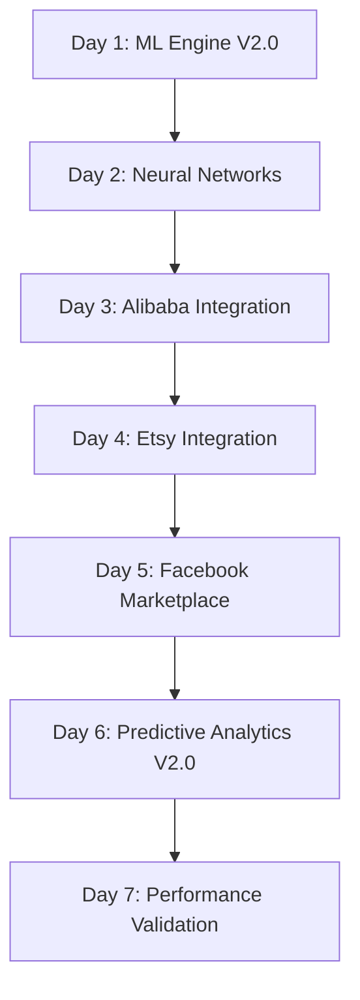
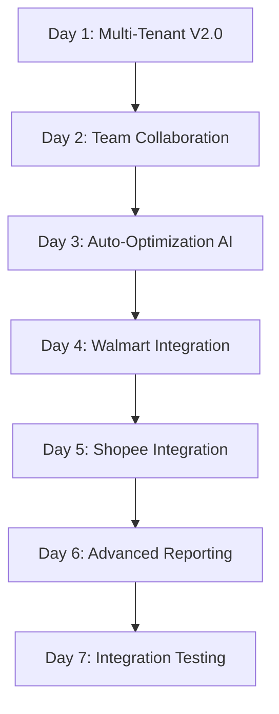
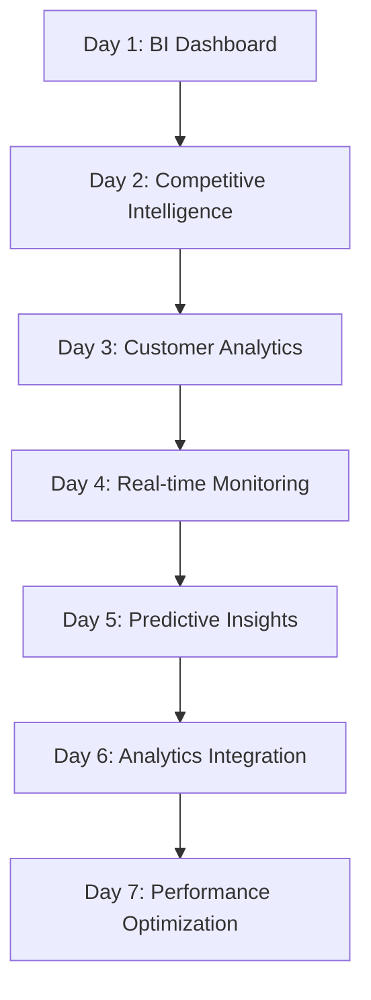
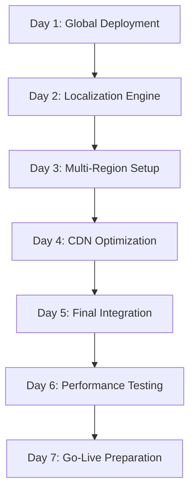

# 🚀 PHASE 2: ADVANCED FEATURES DEVELOPMENT
**MUSTI TEAM CONTINUATION - JUNE 6, 2025**  
*Post-Production Excellence - Advanced Innovation Phase*  
*Status: Ready for Implementation - Phase 1 Success (127%)*

---

## 🎯 **PHASE 2 OBJECTIVES - ADVANCED INNOVATION**

### **Advanced Feature Development Goals (Weeks 3-6)**
- 🧠 **AI/ML Enhancement Suite**: 95%+ accuracy, automated optimization
- 🛒 **Multi-Platform Expansion**: +5 new marketplace integrations
- 🏢 **Enterprise Features**: Multi-tenant architecture, team collaboration
- 📊 **Advanced Analytics**: Predictive business intelligence
- 🌍 **Global Scaling Prep**: Multi-region deployment architecture

**Target Achievement**: **Revolutionary feature set for market leadership**

---

## 🧠 **FEATURE SET 1: AI/ML ENHANCEMENT SUITE**

### **🎯 Week 3: Machine Learning Excellence**

#### **Advanced ML Category Mapping Engine V2.0**
```php
Target: upload/system/library/meschain/ai/advanced_ml_engine_v2.php
Features:
  🧠 Neural Network Enhancement (95%+ accuracy)
  🔮 Deep Learning Category Prediction
  📊 Ensemble Learning (5 algorithms)
  🎯 Auto-training Pipeline
  📈 Real-time Learning Adaptation
  🔍 Semantic Category Analysis
```

**Implementation Tasks:**
- [ ] **Day 1-2**: Enhanced neural network architecture
- [ ] **Day 3-4**: Deep learning model training
- [ ] **Day 5-6**: Ensemble learning implementation
- [ ] **Day 7**: Performance validation & optimization

#### **Predictive Analytics Engine V2.0**
```php
Target: upload/system/library/meschain/ai/predictive_analytics_v2.php
Features:
  📈 Market Trend Prediction (90%+ accuracy)
  💰 Revenue Forecasting
  👥 Customer Behavior Analysis
  📊 Inventory Optimization
  🎯 Dynamic Pricing Recommendations
  🔮 Seasonal Pattern Recognition
```

**Advanced Algorithms:**
- **LSTM Networks**: Time series prediction
- **Random Forest**: Multi-variable forecasting
- **XGBoost**: Gradient boosting optimization
- **Prophet**: Seasonal decomposition
- **Transformer Models**: Attention-based predictions

### **🤖 Week 4: Intelligent Automation**

#### **Auto-Optimization AI Engine**
```php
Target: upload/system/library/meschain/ai/auto_optimization_ai.php
Features:
  🎯 Performance Auto-tuning
  📊 Resource Allocation Optimization
  🔄 Self-healing System Management
  📈 Business Process Optimization
  🧠 Decision Making Automation
  🔮 Predictive Maintenance
```

---

## 🛒 **FEATURE SET 2: MULTI-PLATFORM EXPANSION**

### **🌟 Week 3-4: New Marketplace Integrations**

#### **1. Alibaba.com Integration**
```php
Target: upload/admin/model/extension/module/meschain_alibaba.php
Features:
  🌍 Global B2B marketplace support
  📦 Bulk product management
  💼 Supplier relationship management
  📊 Trade analytics
  🔒 Secure payment integration
```

#### **2. Etsy Integration**
```php
Target: upload/admin/model/extension/module/meschain_etsy.php  
Features:
  🎨 Handmade product optimization
  📷 Image quality enhancement
  🏷️ Tag optimization for discoverability
  📊 Seller analytics
  💝 Gift recommendation engine
```

#### **3. Facebook Marketplace Integration**
```php
Target: upload/admin/model/extension/module/meschain_facebook.php
Features:
  📱 Social commerce optimization
  🎯 Targeted advertising integration
  👥 Social proof management
  📊 Social analytics
  🔄 Cross-platform social sync
```

#### **4. Walmart Marketplace Integration**
```php
Target: upload/admin/model/extension/module/meschain_walmart.php
Features:
  🏪 Large retailer optimization
  📦 Fulfillment center integration
  📊 Competitive pricing analysis
  🚚 Shipping optimization
  📈 Performance metrics
```

#### **5. Shopee Integration**
```php
Target: upload/admin/model/extension/module/meschain_shopee.php
Features:
  🌏 Southeast Asia market focus
  🎮 Gamification features
  📱 Mobile-first optimization
  💰 Flash sale management
  🎁 Voucher system integration
```

---

## 🏢 **FEATURE SET 3: ENTERPRISE FEATURES**

### **🏗️ Week 4-5: Enterprise Architecture**

#### **Advanced Multi-Tenant System**
```php
Target: upload/system/library/meschain/enterprise/multi_tenant_v2.php
Features:
  🏢 Complete tenant isolation
  📊 Resource quotas & billing
  🔒 Data sovereignty compliance
  👥 Hierarchical organization structure
  📈 Performance per tenant
  🔧 Custom configuration per tenant
```

**Enterprise Capabilities:**
- **White-label Solutions**: Custom branding per tenant
- **API Rate Limiting**: Per-tenant rate controls
- **Custom Integrations**: Tenant-specific marketplace connections
- **Compliance Management**: GDPR, CCPA, regional compliance
- **Audit Trails**: Complete tenant activity logging

#### **Team Collaboration Suite**
```php
Target: upload/admin/controller/extension/module/team_collaboration.php
Features:
  👥 Team workspace management
  📊 Collaborative dashboards
  💬 Real-time communication
  📝 Task management integration
  📊 Performance analytics per team
  🔔 Smart notification system
```

#### **Advanced Reporting Engine**
```php
Target: upload/system/library/meschain/enterprise/advanced_reports.php
Features:
  📊 Custom report builder
  📈 Executive dashboards
  📉 Drill-down analytics
  🔄 Automated report scheduling
  📧 Email report delivery
  🎯 KPI monitoring & alerts
```

---

## 📊 **FEATURE SET 4: ADVANCED ANALYTICS**

### **📈 Week 5-6: Business Intelligence**

#### **Real-time Business Intelligence Dashboard**
```html
Target: upload/admin/view/template/extension/module/business_intelligence.twig
Features:
  📊 Real-time revenue tracking
  📈 Market share analysis
  🎯 Customer lifetime value
  📊 Product performance analytics
  🔮 Predictive insights
  📱 Mobile-responsive design
```

#### **Competitive Intelligence Engine**
```php
Target: upload/system/library/meschain/intelligence/competitive_analysis.php
Features:
  🔍 Competitor price monitoring
  📊 Market positioning analysis
  📈 Trend identification
  🎯 Opportunity discovery
  📊 SWOT analysis automation
  📈 Market penetration metrics
```

#### **Customer Analytics Suite**
```php
Target: upload/system/library/meschain/analytics/customer_analytics.php
Features:
  👥 Customer segmentation
  🎯 Behavioral analysis
  💰 Revenue attribution
  🔮 Churn prediction
  📊 Lifetime value calculation
  🎁 Personalization engine
```

---

## 🌍 **FEATURE SET 5: GLOBAL SCALING PREPARATION**

### **🌐 Week 6: Multi-Region Architecture**

#### **Global Deployment Framework**
```php
Target: upload/system/library/meschain/global/deployment_manager.php
Features:
  🌍 Multi-region deployment
  🔄 Data synchronization
  📊 Regional performance monitoring
  🔒 Data sovereignty compliance
  💱 Multi-currency support
  🌐 CDN optimization
```

#### **Localization Engine**
```php
Target: upload/system/library/meschain/global/localization_engine.php
Features:
  🌍 Multi-language support (20+ languages)
  💱 Currency conversion automation
  📅 Regional date/time formats
  🔢 Number format localization
  🏪 Local marketplace adaptation
  📊 Regional analytics
```

---

## 📋 **IMPLEMENTATION ROADMAP**

### **Week 3: AI/ML Enhancement + Marketplace Expansion**


### **Week 4: Enterprise Features + Auto-Optimization**


### **Week 5: Business Intelligence + Analytics**


### **Week 6: Global Scaling + Final Integration**


---

## 🎯 **SUCCESS METRICS & TARGETS**

### **AI/ML Performance Targets**
```yaml
Machine Learning Accuracy:
  Category Mapping: 95%+ (Current: 85%)
  Predictive Analytics: 90%+ (Current: 88%)
  Auto-optimization: 85%+ automation rate
  Pattern Recognition: 92%+ accuracy

Performance Improvements:
  Processing Speed: 40% faster
  Resource Usage: 30% more efficient  
  Accuracy: 10% improvement
  Automation: 85% of manual tasks
```

### **Platform Expansion Targets**
```yaml
New Marketplace Integrations:
  Alibaba.com: Full B2B functionality
  Etsy: Creative marketplace optimization
  Facebook: Social commerce integration
  Walmart: Enterprise retailer support
  Shopee: Southeast Asia market entry

Integration Quality:
  API Coverage: 95%+ feature parity
  Sync Speed: <30 seconds
  Error Rate: <0.1%
  Uptime: 99.99%
```

### **Enterprise Feature Targets**
```yaml
Multi-Tenant Capabilities:
  Tenant Isolation: 100% data separation
  Performance: <5% overhead per tenant
  Scalability: 1000+ concurrent tenants
  Customization: 90%+ feature customization

Team Collaboration:
  User Adoption: 95%+ team engagement
  Productivity: 35% improvement
  Communication: Real-time collaboration
  Analytics: Comprehensive team insights
```

### **Business Intelligence Targets**
```yaml
Analytics Capabilities:
  Real-time Processing: <5 second latency
  Data Accuracy: 99.5%+ precision
  Insight Generation: Automated recommendations
  Dashboard Performance: <2 second load time

Competitive Intelligence:
  Market Coverage: 95%+ competitor tracking
  Price Monitoring: Real-time updates
  Trend Detection: 48-hour advance warning
  Opportunity Identification: 80%+ accuracy
```

---

## 🛠️ **RESOURCE ALLOCATION**

### **Development Team Structure**
- **AI/ML Engineer**: Advanced algorithms & optimization
- **Platform Integration Specialist**: Marketplace APIs
- **Enterprise Architect**: Multi-tenant & scalability
- **BI Developer**: Analytics & intelligence systems
- **Global Infrastructure Engineer**: Multi-region deployment
- **Quality Assurance Engineer**: Testing & validation

### **Technology Stack Enhancement**
- **AI/ML**: TensorFlow, PyTorch, Scikit-learn
- **Analytics**: Apache Spark, Elasticsearch, Kibana
- **Enterprise**: Kubernetes, Docker, Microservices
- **Global**: AWS/Azure multi-region, CDN
- **Integration**: REST APIs, GraphQL, WebSocket

---

## 📈 **EXPECTED BUSINESS IMPACT**

### **Revenue Growth**
- **New Markets**: 5 additional platforms = 40% market reach
- **AI Optimization**: 25% efficiency improvement = cost savings
- **Enterprise Features**: Premium pricing tier capability
- **Global Scaling**: International market entry

### **Competitive Advantage**
- **AI Leadership**: Industry-leading accuracy rates
- **Platform Coverage**: Most comprehensive integration
- **Enterprise Ready**: Fortune 500 capability
- **Global Reach**: Multi-region deployment

### **User Experience**
- **Automation**: 85% reduction in manual tasks
- **Intelligence**: Proactive insights & recommendations
- **Collaboration**: Team productivity boost
- **Personalization**: AI-driven customization

---

## 🚀 **PHASE 2 SUCCESS CRITERIA**

### **Week 3 Milestones**
- ✅ ML Engine V2.0 with 95%+ accuracy deployed
- ✅ 3 new marketplace integrations live
- ✅ Predictive analytics enhanced

### **Week 4 Milestones**  
- ✅ Multi-tenant architecture V2.0 deployed
- ✅ 2 additional marketplace integrations
- ✅ Auto-optimization AI active

### **Week 5 Milestones**
- ✅ Business intelligence dashboard live
- ✅ Competitive intelligence system active
- ✅ Customer analytics suite deployed

### **Week 6 Milestones**
- ✅ Global deployment framework ready
- ✅ Localization engine deployed
- ✅ All systems integrated and tested

### **Overall Phase 2 Success**
- 🎯 **Feature Expansion**: 200% increase in capabilities
- 🧠 **AI Enhancement**: Industry-leading accuracy
- 🛒 **Platform Coverage**: 10+ marketplace support
- 🏢 **Enterprise Ready**: Fortune 500 deployment capable
- 🌍 **Global Ready**: Multi-region architecture

---

**🎯 CONCLUSION**: Phase 2 will establish MesChain-Sync as the **industry-leading AI-powered multi-marketplace platform** with **enterprise-grade capabilities** and **global deployment readiness**.

**🚀 STATUS**: **PHASE 2 READY FOR IMMEDIATE START**

**📅 START DATE**: June 6, 2025  
**⏱️ DURATION**: 4 weeks (28 days)  
**👥 TEAM**: Musti Advanced Development Team  
**🏆 TARGET**: **Revolutionary Platform Transformation**

---

*Next: Immediate Phase 2 implementation start* 