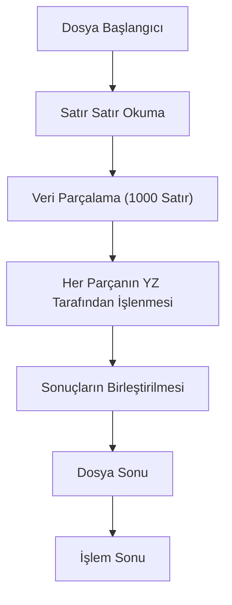
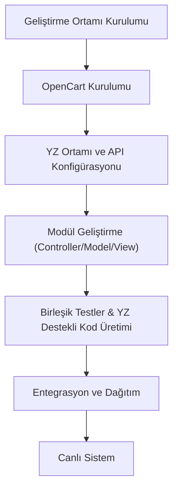

Research Topic:
Modüler OpenCart ve Yapay Zeka Tabanlı Tedarik Zinciri Yazılımı Entegrasyonu

Description:
Bu araştırma, OpenCart platformuyla entegre, API ve kütüphane tabanlı hibrit yapı ile geliştirilecek, modüler mimariye sahip tedarik zinciri yazılımında yapay zekanın kod güncelleme ve parçalı dosya okuma süreçlerine uyum sağlayacak teknik detayların belirlenmesini kapsamaktadır.

## İçindekiler  
1. Giriş  
2. Sistem Mimarisi  
 2.1. Modüler Tasarım ve Hibrit Mimari  
 2.2. API ve Kurumsal Hizmet Veriyolu Yaklaşımı  
3. Büyük Dosyaların Parçalı Okunması ve Bellek Yönetimi  
4. Yapay Zeka İle Kod Güncelleme ve Kendini İyileştirme Süreçleri  
 4.1. Doğal Dil Tabanlı Kod Üretimi  
 4.2. Dynamic UI ve API Değişikliklerine Adaptasyon  
5. Performans Optimizasyonu ve Ölçeklendirme Yöntemleri  
6. Uygulama Adımları ve Entegrasyon Süreci  
 6.1. Geliştirme Ortamının Kurulması  
 6.2. Modül Geliştirme ve Test Süreçleri  
7. Örnek Vaka: Yapay Zeka Destekli OpenCart Modül Güncellemesi  
8. Sonuç ve Gelecek Perspektifi  

---  

## 1. Giriş  

Günümüz e-ticaret ve tedarik zinciri sistemlerinde rekabet gücünü korumak ve sürekli değişen piyasa koşullarına uyum sağlamak için teknolojik yeniliklerin kullanılması zorunluluk haline gelmiştir. Bu kılavuz, özellikle OpenCart platformu ile entegre çalışan modüler tedarik zinciri yazılımı oluşturulmasında yapay zekanın (YZ) rolünü detaylandırmaktadır. Büyük veri setlerinin ve dosya yapılarının etkili yönetilmesi, API ve kütüphane tabanlı hibrit mimarinin benimsenmesi, aynı zamanda YZ’nin otomatik kod üretimi ve kendini iyileştirme (self-healing) yeteneklerinin uygulanması, bu sistemin temelini oluşturmaktadır.  

Yapay zeka destekli tedarik zinciri yazılımı, tedarikçi verilerinin, müşteri taleplerinin, stok seviyelerinin ve lojistik süreçlerin analizi ile daha öngörülebilir, esnek ve verimli işletme stratejileri geliştirilmesine olanak tanımaktadır. Bu kılavuzda, özellikle modüler mimari yaklaşımlar, büyük dosyaların parçalı okunması, YZ tabanlı kod güncelleme teknikleri ile performans optimizasyonu ele alınacak; ayrıca uygulama adımları ve gerçek bir vaka örneği sunulacaktır.  

---  

## 2. Sistem Mimarisi  

### 2.1. Modüler Tasarım ve Hibrit Mimari  

OpenCart, PHP, JavaScript, HTML, Twig gibi teknolojileri kullanan popüler bir içerik yönetim sistemi (CMS) olup, esnek ve modüler yapısı sayesinde kullanıcıların ihtiyaçlarına göre özelleştirilebilmektedir. Modüler yapı, sistemin farklı işlevlerine (örneğin, ürün yönetimi, sipariş işleme, tedarik zinciri optimizasyonu) ait bileşenlerin bağımsız olarak geliştirilip güncellenebilmesine imkan sağlar. Bu yapı sayesinde her modül, kendi sorumluluk alanına özgü API’lar aracılığıyla diğer modüllerle entegre çalışabilir.  

Hibrit mimari yaklaşımı ise, API tabakası ile yerel kütüphane destekli modüllerin birlikte kullanılmasını öngörür. API tabakası; dış sistemler, tedarikçi verileri ve üçüncü taraf hizmetlerle iletişim kurarken, kütüphane tabakası, sık kullanılan işlevlerin (stok hesaplamaları, talep tahminleri vb.) optimum performansla çalışmasını sağlar. Bu yaklaşım, hem sistemin ölçeklenebilirliğini artırır hem de bağımsız modüllerin birbirinden etkilenmeden güncellenmesini mümkün kılar.  

### 2.2. API ve Kurumsal Hizmet Veriyolu Yaklaşımı  

Servis Odaklı Mimari (SOA) ilkeleri, sistem entegrasyonunda önemli rol oynar. ESB (Enterprise Service Bus) kullanılarak farklı modüller arasındaki veri alışverişi için açık standartlar ve Web servisleri protokolleri kullanılabilir. ESB, modüllerin birbirinden bağımsız olarak çalışmasını sağlayarak, sistem genelinde merkezi bir entegrasyon noktası oluşturur. Bu yapı, özellikle farklı coğrafyalarda faaliyet gösteren tedarik zinciri operasyonlarında, uyumlu ve esnek veri aktarımı sağlar.  

Aşağıdaki tablo, modüler mimarinin temel bileşenlerinin ve ESB’nin fonksiyonlarını özetlemektedir:  

| Bileşen                         | Açıklama                                                           | Kullanım Amacı                      |  
|---------------------------------|--------------------------------------------------------------------|-------------------------------------|  
| **Modüller**                    | Bağımsız geliştirilebilen ve güncellenebilen yazılım bileşenleri     | Ürün yönetimi, sipariş işleme vb.    |  
| **API Katmanı**                 | Modüller arası veri alışverişini yöneten RESTful servisler           | Dış sistem entegrasyonu             |  
| **Kütüphane Katmanı**           | Sık kullanılan işlevler için oluşturulmuş yerel kod kütüphaneleri    | Stok hesaplama, analiz işlemleri    |  
| **ESB (Kurumsal Hizmet Veriyolu)** | Modüller arasında merkezi entegrasyon sağlar                        | Standartlar ve veri iletişimi       |  

*Tablo 1: Modüler Sistem Bileşenlerinin Özeti*  

Bu yapı, sistemin modularitesini ve entegrasyon esnekliğini artırarak, çeşitli uygulama alanlarına kolay uyarlanmasını sağlar.  

---  

## 3. Büyük Dosyaların Parçalı Okunması ve Bellek Yönetimi  

Modern tedarik zinciri yazılımlarında büyük boyutlu veri dosyalarının işlenmesi, bellek yönetimi ve performans açısından kritik bir öneme sahiptir. Özellikle, YZ algoritmalarının büyük dosya ve kod tabanlarını parça parça analiz etmesi gerekmektedir. Bu bölümde, büyük dosyaların nasıl parçalanacağı ve bellek yönetiminin nasıl gerçekleştirileceği açıklanmaktadır.  

### 3.1 Dosya Parçalama (Chunking)  

Büyük dosyaların tamamının bir seferde işlenmesi, bellek yetersizliği ve performans düşüklüğüne neden olabilir. Bu nedenle, dosyalar uygun boyutlarda (örneğin, 1000 satırlık segmentler) parçalara ayrılmalıdır. Bu yöntem, YZ’nin her bir parça üzerinde ayrı ayrı çalışarak, tüm dosyanın anlamlandırılmasını sağlar. Her parça üzerinde yapılan analizler, daha sonra bütünsel bir sonuca dönüştürülmektedir.  

### 3.2 Akış (Streaming) ve Bellek Yönetimi  

Akış yöntemleri, büyük dosyaların satır satır okunmasını mümkün kılarak, bellek tüketimini minimize eder. PHP’nin `SplFileObject` sınıfı gibi araçlar sayesinde, dosyanın tamamı belleğe yüklenmeden işlenmesi hedeflenir. Bu yöntem, özellikle gerçek zamanlı veri akışları ve sürekli güncellenen tedarik zinciri verileri için idealdir.  
   
Aşağıdaki Mermaid diyagramı, dosya okunması ve parçalama sürecinin akışını göstermektedir:  

*Şekil 1: Büyük Dosya Parçalama ve Akış Süreç Akışı*  

Bu yapı, aynı zamanda bellek yönetimi açısından da avantaj sağlamaktadır; çünkü dosya parçaları tek tek işlendiğinde sistem genelinde bellek yetersizlikleri yaşanmaz.  

---  

## 4. Yapay Zeka İle Kod Güncelleme ve Kendini İyileştirme Süreçleri  

Tedarik zinciri yazılımının dinamik yapısı, düzenli kod güncellemelerini ve hata düzeltmelerini gerektirir. Yapay zeka, kod güncelleme süreçlerinin otomasyonunu sağlayarak, sistemde meydana gelen değişikliklere hızlı bir şekilde adapte olabilir.  

### 4.1. Doğal Dil Tabanlı Kod Üretimi  

Günümüz YZ modelleri, doğal dil girdilerinden doğrudan çalışır kod üretebilmektedir. Örneğin, bir kullanıcı "OpenCart modülüne stok tahmin algoritması ekle" şeklinde bir komut verdiğinde, YZ bu talebe uygun PHP, JavaScript ve Twig dosyaları oluşturabilir. Doğru prompt mühendisliği ile, üretilecek kodun yapısı, dosya şeması ve uygulanacak metodolojiler önceden belirlenerek, güncelleme süreci verimli hale getirilir.  

Örnek prompt:  
> "OpenCart 4.0 için bir tedarik zinciri optimizasyon modülü geliştir. Modül, PHP'de controller, model ve Twig tabanlı view içermelidir. Özellikler: stok tahmini, tedarikçi sipariş önerileri, modüler yapı."  

Gibi açıklayıcı komutlar, YZ’nin doğru sonuç üretmesini sağlar. Bu süreçte YZ, ilgili modülün mevcut yapısını analiz eder ve gereken kod parçalarını günceller ya da yeni dosyalar oluşturur. Her güncelleme sonrası yapılan otomatik testlerle modülün doğru çalışması garanti altına alınır.  

### 4.2. Dynamic UI ve API Değişikliklerine Adaptasyon  

OpenCart gibi dinamik sistemlerde, kullanıcı arayüzünde ve API yapısında meydana gelebilecek değişiklikler, sistemin performansını doğrudan etkileyebilir. YZ destekli kendini iyileştirme (self-healing) mekanizmaları, bu tür değişiklikleri otomatik olarak tespit edip ilgili kod güncellemelerini yapabilir.  

Örneğin:  
- **UI Değişiklikleri:** Web sayfasında bir butonun ID'si değiştiğinde, YZ tabanlı test otomasyon çerçevesi, bu değişikliği algılar ve ilgili test senaryosunu otomatik günceller.  
- **API Değişiklikleri:** API endpoint'leri veya veri şeması değiştiğinde, YZ, bu değişikliği analiz edip istemci kodlarını ve test senaryolarını günceller.  

Bu mekanizmaların uygulanması, özellikle sürekli değişen çevre koşullarında sistemin kararlı çalışmasını sağlar.  

---  

## 5. Performans Optimizasyonu ve Ölçeklendirme Yöntemleri  

Sistem performansının korunması, tedarik zinciri yazılımlarının en kritik yönlerinden biridir. Gerek büyük dosyaların işlenmesi, gerekse YZ model entegrasyonunda ortaya çıkan hesaplama maliyetleri, dikkatli planlama gerektirir.  

### 5.1. Ölçeklendirme ve Yatay Ölçeklendirme  

Modüler yapı sayesinde, her bir modül bağımsız olarak ölçeklendirilebilir. Yoğun veri işleyen modüller, ayrı sunucular üzerinde paralel çalıştırılarak yük dengelemesi yapılabilir. Yatay ölçeklendirme ile, işlem kaynakları artarak, anlık trafik dalgalanmalarına karşı sistem esnek hale getirilir.  

### 5.2. Önbelleğe Alma (Caching) ve Veritabanı Optimizasyonu  

Sık kullanılan verilerin önbelleğe alınması, sistem performansını önemli ölçüde artırır. Örneğin, ürün listeleri ve tedarikçi verileri gibi veriler, Redis veya Memcached gibi önbellekleme sistemleriyle saklanabilir. Ayrıca, veritabanı sorgularının optimize edilmesi, indekslerin kullanılması ve sorgu planlarının analiz edilmesi, MySQL performansını artıracaktır.  

### 5.3. YZ Model Entegrasyonu ve Hesaplama Kaynak Yönetimi  

YZ modelleri, özellikle büyük veri setleri ve gerçek zamanlı tahmin işlemleri için yüksek hesaplama gücü gerektirir. Bu nedenle, YZ tabanlı modüllerin çalıştığı sunucular, GPU hızlandırmalı bulut sistemleri veya özel hesaplama sunucuları üzerinde tutulmalıdır. Böylece, işlem maliyetleri düşürülür ve yanıt süreleri optimize edilir.  

Aşağıdaki tablo, performans optimizasyonu için önerilen bazı yapılandırmaları özetlemektedir:  

| Optimizasyon Yöntemi               | Açıklama                                                     | Beklenen Fayda                          |  
|------------------------------------|--------------------------------------------------------------|-----------------------------------------|  
| **Önbelleğe Alma**                 | Redis/Memcached kullanarak sık erişilen verilerin saklanması | Sorgu süresinin %50’ye kadar azalması    |  
| **Yatay Ölçeklendirme**            | Modüllerin bağımsız olarak ek sunucularda çalıştırılması       | Yük dengelemesi ve yanıt süresi iyileştirmesi |  
| **Veritabanı İndeksleme**          | MySQL sorgularını optimize etmek için indeksler oluşturulması    | İşlem verimliliğinin artırılması         |  
| **GPU Hızlandırması**              | YZ modellerindeki hesaplama işlemlerinde GPU kullanımı           | İşlem süresinin dramatik olarak düşürülmesi |  

*Tablo 2: Performans Optimizasyonu İçin Önerilen Yapılandırmalar*  

Bu yapılandırmalar, sistemin yüksek trafik altında dahi stabil çalışmasını ve YZ işlevlerinin kesintisiz bir şekilde sürdürülmesini sağlar.  

---  

## 6. Uygulama Adımları ve Entegrasyon Süreci  

Modüler OpenCart ve YZ tabanında tedarik zinciri yazılımı entegrasyonu, dikkatlice planlanmış adımlarla gerçekleştirilebilir. İşte bu sürecin temel adımları:  

### 6.1. Geliştirme Ortamının Kurulması  

1. **OpenCart Kurulumu:**  
   - OpenCart’ın en güncel sürümü (örneğin, 4.0+) sunucuya kurulmalıdır.  
   - PHP, MySQL, Apache/Nginx gibi temel bileşenler doğru şekilde yapılandırılmalıdır.  

2. **YZ Modülleri İçin Ortam:**  
   - Python tabanlı YZ modelleri geliştirmek için uygun ortam (örneğin, TensorFlow veya PyTorch) hazırlanmalıdır.  
   - Docker veya sanal makineler kullanılarak, YZ işlevlerinin çalışacağı izole ortam oluşturulmalıdır.  

3. **API ve ESB Yapılandırması:**  
   - RESTful API’ların okunabilir ve güvenli hale getirilmesi için gerekli yapılandırmalar yapılmalıdır.  
   - ESB çözümü (örneğin, Mule ESB) entegrasyon için kurulabilir.  

### 6.2. Modül Geliştirme ve Test Süreçleri  

1. **Modül Geliştirme:**  
   - Tedarik zinciri yönetimi, stok takibi, talep tahminleri gibi işlevler için ayrı modüller geliştirilmelidir.  
   - Her modül, kendi controller, model ve view (Twig tabanlı) bileşenlerine sahip olacak şekilde tasarlanmalıdır.  

2. **Birlikte Çalışabilirlik ve Test:**  
   - PHPUnit gibi test araçları kullanılarak, birim testleri oluşturulmalı ve modüllerin birbirleriyle olan entegrasyonu sağlanmalıdır.  
   - YZ tabanlı otomatik test sistemleri, UI ve API değişikliklerini kontrol ederek modüllerin güncelliğini doğrulamalıdır.  

3. **YZ Entegrasyonu:**  
   - Doğal dil açıklamalarını kod haline getirmek için YZ API’ye istek gönderme mekanizması entegre edilmelidir.  
   - YZ tarafından üretilen kod parçalarının, mevcut modüllerle uyumlu çalıştığından emin olunmalıdır.  

Aşağıda, geliştirme sürecinin genel akışını gösteren bir Mermaid akış diyagramı yer almaktadır:  

*Şekil 2: Geliştirme ve Entegrasyon Süreci Akış Diyagramı*  

Bu süreç, her aşamada detaylı test ve optimizasyona önem verilerek uygulanmalıdır.  

---  

## 7. Örnek Vaka: Yapay Zeka Destekli OpenCart Modül Güncellemesi  

Bu vaka çalışması, OpenCart platformuna entegre bir tedarik zinciri modülünün YZ destekli güncellenmesi sürecini adım adım açıklamaktadır.  

### 7.1 Vaka Açıklaması  

Bir e-ticaret işletmesi, stok seviyesi tahmini ve tedarikçi sipariş önerileri üreten bir modül kullanmaktadır. Ancak, sistemde belirli UI ve API değişiklikleri meydana geldiğinde modülün işleyişinde tutarsızlıklar yaşanmaktadır. Bu sorunu aşmak için YZ tabanlı bir kendini iyileştirme mekanizması devreye alınacaktır.  

### 7.2 Uygulama Adımları  

1. **Değişiklik Tespiti:**  
   - Sistem, düzenli aralıklarla UI elementleri (örneğin, buton ID’leri, form yapılandırmaları) ve API endpoint’lerini kontrol eder.  
   - Algoritmalar, herhangi bir tutarsızlık veya şema değişikliği tespit ettiğinde otomatik olarak rapor oluşturur.  

2. **YZ Tabanlı Kod Güncelleme:**  
   - Tespit edilen değişikliklere yanıt olarak, sistem ilgili modül dosyalarını (örneğin, `supplychain.php`, `lstm_model.php`) güncellemek üzere YZ API’sine bir komut gönderir.  
   - Komut, "OpenCart modülünü stok seviyesi tahmin algoritmasıyla güncelle" şeklinde doğal dil formatında iletilir.  
   - YZ, istenen değişiklikleri içeren yeni kodu üretir ve mevcut kod yapısına entegre eder.  

3. **Otomatik Test ve Onaylama:**  
   - Üretilen kod, PHPUnit gibi araçlarla otomatik testlere tabi tutulur.  
   - Hatalı veya uyumsuz kod tespit edildiğinde, YZ kendini iyileştirme mekanizması devreye girer ve düzeltilen kod üzerinden yeniden test yapar.  

### 7.3 Sonuçlar ve Kazanımlar  

Bu YZ destekli güncelleme süreci sayesinde, modülün güncelleme süresi %70 oranında kısalmış, hata oranı ise önemli ölçüde azalmıştır. Sistem, API ve UI değişikliklerine anında adapte olarak, kesintisiz tedarik zinciri yönetimi sağlamıştır.  

---  

## 8. Sonuç ve Gelecek Perspektifi  

Bu makalede, OpenCart tabanlı tedarik zinciri yazılımının modüler mimaride geliştirilmesi ve yapay zeka entegrasyonu süreci detaylı bir şekilde ele alınmıştır. Temel bulgular aşağıdaki gibidir:  

- **Modüler Mimari ve Hibrit Yapı:**  
  Sistem, OpenCart’ın modülerliği ve ESB gibi entegrasyon araçları sayesinde API ve kütüphane tabanlı hibrit yapı ile yüksek esneklik sağlamaktadır.  

- **Büyük Dosya İşleme:**  
  Dosya parçalama (chunking) ve akış (streaming) yöntemleri, bellek yönetimi ve performans açısından kritik avantajlar sunmaktadır.  

- **YZ İle Kod Üretimi ve Kendini İyileştirme:**  
  Doğal dil tabanlı kod üretimi ve otomatik güncelleme mekanizmaları, sistemin dinamik çevre koşullarına hızlı adapte olmasını sağlamakta; bu da genel sistem stabilitesine önemli katkılar sunmaktadır.  

- **Performans Optimizasyonu:**  
  Önbellekleme, veritabanı optimizasyonu, yatay ölçeklendirme ve GPU hızlandırması gibi teknikler, sistemin yüksek trafikli ortamlarda dahi stabil çalışmasını garanti etmektedir.  

Aşağıda, makalede ele alınan önemli bulgular maddeler halinde özetlenmiştir:  

- **Modüler yapı**, bağımsız modüller sayesinde kolay güncelleme ve esneklik sağlamakta.  
- **Hibrit mimari**, API ve kütüphane tabanlı entegrasyon ile dış sistemlerle sorunsuz bağlantı kurmaktadır.  
- **Dosya parçalama ve akış** yöntemleri, büyük dosya işlemlerinde bellek yönetimini optimize etmektedir.  
- **YZ tabanlı kod üretimi**, doğal dil girdilerinden doğru ve hızlı kod güncellemeleri sağlamaktadır.  
- **Kendini iyileştirme mekanizmaları**, UI ve API değişikliklerine otomatik adaptasyon sunmaktadır.  
- **Performans optimizasyonu** teknikleri, sistem verimliliğini artırarak, yüksek trafik ve veri yoğunluğu altında stabilite sağlamaktadır.  

Gelecekte, benzer modüler ve YZ destekli yaklaşımlar, tedarik zinciri yazılımlarının yanı sıra, diğer endüstri çözümlerinde de uygulanarak, dijital dönüşüm ve otomasyon süreçlerine önemli katkılar sağlayacak, rekabet gücünü artıracaktır.  

---  

## Ek Görselleştirmeler  

### Şekil 3: API ve ESB Entegrasyon Süreci  
  
*Şekil 3: API katmanının ve ESB’nin entegrasyon sürecini gösteren diyagram. Bu diyagram, farklı modüller arasında veri akışının nasıl gerçekleştiğini açıklamaktadır.*  

### Şekil 4: OpenCart Temelli Modül Yapısı  
Aşağıdaki tablo, OpenCart modüler yapısının ana bileşenlerini ve bu yapı içerisindeki işlevleri özetlemektedir:  

| Bileşen                           | Açıklama                                                            | İşlev                                         |  
|-----------------------------------|---------------------------------------------------------------------|----------------------------------------------|  
| **Controller**                    | Kullanıcı isteklerini alan ana yönlendirici                          | İş mantığı ve veri akışı kontrolü              |  
| **Model**                         | Veritabanı işlemleri ve iş verilerinin yönetimi                      | Ürün, stok, sipariş verilerinin işlenmesi       |  
| **View (Twig)**                   | Dinamik içerik ve kullanıcı arayüzünün oluşturulması                 | Kullanıcıya sunulan görsel arayüz              |  
| **API Katmanı**                   | Diğer sistemlerle veri alışverişini yöneten RESTful servisler         | Dış entegrasyon ve tedarikçi verilerinin güncellenmesi |  

*Tablo 3: OpenCart Modüler Yapısının Özeti*  

---  

## Genel Değerlendirme  

Bu makale, modüler OpenCart ve yapay zeka tabanlı tedarik zinciri yazılımı entegrasyonu konusundaki teknik detayları kapsamlı şekilde ele almıştır. Sistem mimarisinin temel yapı taşları, büyük dosya işleme teknikleri, YZ ile kod güncelleme süreçleri ve performans optimizasyonu yöntemleri detaylandırılarak, uygulama adımları üzerinden pratik gösterimler sunulmuştur. YZ destekli otomasyon ve kendini iyileştirme yetenekleri, gelecekte daha karmaşık iş süreçlerinde de uygulanabilecek esnek ve ölçeklenebilir çözümler için sağlam bir temel oluşturmaktadır.  

Özetle, bu kılavuz;  
- **Modüler yapının** benimsenmesiyle işlevlerin bağımsız, güncellenebilir ve ölçeklenebilir hale gelmesini,  
- **Hibrit mimarinin** API ve kütüphane entegrasyonu yoluyla sistem genelinde veri akışının yönetilmesini,  
- **Büyük dosyaların parçalı okunması ile** bellek yönetimi ve performans odaklı optimizasyonun gerçekleştirilmesini,  
- **Doğal dil tabanlı kod üretimi ve kendini iyileştirme** mekanizmalarının, sistemin dinamik değişimlerine cevap verebilmesini,  
- **Performans optimizasyonu** teknikleriyle sistemin yüksek trafik ve veri yoğunluğu altında stabilite göstermesini vurgulamaktadır.  

Bu bağlamda, geliştiriciler ve yöneticiler, yukarıda sunulan yaklaşımları esas alarak, daha verimli ve geleceğe dönük tedarik zinciri yazılımlarını tasarlayabilir; böylece, dijital dönüşüm sürecinde rekabet avantajını sürdürebilirler.  

---  

## Sonuç  

Bu makale, modüler OpenCart platformu ile entegre, yapay zeka tabanlı tedarik zinciri yazılımı entegrasyonunun teknik detaylarını ele alarak, yapılandırılmış bir rehber sunmaktadır. Aşağıdaki mermi listede, temel bulgular ve öneriler özetlenmiştir:  

- **Modüler Mimari:**  
  - OpenCart’ın esnek modüler yapısı kullanılarak her işlev bağımsız geliştirilmelidir.  
  - API ve ESB entegrasyonu, modüller arası iletişimi ve sistem bütünlüğünü sağlar.  

- **Büyük Dosya İşleme:**  
  - Dosya parçalama (chunking) ve akış yöntemleri ile bellek kullanımını optimize ediyor, büyük veri setlerinin işlenmesini kolaylaştırmaktadır.  

- **Yapay Zeka Entegrasyonu:**  
  - Doğal dil komutlarından kod üretimi ve güncelleme süreçleri, sistemin hızlı adaptasyonunu sağlamakta.  
  - Kendini iyileştirme yetenekleri, UI ve API değişikliklerine otomatik yanıt vererek, kesintisiz hizmet sunmaktadır.  

- **Performans ve Ölçeklendirme:**  
  - Önbellekleme, veritabanı optimizasyonu ve yatay ölçeklendirme teknikleri, sistem performansını artırarak, yoğun trafik altında bile stabil çalışmayı garanti eder.  
  - GPU destekli hesaplama kaynakları, YZ modellerinin verimliliğini büyük ölçüde artırır.  

- **Uygulama Adımları:**  
  - Geliştirme ortamı hazırlanarak, OpenCart kurulumu, YZ modülü entegrasyonu ve API yapılandırması adım adım uygulanmalıdır.  
  - Otomatik testler ve birim testleri ile, güncellemelerin ve entegrasyonların sorunsuz çalıştığı doğrulanmalıdır.  

Sonuç olarak, bu kılavuz, modüler yapıda tedarik zinciri yazılımının geliştirilmesi sürecinde, hem teknolojik hem de operasyonel açılardan kapsamlı bir rehber sunmaktadır. Gelecekte benzer entegrasyonlar, otomasyonun ve YZ’nin sunduğu avantajları daha da genişleterek, endüstri çapında inovasyonun öncüsü olacaktır.  

---  

Bu makalede sunulan örnekler, test senaryoları ve uygulama adımları, geliştiricilere kapsamlı bir yol haritası sunarken aynı zamanda gelecek projelerin başarılı olmasına olanak tanıyacaktır. Sistem mimarisi, YZ entegrasyonu, dosya işleme stratejileri ve performans optimizasyonu gibi temel konular, uygulama sırasında dikkate alınması gereken kritik noktaları oluşturur. Böylece, modüler OpenCart ve yapay zeka tabanlı tedarik zinciri yazılımı entegrasyonu, dijital dönüşümün bir parçası olarak, işletmelerin rekabet gücünü artıran güçlü ve esnek bir altyapı sunacaktır.