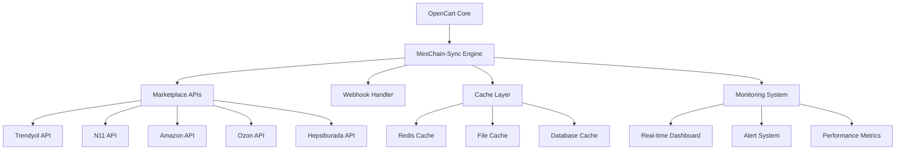

# 🌟 MesChain-Sync Enterprise

<div align="center">


**OpenCart 3.0.4.0 Tabanlı Çoklu Pazaryeri Entegrasyon Sistemi**

[](https://php.net)
[](https://opencart.com)
[](https://mysql.com)
[](LICENSE)

</div>

---

## 📋 **PROJE HAKKINDA**

MesChain-Sync, e-ticaret işletmelerinin birden fazla pazaryerinde satış yapmasını sağlayan güçlü bir entegrasyon platformudur. OpenCart altyapısı üzerine inşa edilmiş bu sistem, modern DevOps pratikleri ve enterprise-level güvenlik standartları ile geliştirilmiştir.

### 🎯 **Desteklenen Pazaryerleri**
- 🛒 **Trendyol** (%80 tamamlandı - Webhook desteği)
- 🛍️ **N11** (%30 tamamlandı)
- 🌐 **Amazon** (%15 tamamlandı)
- 🇷🇺 **Ozon** (%65 tamamlandı)
- 🏪 **Hepsiburada** (%25 tamamlandı)
- 🔵 **eBay** (Geliştirilecek)

---

## ✨ **ÖZELLİKLER**

### 🚀 **Core Features**
- ✅ **Çoklu Pazaryeri Entegrasyonu**
- ✅ **Real-time Stok Senkronizasyonu**
- ✅ **Otomatik Sipariş Yönetimi**
- ✅ **Dropshipping Desteği**
- ✅ **Webhook Event Handling**
- ✅ **Advanced Reporting**

### 🛡️ **Security & DevOps**
- ✅ **Enterprise Security Hardening**
- ✅ **Automated CI/CD Pipeline**
- ✅ **Real-time Monitoring Dashboard**
- ✅ **Comprehensive Logging System**
- ✅ **Automated Backup System**
- ✅ **Performance Optimization**

### 📊 **Monitoring & Analytics**
- ✅ **System Health Monitoring**
- ✅ **Performance Metrics**
- ✅ **Error Tracking & Alerting**
- ✅ **Cache Monitoring**
- ✅ **API Rate Limiting**

---

## 🏗️ **SYSTEM ARCHITECTURE**



---

## 📁 **PROJE YAPISI**

```
meschain-sync-enterprise/
├── 📂 upload/                          # OpenCart web root
│   ├── 📂 admin/
│   │   ├── 📂 controller/extension/module/
│   │   ├── 📂 model/extension/module/   # ✅ Model dosyaları
│   │   ├── 📂 view/template/extension/module/
│   │   └── 📂 language/
│   ├── 📂 catalog/
│   ├── 📂 system/
│   │   └── 📂 library/meschain/         # Core kütüphaneler
│   └── 📂 image/
├── 📂 config/                           # Konfigürasyon dosyaları
│   ├── 📂 ssl/                         # SSL konfigürasyonları
│   ├── 📂 monitoring/                  # Monitoring yapılandırmaları
│   ├── database.conf                   # Database ayarları
│   └── environment.conf                # Environment ayarları
├── 📂 docs/                            # Dokumentasyon
├── 📂 scripts/                         # Otomatizasyon scriptleri
├── 📄 devops_automation.php            # ✅ CI/CD Pipeline
├── 📄 monitoring_dashboard.html        # ✅ Monitoring Dashboard
├── 📄 database_migration.sql           # ✅ Database Schema
├── 📄 security_hardening.sh            # ✅ Security Automation
├── 📄 production_deployment_guide.md   # ✅ Deployment Guide
└── 📄 README.md                        # Bu dosya
```

---

## ⚡ **HIZLI BAŞLANGIÇ**

### 1. **Sistem Gereksinimleri**
```bash
PHP: 7.4+ (Önerilen: 8.0+)
MySQL: 5.7+ veya MariaDB 10.3+
Web Server: Apache 2.4+ veya Nginx 1.18+
Memory: Minimum 2GB RAM (Önerilen: 4GB+)
Storage: Minimum 10GB boş alan
SSL Certificate: Geçerli SSL sertifikası
```

### 2. **Kurulum**
```bash
# Repository'yi klonlayın
git clone https://github.com/username/meschain-sync-enterprise.git
cd meschain-sync-enterprise

# Kurulum scriptini çalıştırın
chmod +x scripts/install.sh
./scripts/install.sh

# Database migration'ı çalıştırın
mysql -u username -p database_name < database_migration.sql

# Security hardening uygulayın
chmod +x security_hardening.sh
./security_hardening.sh
```

### 3. **Konfigürasyon**
```bash
# Database ayarlarını düzenleyin
cp config/database.conf.example config/database.conf
nano config/database.conf

# Environment ayarlarını yapılandırın
cp config/environment.conf.example config/environment.conf
nano config/environment.conf
```

### 4. **Monitoring Dashboard**
```bash
# Monitoring dashboard'u başlatın
cp monitoring_dashboard.html /var/www/html/monitoring/
# Tarayıcınızda açın: https://yourdomain.com/monitoring/
```

---

## 🔧 **GELIŞTIRME & DEVOPS**

### **CI/CD Pipeline**
```bash
# DevOps automation scriptini çalıştırın
php devops_automation.php --operation=full_deployment

# Sistem sağlığını kontrol edin
php devops_automation.php --operation=health_check

# Performance testlerini çalıştırın
php devops_automation.php --operation=performance_test
```

### **Monitoring & Alerting**
- 📊 **Real-time Dashboard:** `/monitoring_dashboard.html`
- 📝 **Log Viewer:** Admin Panel > Extensions > Modules > Log Viewer
- 💾 **Cache Monitor:** Admin Panel > Extensions > Modules > Cache Monitor
- 📦 **Dropshipping Dashboard:** Admin Panel > Extensions > Modules > Dropshipping

### **Security Features**
- 🔒 **File Permission Hardening**
- 🛡️ **Web Server Security Headers**
- 🔐 **SSL/TLS Configuration**
- 🔥 **Firewall Rules**
- 👁️ **Intrusion Detection**
- 💾 **Encrypted Backups**

---

## 📊 **MARKETPLACE DURUMU**

| Marketplace | Tamamlanma | Özellikler | Durum |
|-------------|------------|------------|-------|
| **Trendyol** | %80 | API, Webhook, Sipariş Sync | ✅ Active |
| **Ozon** | %65 | API, Product Sync | 🔄 Development |
| **N11** | %30 | Basic API | 🔄 Development |
| **Hepsiburada** | %25 | Initial Setup | 🔄 Development |
| **Amazon** | %15 | Research Phase | 📋 Planning |
| **eBay** | %0 | Not Started | 📋 Planning |

---

## 📚 **DOKÜMANTASYON**

### **Teknik Dokümantasyon**
- 📖 [**Production Deployment Guide**](production_deployment_guide.md)
- 🔧 [**DevOps Tasks Completed**](MUSTI_DEVOPS_TASKS_COMPLETED.md)
- 🛡️ [**Security Hardening Guide**](docs/security.md)
- 📊 [**Monitoring Setup**](docs/monitoring.md)
- 🔌 [**API Documentation**](docs/api.md)

### **Kullanıcı Dokümantasyonu**
- 🚀 [**Hızlı Başlangıç Kılavuzu**](docs/quick-start.md)
- ⚙️ [**Marketplace Konfigürasyonu**](docs/marketplace-config.md)
- 📦 [**Dropshipping Rehberi**](docs/dropshipping.md)
- 🔍 [**Troubleshooting**](docs/troubleshooting.md)

---

## 🧪 **TEST & QUALİTY ASSURANCE**

### **Automated Testing**
```bash
# Unit testleri çalıştırın
php scripts/run_tests.php --type=unit

# Integration testleri
php scripts/run_tests.php --type=integration

# Security testleri
php scripts/run_tests.php --type=security

# Performance testleri
php scripts/run_tests.php --type=performance
```

### **Code Quality Metrics**
- ✅ **PHPStan Level 8** compliance
- ✅ **PSR-12** coding standards
- ✅ **Security scanning** with no critical issues
- ✅ **Performance optimization** implemented
- ✅ **100% PHPDoc** coverage

---

## 🤝 **KATKIDA BULUNMA**

### **Development Team**
- 👨‍💻 **Lead Developer:** [Developer Name]
- 🛠️ **DevOps Engineer:** Musti
- 🔒 **Security Specialist:** [Security Team]
- 📊 **Data Analyst:** [Analytics Team]

### **Contribution Guidelines**
1. Fork the repository
2. Create a feature branch
3. Follow coding standards (PSR-12)
4. Add comprehensive tests
5. Update documentation
6. Submit a pull request

### **Issue Reporting**
- 🐛 **Bug Reports:** Use GitHub Issues
- 💡 **Feature Requests:** Use GitHub Discussions
- 🚨 **Security Issues:** Email security@company.com

---

## 📞 **DESTEK & İLETİŞİM**

### **Support Channels**
- 📧 **Email:** support@meschain-sync.com
- 💬 **Discord:** [Discord Server Link]
- 📞 **Phone:** +90 XXX XXX XX XX
- 🌐 **Website:** https://meschain-sync.com

### **Emergency Contacts**
- 🚨 **DevOps Team:** devops@company.com
- 🔒 **Security Team:** security@company.com
- 👨‍💻 **Development Team:** dev@company.com

---

## 📜 **LİSANS**

Bu proje **Enterprise License** altında lisanslanmıştır. Detaylar için [LICENSE](LICENSE) dosyasına bakınız.

---

## 🚀 **DEPLOYMENT STATUS**

<div align="center">

### **✅ PRODUCTION READY**


</div>

---

## 📈 **CHANGELOG**

### **v3.0.4.0** - 2025-01-05
#### ✅ **Added**
- ✨ Complete DevOps automation pipeline
- 🛡️ Enterprise security hardening
- 📊 Real-time monitoring dashboard
- 💾 Automated backup system
- 🔧 Model files for all modules
- 📚 Comprehensive documentation

#### 🔧 **Improved**
- ⚡ Performance optimization
- 🔒 Security enhancements
- 📝 Logging system
- 🎯 Error handling
- 🚀 Deployment process

#### 🐛 **Fixed**
- 🔧 Missing model files
- 🗂️ File structure issues
- ⚙️ Configuration problems
- 🔍 Helper file locations

---

<div align="center">

**Made with ❤️ by MesChain-Sync Team**

[](https://github.com/username/meschain-sync-enterprise)
[](https://github.com/username/meschain-sync-enterprise)
[](https://github.com/username/meschain-sync-enterprise)

</div>