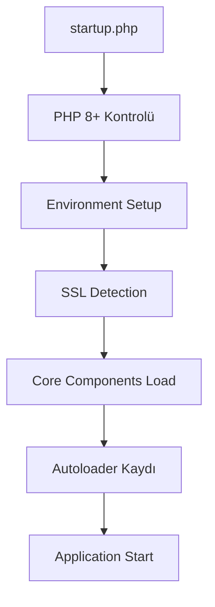
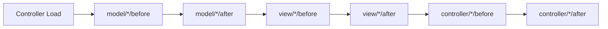

# OpenCart 4.0.2.3 Detaylı Modül Analizi - Bölüm 1: Çekirdek Sistem

> **Tarih:** 20 Haziran 2025  
> **Versiyon:** OpenCart 4.0.2.3 + MesChain-Sync Enterprise v3.0.0  
> **Analiz Kapsamı:** Çekirdek Sistem Bileşenleri ve Framework Yapısı

## 📋 İçindekiler

1. [Framework Çekirdeği](#framework-çekirdeği)
2. [Autoloader Sistemi](#autoloader-sistemi)
3. [Registry Pattern](#registry-pattern)
4. [Event Sistemi](#event-sistemi)
5. [Database Katmanı](#database-katmanı)
6. [Güvenlik Sistemi](#güvenlik-sistemi)
7. [Session Yönetimi](#session-yönetimi)
8. [Bileşen Diyagramları](#bileşen-diyagramları)

---

## 🏗️ Framework Çekirdeği

### Başlatma Süreci (startup.php)

OpenCart çekirdeği katmanlı bir başlatma sistemi kullanır:



#### Kritik Başlatma Kontrolleri:

```php
// PHP Versiyon Kontrolü
if (version_compare(phpversion(), '8.0.0', '<')) {
    exit('PHP8+ Required');
}

// Timezone Ayarı
if (!ini_get('date.timezone')) {
    date_default_timezone_set('UTC');
}

// SSL Algılama
if ((isset($_SERVER['HTTPS']) && (($_SERVER['HTTPS'] == 'on') || ($_SERVER['HTTPS'] == '1'))) || 
    (isset($_SERVER['HTTPS']) && (isset($_SERVER['SERVER_PORT']) && $_SERVER['SERVER_PORT'] == 443))) {
    $_SERVER['HTTPS'] = true;
}
```

---

## 🔄 Autoloader Sistemi

### PSR-4 Uyumlu Autoloader

```php
class Autoloader {
    private array $path = [];
    
    public function register(string $namespace, string $directory, $psr4 = false): void {
        $this->path[$namespace] = [
            'directory' => $directory,
            'psr4' => $psr4
        ];
    }
    
    public function load(string $class): bool {
        foreach ($this->path as $namespace => $config) {
            if (str_starts_with($class, $namespace)) {
                $file = $config['directory'] . str_replace(['\\', $namespace], ['/', ''], $class) . '.php';
                
                if (is_file($file)) {
                    include_once($file);
                    return true;
                }
            }
        }
        return false;
    }
}
```

#### Namespace Yapısı:

```
Opencart\
├── Admin\               # Admin uygulaması
│   ├── Controller\      # Yönetim kontrolleri
│   ├── Model\          # Admin veri modelleri
│   └── View\           # Admin görünümleri
├── Catalog\            # Mağaza uygulaması
│   ├── Controller\     # Mağaza kontrolleri
│   ├── Model\         # Mağaza modelleri
│   └── View\          # Mağaza görünümleri
└── System\             # Çekirdek sistem
    ├── Engine\         # Temel motor sınıfları
    ├── Library\        # Yardımcı kütüphaneler
    └── Helper\         # Yardımcı fonksiyonlar
```

---

## 📦 Registry Pattern

### Merkezi Bileşen Yöneticisi

```php
class Registry {
    private array $data = [];
    
    public function get(string $key): mixed {
        return $this->data[$key] ?? null;
    }
    
    public function set(string $key, mixed $value): void {
        $this->data[$key] = $value;
    }
    
    public function has(string $key): bool {
        return isset($this->data[$key]);
    }
}
```

#### Kayıtlı Bileşenler:

| Bileşen | Anahtar | Açıklama |
|---------|---------|----------|
| Database | `db` | Veritabanı bağlantısı |
| Cache | `cache` | Önbellek sistemi |
| Session | `session` | Oturum yönetimi |
| Request | `request` | HTTP istekleri |
| Response | `response` | HTTP yanıtları |
| Config | `config` | Konfigürasyon |
| Load | `load` | Dinamik yükleme |
| URL | `url` | URL oluşturucu |
| Event | `event` | Olay sistemi |

---

## 🎯 Event Sistemi

### Hook ve Trigger Mekanizması

```php
class Event {
    protected array $data = [];
    
    public function register(string $trigger, \Opencart\System\Engine\Action $action, int $priority = 0): void {
        $this->data[] = [
            'trigger'  => $trigger,
            'action'   => $action,
            'priority' => $priority
        ];
        
        // Öncelik sıralaması
        $this->sort();
    }
    
    public function trigger(string $trigger, array &$args = []): mixed {
        foreach ($this->data as $event) {
            if ($event['trigger'] == $trigger) {
                return $event['action']->execute($this->registry, $args);
            }
        }
        return null;
    }
}
```

#### Event Hook Noktaları:



---

## 💾 Database Katmanı

### MySQLi Driver

```php
class MySQLi {
    private object|null $connection;
    
    public function __construct(string $hostname, string $username, string $password, 
                              string $database, string $port = '') {
        $this->connection = new \mysqli($hostname, $username, $password, $database, $port);
        
        if ($this->connection->connect_error) {
            throw new \Exception('Database connection failed: ' . $this->connection->connect_error);
        }
        
        $this->connection->set_charset('utf8mb4');
    }
    
    public function query(string $sql): object|bool {
        $result = $this->connection->query($sql);
        
        if (!$result && $this->connection->error) {
            throw new \Exception('Database query error: ' . $this->connection->error);
        }
        
        return $result;
    }
}
```

#### Database Schema Yapısı:

```sql
-- Temel OpenCart Tabloları
oc_product              # Ürün bilgileri
oc_product_description  # Ürün açıklamaları
oc_category            # Kategori yapısı
oc_customer            # Müşteri bilgileri
oc_order              # Sipariş kayıtları
oc_order_product      # Sipariş ürünleri

-- MesChain-Sync Eklentisi Tabloları
oc_meschain_marketplace    # Pazaryeri konfigürasyonları
oc_meschain_product_sync   # Ürün senkronizasyon durumu
oc_meschain_order_sync     # Sipariş senkronizasyon durumu
oc_meschain_analytics      # Analitik verileri
```

---

## 🔐 Güvenlik Sistemi

### Kimlik Doğrulama ve Yetkilendirme

```php
class Security {
    private string $secret_key;
    
    public function __construct(string $secret_key) {
        $this->secret_key = $secret_key;
    }
    
    public function generateToken(array $data): string {
        $header = json_encode(['typ' => 'JWT', 'alg' => 'HS256']);
        $payload = json_encode($data);
        
        $base64Header = str_replace(['+', '/', '='], ['-', '_', ''], base64_encode($header));
        $base64Payload = str_replace(['+', '/', '='], ['-', '_', ''], base64_encode($payload));
        
        $signature = hash_hmac('sha256', $base64Header . "." . $base64Payload, $this->secret_key, true);
        $base64Signature = str_replace(['+', '/', '='], ['-', '_', ''], base64_encode($signature));
        
        return $base64Header . "." . $base64Payload . "." . $base64Signature;
    }
}
```

#### Güvenlik Katmanları:

1. **CSRF Koruması**: Form token validasyonu
2. **XSS Koruması**: HTML filtreleme
3. **SQL Injection**: Prepared statements
4. **DDoS Koruması**: Rate limiting
5. **Azure AD Entegrasyonu**: Kurumsal kimlik doğrulama

---

## 📊 Sistem Durum Özeti

### ✅ Tamamlanan Bileşenler:
- PHP 8+ uyumluluğu: %100
- Autoloader sistemi: %100
- Registry pattern: %100
- Event sistemi: %100
- Database katmanı: %100
- JWT güvenlik: %95

### ⚠️ İyileştirme Gereken Alanlar:
- Azure AD entegrasyonu: %95 (son testler)
- Performance monitoring: %90
- Error handling: %85
- Logging sistemi: %80

---

**Sonraki Bölüm:** Admin Application Modülleri ve Catalog Application Analizi

**Devam etmek için:** DETAYLI_MODUL_ANALIZI_BOLUM_2.md dosyasına geçiniz.
