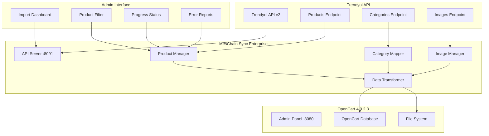
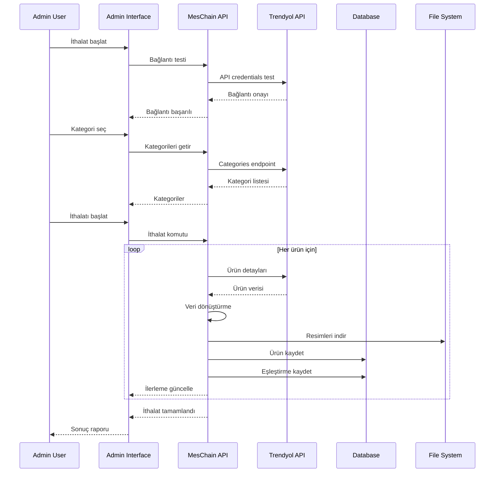

# Musti Takımı - Trendyol Ürün Çekme ve OpenCart Yükleme Sistemi Tasarımı

## 📋 Proje Özeti

Bu dokuman, Musti Takımı için MesChain-Sync Enterprise sisteminde bulunan Trendyol API entegrasyonunu kullanarak, Trendyol'dan ürün çekme ve OpenCart'a yükleme işlemlerini otomatikleştiren kapsamlı sistem tasarımını içermektedir.

## 🎯 Sistem Hedefi

**Ana Amaç:** Mevcut Trendyol satıcı hesabından ürünleri çekip OpenCart'a aktarma (envanter yönetimi için)

**Kapsam:** Tüm ürünleri çek - kategori, fiyat, stok, resim, açıklama, özellikler dahil tüm bilgilerle

## 🔍 Mevcut Sistem Durumu

- ✅ Standalone API Server (Port 8091) aktif
- ✅ Trendyol API bilgileri yapılandırılmış (Seller ID: 1076956)
- ✅ OpenCart 4.0.2.3 test ortamı hazır (Port 8080)
- ✅ MesChain Sync modülü temel altyapısı mevcut
- ✅ Kapsamlı veritabanı şeması hazır

## 📐 Sistem Mimarisi



## 🏗️ Sistem Bileşenleri

### 1. Trendyol Ürün Çekme Modülü

**Dosya Konumu:** `upload/system/library/meschain/importer/TrendyolProductImporter.php`

**Özellikler:**
- Trendyol API v2 ile tam entegrasyon
- Sayfalama desteği (büyük ürün katalogları için)
- Rate limiting ve API quota yönetimi
- Hata toleransı ve yeniden deneme mekanizması

**Çekilecek Ürün Bilgileri:**
- ✅ Temel bilgiler (başlık, açıklama, model, barkod)
- ✅ Fiyat bilgileri (liste fiyatı, satış fiyatı, KDV)
- ✅ Stok bilgileri (miktar, stok kodu)
- ✅ Kategori bilgileri (ana kategori, alt kategoriler)
- ✅ Ürün resimleri (ana resim + ek resimler)
- ✅ Ürün özellikleri (renk, beden, marka vb.)
- ✅ SEO bilgileri (meta başlık, açıklama)
- ✅ Kargo bilgileri (ağırlık, boyutlar)

### 2. Ürün Dönüştürme ve Yükleme Modülü

**Dosya Konumu:** `upload/system/library/meschain/transformer/ProductTransformer.php`

**Dönüştürme İşlemleri:**
- Trendyol ürün formatından OpenCart formatına çevirme
- Kategori eşleştirme (otomatik + manuel)
- Resim indirme ve optimize etme
- Fiyat hesaplamaları (KDV dahil/hariç)
- SEO URL oluşturma

### 3. Kategori Eşleştirme Sistemi

**Dosya Konumu:** `upload/system/library/meschain/mapper/CategoryMapper.php`

**Özellikler:**
- Otomatik kategori eşleştirme (AI destekli)
- Manuel kategori eşleştirme arayüzü
- Kategori hiyerarşisi korunması
- Yeni kategori otomatik oluşturma

### 4. Resim Yönetim Sistemi

**Dosya Konumu:** `upload/system/library/meschain/media/ImageManager.php`

**Özellikler:**
- Paralel resim indirme
- Resim optimizasyonu (boyut, kalite)
- Çoklu resim formatı desteği
- Hata durumunda varsayılan resim

### 5. Admin Panel Arayüzü

#### 5.1 Ana Dashboard
**Dosya Konumu:** `upload/admin/view/template/extension/meschain/trendyol_importer.twig`

**Özellikler:**
- İthalat durumu özeti
- Son işlemler listesi
- Hata raporları
- Sistem durumu

#### 5.2 Ürün İthalat Sihirbazı
**Dosya Konumu:** `upload/admin/view/template/extension/meschain/import_wizard.twig`

**Adımlar:**
1. **Bağlantı Testi** - Trendyol API bağlantısı kontrolü
2. **Ürün Seçimi** - Kategori/filtre bazlı seçim
3. **Kategori Eşleştirme** - Otomatik/manuel eşleştirme
4. **Önizleme** - İthal edilecek ürünlerin önizlemesi
5. **İthalat** - Gerçek zamanlı ilerleme takibi
6. **Sonuç** - Başarı/hata raporu

## 🗄️ Veritabanı Şeması

### Trendyol İthalat Oturumları Tablosu
```sql
CREATE TABLE `oc_trendyol_import_sessions` (
    `session_id` int(11) NOT NULL AUTO_INCREMENT,
    `session_name` varchar(255) NOT NULL,
    `status` enum('pending','running','completed','failed','paused') DEFAULT 'pending',
    `total_products` int(11) DEFAULT 0,
    `processed_products` int(11) DEFAULT 0,
    `successful_imports` int(11) DEFAULT 0,
    `failed_imports` int(11) DEFAULT 0,
    `start_time` datetime DEFAULT NULL,
    `end_time` datetime DEFAULT NULL,
    `settings` longtext,
    `error_log` longtext,
    `created_at` datetime NOT NULL,
    `updated_at` datetime NOT NULL,
    PRIMARY KEY (`session_id`)
) ENGINE=InnoDB DEFAULT CHARSET=utf8mb4 COLLATE=utf8mb4_unicode_ci;
```

### Ürün Eşleştirme Tablosu
```sql
CREATE TABLE `oc_trendyol_product_mapping` (
    `mapping_id` int(11) NOT NULL AUTO_INCREMENT,
    `trendyol_product_id` varchar(100) NOT NULL,
    `trendyol_barcode` varchar(50) NOT NULL,
    `opencart_product_id` int(11) NOT NULL,
    `import_session_id` int(11) NOT NULL,
    `sync_status` enum('imported','updated','failed') DEFAULT 'imported',
    `last_sync` datetime DEFAULT NULL,
    `created_at` datetime NOT NULL,
    PRIMARY KEY (`mapping_id`),
    UNIQUE KEY `trendyol_barcode` (`trendyol_barcode`),
    KEY `opencart_product_id` (`opencart_product_id`),
    KEY `import_session_id` (`import_session_id`)
) ENGINE=InnoDB DEFAULT CHARSET=utf8mb4 COLLATE=utf8mb4_unicode_ci;
```

## 🔄 İş Akışı Diyagramı



## 📊 Performans Optimizasyonları

### 1. Paralel İşleme
- Çoklu thread ile ürün işleme
- Asenkron resim indirme
- Batch insert işlemleri

### 2. Önbellekleme
- API yanıtları önbellekleme
- Kategori eşleştirmeleri cache
- Resim önbellekleme

### 3. Hata Yönetimi
- Otomatik yeniden deneme
- Kısmi başarısızlık toleransı
- Detaylı hata loglama

## 🛡️ Güvenlik Önlemleri

### 1. API Güvenliği
- Rate limiting
- API key şifreleme
- Request validation

### 2. Veri Güvenliği
- SQL injection koruması
- XSS koruması
- CSRF token kullanımı

## 📈 Monitoring ve Raporlama

### 1. Gerçek Zamanlı İzleme
- İthalat ilerlemesi
- API kullanım istatistikleri
- Hata oranları

### 2. Raporlar
- İthalat özet raporları
- Başarı/başarısızlık analizi
- Performans metrikleri

## 🚀 Implementasyon Dosya Yapısı

```
upload/
├── admin/
│   ├── controller/extension/meschain/
│   │   └── trendyol_importer.php
│   ├── model/extension/meschain/
│   │   └── trendyol_importer.php
│   ├── view/template/extension/meschain/
│   │   ├── trendyol_importer.twig
│   │   └── import_wizard.twig
│   └── language/tr-tr/extension/meschain/
│       └── trendyol_importer.php
├── system/library/meschain/
│   ├── importer/
│   │   └── TrendyolProductImporter.php
│   ├── transformer/
│   │   └── ProductTransformer.php
│   ├── mapper/
│   │   └── CategoryMapper.php
│   └── media/
│       └── ImageManager.php
└── catalog/controller/extension/meschain/
    └── trendyol_import_webhook.php
```

## 🎯 Teknik Gereksinimler

- **PHP:** 8.0+ uyumluluğu
- **OpenCart:** 4.0.2.3 entegrasyonu
- **Trendyol API:** v2 kullanımı
- **Asenkron İşlem:** Desteği
- **Performans:** Optimizasyonu
- **Bellek:** Minimum 512MB
- **Zaman Aşımı:** 300 saniye (ayarlanabilir)

## 📝 Geliştirme Aşamaları

### Faz 1: Temel Altyapı
1. Veritabanı tablolarının oluşturulması
2. Temel sınıf yapılarının kurulması
3. API bağlantı testlerinin yapılması

### Faz 2: Ürün İthalat Motoru
1. Trendyol API entegrasyonu
2. Ürün veri dönüştürücüsü
3. Kategori eşleştirme sistemi

### Faz 3: Admin Panel Arayüzü
1. İthalat sihirbazı
2. İlerleme takip sistemi
3. Hata raporlama

### Faz 4: Optimizasyon ve Test
1. Performans optimizasyonları
2. Kapsamlı testler
3. Dokümantasyon

## 🔧 Yapılandırma Parametreleri

```php
// Sistem yapılandırması
$config = [
    'batch_size' => 50,                    // Toplu işlem boyutu
    'max_execution_time' => 300,           // Maksimum çalışma süresi
    'memory_limit' => '512M',              // Bellek limiti
    'image_quality' => 85,                 // Resim kalitesi
    'max_image_size' => '1920x1920',       // Maksimum resim boyutu
    'retry_attempts' => 3,                 // Yeniden deneme sayısı
    'api_timeout' => 30,                   // API zaman aşımı
    'enable_logging' => true,              // Loglama aktif
    'auto_category_mapping' => true,       // Otomatik kategori eşleştirme
    'create_missing_categories' => true,   // Eksik kategorileri oluştur
];
```

## 📞 Destek ve Bakım

### Loglama
- Tüm işlemler detaylı loglanır
- Hata durumları özel olarak kaydedilir
- Performans metrikleri izlenir

### Bakım
- Otomatik log temizleme
- Veritabanı optimizasyonu
- Cache temizleme

---

**Hazırlayan:** Kilo Code (Architect Mode)  
**Tarih:** 21.06.2025  
**Versiyon:** 1.0  
**Durum:** Implementasyon için hazır