```mermaid
graph TB
    subgraph "Trendyol API"
        TA[Trendyol API v2]
        TP[Products Endpoint]
        TC[Categories Endpoint]
        TB[Brands Endpoint]
        TO[Orders Endpoint]
        TI[Images Endpoint]
        TS[Stock/Price Endpoint]
    end
    
    subgraph "OpenCart 4.0.2.3 Core System"
        OC[OpenCart Core]
        ODB[(OpenCart Database)]
        OFS[OpenCart File System]
        OE[OpenCart Event System]
        OH[OpenCart Hook System]
        OL[OpenCart Loader]
        OR[OpenCart Registry]
        OCR[OpenCart Cron System]
    end
    
    subgraph "MesChain Trendyol Extension"
        subgraph "Admin Controllers (OpenCart Admin Panel)"
            AC[admin/controller/extension/module/meschain_sync.php]
            ACM[admin/controller/extension/meschain/category_mapping.php]
            ABM[admin/controller/extension/meschain/brand_mapping.php]
            AAM[admin/controller/extension/meschain/attribute_mapping.php]
            APS[admin/controller/extension/meschain/product_sync.php]
            AOS[admin/controller/extension/meschain/order_sync.php]
            AR[admin/controller/extension/meschain/reports.php]
        end
        
        subgraph "Admin Models (OpenCart Database Layer)"
            AM[admin/model/extension/module/meschain_sync.php]
            AMM[admin/model/extension/meschain/category_mapping.php]
            ABM2[admin/model/extension/meschain/brand_mapping.php]
            AAM2[admin/model/extension/meschain/attribute_mapping.php]
            APS2[admin/model/extension/meschain/sync_sessions.php]
            AQM[admin/model/extension/meschain/sync_queue.php]
        end
        
        subgraph "Admin Views (OpenCart Twig Templates)"
            AV[admin/view/template/extension/module/meschain_sync.twig]
            AVM[admin/view/template/extension/meschain/category_mapping.twig]
            AVB[admin/view/template/extension/meschain/brand_mapping.twig]
            AVA[admin/view/template/extension/meschain/attribute_mapping.twig]
            AVS[admin/view/template/extension/meschain/sync_wizard.twig]
            AVR[admin/view/template/extension/meschain/reports.twig]
        end
        
        subgraph "System Libraries (OpenCart Library System)"
            SL[system/library/meschain/TrendyolClient.php]
            SLE[system/library/meschain/sync/ProductSyncEngine.php]
            SLO[system/library/meschain/sync/OrderSyncEngine.php]
            SLM[system/library/meschain/mapping/CategoryMapper.php]
            SLQ[system/library/meschain/queue/QueueManager.php]
            SLA[system/library/meschain/automation/CronHandler.php]
            SLH[system/library/meschain/automation/EventHandler.php]
        end
        
        subgraph "Catalog Controllers (Frontend/Webhook)"
            CC[catalog/controller/extension/meschain/webhook.php]
            CCA[catalog/controller/extension/meschain/api.php]
        end
        
        subgraph "Extension Database Tables (OpenCart DB Prefix)"
            EDT[(oc_trendyol_* tables)]
        end
    end
    
    subgraph "OpenCart Admin Panel Integration"
        subgraph "Extensions Menu"
            EM[Extensions > Modules > MesChain Sync]
            EMC[Extensions > MesChain > Category Mapping]
            EMB[Extensions > MesChain > Brand Mapping]
            EMA[Extensions > MesChain > Attribute Mapping]
            EMS[Extensions > MesChain > Sync Management]
            EMR[Extensions > MesChain > Reports]
        end
        
        subgraph "Dashboard Widgets"
            DW[Trendyol Sync Status Widget]
            DWO[Order Sync Widget]
            DWP[Product Sync Widget]
            DWS[Stock Alert Widget]
        end
    end
    
    TA --> SL
    TP --> SLE
    TC --> SLM
    TB --> SLM
    TO --> SLO
    TI --> SLE
    TS --> SLE
    
    OC --> AC
    ODB --> AM
    OFS --> SL
    OE --> SLH
    OH --> SLH
    OL --> SL
    OR --> AC
    OCR --> SLA
    
    AC --> AM
    AM --> EDT
    AM --> SL
    
    SL --> SLE
    SL --> SLO
    SL --> SLM
    
    SLE --> SLQ
    SLO --> SLQ
    SLQ --> EDT
    
    AC --> AV
    ACM --> AVM
    ABM --> AVB
    AAM --> AVA
    
    EM --> AC
    EMC --> ACM
    EMB --> ABM
    EMA --> AAM
    EMS --> APS
    EMR --> AR
    
    SLA --> OCR
    SLH --> OE
    CC --> SL
```

# Musti Takımı - Trendyol OpenCart Extension Sistemi Tasarımı v2.0

## 📋 Proje Özeti

Bu dokuman, Musti Takımı için **OpenCart 4.0.2.3 Extension** olarak tasarlanan Trendyol API entegrasyonunun **ikinci versiyonunu** içermektedir. Sistem tamamen OpenCart eklentisi (extension) olarak geliştirilecek ve OpenCart admin paneli içinden yönetilecektir.

## 🎯 Sistem Hedefi

**Ana Amaç:** OpenCart 4.0.2.3 ile tam uyumlu, OpenCart admin paneli içinden yönetilen Trendyol entegrasyon eklentisi

**Kapsam:** 
- ✅ OpenCart Extension yapısına uygun geliştirme
- ✅ OpenCart admin paneli entegrasyonu
- ✅ OpenCart event system kullanımı
- ✅ OpenCart hook system entegrasyonu
- 🆕 Kategori ve Marka Eşleştirme arayüzü (OpenCart admin içinde)
- 🆕 Özellik (Attribute) Eşleştirme arayüzü (OpenCart admin içinde)
- 🆕 Gelişmiş Ürün Senkronizasyonu (OpenCart event-driven)
- 🆕 Sipariş Çekme otomasyonu (OpenCart cron entegrasyonu)
- 🆕 Sipariş Durumu Senkronizasyonu (OpenCart order status uyumlu)
- 🆕 Stok ve Fiyat Senkronizasyonu (OpenCart event system)
- 🆕 OpenCart Admin Panel Kullanıcı Arayüzü ve Raporlama

## 🔍 V1 Analizi ve OpenCart Extension Perspektifi

### ✅ Mevcut Özellikler (V1) - OpenCart Extension Olarak
- OpenCart extension yapısında temel API bağlantısı
- OpenCart admin paneli entegrasyonu
- OpenCart veritabanı uyumlu ürün yükleme
- OpenCart sipariş sistemi uyumlu sipariş çekme
- OpenCart webhook desteği
- OpenCart logging sistemi uyumlu hata yönetimi
- OpenCart admin panel içinde basit yönetim arayüzü

### ❌ Eksik Özellikler (V2'de OpenCart Extension Olarak Eklenecek)

#### 1. OpenCart Admin Panel Kategori ve Marka Eşleştirme Arayüzü
- **Mevcut Durum:** Sabit kategori ID (411) kullanılıyor
- **Gereksinim:** OpenCart admin paneli içinde dinamik kategori eşleştirme
- **Çözüm:** OpenCart admin menu entegrasyonu ile görsel kategori eşleştirme modülü

#### 2. OpenCart Attribute System Uyumlu Özellik Eşleştirme
- **Mevcut Durum:** OpenCart attribute system ile entegrasyon yok
- **Gereksinim:** OpenCart özelliklerini Trendyol özelliklerine eşleştirme
- **Çözüm:** OpenCart attribute system uyumlu mapping sistemi

#### 3. OpenCart Event System Tabanlı Gelişmiş Senkronizasyon
- **Mevcut Durum:** Manuel senkronizasyon
- **Gereksinim:** OpenCart event system kullanarak otomatik senkronizasyon
- **Çözüm:** OpenCart event hooks ile real-time senkronizasyon

#### 4. OpenCart Cron System Entegrasyonu
- **Mevcut Durum:** Standalone cron jobs
- **Gereksinim:** OpenCart cron.php entegrasyonu
- **Çözüm:** OpenCart cron system uyumlu otomatik işlemler

#### 5. OpenCart Order Status System Uyumlu Durum Senkronizasyonu
- **Mevcut Durum:** Temel sipariş çekme
- **Gereksinim:** OpenCart order status system ile uyumlu çift yönlü senkronizasyon
- **Çözüm:** OpenCart order status mapping ve otomatik güncelleme

#### 6. OpenCart Product System Uyumlu Stok/Fiyat Senkronizasyonu
- **Mevcut Durum:** Manuel güncelleme
- **Gereksinim:** OpenCart product events ile anlık senkronizasyon
- **Çözüm:** OpenCart event system tabanlı real-time senkronizasyon

#### 7. OpenCart Admin Panel Entegrasyonu ve Raporlama
- **Mevcut Durum:** Basit admin paneli
- **Gereksinim:** Tam OpenCart admin panel entegrasyonu
- **Çözüm:** OpenCart admin menu, dashboard widgets ve raporlama modülleri

## 📐 V2 OpenCart Extension Mimarisi



## 🏗️ V2 OpenCart Extension Bileşenleri

### 1. OpenCart Extension Yapısı

#### 1.1 Extension Dosya Yapısı (OpenCart 4.0.2.3 Uyumlu)
```
upload/
├── admin/
│   ├── controller/extension/module/
│   │   └── meschain_sync.php                    # Ana extension controller
│   ├── controller/extension/meschain/
│   │   ├── category_mapping.php                 # Kategori eşleştirme
│   │   ├── brand_mapping.php                    # Marka eşleştirme
│   │   ├── attribute_mapping.php                # Özellik eşleştirme
│   │   ├── product_sync.php                     # Ürün senkronizasyon
│   │   ├── order_sync.php                       # Sipariş senkronizasyon
│   │   └── reports.php                          # Raporlama
│   ├── model/extension/module/
│   │   └── meschain_sync.php                    # Ana extension model
│   ├── model/extension/meschain/
│   │   ├── category_mapping.php                 # Kategori model
│   │   ├── brand_mapping.php                    # Marka model
│   │   ├── attribute_mapping.php                # Özellik model
│   │   ├── sync_sessions.php                    # Senkronizasyon oturumları
│   │   └── sync_queue.php                       # Kuyruk yönetimi
│   ├── view/template/extension/module/
│   │   └── meschain_sync.twig                   # Ana extension view
│   ├── view/template/extension/meschain/
│   │   ├── category_mapping.twig                # Kategori eşleştirme UI
│   │   ├── brand_mapping.twig                   # Marka eşleştirme UI
│   │   ├── attribute_mapping.twig               # Özellik eşleştirme UI
│   │   ├── sync_wizard.twig                     # Senkronizasyon sihirbazı
│   │   └── reports.twig                         # Raporlama UI
│   ├── language/en-gb/extension/module/
│   │   └── meschain_sync.php                    # İngilizce dil dosyası
│   └── language/tr-tr/extension/module/
│       └── meschain_sync.php                    # Türkçe dil dosyası
├── catalog/
│   └── controller/extension/meschain/
│       ├── webhook.php                          # Trendyol webhook handler
│       └── api.php                              # Public API endpoints
├── system/library/meschain/
│   ├── TrendyolClient.php                       # Trendyol API client
│   ├── sync/
│   │   ├── ProductSyncEngine.php                # Ürün senkronizasyon motoru
│   │   ├── OrderSyncEngine.php                  # Sipariş senkronizasyon motoru
│   │   └── StockSyncEngine.php                  # Stok senkronizasyon motoru
│   ├── mapping/
│   │   ├── CategoryMapper.php                   # Kategori eşleştirici
│   │   ├── BrandMapper.php                      # Marka eşleştirici
│   │   └── AttributeMapper.php                  # Özellik eşleştirici
│   ├── queue/
│   │   ├── QueueManager.php                     # Kuyruk yöneticisi
│   │   └── JobProcessor.php                     # İş işleyicisi
│   └── automation/
│       ├── CronHandler.php                      # Cron işleyicisi
│       └── EventHandler.php                     # Event işleyicisi
└── install.xml                                  # OCMOD kurulum dosyası
```

#### 1.2 OpenCart Extension Install/Uninstall Methods
```php
// admin/controller/extension/module/meschain_sync.php
class ControllerExtensionModuleMeschainSync extends Controller {
    
    public function install() {
        // Extension kurulumu
        $this->load->model('extension/meschain/install');
        $this->model_extension_meschain_install->createTables();
        $this->model_extension_meschain_install->addEvents();
        $this->model_extension_meschain_install->addPermissions();
        $this->model_extension_meschain_install->createMenuItems();
    }
    
    public function uninstall() {
        // Extension kaldırma
        $this->load->model('extension/meschain/install');
        $this->model_extension_meschain_install->removeEvents();
        $this->model_extension_meschain_install->removePermissions();
        $this->model_extension_meschain_install->removeMenuItems();
        // Tabloları silme (opsiyonel)
    }
}
```

### 2. Kategori ve Marka Eşleştirme Sistemi

#### 2.1 Kategori Eşleştirme Modülü (OpenCart Admin Panel İçinde)
**Dosya Konumu:** `upload/admin/controller/extension/meschain/category_mapping.php`

**OpenCart Admin Panel Entegrasyonu:**
- OpenCart admin menu sistemi kullanarak erişim
- OpenCart permission system ile yetkilendirme
- OpenCart category system ile entegrasyon
- OpenCart language system ile çoklu dil desteği

**Özellikler:**
- Trendyol kategori ağacını çekme ve OpenCart admin panelinde görüntüleme
- OpenCart kategorileri ile eşleştirme arayüzü
- OpenCart admin panel içinde otomatik kategori önerisi
- OpenCart toplu işlem sistemi ile toplu kategori eşleştirme
- OpenCart kategori hiyerarşisi korunması

**OpenCart Uyumlu Veritabanı Tablosu:**
```sql
CREATE TABLE `{DB_PREFIX}trendyol_category_mapping` (
    `mapping_id` int(11) NOT NULL AUTO_INCREMENT,
    `opencart_category_id` int(11) NOT NULL,
    `trendyol_category_id` int(11) NOT NULL,
    `trendyol_category_name` varchar(255) NOT NULL,
    `opencart_category_name` varchar(255) NOT NULL,
    `mapping_type` enum('manual','auto','ai_suggested') DEFAULT 'manual',
    `confidence_score` decimal(3,2) DEFAULT NULL,
    `is_active` tinyint(1) DEFAULT 1,
    `created_by` int(11) DEFAULT NULL,
    `created_at` datetime NOT NULL,
    `updated_at` datetime NOT NULL,
    PRIMARY KEY (`mapping_id`),
    UNIQUE KEY `opencart_category_id` (`opencart_category_id`),
    KEY `trendyol_category_id` (`trendyol_category_id`),
    KEY `mapping_type` (`mapping_type`),
    FOREIGN KEY (`opencart_category_id`) REFERENCES `{DB_PREFIX}category` (`category_id`) ON DELETE CASCADE
) ENGINE=InnoDB DEFAULT CHARSET=utf8mb4;
```

#### 2.2 Marka Eşleştirme Modülü (OpenCart Manufacturer System Uyumlu)
**Dosya Konumu:** `upload/admin/controller/extension/meschain/brand_mapping.php`

**OpenCart Manufacturer System Entegrasyonu:**
- OpenCart manufacturer system ile tam entegrasyon
- OpenCart admin panel içinde marka yönetimi
- OpenCart manufacturer model kullanımı

**Özellikler:**
- Trendyol marka listesini OpenCart admin panelinde görüntüleme
- OpenCart üreticileri (manufacturers) ile eşleştirme
- OpenCart manufacturer system kullanarak yeni marka otomatik oluşturma
- OpenCart admin panel içinde marka onay süreci

**OpenCart Uyumlu Veritabanı Tablosu:**
```sql
CREATE TABLE `{DB_PREFIX}trendyol_brand_mapping` (
    `mapping_id` int(11) NOT NULL AUTO_INCREMENT,
    `opencart_manufacturer_id` int(11) NOT NULL,
    `trendyol_brand_id` int(11) NOT NULL,
    `trendyol_brand_name` varchar(255) NOT NULL,
    `opencart_manufacturer_name` varchar(255) NOT NULL,
    `auto_created` tinyint(1) DEFAULT 0,
    `is_active` tinyint(1) DEFAULT 1,
    `created_at` datetime NOT NULL,
    `updated_at` datetime NOT NULL,
    PRIMARY KEY (`mapping_id`),
    UNIQUE KEY `opencart_manufacturer_id` (`opencart_manufacturer_id`),
    KEY `trendyol_brand_id` (`trendyol_brand_id`),
    FOREIGN KEY (`opencart_manufacturer_id`) REFERENCES `{DB_PREFIX}manufacturer` (`manufacturer_id`) ON DELETE CASCADE
) ENGINE=InnoDB DEFAULT CHARSET=utf8mb4;
```

### 3. Özellik (Attribute) Eşleştirme Sistemi

#### 3.1 Attribute Mapping Modülü (OpenCart Attribute System Uyumlu)
**Dosya Konumu:** `upload/admin/controller/extension/meschain/attribute_mapping.php`

**OpenCart Attribute System Entegrasyonu:**
- OpenCart attribute system ile tam uyumluluk
- OpenCart attribute groups kullanımı
- OpenCart product attributes ile entegrasyon

**Özellikler:**
- Trendyol kategori özelliklerini OpenCart admin panelinde görüntüleme
- OpenCart özellikler (attributes) ile eşleştirme
- OpenCart attribute system uyumlu özellik değer eşleştirme
- OpenCart admin panel içinde zorunlu özellik kontrolü
- OpenCart validation system ile özellik validasyon kuralları

**OpenCart Uyumlu Veritabanı Tablosu:**
```sql
CREATE TABLE `{DB_PREFIX}trendyol_attribute_mapping` (
    `mapping_id` int(11) NOT NULL AUTO_INCREMENT,
    `trendyol_category_id` int(11) NOT NULL,
    `trendyol_attribute_id` int(11) NOT NULL,
    `trendyol_attribute_name` varchar(255) NOT NULL,
    `opencart_attribute_id` int(11) DEFAULT NULL,
    `opencart_attribute_name` varchar(255) DEFAULT NULL,
    `is_required` tinyint(1) DEFAULT 0,
    `is_variant` tinyint(1) DEFAULT 0,
    `attribute_type` enum('text','select','multiselect','numeric','boolean') DEFAULT 'text',
    `default_value` text,
    `validation_rules` json,
    `is_active` tinyint(1) DEFAULT 1,
    `created_at` datetime NOT NULL,
    `updated_at` datetime NOT NULL,
    PRIMARY KEY (`mapping_id`),
    KEY `trendyol_category_id` (`trendyol_category_id`),
    KEY `trendyol_attribute_id` (`trendyol_attribute_id`),
    KEY `opencart_attribute_id` (`opencart_attribute_id`),
    FOREIGN KEY (`opencart_attribute_id`) REFERENCES `{DB_PREFIX}attribute` (`attribute_id`) ON DELETE SET NULL
) ENGINE=InnoDB DEFAULT CHARSET=utf8mb4;

CREATE TABLE `{DB_PREFIX}trendyol_attribute_value_mapping` (
    `mapping_id` int(11) NOT NULL AUTO_INCREMENT,
    `attribute_mapping_id` int(11) NOT NULL,
    `trendyol_value_id` int(11) DEFAULT NULL,
    `trendyol_value_name` varchar(255) DEFAULT NULL,
    `opencart_value` text,
    `is_active` tinyint(1) DEFAULT 1,
    `created_at` datetime NOT NULL,
    PRIMARY KEY (`mapping_id`),
    KEY `attribute_mapping_id` (`attribute_mapping_id`),
    FOREIGN KEY (`attribute_mapping_id`) REFERENCES `{DB_PREFIX}trendyol_attribute_mapping` (`mapping_id`) ON DELETE CASCADE
) ENGINE=InnoDB DEFAULT CHARSET=utf8mb4;
```

### 4. Gelişmiş Ürün Senkronizasyon Sistemi

#### 4.1 Product Sync Engine V2 (OpenCart Extension İçinde)
**Dosya Konumu:** `upload/system/library/meschain/sync/ProductSyncEngineV2.php`

**OpenCart Product System Entegrasyonu:**
- OpenCart product model kullanımı
- OpenCart image system entegrasyonu
- OpenCart option system uyumluluğu
- OpenCart SEO URL system entegrasyonu

**Özellikler:**
- OpenCart admin panel içinde filtreleme seçenekleri
- OpenCart admin panel içinde önizleme modu
- OpenCart product system uyumlu kısmi senkronizasyon
- OpenCart batch processing ile toplu işlem optimizasyonu
- OpenCart error handling ile hata toleransı
- OpenCart admin panel içinde ilerleme takibi

**Senkronizasyon Türleri:**
- **Tam Senkronizasyon:** Tüm OpenCart ürün bilgileri
- **Hızlı Senkronizasyon:** Sadece stok ve fiyat (OpenCart product table)
- **Seçici Senkronizasyon:** OpenCart kategoriler/markalar bazında
- **Delta Senkronizasyon:** OpenCart product update_date bazında

#### 4.2 Product Sync Wizard (OpenCart Admin Panel İçinde)
**Dosya Konumu:** `upload/admin/view/template/extension/meschain/product_sync_wizard.twig`

**OpenCart Admin Panel Entegrasyonu:**
- OpenCart admin template system kullanımı
- OpenCart JavaScript framework entegrasyonu
- OpenCart AJAX system kullanımı

**Adımlar:**
1. **Senkronizasyon Türü Seçimi** (OpenCart admin panel içinde)
2. **OpenCart Filtre Ayarları** (kategori, marka, fiyat aralığı)
3. **Eşleştirme Kontrolü** (OpenCart data validation)
4. **Önizleme ve Onay** (OpenCart admin panel içinde)
5. **Senkronizasyon İşlemi** (OpenCart background processing)
6. **Sonuç Raporu** (OpenCart admin panel içinde)

### 5. Sipariş Çekme Otomasyonu (OpenCart Event System Kullanarak)

#### 5.1 Order Automation Engine (OpenCart Order System Uyumlu)
**Dosya Konumu:** `upload/system/library/meschain/automation/OrderAutomationEngine.php`

**OpenCart Order System Entegrasyonu:**
- OpenCart order model kullanımı
- OpenCart customer system entegrasyonu
- OpenCart order status system uyumluluğu
- OpenCart email template system kullanımı

**Özellikler:**
- OpenCart cron system ile otomatik sipariş çekme
- OpenCart order system uyumlu sipariş filtreleme
- OpenCart customer system ile müşteri bilgileri eşleştirme
- OpenCart product system ile ürün stok kontrolü
- OpenCart order status ile otomatik sipariş onayı
- OpenCart mail system ile e-posta bildirimleri

**OpenCart Cron Yapılandırması:**
```bash
# OpenCart cron.php üzerinden çalışacak
*/15 * * * * php /path/to/opencart/cron.php route=extension/meschain/cron/order_sync

# OpenCart event system kullanarak
*/15 * * * * php /path/to/opencart/cron.php route=extension/meschain/cron/order_status_sync
```

**OpenCart Event System Entegrasyonu:**
```php
// OpenCart event system ile entegrasyon
$this->model_setting_event->addEvent('meschain_order_sync', 'catalog/model/checkout/order/addOrder/after', 'extension/meschain/event/order_created');
$this->model_setting_event->addEvent('meschain_order_update', 'catalog/model/checkout/order/editOrder/after', 'extension/meschain/event/order_updated');
```

#### 5.2 Order Processing Rules (OpenCart Uyumlu)
**OpenCart Uyumlu Veritabanı Tablosu:**
```sql
CREATE TABLE `{DB_PREFIX}trendyol_order_processing_rules` (
    `rule_id` int(11) NOT NULL AUTO_INCREMENT,
    `rule_name` varchar(255) NOT NULL,
    `rule_type` enum('auto_approve','hold_review','reject') DEFAULT 'auto_approve',
    `conditions` json NOT NULL,
    `actions` json NOT NULL,
    `priority` int(11) DEFAULT 0,
    `is_active` tinyint(1) DEFAULT 1,
    `created_at` datetime NOT NULL,
    `updated_at` datetime NOT NULL,
    PRIMARY KEY (`rule_id`),
    KEY `rule_type` (`rule_type`),
    KEY `priority` (`priority`)
) ENGINE=InnoDB DEFAULT CHARSET=utf8mb4;
```

### 6. Sipariş Durumu Senkronizasyonu (OpenCart Order Status System Uyumlu)

#### 6.1 Order Status Sync Engine (OpenCart Order Status Entegrasyonu)
**Dosya Konumu:** `upload/system/library/meschain/sync/OrderStatusSyncEngine.php`

**OpenCart Order Status System Entegrasyonu:**
- OpenCart order_status table kullanımı
- OpenCart order history system entegrasyonu
- OpenCart order status language support

**Özellikler:**
- OpenCart order status system ile çift yönlü durum senkronizasyonu
- OpenCart order status mapping tablosu
- OpenCart order history ile otomatik kargo takip numarası gönderimi
- OpenCart order comment system ile sipariş notları senkronizasyonu
- OpenCart order status ile iade ve iptal işlemleri

**OpenCart Order Status Uyumlu Eşleştirme Tablosu:**
```sql
CREATE TABLE `{DB_PREFIX}trendyol_order_status_mapping` (
    `mapping_id` int(11) NOT NULL AUTO_INCREMENT,
    `opencart_order_status_id` int(11) NOT NULL,
    `opencart_status_name` varchar(255) NOT NULL,
    `trendyol_status` varchar(100) NOT NULL,
    `trendyol_status_name` varchar(255) NOT NULL,
    `sync_direction` enum('both','to_trendyol','from_trendyol') DEFAULT 'both',
    `auto_sync` tinyint(1) DEFAULT 1,
    `requires_tracking` tinyint(1) DEFAULT 0,
    `is_active` tinyint(1) DEFAULT 1,
    `created_at` datetime NOT NULL,
    PRIMARY KEY (`mapping_id`),
    KEY `opencart_order_status_id` (`opencart_order_status_id`),
    KEY `trendyol_status` (`trendyol_status`),
    FOREIGN KEY (`opencart_order_status_id`) REFERENCES `{DB_PREFIX}order_status` (`order_status_id`) ON DELETE CASCADE
) ENGINE=InnoDB DEFAULT CHARSET=utf8mb4;
```

### 7. Stok ve Fiyat Senkronizasyonu (OpenCart Event System Kullanarak)

#### 7.1 Real-time Sync Engine (OpenCart Event-Driven)
**Dosya Konumu:** `upload/system/library/meschain/sync/RealtimeSyncEngine.php`

**OpenCart Event System Entegrasyonu:**
- OpenCart event system ile webhook tabanlı anlık senkronizasyon
- OpenCart model events ile event-driven güncelleme sistemi
- OpenCart batch processing ile batch güncelleme optimizasyonu

**Özellikler:**
- OpenCart event system ile webhook tabanlı anlık senkronizasyon
- OpenCart product events ile event-driven güncelleme sistemi
- OpenCart batch processing optimizasyonu
- OpenCart transaction system ile conflict resolution
- OpenCart backup system ile rollback mekanizması

**OpenCart Event System Entegrasyonu:**
```php
// OpenCart event system ile entegrasyon
$this->model_setting_event->addEvent('meschain_product_add', 'admin/model/catalog/product/addProduct/after', 'extension/meschain/event/product_added');
$this->model
3. **OpenCart Admin Views**
   - OpenCart Twig template system kullanımı
   - OpenCart responsive design uyumluluğu
   - OpenCart JavaScript framework entegrasyonu
   - OpenCart CSS framework kullanımı

### Faz 3: Mapping ve Eşleştirme Sistemleri (OpenCart Uyumlu) (6 hafta)
1. **OpenCart Category System Entegrasyonu**
   - OpenCart category model kullanımı
   - OpenCart category hierarchy korunması
   - OpenCart multi-language category support
   - OpenCart category SEO URL entegrasyonu

2. **OpenCart Manufacturer System Entegrasyonu**
   - OpenCart manufacturer model kullanımı
   - OpenCart manufacturer image system
   - OpenCart manufacturer SEO URL entegrasyonu
   - OpenCart manufacturer filter system

3. **OpenCart Attribute System Entegrasyonu**
   - OpenCart attribute model kullanımı
   - OpenCart attribute group system
   - OpenCart product attribute entegrasyonu
   - OpenCart attribute filter system

### Faz 4: Senkronizasyon Motorları (OpenCart Event System) (8 hafta)
1. **OpenCart Product System Entegrasyonu**
   - OpenCart product model kullanımı
   - OpenCart product option system
   - OpenCart product image system
   - OpenCart product SEO URL system

2. **OpenCart Order System Entegrasyonu**
   - OpenCart order model kullanımı
   - OpenCart order status system
   - OpenCart order history system
   - OpenCart customer system entegrasyonu

3. **OpenCart Event System Tabanlı Real-time Sync**
   - OpenCart event system hooks
   - OpenCart model event triggers
   - OpenCart background processing
   - OpenCart queue system entegrasyonu

### Faz 5: Test ve Optimizasyon (OpenCart Ortamında) (4 hafta)
1. **OpenCart Extension Testleri**
   - OpenCart compatibility testleri
   - OpenCart performance testleri
   - OpenCart security testleri
   - OpenCart marketplace compliance testleri

2. **OpenCart Performans Optimizasyonları**
   - OpenCart database optimization
   - OpenCart cache optimization
   - OpenCart template optimization
   - OpenCart JavaScript/CSS optimization

3. **OpenCart Extension Dokümantasyonu**
   - OpenCart extension installation guide
   - OpenCart admin user guide
   - OpenCart developer documentation
   - OpenCart API documentation

## 🔧 V2 OpenCart Extension Yapılandırma Parametreleri

```php
// OpenCart Extension V2 Sistem yapılandırması
$config_v2 = [
    // OpenCart Extension Temel Ayarları
    'extension_version' => '2.0.0',
    'opencart_version' => '4.0.2.3',
    'extension_code' => 'meschain_sync',
    'extension_type' => 'module',
    
    // OpenCart Uyumluluk Ayarları
    'opencart_compatibility' => [
        'min_version' => '4.0.2.0',
        'max_version' => '4.0.9.9',
        'tested_version' => '4.0.2.3'
    ],
    
    // OpenCart Database Ayarları
    'database' => [
        'use_prefix' => true,
        'prefix_placeholder' => '{DB_PREFIX}',
        'foreign_keys' => true,
        'utf8mb4_support' => true
    ],
    
    // OpenCart Event System Ayarları
    'events' => [
        'auto_register' => true,
        'event_prefix' => 'meschain_',
        'priority' => 0,
        'status' => 1
    ],
    
    // OpenCart Permission Ayarları
    'permissions' => [
        'auto_install' => true,
        'user_groups' => ['Administrator'],
        'access_permissions' => [
            'extension/meschain/category_mapping',
            'extension/meschain/brand_mapping',
            'extension/meschain/attribute_mapping',
            'extension/meschain/product_sync',
            'extension/meschain/order_sync',
            'extension/meschain/reports'
        ],
        'modify_permissions' => [
            'extension/meschain/category_mapping',
            'extension/meschain/brand_mapping',
            'extension/meschain/attribute_mapping',
            'extension/meschain/product_sync',
            'extension/meschain/order_sync',
            'extension/meschain/settings'
        ]
    ],
    
    // OpenCart Menu Ayarları
    'admin_menu' => [
        'parent_menu' => 'extension',
        'menu_items' => [
            'meschain_dashboard' => [
                'name' => 'MesChain Dashboard',
                'route' => 'extension/meschain/dashboard',
                'icon' => 'fa-dashboard'
            ],
            'meschain_category_mapping' => [
                'name' => 'Category Mapping',
                'route' => 'extension/meschain/category_mapping',
                'icon' => 'fa-sitemap'
            ],
            'meschain_brand_mapping' => [
                'name' => 'Brand Mapping',
                'route' => 'extension/meschain/brand_mapping',
                'icon' => 'fa-tags'
            ],
            'meschain_attribute_mapping' => [
                'name' => 'Attribute Mapping',
                'route' => 'extension/meschain/attribute_mapping',
                'icon' => 'fa-list-alt'
            ],
            'meschain_product_sync' => [
                'name' => 'Product Sync',
                'route' => 'extension/meschain/product_sync',
                'icon' => 'fa-cubes'
            ],
            'meschain_order_sync' => [
                'name' => 'Order Sync',
                'route' => 'extension/meschain/order_sync',
                'icon' => 'fa-shopping-cart'
            ],
            'meschain_reports' => [
                'name' => 'Reports',
                'route' => 'extension/meschain/reports',
                'icon' => 'fa-bar-chart'
            ]
        ]
    ],
    
    // Performance ayarları (OpenCart Uyumlu)
    'performance' => [
        'batch_size' => 100,
        'max_execution_time' => 600,
        'memory_limit' => '1024M',
        'concurrent_jobs' => 5,
        'queue_batch_size' => 50,
        'opencart_cache_integration' => true
    ],
    
    // OpenCart Cache Ayarları
    'cache' => [
        'enabled' => true,
        'driver' => 'opencart', // OpenCart'ın kendi cache sistemini kullan
        'ttl' => 3600,
        'prefix' => 'meschain_trendyol_',
        'opencart_cache_keys' => [
            'category_mapping',
            'brand_mapping',
            'attribute_mapping',
            'trendyol_categories',
            'trendyol_brands'
        ]
    ],
    
    // OpenCart Event System Ayarları
    'sync' => [
        'auto_sync_enabled' => true,
        'sync_interval' => 300,
        'real_time_sync' => true,
        'conflict_resolution' => 'latest_wins',
        'opencart_event_integration' => true
    ],
    
    // OpenCart Mapping Ayarları
    'mapping' => [
        'auto_category_mapping' => true,
        'ai_suggestions_enabled' => true,
        'create_missing_categories' => true,
        'create_missing_brands' => true,
        'opencart_category_integration' => true,
        'opencart_manufacturer_integration' => true,
        'opencart_attribute_integration' => true
    ],
    
    // OpenCart Image Ayarları
    'image' => [
        'quality' => 90,
        'max_size' => '2048x2048',
        'optimization' => true,
        'webp_conversion' => true,
        'opencart_image_integration' => true,
        'opencart_image_cache' => true
    ],
    
    // API ayarları
    'api' => [
        'retry_attempts' => 5,
        'timeout' => 45,
        'rate_limit_buffer' => 0.8,
        'circuit_breaker_enabled' => true
    ],
    
    // OpenCart Security Ayarları
    'security' => [
        'encryption_enabled' => true,
        'audit_logging' => true,
        'ip_whitelist_enabled' => false,
        'session_timeout' => 3600,
        'opencart_permission_integration' => true,
        'opencart_csrf_protection' => true
    ],
    
    // OpenCart Monitoring Ayarları
    'monitoring' => [
        'enabled' => true,
        'performance_tracking' => true,
        'error_reporting' => true,
        'opencart_log_integration' => true,
        'alert_thresholds' => [
            'error_rate' => 5,
            'response_time' => 2000,
            'queue_size' => 1000
        ]
    ],
    
    // OpenCart Business Rules
    'business_rules' => [
        'order_auto_approval' => false,
        'stock_sync_threshold' => 5,
        'price_change_threshold' => 10,
        'opencart_order_status_integration' => true,
        'notification_channels' => [
            'opencart_admin' => true,
            'email' => true,
            'sms' => false
        ]
    ]
];
```

## 📞 V2 OpenCart Extension Destek ve Bakım

### OpenCart Extension Otomatik Bakım
- **OpenCart Log Integration:** OpenCart log sistemi ile entegrasyon
- **OpenCart Cache Management:** OpenCart cache temizleme entegrasyonu
- **OpenCart Database Maintenance:** OpenCart veritabanı bakım araçları
- **Extension Update Management:** OpenCart extension güncelleme sistemi

### OpenCart System Monitoring
- **OpenCart Health Checks:** OpenCart sistem sağlık kontrolleri
- **Extension Performance Monitoring:** Extension performans izleme
- **OpenCart Error Integration:** OpenCart hata takip sistemi
- **OpenCart Analytics Integration:** OpenCart analitik entegrasyonu

### OpenCart Extension Support Channels
- **OpenCart Marketplace Support:** OpenCart marketplace destek
- **Extension Documentation:** OpenCart extension dokümantasyonu
- **OpenCart Community Forum:** OpenCart topluluk forumu
- **Professional Extension Support:** Profesyonel extension desteği

## 🎉 V2 OpenCart Extension Yenilikler Özeti

### 🆕 OpenCart Extension Yeni Özellikler
1. **OpenCart Admin Panel Entegrasyonu** - Tam OpenCart admin panel entegrasyonu
2. **OpenCart Event System Kullanımı** - Real-time senkronizasyon için event system
3. **OpenCart Database Uyumluluğu** - OpenCart veritabanı yapısına tam uyum
4. **OpenCart Permission System** - OpenCart yetkilendirme sistemi entegrasyonu
5. **OpenCart Cache Integration** - OpenCart cache sistemi kullanımı
6. **OpenCart Menu System** - OpenCart admin menu entegrasyonu
7. **OpenCart Template System** - OpenCart Twig template kullanımı
8. **OpenCart Multi-language Support** - OpenCart çoklu dil desteği

### 🔧 OpenCart Extension İyileştirmeler
1. **OpenCart Compatibility** - OpenCart 4.0.2.3 tam uyumluluğu
2. **Extension Performance** - OpenCart ortamında optimize edilmiş performans
3. **OpenCart Security** - OpenCart güvenlik standartlarına uyum
4. **Extension Reliability** - OpenCart extension güvenilirliği
5. **OpenCart User Experience** - OpenCart admin panel kullanıcı deneyimi
6. **Extension Monitoring** - OpenCart sistem izleme entegrasyonu
7. **OpenCart Documentation** - Kapsamlı OpenCart extension dokümantasyonu

### 📋 OpenCart Extension Kurulum Gereksinimleri

#### Minimum Sistem Gereksinimleri
- **OpenCart:** 4.0.2.3 veya üzeri
- **PHP:** 8.1 veya üzeri
- **MySQL:** 8.0 veya üzeri
- **Web Server:** Apache 2.4+ veya Nginx 1.18+
- **Memory:** 1GB RAM minimum
- **Storage:** 500MB boş disk alanı

#### OpenCart Extension Gereksinimleri
- **Extension Type:** Module
- **OCMOD Version:** 3.0+
- **OpenCart Marketplace Compliance:** Evet
- **Extension Dependencies:** OpenCart Core

#### Kurulum Adımları
1. **Extension Download:** OpenCart marketplace'den indirme
2. **Extension Upload:** OpenCart admin panel > Extensions > Installer
3. **Extension Install:** Extensions > Modules > MesChain Sync > Install
4. **Extension Configure:** Extensions > MesChain > Settings
5. **Permission Setup:** System > Users > User Groups > Permissions
6. **API Configuration:** Trendyol API bilgilerini girme
7. **Initial Sync:** İlk kategori ve marka eşleştirmeleri

---

**Hazırlayan:** Kilo Code (Code Mode)  
**Tarih:** 21.06.2025  
**Versiyon:** 2.0 (OpenCart Extension)  
**Durum:** OpenCart 4.0.2.3 Extension olarak implementasyon için hazır  
**Tahmini Geliştirme Süresi:** 28 hafta  
**Gerekli Kaynak:** 3-4 Senior OpenCart Developer + 1 DevOps Engineer  
**OpenCart Uyumluluk:** 4.0.2.3+ tam uyumlu  
**Extension Type:** Module (OpenCart Extension)  
**Marketplace Ready:** OpenCart Marketplace standartlarına uygun