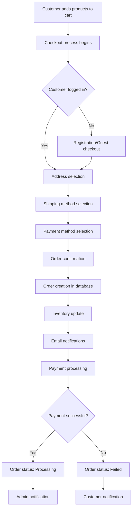

# OpenCart 4.0.2.3 Admin and Catalog Applications Analysis

## Table of Contents
1. [Overview](#overview)
2. [Admin Application Analysis](#admin-application-analysis)
3. [Catalog Application Analysis](#catalog-application-analysis)
4. [Shared Components Analysis](#shared-components-analysis)
5. [Business Logic Analysis](#business-logic-analysis)
6. [Frontend/Backend Integration](#frontendbackend-integration)
7. [Extension Integration Points](#extension-integration-points)
8. [Workflow Diagrams](#workflow-diagrams)
9. [Development Guidelines](#development-guidelines)

## Overview

OpenCart 4.0.2.3 consists of two main applications:
- **Admin Application**: Backend management interface for store administration
- **Catalog Application**: Frontend customer-facing e-commerce interface

Both applications share the same core framework but serve different purposes and user types.

## Admin Application Analysis

### Directory Structure
```
admin/
├── controller/          # Business logic controllers
│   ├── catalog/        # Product, category, manufacturer management
│   ├── customer/       # Customer and group management
│   ├── sale/          # Order, voucher, subscription management
│   ├── marketing/     # Coupons, affiliates, marketing tools
│   ├── design/        # Themes, layouts, banners
│   ├── extension/     # Extension management
│   ├── localisation/  # Languages, currencies, zones
│   ├── setting/       # Store settings and configuration
│   ├── user/          # Admin user management
│   └── tool/          # Utilities and tools
├── model/              # Data access layer
├── view/               # Templates and assets
│   ├── template/      # Twig templates
│   ├── javascript/    # JS libraries and scripts
│   └── stylesheet/    # CSS and SCSS files
└── language/           # Language files
```

### Controller Structure and Organization

#### Catalog Management Controllers
```php
// admin/controller/catalog/product.php
class Product extends \Opencart\System\Engine\Controller {
    public function index(): void {
        // Product listing with filters and pagination
        $this->load->language('catalog/product');
        $this->document->setTitle($this->language->get('heading_title'));
        
        // Filter handling
        $filter_data = [
            'filter_name' => $filter_name,
            'filter_model' => $filter_model,
            'filter_price' => $filter_price,
            'filter_quantity' => $filter_quantity,
            'filter_status' => $filter_status,
            'sort' => $sort,
            'order' => $order,
            'start' => ($page - 1) * $this->config->get('config_pagination_admin'),
            'limit' => $this->config->get('config_pagination_admin')
        ];
    }
    
    public function form(): void {
        // Product add/edit form with complex data handling
        // Handles variants, options, attributes, images, etc.
    }
    
    public function save(): void {
        // Product save with validation and data processing
        // Supports both regular products and variants
    }
}
```

#### Key Admin Controller Patterns
1. **Index Method**: Lists entities with filtering, sorting, pagination
2. **Form Method**: Displays add/edit forms with data population
3. **Save Method**: Handles form submission with validation
4. **Delete Method**: Handles entity deletion with dependencies
5. **AJAX Methods**: Handle dynamic operations (autocomplete, status updates)

### Model Implementations and Data Access Patterns

#### Product Model Example
```php
// admin/model/catalog/product.php
class Product extends \Opencart\System\Engine\Model {
    public function addProduct(array $data): int {
        // Main product insertion
        $this->db->query("INSERT INTO `" . DB_PREFIX . "product` SET ...");
        $product_id = $this->db->getLastId();
        
        // Related data insertion
        foreach ($data['product_description'] as $language_id => $value) {
            $this->db->query("INSERT INTO `" . DB_PREFIX . "product_description` SET ...");
        }
        
        // Categories, filters, stores, downloads, etc.
        if (isset($data['product_category'])) {
            foreach ($data['product_category'] as $category_id) {
                $this->db->query("INSERT INTO `" . DB_PREFIX . "product_to_category` SET ...");
            }
        }
        
        $this->cache->delete('product');
        return $product_id;
    }
    
    public function getProducts(array $data = []): array {
        // Complex query with joins and filters
        $sql = "SELECT * FROM `" . DB_PREFIX . "product` p 
                LEFT JOIN `" . DB_PREFIX . "product_description` pd ON (p.`product_id` = pd.`product_id`) 
                WHERE pd.`language_id` = '" . (int)$this->config->get('config_language_id') . "'";
        
        // Dynamic filter application
        if (!empty($data['filter_name'])) {
            $sql .= " AND pd.`name` LIKE '" . $this->db->escape((string)$data['filter_name'] . '%') . "'";
        }
        
        return $this->db->query($sql)->rows;
    }
}
```

### View Templates and JavaScript Components

#### Dashboard Template Structure
```twig
{# admin/view/template/common/dashboard.twig #}
{{ header }}{{ column_left }}
<div id="content">
  <div class="page-header">
    <div class="container-fluid">
      
        <div class="float-end">
          <button type="button" id="button-setting" class="btn btn-info">
            <i class="fa-solid fa-cog"></i>
          </button>
        </div>
      
      <h1>{{ heading_title }}</h1>
      <ol class="breadcrumb">
        
          <li class="breadcrumb-item">
            <a href="{{ breadcrumb.href }}">{{ breadcrumb.text }}</a>
          </li>
        
      </ol>
    </div>
  </div>
  
  <div class="container-fluid">
    
      <div class="row">
        
          <div class="col-lg-{{ dashboard_1.width }} mb-3">
            {{ dashboard_1.output }}
          </div>
        
      </div>
    
  </div>
</div>
{{ footer }}
```

### Authentication and Permission Systems

#### User Authentication Flow
```php
// admin/controller/startup/login.php
class Login extends \Opencart\System\Engine\Controller {
    public function index(): void {
        if (!$this->user->isLogged()) {
            $this->response->redirect($this->url->link('common/login'));
        }
        
        if (!$this->user->hasPermission('access', $this->request->get['route'])) {
            $this->response->redirect($this->url->link('error/permission'));
        }
    }
}
```

#### Permission Checking Pattern
```php
// Used throughout admin controllers
if (!$this->user->hasPermission('modify', 'catalog/product')) {
    $json['error']['warning'] = $this->language->get('error_permission');
}
```

### Dashboard and Reporting Functionality

#### Dashboard Extension System
```php
// admin/controller/common/dashboard.php
$extensions = $this->model_setting_extension->getExtensionsByType('dashboard');

foreach ($extensions as $extension) {
    if ($this->config->get('dashboard_' . $extension['code'] . '_status')) {
        $output = $this->load->controller('extension/' . $extension['extension'] . '/dashboard/' . $extension['code'] . '.dashboard');
        
        if ($output) {
            $dashboards[] = [
                'code' => $extension['code'],
                'width' => $this->config->get('dashboard_' . $extension['code'] . '_width'),
                'sort_order' => $this->config->get('dashboard_' . $extension['code'] . '_sort_order'),
                'output' => $output
            ];
        }
    }
}
```

### File Management and Media Handling

#### File Manager Integration
```php
// admin/controller/common/filemanager.php
class Filemanager extends \Opencart\System\Engine\Controller {
    public function index(): void {
        $this->load->language('common/filemanager');
        
        if (isset($this->request->get['target'])) {
            $data['target'] = $this->request->get['target'];
        } else {
            $data['target'] = '';
        }
        
        if (isset($this->request->get['thumb'])) {
            $data['thumb'] = $this->request->get['thumb'];
        } else {
            $data['thumb'] = '';
        }
        
        // Directory listing and file operations
        $data['directories'] = [];
        $data['images'] = [];
        
        $this->response->setOutput($this->load->view('common/filemanager', $data));
    }
}
```

## Catalog Application Analysis

### Directory Structure
```
catalog/
├── controller/          # Frontend controllers
│   ├── account/        # Customer account management
│   ├── checkout/       # Shopping cart and checkout
│   ├── product/        # Product display and search
│   ├── common/         # Common elements (header, footer, menu)
│   ├── cms/            # Content management (blog, articles)
│   ├── api/            # API endpoints
│   ├── mail/           # Email notifications
│   └── startup/        # Initialization controllers
├── model/              # Data access layer
├── view/               # Frontend templates and assets
│   ├── template/      # Twig templates
│   ├── javascript/    # Frontend JavaScript
│   └── stylesheet/    # Frontend CSS
└── language/           # Language files
```

### Frontend Controller Structure

#### Product Display Controller
```php
// catalog/controller/product/product.php
class Product extends \Opencart\System\Engine\Controller {
    public function index(): \Opencart\System\Engine\Action|null {
        $this->load->language('product/product');
        
        if (isset($this->request->get['product_id'])) {
            $product_id = (int)$this->request->get['product_id'];
        } else {
            $product_id = 0;
        }
        
        $product_info = $this->model_catalog_product->getProduct($product_id);
        
        if ($product_info) {
            // SEO meta data
            $this->document->setTitle($product_info['meta_title']);
            $this->document->setDescription($product_info['meta_description']);
            $this->document->setKeywords($product_info['meta_keyword']);
            
            // Breadcrumb navigation
            $data['breadcrumbs'] = [];
            $data['breadcrumbs'][] = [
                'text' => $this->language->get('text_home'),
                'href' => $this->url->link('common/home')
            ];
            
            // Product data preparation
            $data['heading_title'] = $product_info['name'];
            $data['description'] = html_entity_decode($product_info['description'], ENT_QUOTES, 'UTF-8');
            
            // Price calculation with customer groups and specials
            if ($this->customer->isLogged() || !$this->config->get('config_customer_price')) {
                $data['price'] = $this->currency->format(
                    $this->tax->calculate($product_info['price'], $product_info['tax_class_id'], $this->config->get('config_tax')), 
                    $this->session->data['currency']
                );
            } else {
                $data['price'] = false;
            }
            
            // Options and variants handling
            $data['options'] = [];
            $product_options = $this->model_catalog_product->getOptions($product_id);
            
            foreach ($product_options as $option) {
                $product_option_value_data = [];
                
                foreach ($option['product_option_value'] as $option_value) {
                    if (!$option_value['subtract'] || ($option_value['quantity'] > 0)) {
                        $product_option_value_data[] = [
                            'product_option_value_id' => $option_value['product_option_value_id'],
                            'option_value_id' => $option_value['option_value_id'],
                            'name' => $option_value['name'],
                            'price' => $price,
                            'price_prefix' => $option_value['price_prefix']
                        ];
                    }
                }
                
                $data['options'][] = [
                    'product_option_id' => $option['product_option_id'],
                    'product_option_value' => $product_option_value_data,
                    'option_id' => $option['option_id'],
                    'name' => $option['name'],
                    'type' => $option['type'],
                    'value' => $option['value'],
                    'required' => $option['required']
                ];
            }
            
            $this->response->setOutput($this->load->view('product/product', $data));
        } else {
            return new \Opencart\System\Engine\Action('error/not_found');
        }
        
        return null;
    }
}
```

### Shopping Cart and Checkout Process

#### Checkout Controller
```php
// catalog/controller/checkout/checkout.php
class Checkout extends \Opencart\System\Engine\Controller {
    public function index(): void {
        // Validate cart has products and stock
        if ((!$this->cart->hasProducts() && empty($this->session->data['vouchers'])) || 
            (!$this->cart->hasStock() && !$this->config->get('config_stock_checkout'))) {
            $this->response->redirect($this->url->link('checkout/cart'));
        }
        
        // Validate minimum quantity requirements
        $products = $this->cart->getProducts();
        foreach ($products as $product) {
            if (!$product['minimum']) {
                $this->response->redirect($this->url->link('checkout/cart'));
                break;
            }
        }
        
        $this->load->language('checkout/checkout');
        $this->document->setTitle($this->language->get('heading_title'));
        
        // Load checkout steps based on customer status
        if (!$this->customer->isLogged()) {
            $data['register'] = $this->load->controller('checkout/register');
        } else {
            $data['register'] = '';
        }
        
        if ($this->customer->isLogged() && $this->config->get('config_checkout_payment_address')) {
            $data['payment_address'] = $this->load->controller('checkout/payment_address');
        } else {
            $data['payment_address'] = '';
        }
        
        if ($this->customer->isLogged() && $this->cart->hasShipping()) {
            $data['shipping_address'] = $this->load->controller('checkout/shipping_address');
        } else {
            $data['shipping_address'] = '';
        }
        
        if ($this->cart->hasShipping()) {
            $data['shipping_method'] = $this->load->controller('checkout/shipping_method');
        } else {
            $data['shipping_method'] = '';
        }
        
        $data['payment_method'] = $this->load->controller('checkout/payment_method');
        $data['confirm'] = $this->load->controller('checkout/confirm');
        
        $this->response->setOutput($this->load->view('checkout/checkout', $data));
    }
}
```

### User Account Management

#### Account Controller Structure
```php
// catalog/controller/account/account.php
class Account extends \Opencart\System\Engine\Controller {
    public function index(): void {
        if (!$this->customer->isLogged()) {
            $this->session->data['redirect'] = $this->url->link('account/account');
            $this->response->redirect($this->url->link('account/login'));
        }
        
        $this->load->language('account/account');
        $this->document->setTitle($this->language->get('heading_title'));
        
        // Account dashboard with links to various account functions
        $data['edit'] = $this->url->link('account/edit');
        $data['password'] = $this->url->link('account/password');
        $data['address'] = $this->url->link('account/address');
        $data['wishlist'] = $this->url->link('account/wishlist');
        $data['order'] = $this->url->link('account/order');
        $data['download'] = $this->url->link('account/download');
        $data['reward'] = $this->url->link('account/reward');
        $data['returns'] = $this->url->link('account/returns');
        $data['transaction'] = $this->url->link('account/transaction');
        $data['newsletter'] = $this->url->link('account/newsletter');
        $data['subscription'] = $this->url->link('account/subscription');
        
        $this->response->setOutput($this->load->view('account/account', $data));
    }
}
```

### CMS Features (Blog, Articles, Comments)

#### Blog Controller
```php
// catalog/controller/cms/blog.php
class Blog extends \Opencart\System\Engine\Controller {
    public function index(): void {
        $this->load->language('cms/blog');
        $this->load->model('cms/article');
        
        if (isset($this->request->get['page'])) {
            $page = (int)$this->request->get['page'];
        } else {
            $page = 1;
        }
        
        $data['articles'] = [];
        
        $filter_data = [
            'start' => ($page - 1) * $this->config->get('config_pagination'),
            'limit' => $this->config->get('config_pagination')
        ];
        
        $article_total = $this->model_cms_article->getTotalArticles($filter_data);
        $results = $this->model_cms_article->getArticles($filter_data);
        
        foreach ($results as $result) {
            $data['articles'][] = [
                'article_id' => $result['article_id'],
                'name' => $result['name'],
                'description' => oc_substr(strip_tags(html_entity_decode($result['description'], ENT_QUOTES, 'UTF-8')), 0, $this->config->get('config_article_description_length')) . '..',
                'author' => $result['author'],
                'date_added' => date($this->language->get('date_format_short'), strtotime($result['date_added'])),
                'href' => $this->url->link('cms/article', 'article_id=' . $result['article_id'])
            ];
        }
        
        $this->response->setOutput($this->load->view('cms/blog', $data));
    }
}
```

## Shared Components Analysis

### Common Controllers and Models

#### Shared Model Pattern
```php
// Both admin and catalog use similar model structures
// catalog/model/catalog/product.php (simplified version of admin model)
class Product extends \Opencart\System\Engine\Model {
    public function getProduct(int $product_id): array {
        $query = $this->db->query("SELECT DISTINCT * FROM `" . DB_PREFIX . "product` p 
                                  LEFT JOIN `" . DB_PREFIX . "product_description` pd ON (p.`product_id` = pd.`product_id`) 
                                  LEFT JOIN `" . DB_PREFIX . "product_to_store` p2s ON (p.`product_id` = p2s.`product_id`) 
                                  WHERE p.`product_id` = '" . (int)$product_id . "' 
                                  AND pd.`language_id` = '" . (int)$this->config->get('config_language_id') . "' 
                                  AND p.`status` = '1' 
                                  AND p.`date_available` <= NOW() 
                                  AND p2s.`store_id` = '" . (int)$this->config->get('config_store_id') . "'");
        
        return $query->row;
    }
}
```

### Shared JavaScript Libraries and Assets

#### Common JavaScript Structure
```javascript
// catalog/view/javascript/common.js
// Shared utilities used across both applications
function getURLVar(key) {
    var value = [];
    var query = String(document.location).split('?');
    
    if (query[1]) {
        var part = query[1].split('&');
        
        for (i = 0; i < part.length; i++) {
            var data = part[i].split('=');
            
            if (data[0] && data[1]) {
                value[data[0]] = data[1];
            }
        }
        
        if (value[key]) {
            return value[key];
        } else {
            return '';
        }
    }
}

// AJAX cart functionality
function addToCart(product_id, quantity) {
    $.ajax({
        url: 'index.php?route=checkout/cart.add',
        type: 'post',
        data: 'product_id=' + product_id + '&quantity=' + (typeof(quantity) != 'undefined' ? quantity : 1),
        dataType: 'json',
        beforeSend: function() {
            $('#cart > button').button('loading');
        },
        complete: function() {
            $('#cart > button').button('reset');
        },
        success: function(json) {
            if (json['redirect']) {
                location = json['redirect'];
            }
            
            if (json['success']) {
                $('#alert').prepend('<div class="alert alert-success alert-dismissible">' + json['success'] + '</div>');
                
                // Update cart display
                $('#cart-total').html(json['total']);
                
                $('html, body').animate({ scrollTop: 0 }, 'slow');
            }
        },
        error: function(xhr, ajaxOptions, thrownError) {
            alert(thrownError + "\r\n" + xhr.statusText + "\r\n" + xhr.responseText);
        }
    });
}
```

### Mail Templates and Notification System

#### Mail Controller Pattern
```php
// catalog/controller/mail/order.php
class Order extends \Opencart\System\Engine\Controller {
    public function index(string &$route, array &$args, mixed &$output): void {
        if (isset($args[0])) {
            $order_id = $args[0];
        } else {
            $order_id = 0;
        }
        
        $this->load->model('sale/order');
        $order_info = $this->model_sale_order->getOrder($order_id);
        
        if ($order_info) {
            $this->load->model('setting/setting');
            $store_info = $this->model_setting_setting->getSetting('config', $order_info['store_id']);
            
            if ($store_info) {
                $store_name = html_entity_decode($store_info['config_name'], ENT_QUOTES, 'UTF-8');
                $store_email = $store_info['config_email'];
            } else {
                $store_name = html_entity_decode($this->config->get('config_name'), ENT_QUOTES, 'UTF-8');
                $store_email = $this->config->get('config_email');
            }
            
            // Send order confirmation email
            $mail = new \Opencart\System\Library\Mail($this->config->get('config_mail_engine'));
            $mail->parameter = $this->config->get('config_mail_parameter');
            $mail->smtp_hostname = $this->config->get('config_mail_smtp_hostname');
            $mail->smtp_username = $this->config->get('config_mail_smtp_username');
            $mail->smtp_password = html_entity_decode($this->config->get('config_mail_smtp_password'), ENT_QUOTES, 'UTF-8');
            $mail->smtp_port = $this->config->get('config_mail_smtp_port');
            $mail->smtp_timeout = $this->config->get('config_mail_smtp_timeout');
            
            $mail->setTo($order_info['email']);
            $mail->setFrom($store_email);
            $mail->setSender($store_name);
            $mail->setSubject(sprintf($this->language->get('text_subject'), $store_name, $order_id));
            $mail->setHtml($this->load->view('mail/order_add', $data));
            $mail->send();
        }
    }
}
```

## Business Logic Analysis

### E-commerce Workflow Implementation

#### Order Processing Flow


### Order Processing and Management

#### Order Model Implementation
```php
// admin/model/sale/order.php
class Order extends \Opencart\System\Engine\Model {
    public function addOrder(array $data): int {
        $this->db->query("INSERT INTO `" . DB_PREFIX . "order` SET 
            `invoice_no` = '" . (int)$data['invoice_no'] . "', 
            `invoice_prefix` = '" . $this->db->escape($data['invoice_prefix']) . "', 
            `store_id` = '" . (int)$data['store_id'] . "', 
            `store_name` = '" . $this->db->escape($data['store_name']) . "', 
            `store_url` = '" . $this->db->escape($data['store_url']) . "', 
            `customer_id` = '" . (int)$data['customer_id'] . "', 
            `customer_group_id` = '" . (int)$data['customer_group_id'] . "', 
            `firstname` = '" . $this->db->escape($data['firstname']) . "', 
            `lastname` = '" . $this->db->escape($data['lastname']) . "', 
            `email` = '" . $this->db->escape($data['email']) . "', 
            `telephone` = '" . $this->db->escape($data['telephone']) . "', 
            `custom_field` = '" . $this->db->escape(json_encode($data['custom_field'])) . "', 
            `payment_firstname` = '" . $this->db->escape($data['payment_firstname']) . "', 
            `payment_lastname` = '" . $this->db->escape($data['payment_lastname']) . "', 
            `payment_company` = '" . $this->db->escape($data['payment_company']) . "', 
            `payment_address_1` = '" . $this->db->escape($data['payment_address_1']) . "', 
            `payment_address_2` = '" . $this->db->escape($data['payment_address_2']) . "', 
            `payment_city` = '" . $this->db->escape($data['payment_city']) . "', 
            `payment_postcode` = '" . $this->db->escape($data['payment_postcode']) . "', 
            `payment_country` = '" . $this->db->escape($data['payment_country']) . "', 
            `payment_country_id` = '" . (int)$data['payment_country_id'] . "', 
            `payment_zone` = '" . $this->db->escape($data['payment_zone']) . "', 
            `payment_zone_id` = '" . (int)$data['payment_zone_id'] . "', 
            `payment_address_format` = '" . $this->db->escape($data['payment_address_format']) . "', 
            `payment_custom_field` = '" . $this->db->escape(json_encode($data['payment_custom_field'])) . "', 
            `payment_method` = '" . $this->db->escape(json_encode($data['payment_method'])) . "', 
            `payment_code` = '" . $this->db->escape($data['payment_code']) . "', 
            `shipping_firstname` = '" . $this->db->escape($data['shipping_firstname']) . "', 
            `shipping_lastname` = '" . $this->db->escape($data['shipping_lastname']) . "', 
            `shipping_company` = '" . $this->db->escape($data['shipping_company']) . "', 
            `shipping_address_1` = '" . $this->db->escape($data['shipping_address_1']) . "', 
            `shipping_address_2` = '" . $this->db->escape($data['shipping_address_2']) . "', 
            `shipping_city` = '" . $this->db->escape($data['shipping_city']) . "', 
            `shipping_postcode` = '" . $this->db->escape($data['shipping_postcode']) . "', 
            `shipping_country` = '" . $this->db->escape($data['shipping_country']) . "', 
            `shipping_country_id` = '" . (int)$data['shipping_country_id'] . "', 
            `shipping_zone` = '" . $this->db->escape($data['shipping_zone']) . "', 
            `shipping_zone_id` = '" . (int)$data['shipping_zone_id'] . "', 
            `shipping_address_format` = '" . $this->db->escape($data['shipping_address_format']) . "', 
            `shipping_custom_field` = '" . $this->db->escape(json_encode($data['shipping_custom_field'])) . "', 
            `shipping_method` = '" . $this->db->escape(json_encode($data['shipping_method'])) . "', 
            `shipping_code` = '" . $this->db->escape($data['shipping_code']) . "', 
            `comment` = '" . $this->db->escape($data['comment']) . "', 
            `total` = '" . (float)$data['total'] . "', 
            `affiliate_id` = '" . (int)$data['affiliate_id'] . "', 
            `commission` = '" . (float)$data['commission'] . "', 
            `marketing_id` = '" . (int)$data['marketing_id'] . "', 
            `tracking` = '" . $this->db->escape($data['tracking']) . "', 
            `language_id` = '" . (int)$data['language_id'] . "', 
            `language_code` = '" . $this->db->escape($data['language_code']) . "', 
            `currency_id` = '" . (int)$data['currency_id'] . "', 
            `currency_code` = '" . $this->db->escape($data['currency_code']) . "', 
            `currency_value` = '" . (
`currency_value` = '" . (float)$data['currency_value'] . "', 
            `ip` = '" . $this->db->escape($data['ip']) . "', 
            `forwarded_ip` = '" . $this->db->escape($data['forwarded_ip']) . "', 
            `user_agent` = '" . $this->db->escape($data['user_agent']) . "', 
            `accept_language` = '" . $this->db->escape($data['accept_language']) . "', 
            `date_added` = NOW(), 
            `date_modified` = NOW()");
        
        $order_id = $this->db->getLastId();
        
        // Add order products
        if (isset($data['order_product'])) {
            foreach ($data['order_product'] as $order_product) {
                $this->db->query("INSERT INTO `" . DB_PREFIX . "order_product` SET 
                    `order_id` = '" . (int)$order_id . "', 
                    `product_id` = '" . (int)$order_product['product_id'] . "', 
                    `master_id` = '" . (int)$order_product['master_id'] . "', 
                    `name` = '" . $this->db->escape($order_product['name']) . "', 
                    `model` = '" . $this->db->escape($order_product['model']) . "', 
                    `quantity` = '" . (int)$order_product['quantity'] . "', 
                    `price` = '" . (float)$order_product['price'] . "', 
                    `total` = '" . (float)$order_product['total'] . "', 
                    `tax` = '" . (float)$order_product['tax'] . "', 
                    `reward` = '" . (int)$order_product['reward'] . "'");
                
                $order_product_id = $this->db->getLastId();
                
                // Add order options
                if (isset($order_product['order_option'])) {
                    foreach ($order_product['order_option'] as $order_option) {
                        $this->db->query("INSERT INTO `" . DB_PREFIX . "order_option` SET 
                            `order_id` = '" . (int)$order_id . "', 
                            `order_product_id` = '" . (int)$order_product_id . "', 
                            `product_option_id` = '" . (int)$order_option['product_option_id'] . "', 
                            `product_option_value_id` = '" . (int)$order_option['product_option_value_id'] . "', 
                            `name` = '" . $this->db->escape($order_option['name']) . "', 
                            `value` = '" . $this->db->escape($order_option['value']) . "', 
                            `type` = '" . $this->db->escape($order_option['type']) . "'");
                    }
                }
            }
        }
        
        // Add order totals
        if (isset($data['order_total'])) {
            foreach ($data['order_total'] as $order_total) {
                $this->db->query("INSERT INTO `" . DB_PREFIX . "order_total` SET 
                    `order_id` = '" . (int)$order_id . "', 
                    `extension` = '" . $this->db->escape($order_total['extension']) . "', 
                    `code` = '" . $this->db->escape($order_total['code']) . "', 
                    `title` = '" . $this->db->escape($order_total['title']) . "', 
                    `value` = '" . (float)$order_total['value'] . "', 
                    `sort_order` = '" . (int)$order_total['sort_order'] . "'");
            }
        }
        
        return $order_id;
    }
}
```

### Customer Management and Authentication

#### Customer Registration and Login Flow
```php
// catalog/controller/account/register.php
class Register extends \Opencart\System\Engine\Controller {
    public function index(): void {
        if ($this->customer->isLogged()) {
            $this->response->redirect($this->url->link('account/account'));
        }
        
        $this->load->language('account/register');
        $this->document->setTitle($this->language->get('heading_title'));
        
        if (($this->request->server['REQUEST_METHOD'] == 'POST') && $this->validate()) {
            $this->load->model('account/customer');
            
            $customer_id = $this->model_account_customer->addCustomer($this->request->post);
            
            // Customer approval process
            if ($this->config->get('config_customer_approval')) {
                $this->session->data['success'] = $this->language->get('text_approval');
                $this->response->redirect($this->url->link('account/login'));
            } else {
                $this->customer->login($this->request->post['email'], $this->request->post['password']);
                
                // Send welcome email
                $this->load->controller('mail/register');
                
                $this->response->redirect($this->url->link('account/success'));
            }
        }
        
        $this->response->setOutput($this->load->view('account/register', $data));
    }
    
    private function validate(): bool {
        if ((oc_strlen($this->request->post['firstname']) < 1) || (oc_strlen($this->request->post['firstname']) > 32)) {
            $this->error['firstname'] = $this->language->get('error_firstname');
        }
        
        if ((oc_strlen($this->request->post['lastname']) < 1) || (oc_strlen($this->request->post['lastname']) > 32)) {
            $this->error['lastname'] = $this->language->get('error_lastname');
        }
        
        if ((oc_strlen($this->request->post['email']) > 96) || !filter_var($this->request->post['email'], FILTER_VALIDATE_EMAIL)) {
            $this->error['email'] = $this->language->get('error_email');
        }
        
        // Check if email already exists
        $this->load->model('account/customer');
        if ($this->model_account_customer->getTotalCustomersByEmail($this->request->post['email'])) {
            $this->error['warning'] = $this->language->get('error_exists');
        }
        
        if ((oc_strlen(html_entity_decode($this->request->post['password'], ENT_QUOTES, 'UTF-8')) < 4) || (oc_strlen(html_entity_decode($this->request->post['password'], ENT_QUOTES, 'UTF-8')) > 40)) {
            $this->error['password'] = $this->language->get('error_password');
        }
        
        if ($this->request->post['confirm'] != $this->request->post['password']) {
            $this->error['confirm'] = $this->language->get('error_confirm');
        }
        
        return !$this->error;
    }
}
```

### Product Catalog Management

#### Category and Product Hierarchy
```php
// catalog/model/catalog/category.php
class Category extends \Opencart\System\Engine\Model {
    public function getCategories(int $parent_id = 0): array {
        $query = $this->db->query("SELECT * FROM `" . DB_PREFIX . "category` c 
                                  LEFT JOIN `" . DB_PREFIX . "category_description` cd ON (c.`category_id` = cd.`category_id`) 
                                  LEFT JOIN `" . DB_PREFIX . "category_to_store` c2s ON (c.`category_id` = c2s.`category_id`) 
                                  WHERE c.`parent_id` = '" . (int)$parent_id . "' 
                                  AND cd.`language_id` = '" . (int)$this->config->get('config_language_id') . "' 
                                  AND c2s.`store_id` = '" . (int)$this->config->get('config_store_id') . "'  
                                  AND c.`status` = '1' 
                                  ORDER BY c.`sort_order`, LCASE(cd.`name`)");
        
        return $query->rows;
    }
    
    public function getCategoryPath(int $category_id): array {
        $query = $this->db->query("SELECT `category_id`, `path_id` FROM `" . DB_PREFIX . "category_path` WHERE `category_id` = '" . (int)$category_id . "' ORDER BY `level` ASC");
        
        return $query->rows;
    }
}
```

### Payment and Shipping Integration

#### Payment Method Integration Pattern
```php
// Extension payment method example
// extension/opencart/catalog/controller/payment/bank_transfer.php
class BankTransfer extends \Opencart\System\Engine\Controller {
    public function index(): string {
        $this->load->language('extension/opencart/payment/bank_transfer');
        
        $data['bank'] = nl2br($this->config->get('payment_bank_transfer_bank_' . $this->config->get('config_language_id')));
        
        return $this->load->view('extension/opencart/payment/bank_transfer', $data);
    }
    
    public function confirm(): void {
        $this->load->language('extension/opencart/payment/bank_transfer');
        
        $json = [];
        
        if (!isset($this->session->data['order_id'])) {
            $json['error'] = $this->language->get('error_order');
        }
        
        if (!$json) {
            $this->load->model('checkout/order');
            
            $comment = $this->language->get('text_instruction') . "\n\n";
            $comment .= $this->config->get('payment_bank_transfer_bank_' . $this->config->get('config_language_id')) . "\n\n";
            $comment .= $this->language->get('text_payment');
            
            $this->model_checkout_order->addHistory($this->session->data['order_id'], $this->config->get('payment_bank_transfer_order_status_id'), $comment, true);
            
            $json['redirect'] = $this->url->link('checkout/success', 'language=' . $this->config->get('config_language'));
        }
        
        $this->response->addHeader('Content-Type: application/json');
        $this->response->setOutput(json_encode($json));
    }
}
```

### Subscription and Recurring Billing

#### Subscription Management
```php
// admin/controller/sale/subscription.php
class Subscription extends \Opencart\System\Engine\Controller {
    public function index(): void {
        $this->load->language('sale/subscription');
        $this->document->setTitle($this->language->get('heading_title'));
        
        $data['subscriptions'] = [];
        
        $filter_data = [
            'filter_subscription_id' => $filter_subscription_id,
            'filter_order_id' => $filter_order_id,
            'filter_customer' => $filter_customer,
            'filter_subscription_status_id' => $filter_subscription_status_id,
            'filter_date_from' => $filter_date_from,
            'filter_date_to' => $filter_date_to,
            'sort' => $sort,
            'order' => $order,
            'start' => ($page - 1) * $this->config->get('config_pagination_admin'),
            'limit' => $this->config->get('config_pagination_admin')
        ];
        
        $this->load->model('sale/subscription');
        
        $subscription_total = $this->model_sale_subscription->getTotalSubscriptions($filter_data);
        $results = $this->model_sale_subscription->getSubscriptions($filter_data);
        
        foreach ($results as $result) {
            $data['subscriptions'][] = [
                'subscription_id' => $result['subscription_id'],
                'order_id' => $result['order_id'],
                'customer' => $result['customer'],
                'status' => $result['subscription_status'],
                'date_added' => date($this->language->get('date_format_short'), strtotime($result['date_added'])),
                'view' => $this->url->link('sale/subscription.info', 'user_token=' . $this->session->data['user_token'] . '&subscription_id=' . $result['subscription_id'])
            ];
        }
        
        $this->response->setOutput($this->load->view('sale/subscription', $data));
    }
}
```

## Frontend/Backend Integration

### How Admin Changes Affect Frontend

#### Cache Management System
```php
// system/library/cache.php
class Cache {
    private $adaptor;
    
    public function __construct($adaptor, $expire = 3600) {
        $class = 'Opencart\System\Library\Cache\\' . $adaptor;
        
        if (class_exists($class)) {
            $this->adaptor = new $class($expire);
        } else {
            throw new \Exception('Error: Could not load cache adaptor ' . $adaptor . ' cache!');
        }
    }
    
    public function get(string $key) {
        return $this->adaptor->get($key);
    }
    
    public function set(string $key, $value, int $expire = 0) {
        return $this->adaptor->set($key, $value, $expire);
    }
    
    public function delete(string $key) {
        return $this->adaptor->delete($key);
    }
}

// Usage in models
public function editProduct(int $product_id, array $data): void {
    // Update product data
    $this->db->query("UPDATE `" . DB_PREFIX . "product` SET ...");
    
    // Clear related caches
    $this->cache->delete('product');
    $this->cache->delete('category');
    $this->cache->delete('manufacturer');
}
```

### Data Synchronization Between Applications

#### Event System Integration
```php
// system/engine/event.php
class Event {
    private $registry;
    private $data = [];
    
    public function __construct(\Opencart\System\Engine\Registry $registry) {
        $this->registry = $registry;
    }
    
    public function register(string $trigger, \Opencart\System\Engine\Action $action, int $priority = 0): void {
        $this->data[] = [
            'trigger'  => $trigger,
            'action'   => $action,
            'priority' => $priority
        ];
        
        $sort_order = [];
        
        foreach ($this->data as $key => $value) {
            $sort_order[$key] = $value['priority'];
        }
        
        array_multisort($sort_order, SORT_ASC, $this->data);
    }
    
    public function trigger(string $event, array &$args = []): mixed {
        foreach ($this->data as $value) {
            if (preg_match('/^' . str_replace(['\*', '\?'], ['.*', '.'], preg_quote($value['trigger'], '/')) . '/', $event)) {
                $result = $value['action']->execute($this->registry, $args);
                
                if (!is_null($result) && !($result instanceof \Exception)) {
                    return $result;
                }
            }
        }
        
        return null;
    }
}

// Event usage example
// When a product is updated in admin, trigger frontend cache clear
$this->event->trigger('admin/model/catalog/product/editProduct/after', [&$product_id, &$data]);
```

### API Integration Points

#### REST API Structure
```php
// catalog/controller/api/sale/order.php
class Order extends \Opencart\System\Engine\Controller {
    public function index(): void {
        $this->load->language('api/sale/order');
        
        $json = [];
        
        // API authentication
        if (isset($this->request->post['api_token'])) {
            $this->load->model('setting/api');
            
            $api_info = $this->model_setting_api->getApiByToken($this->request->post['api_token']);
            
            if (!$api_info) {
                $json['error']['api'] = $this->language->get('error_permission');
            }
        } else {
            $json['error']['api'] = $this->language->get('error_permission');
        }
        
        if (!$json) {
            $this->load->model('sale/order');
            
            if (isset($this->request->get['order_id'])) {
                $order_info = $this->model_sale_order->getOrder($this->request->get['order_id']);
                
                if ($order_info) {
                    $json['order'] = $order_info;
                } else {
                    $json['error'] = $this->language->get('error_not_found');
                }
            } else {
                $json['error'] = $this->language->get('error_order_id');
            }
        }
        
        $this->response->addHeader('Content-Type: application/json');
        $this->response->setOutput(json_encode($json));
    }
    
    public function add(): void {
        $this->load->language('api/sale/order');
        
        $json = [];
        
        if (!$json) {
            $this->load->model('sale/order');
            
            $order_id = $this->model_sale_order->addOrder($this->request->post);
            
            $json['success'] = $this->language->get('text_success');
            $json['order_id'] = $order_id;
        }
        
        $this->response->addHeader('Content-Type: application/json');
        $this->response->setOutput(json_encode($json));
    }
}
```

## Extension Integration Points

### How Extensions Modify Admin Functionality

#### Extension Installation Process
```php
// admin/controller/marketplace/installer.php
class Installer extends \Opencart\System\Engine\Controller {
    public function install(): void {
        $this->load->language('marketplace/installer');
        
        $json = [];
        
        if (!$this->user->hasPermission('modify', 'marketplace/installer')) {
            $json['error'] = $this->language->get('error_permission');
        }
        
        if (!$json) {
            $file = $this->request->files['file']['tmp_name'];
            $filename = $this->request->files['file']['name'];
            
            if (!is_uploaded_file($file)) {
                $json['error'] = $this->language->get('error_upload');
            }
            
            if (!$json) {
                // Extract and validate extension
                $zip = new \ZipArchive();
                
                if ($zip->open($file) === TRUE) {
                    // Validate extension structure
                    $install_json = $zip->getFromName('install.json');
                    
                    if ($install_json) {
                        $install_data = json_decode($install_json, true);
                        
                        if ($install_data) {
                            // Extract to extension directory
                            $extension_path = DIR_EXTENSION . $install_data['code'] . '/';
                            
                            if (!is_dir($extension_path)) {
                                mkdir($extension_path, 0755, true);
                            }
                            
                            $zip->extractTo($extension_path);
                            $zip->close();
                            
                            // Register extension
                            $this->load->model('setting/extension');
                            $this->model_setting_extension->install($install_data['type'], $install_data['code'], $install_data['code']);
                            
                            $json['success'] = $this->language->get('text_success');
                        } else {
                            $json['error'] = $this->language->get('error_install');
                        }
                    } else {
                        $json['error'] = $this->language->get('error_install');
                    }
                } else {
                    $json['error'] = $this->language->get('error_unzip');
                }
            }
        }
        
        $this->response->addHeader('Content-Type: application/json');
        $this->response->setOutput(json_encode($json));
    }
}
```

### Fronten