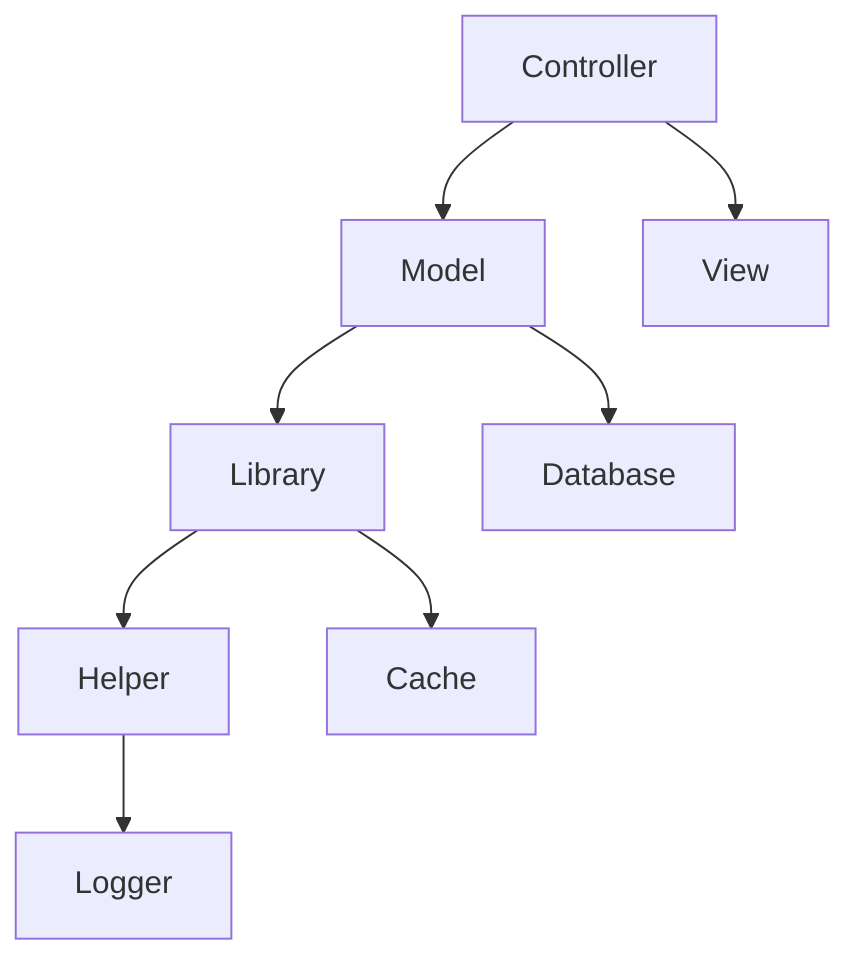

# MesChain-Sync Enterprise Modül Bağımlılıkları Raporu

**Versiyon:** 3.0.0
**Tarih:** 19 Haziran 2025
**Platform:** OpenCart 4.0.2.3

## İçindekiler

1. [Genel Bağımlılık Analizi](#genel-bağımlılık-analizi)
2. [Modül İlişkileri](#modül-ilişkileri)
3. [Dış Sistem Bağımlılıkları](#dış-sistem-bağımlılıkları)
4. [Kritik Bileşenler](#kritik-bileşenler)

## Genel Bağımlılık Analizi

### Ana Sistem Bileşenleri

```
RESTRUCTURED_UPLOAD/
├── Temel Bileşenler
│   ├── Controller Katmanı
│   ├── Model Katmanı
│   ├── View Katmanı
│   └── Library Katmanı
├── Yardımcı Bileşenler
│   ├── Güvenlik Modülleri
│   ├── Performans Araçları
│   └── Log Sistemleri
└── Dış Entegrasyonlar
    ├── Pazaryeri API'leri
    ├── Ödeme Sistemleri
    └── Azure Servisleri (Opsiyonel)
```

### Bağımlılık Seviyeleri

1. **Kritik Bağımlılıklar**
   - OpenCart Çekirdek
   - PHP Runtime
   - MySQL/MariaDB
   - SSL Sertifikası

2. **Önemli Bağımlılıklar**
   - Pazaryeri API'leri
   - Cron Sistemi
   - Cache Sistemi

3. **Opsiyonel Bağımlılıklar**
   - Azure Servisleri
   - İleri Analitik Araçları
   - AI/ML Modülleri

## Modül İlişkileri

### İç Modül Bağımlılıkları



### Modül İletişim Şeması

1. **Veri Akışı**
   ```
   Controller → Model → Database
        ↓         ↓        ↓
      View  →  Cache  →  Logger
   ```

2. **Servis İletişimi**
   ```
   API Client → Rate Limiter → Marketplace
        ↓            ↓           ↓
   Error Handler → Logger → Notification
   ```

## Dış Sistem Bağımlılıkları

### Pazaryeri API'leri

| Pazaryeri | Bağımlılık Tipi | Kritiklik |
|-----------|-----------------|------------|
| Trendyol | REST API | Yüksek |
| Hepsiburada | REST API | Yüksek |
| Amazon | SP-API | Yüksek |
| N11 | SOAP/REST | Orta |
| GittiGidiyor | REST API | Orta |
| Pazarama | REST API | Düşük |

### Sistem Servisleri

1. **Web Sunucu Gereksinimleri**
   - Apache/Nginx
   - mod_rewrite
   - SSL desteği

2. **PHP Eklentileri**
   ```php
   // Gerekli PHP Eklentileri
   $required_extensions = [
       'curl',
       'json',
       'mbstring',
       'xml',
       'zip',
       'gd',
       'openssl'
   ];
   ```

## Kritik Bileşenler

### 1. Veri Katmanı

```php
// Veri Katmanı Bağımlılıkları
class DataLayerDependencies {
    private $required = [
        'database' => [
            'type' => 'mysql',
            'min_version' => '5.7.0',
            'recommended' => '8.0.0'
        ],
        'cache' => [
            'type' => ['file', 'redis', 'memcached'],
            'required' => true
        ]
    ];
}
```

### 2. İş Mantığı Katmanı

```php
// İş Mantığı Bağımlılıkları
class BusinessLayerDependencies {
    private $components = [
        'product_sync' => [
            'required' => true,
            'dependencies' => ['api_client', 'cache', 'logger']
        ],
        'order_management' => [
            'required' => true,
            'dependencies' => ['database', 'notification']
        ]
    ];
}
```

### 3. Sunum Katmanı

```php
// Sunum Katmanı Bağımlılıkları
class PresentationLayerDependencies {
    private $requirements = [
        'template_engine' => true,
        'asset_manager' => true,
        'session_handler' => true
    ];
}
```

## Bağımsızlaştırma Stratejileri

### 1. Modüler Yapı

- Gevşek bağlı modüller
- Dependency Injection
- Interface kullanımı

### 2. Soyutlama Katmanları

```php
// Soyutlama Örneği
interface MarketplaceInterface {
    public function connect();
    public function syncProducts();
    public function getOrders();
}

class TrendyolAdapter implements MarketplaceInterface {
    // Implementation
}

class HepsiburadaAdapter implements MarketplaceInterface {
    // Implementation
}
```

### 3. Fallback Mekanizmaları

```php
// Fallback Örneği
class StorageManager {
    public function save($data) {
        try {
            return $this->cloudStorage->save($data);
        } catch (Exception $e) {
            return $this->localStorage->save($data);
        }
    }
}
```

## Sonuç ve Öneriler

1. **Kısa Vadeli Öneriler**
   - Kritik bağımlılıkların yedeklenmesi
   - Hata tolerans mekanizmalarının güçlendirilmesi
   - Monitoring sisteminin geliştirilmesi

2. **Orta Vadeli Öneriler**
   - Modüler yapının güçlendirilmesi
   - Cache stratejilerinin optimize edilmesi
   - API soyutlama katmanının geliştirilmesi

3. **Uzun Vadeli Öneriler**
   - Tam mikroservis mimarisine geçiş
   - Event-driven mimari adaptasyonu
   - Cloud-native dönüşüm
