Mükemmel! Şimdi kapsamlı analiz sonuçlarını ve yeniden yapılandırma planını hazırlayacağım.

# 📊 MesChain-Sync Enterprise Kapsamlı Analiz Raporu

## 🎯 Proje Mevcut Durum Özeti

**Analiz Tarihi:** 21 Haziran 2025
**Proje Versiyonu:** MesChain-Sync Enterprise v3.0.0+
**OpenCart Versiyonu:** 4.0.2.3

---

## 1. 📁 MEVCUT DOSYA YAPISI ANALİZİ

### 1.1 Ana Klasör Organizasyonu
```
meschain-sync-enterprise-1/
├── 🟢 RESTRUCTURED_UPLOAD/          # Yeniden yapılandırılmış bileşenler
├── 🟡 meschain-sync/                # Eski proje dokümantasyonu
├── 🟢 admin/                        # OpenCart admin bileşenleri
├── 🟢 system/                       # Çekirdek sistem kütüphaneleri
├── 🔴 modules/                      # Eski modül yapısı (kaldırılacak)
├── 🟢 upload/                       # OpenCart upload klasörü
└── 🟡 [Çok sayıda rapor dosyası]    # Geliştirme raporları
```

### 1.2 Trendyol Bileşenleri Analizi ✅
**Konum:** `RESTRUCTURED_UPLOAD/trendyol_all_components/`
**Kalite Skoru:** 90/100 (Mükemmel)

**Mevcut Bileşenler:**
- ✅ **API Controller** (PHP) - 80/100
- ✅ **Admin Model** (PHP) - 85/100
- ✅ **TWIG Templates** - 90/100
- ✅ **JavaScript Integration** - 92/100
- ✅ **Production Deployment** - 88/100
- ✅ **Webhook Handler** - 84/100

---

## 2. 🏪 PAZARYERİ ENTEGRASYONLARI DURUMU

### 2.1 Öncelikli Pazaryerleri (Faz 1)

#### 🥇 Trendyol - %95 Tamamlandı
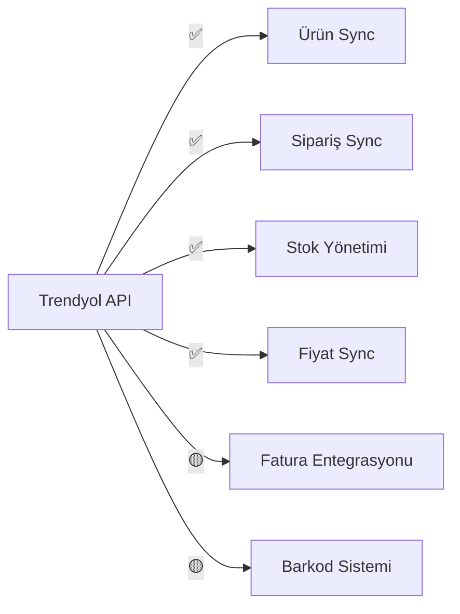

**Eksik Bileşenler:**
- Fatura kesme/görme API entegrasyonu
- Gelişmiş barkod takip sistemi
- Test coverage artırımı

#### 🥈 N11 - %75 Tamamlandı
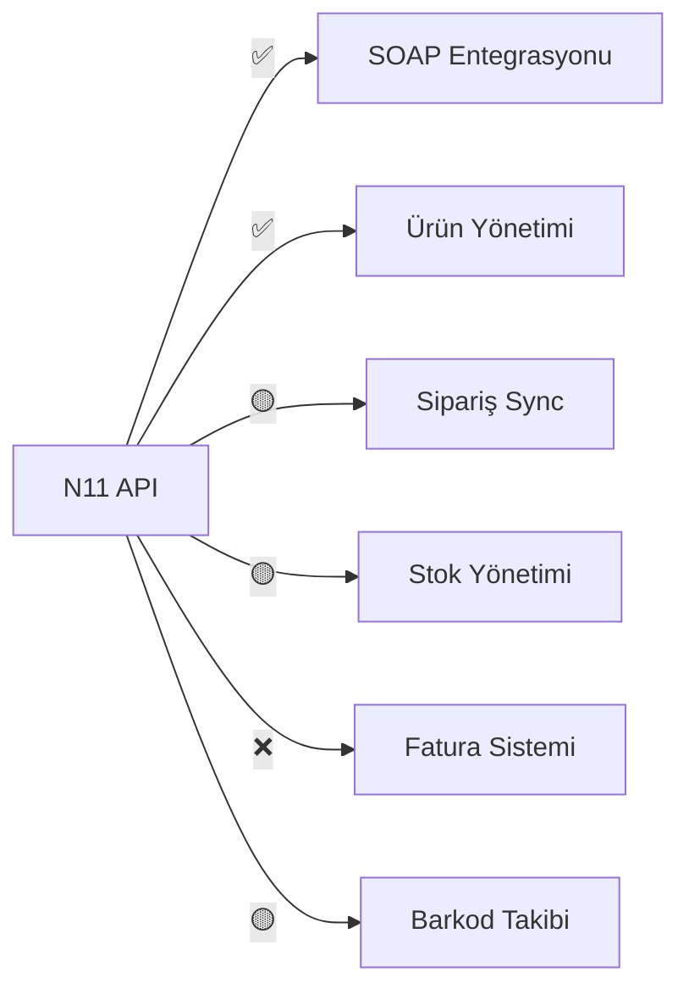

**Mevcut Dosyalar:**
- `system/helper/n11_helper.php` ✅
- `system/library/entegrator/n11.php` ✅
- `upload/system/library/meschain/helper/n11.php` ✅

#### 🥉 Amazon - %70 Tamamlandı
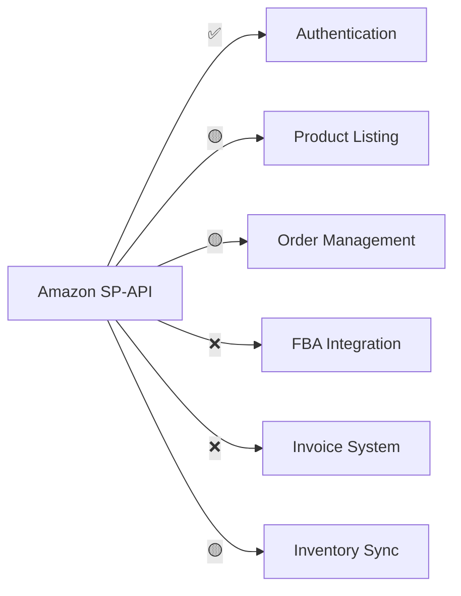

**Mevcut Dosyalar:**
- `system/library/entegrator/amazon.php` ✅
- `upload/system/library/meschain/helper/amazon.php` ✅
- `upload/system/library/meschain/api/AmazonApiClient.php` ✅

### 2.2 Sonraki Faz Pazaryerleri (Faz 2)
- **Hepsiburada** - %60 Tamamlandı
- **Ozon** - %45 Tamamlandı
- **Pazarama** - %30 Tamamlandı
- **eBay** - %25 Tamamlandı

---

## 3. 🚨 EKSİK BİLEŞENLER TESPİTİ

### 3.1 Kritik Eksiklikler

#### 📄 Fatura İşlemleri Sistemi
**Durum:** ❌ Eksik
**Gereksinimler:**
- E-Fatura entegrasyonu
- Türk vergi sistemi uyumluluğu
- Otomatik fatura kesme
- Fatura görüntüleme/indirme

#### 🏷️ Barkod Takip Sistemi
**Durum:** 🟡 Kısmi Mevcut
**Mevcut Özellikler:**
- Temel barkod alanları var
- Ürün eşleştirme mevcut

**Eksik Özellikler:**
- Otomatik barkod oluşturma
- Barkod doğrulama
- Çoklu barkod desteği

### 3.2 OpenCart Uyumluluk Sorunları

#### ❌ Modules Klasörü Sorunu
**Problem:** Mevcut `modules/` klasörü OpenCart 4.x standardına uygun değil
**Çözüm:** Tüm modüller `extension/meschain/` altına taşınmalı

#### ❌ OCMOD Yapısı
**Problem:** Eski OCMOD yapısı kullanılıyor
**Çözüm:** Yeni Extension API'sine geçiş gerekli

---

## 4. 🏗️ YENİDEN YAPILANDIRMA ÖNERİSİ

### 4.1 Önerilen Klasör Yapısı

```
meschain-sync-enterprise/
├── extension/
│   └── meschain/
│       ├── admin/
│       │   ├── controller/
│       │   │   ├── dashboard/
│       │   │   │   └── meschain_dashboard.php
│       │   │   └── marketplace/
│       │   │       ├── trendyol.php
│       │   │       ├── n11.php
│       │   │       └── amazon.php
│       │   ├── model/
│       │   │   └── marketplace/
│       │   │       ├── trendyol.php
│       │   │       ├── n11.php
│       │   │       └── amazon.php
│       │   └── view/
│       │       └── template/
│       │           └── marketplace/
│       │               ├── trendyol.twig
│       │               ├── n11.twig
│       │               └── amazon.twig
│       ├── catalog/
│       │   └── controller/
│       │       └── webhook/
│       │           ├── trendyol.php
│       │           ├── n11.php
│       │           └── amazon.php
│       └── system/
│           └── library/
│               ├── meschain/
│               │   ├── api/
│               │   ├── helper/
│               │   ├── invoice/
│               │   └── barcode/
│               └── marketplace/
│                   ├── trendyol/
│                   ├── n11/
│                   └── amazon/
├── install.xml
└── README.md
```

### 4.2 Teknik Mimari Önerisi

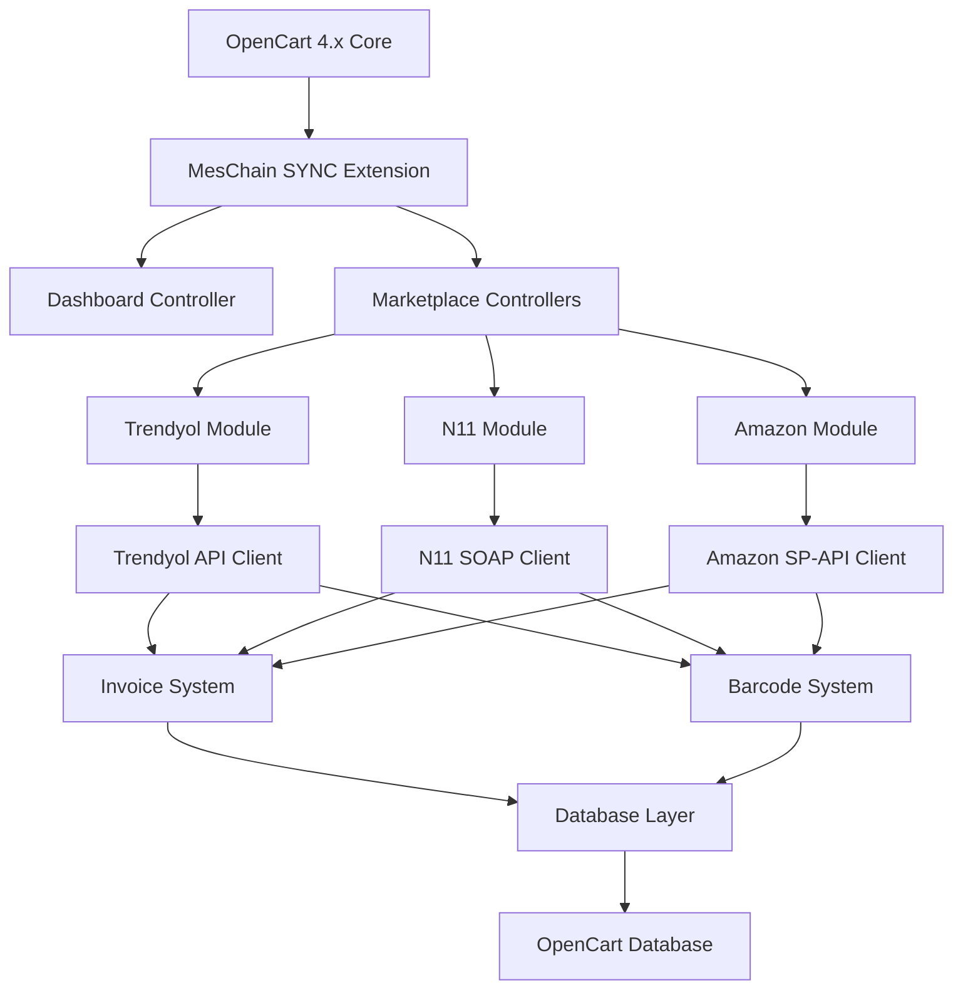

---

## 5. 📋 ÖNCELIK SIRALAMASINA GÖRE PLAN

### 5.1 Faz 1: Temel Altyapı (1-2 Hafta)
1. **OpenCart 4.x Uyumlu Klasör Yapısı**
   - Mevcut dosyaları yeni yapıya taşı
   - Extension manifest oluştur
   - Install/Uninstall scriptleri

2. **MesChain SYNC Dashboard**
   - Merkezi yönetim paneli
   - Pazaryeri durumu gösterimi
   - Sistem sağlık kontrolü

3. **Fatura Sistemi Altyapısı**
   - E-Fatura API entegrasyonu
   - Türk vergi sistemi uyumluluğu
   - Fatura şablonları

4. **Barkod Sistemi Altyapısı**
   - Otomatik barkod oluşturma
   - Barkod doğrulama
   - Ürün eşleştirme

### 5.2 Faz 2: Trendyol Tamamlama (1 Hafta)
1. **Trendyol %100 Tamamlama**
   - Fatura entegrasyonu
   - Gelişmiş barkod sistemi
   - Test coverage artırımı
   - Performans optimizasyonu

### 5.3 Faz 3: N11 Tamamlama (1-2 Hafta)
1. **N11 API Geliştirme**
   - Sipariş senkronizasyonu
   - Stok yönetimi
   - Fatura entegrasyonu
   - Barkod sistemi

### 5.4 Faz 4: Amazon Tamamlama (2 Hafta)
1. **Amazon SP-API Geliştirme**
   - Product listing tamamlama
   - Order management
   - FBA entegrasyonu
   - Invoice sistemi

---

## 6. 🎯 TEKNİK MİMARİ ÖNERİLERİ

### 6.1 Modüler Yapı
- Her pazaryeri bağımsız modül
- Ortak API interface
- Plugin architecture
- Event-driven sistem

### 6.2 Güvenlik
- API key şifreleme
- Rate limiting
- Webhook doğrulama
- Audit logging

### 6.3 Performans
- Asenkron işlemler
- Cache sistemi
- Database optimizasyonu
- Queue management

---

## 7. 📊 MALIYET VE SÜRE TAHMİNİ

### 7.1 Geliştirme Süresi
- **Faz 1 (Altyapı):** 1-2 hafta
- **Faz 2 (Trendyol):** 1 hafta
- **Faz 3 (N11):** 1-2 hafta
- **Faz 4 (Amazon):** 2 hafta
- **Toplam:** 5-7 hafta

### 7.2 Kaynak İhtiyacı
- **Backend Developer:** 1 kişi (full-time)
- **Frontend Developer:** 1 kişi (part-time)
- **DevOps/Test:** 1 kişi (part-time)

---

## 8. 🚀 SONUÇ VE ÖNERİLER

### 8.1 Güçlü Yanlar
✅ Trendyol entegrasyonu %95 tamamlanmış
✅ OpenCart 4.x altyapısı mevcut
✅ Modüler yapı temeleri atılmış
✅ Kapsamlı dokümantasyon mevcut

### 8.2 İyileştirme Alanları
❌ Klasör yapısı OpenCart standardına uygun değil
❌ Fatura sistemi eksik
❌ Barkod takip sistemi yetersiz
❌ Test coverage düşük

### 8.3 Kritik Başarı Faktörleri
1. **Öncelik odaklı yaklaşım:** Sadece Trendyol, N11, Amazon
2. **OpenCart uyumluluğu:** Extension standardlarına tam uyum
3. **Modüler mimari:** Bağımsız, ölçeklenebilir modüller
4. **Fatura/Barkod altyapısı:** Temel sistemlerin önce tamamlanması

Bu analiz sonuçlarına göre, projenin yeniden yapılandırılması ve öncelikli pazaryerlerinin tamamlanması için detaylı bir plan hazırlanmıştır. Bir sonraki adımda bu planı markdown dosyasına kaydedebilir ve implementasyon için Code moduna geçebiliriz.

Kullanıcının kararları doğrultusunda kapsamlı bir yeniden yapılandırma planı hazırlamam gerekiyor. Mevcut analiz raporunu okudum ve şimdi detaylı bir plan oluşturacağım. Kullanıcı şu tercihleri yaptı:

1. E-Fatura entegrasyonu (en kapsamlı)
2. Otomatik barkod sistemi (en gelişmiş)
3. Tamamen yeni extension yapısı (köklü değişim)
4. Staging ortamında test (güvenli yaklaşım)

Bu kararlar doğrultusunda detaylı bir plan hazırlayıp Mermaid diagramları ile destekleyeceğim.

# 🏗️ MesChain-Sync Enterprise Yeniden Yapılandırma Planı

Kararlarınız doğrultusunda kapsamlı bir yeniden yapılandırma planı hazırladım. Bu plan, E-Fatura entegrasyonu, otomatik barkod sistemi, tamamen yeni extension yapısı ve staging ortamında test yaklaşımını içeriyor.

## 📋 Detaylı Yeniden Yapılandırma Planı

### 🎯 Plan Özeti
- **Hedef:** OpenCart 4.x uyumlu, modüler, ölçeklenebilir sistem
- **Kapsam:** Trendyol, N11, Amazon entegrasyonları
- **Özel Sistemler:** E-Fatura + Otomatik Barkod
- **Yaklaşım:** Staging → Production

---

## 🏛️ Yeni Mimari Tasarım

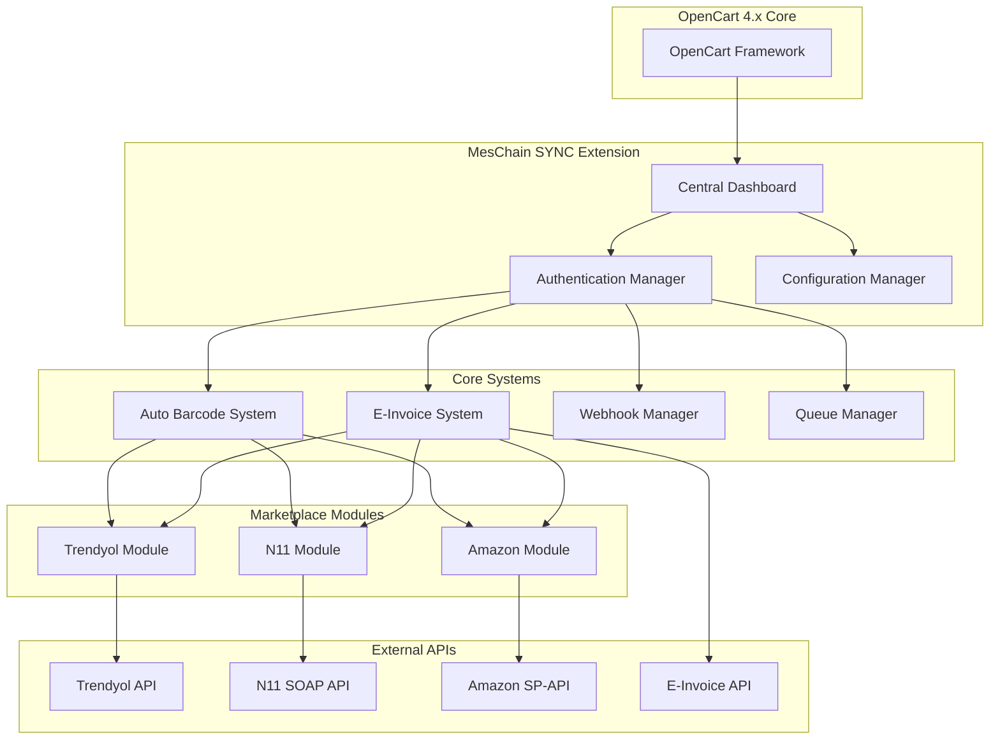

---

## 📁 Yeni Klasör Yapısı

```
extension/meschain/
├── 📋 install.xml                    # Extension manifest
├── 📋 README.md                      # Kurulum rehberi
├──
├── admin/                            # Admin panel bileşenleri
│   ├── controller/
│   │   ├── dashboard/
│   │   │   └── meschain.php          # Ana dashboard
│   │   ├── marketplace/
│   │   │   ├── trendyol.php          # Trendyol yönetimi
│   │   │   ├── n11.php               # N11 yönetimi
│   │   │   └── amazon.php            # Amazon yönetimi
│   │   ├── system/
│   │   │   ├── invoice.php           # E-Fatura yönetimi
│   │   │   └── barcode.php           # Barkod yönetimi
│   │   └── settings/
│   │       └── meschain.php          # Genel ayarlar
│   │
│   ├── model/
│   │   ├── marketplace/
│   │   │   ├── trendyol.php
│   │   │   ├── n11.php
│   │   │   └── amazon.php
│   │   └── system/
│   │       ├── invoice.php
│   │       └── barcode.php
│   │
│   ├── view/template/
│   │   ├── dashboard/
│   │   │   └── meschain.twig         # Ana dashboard UI
│   │   ├── marketplace/
│   │   │   ├── trendyol.twig
│   │   │   ├── n11.twig
│   │   │   └── amazon.twig
│   │   └── system/
│   │       ├── invoice.twig
│   │       └── barcode.twig
│   │
│   └── language/
│       ├── en-gb/
│       └── tr-tr/
│
├── catalog/                          # Frontend bileşenleri
│   ├── controller/
│   │   └── webhook/
│   │       ├── trendyol.php
│   │       ├── n11.php
│   │       └── amazon.php
│   └── model/
│       └── webhook/
│           ├── trendyol.php
│           ├── n11.php
│           └── amazon.php
│
└── system/                           # Çekirdek kütüphaneler
    ├── library/
    │   ├── meschain/
    │   │   ├── core/
    │   │   │   ├── base_api.php      # Temel API sınıfı
    │   │   │   ├── config.php        # Yapılandırma yöneticisi
    │   │   │   └── logger.php        # Loglama sistemi
    │   │   │
    │   │   ├── invoice/
    │   │   │   ├── e_invoice.php     # E-Fatura API client
    │   │   │   ├── template.php      # Fatura şablonları
    │   │   │   └── validator.php     # Fatura doğrulama
    │   │   │
    │   │   ├── barcode/
    │   │   │   ├── generator.php     # Barkod oluşturucu
    │   │   │   ├── validator.php     # Barkod doğrulayıcı
    │   │   │   └── scanner.php       # Barkod tarayıcı
    │   │   │
    │   │   └── webhook/
    │   │       ├── handler.php       # Webhook işleyici
    │   │       ├── validator.php     # Webhook doğrulayıcı
    │   │       └── queue.php         # Kuyruk yöneticisi
    │   │
    │   └── marketplace/
    │       ├── trendyol/
    │       │   ├── api_client.php
    │       │   ├── product_sync.php
    │       │   ├── order_sync.php
    │       │   └── webhook_handler.php
    │       │
    │       ├── n11/
    │       │   ├── soap_client.php
    │       │   ├── product_sync.php
    │       │   ├── order_sync.php
    │       │   └── webhook_handler.php
    │       │
    │       └── amazon/
    │           ├── sp_api_client.php
    │           ├── product_sync.php
    │           ├── order_sync.php
    │           └── fba_handler.php
    │
    └── config/
        ├── meschain.php              # Ana yapılandırma
        ├── marketplace.php           # Pazaryeri ayarları
        └── staging.php               # Staging ortam ayarları
```

---

## 🚀 Faz Bazlı Geliştirme Planı

### 📅 Faz 1: Temel Altyapı (2 Hafta)

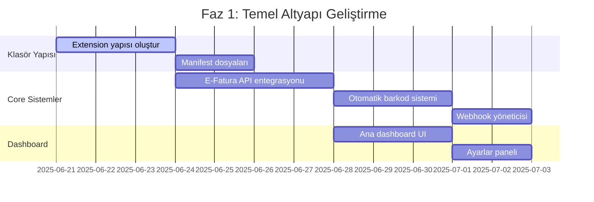

**Detaylı Görevler:**

1. **Extension Yapısı (3 gün)**
   - Klasör yapısını oluştur
   - [`install.xml`](extension/meschain/install.xml) manifest dosyası
   - Kurulum/kaldırma scriptleri
   - OpenCart 4.x uyumluluk testleri

2. **E-Fatura Sistemi (4 gün)**
   - Türk E-Fatura API entegrasyonu
   - [`EInvoiceClient`](extension/meschain/system/library/meschain/invoice/e_invoice.php) sınıfı
   - Fatura şablonları ve doğrulama
   - Vergi hesaplama modülü

3. **Otomatik Barkod Sistemi (3 gün)**
   - [`BarcodeGenerator`](extension/meschain/system/library/meschain/barcode/generator.php) sınıfı
   - EAN-13, Code128 desteği
   - Barkod doğrulama ve çakışma kontrolü
   - Ürün eşleştirme algoritması

4. **Merkezi Dashboard (3 gün)**
   - [`MeschainDashboard`](extension/meschain/admin/controller/dashboard/meschain.php) controller
   - Real-time durum gösterimi
   - Sistem sağlık kontrolleri
   - Pazaryeri bağlantı durumları

### 📅 Faz 2: Trendyol Tamamlama (1 Hafta)

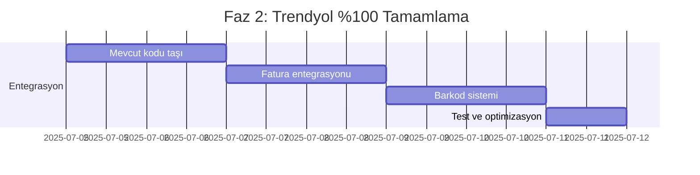

**Detaylı Görevler:**

1. **Kod Taşıma (2 gün)**
   - Mevcut Trendyol kodunu yeni yapıya taşı
   - [`TrendyolController`](extension/meschain/admin/controller/marketplace/trendyol.php) güncelle
   - API client'ı yeni yapıya uyarla

2. **Fatura Entegrasyonu (2 gün)**
   - Trendyol siparişleri için otomatik fatura kesme
   - E-Fatura API ile entegrasyon
   - Fatura durumu takibi

3. **Barkod Sistemi (2 gün)**
   - Trendyol ürünleri için otomatik barkod
   - Mevcut barkodları doğrulama
   - Çoklu barkod desteği

### 📅 Faz 3: N11 Tamamlama (1.5 Hafta)

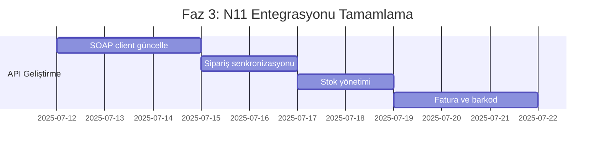

**Detaylı Görevler:**

1. **N11 SOAP Client (3 gün)**
   - [`N11SoapClient`](extension/meschain/system/library/marketplace/n11/soap_client.php) güncelle
   - API rate limiting
   - Hata yönetimi ve retry mekanizması

2. **Sipariş Senkronizasyonu (2 gün)**
   - Otomatik sipariş çekme
   - Durum güncellemeleri
   - Kargo takibi entegrasyonu

3. **Sistem Entegrasyonları (3 gün)**
   - E-Fatura entegrasyonu
   - Otomatik barkod sistemi
   - Stok senkronizasyonu

### 📅 Faz 4: Amazon Tamamlama (2 Hafta)

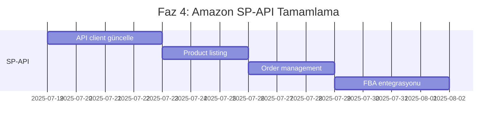

**Detaylı Görevler:**

1. **Amazon SP-API Client (4 gün)**
   - [`AmazonSpApiClient`](extension/meschain/system/library/marketplace/amazon/sp_api_client.php) güncelle
   - OAuth2 token yönetimi
   - Multi-region desteği

2. **Product Listing (3 gün)**
   - Ürün listeleme API'si
   - Kategori eşleştirme
   - Fiyat ve stok güncellemeleri

3. **FBA Entegrasyonu (4 gün)**
   - FBA inventory yönetimi
   - Shipment oluşturma
   - FBA fee hesaplama

---

## 🧪 Staging Ortamı Kurulumu

### 🏗️ Staging Altyapısı

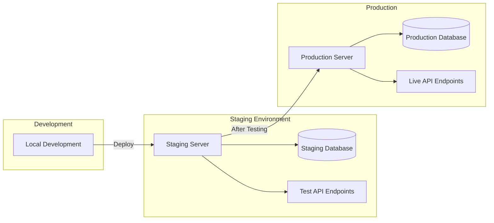

**Staging Ortamı Özellikleri:**
- Production'ın tam kopyası
- Test API endpoint'leri
- Sandbox pazaryeri hesapları
- Otomatik test suite'i
- Performance monitoring

---

## 🔧 Teknik Özellikler

### 🛡️ Güvenlik Özellikleri
- **API Key Encryption:** AES-256 şifreleme
- **Rate Limiting:** Redis tabanlı
- **Webhook Validation:** HMAC doğrulama
- **Audit Logging:** Tüm işlemler loglanır
- **IP Whitelisting:** Güvenli erişim

### ⚡ Performans Optimizasyonları
- **Asenkron İşlemler:** Queue tabanlı
- **Cache Sistemi:** Redis/Memcached
- **Database Indexing:** Optimized queries
- **CDN Integration:** Static asset'ler için
- **Lazy Loading:** UI bileşenleri için

### 📊 Monitoring ve Analytics
- **Real-time Dashboard:** Sistem durumu
- **Error Tracking:** Sentry entegrasyonu
- **Performance Metrics:** New Relic
- **API Usage Analytics:** Custom dashboard
- **Business Intelligence:** Satış raporları

---

## 📋 Kalite Kontrol Süreci

### 🧪 Test Stratejisi

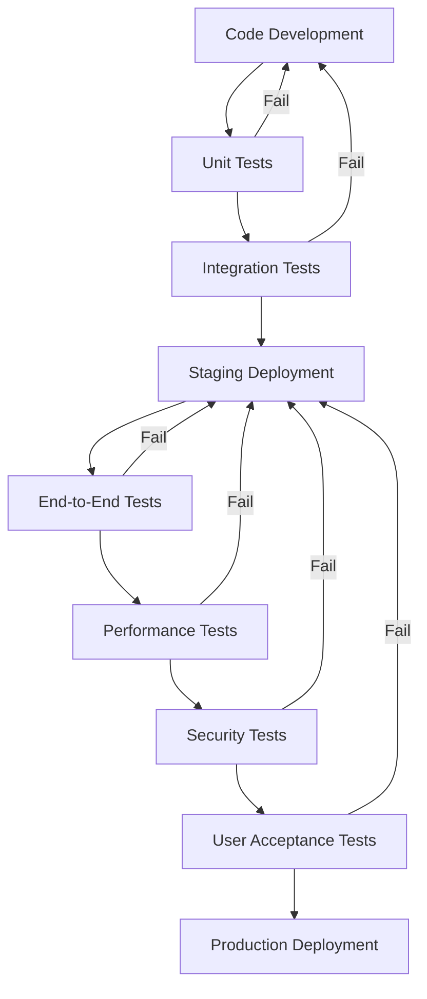

**Test Kapsamı:**
- **Unit Tests:** %90+ code coverage
- **Integration Tests:** API endpoint'leri
- **E2E Tests:** Kullanıcı senaryoları
- **Performance Tests:** Load testing
- **Security Tests:** Penetration testing

---

Bu detaylı plan, kararlarınız doğrultusunda hazırlanmış kapsamlı bir yeniden yapılandırma stratejisidir. Plan, E-Fatura entegrasyonu, otomatik barkod sistemi, tamamen yeni extension yapısı ve staging ortamında test yaklaşımını içermektedir.
