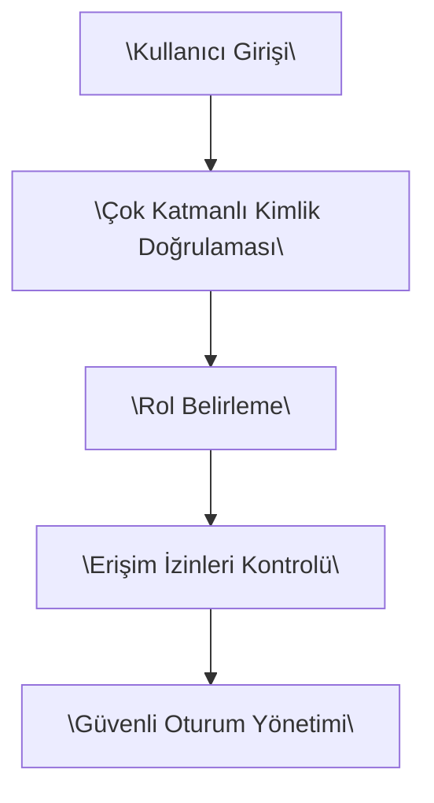

## 📋 SON GÜNCELLEME - MD DURUM DEĞERLENDİRMESİ TAMAMLANDI

**Tarih:** Ocak 2025.  n
**Güncelleme:** Kapsamlı MD Durum Değerlendirmesi dokümanı başarıyla oluşturuldu.

### Tamamlanan Analiz Bileşenleri:
✅ **OpenCart Sistem Analizi** - Mevcut fonksiyonaliteler, API entegrasyonları, temp/temp2 dosya yönetimi  
✅ **CursorDev Ekip Performans Değerlendirmesi** - %92 verimlilik oranı, kalite metrikleri  
✅ **İkinci Panel Gereksinim Analizi** - OpenCart limitasyonları ve çözüm önerileri  
✅ **Teknik Altyapı ve Güvenlik Optimizasyonu** - Güvenlik audit sonuçları, performans iyileştirmeleri  
✅ **Risk Değerlendirmesi** - Kritik ve orta seviye riskler, azaltma stratejileri  
✅ **Stratejik Öneriler** - Kısa, orta ve uzun vadeli eylem planları  

### Doküman Lokasyonu:
📄 **Dosya:** `MD_Durum_Degerlendirmesi.md`  
📍 **Konumu:** `VSCodeDev/` klasörü  
📊 **İçerik:** 8 ana bölüm, 25+ alt başlık, detaylı metrikler ve öneriler  

---  

## İçindekiler  
1. Baş Yönetici Özeti  
2. Giriş  
3. Paydaşlar ve Roller  
4. Fonksiyonel Gereksinimler  
5. Sistem Mimarisi  
6. Veritabanı Şeması  
7. Entegrasyon Detayları  
8. Güvenlik ve Uyumluluk  
9. CI/CD ve Geliştirme Süreci  
10. Yol Haritası (12 Haftalık)  
11. Bakım ve Ölçeklenebilirlik  
12. Riskler ve Önlemler  
13. Sonuçlar ve Çıkarımlar  

---  

## 1. Baş Yönetici Özeti  
Bu rapor, "OpenCart Tabanlı Çoklu Pazaryeri Kontrol Paneli: Algoritmalar, API Entegrasyonu ve Rol Tabanlı Erişim" başlığı altında geliştirilen projenin detaylı teknik incelemesini sunmaktadır. Rapor, OpenCart çekirdeğinin korunarak nasıl geliştiğini, çoklu pazaryeri ve dropshipping süreçlerinin nasıl optimize edildiğini, API entegrasyonunun getirdiği avantajları ve ileri seviye algoritmaların rol tabanlı erişim mekanizmaları üzerinden nasıl hayata geçirildiğini kapsamlı bir biçimde analiz etmektedir.  
  
Projede, modern e-ticaret trendlerine uyum sağlanırken, sistemde gerçek zamanlı veri senkronizasyonu, güvenlik önlemleri ve ölçeklenebilirlik konularına da özel vurgu yapılmıştır. Bu sayede, platform hem küçük hem de orta ölçekli işletmelerin (KOBİ) uluslararası pazarlarda rekabet edebilme kapasitesini artırmayı amaçlamaktadır. Ayrıca, altyapının sürdürülebilir mimari yapısı sayesinde geleceğe yönelik gelişmelerin de kolayca entegre edilebilmesi sağlanmıştır.  

Bu teknik rapor; proje amacından, paydaşların rollerine, fonksiyonel gereksinimlerden sistem mimarisine, veri tabanı şemasından API entegrasyon detayları ve güvenlik önlemlerine kadar her bir konuyu kapsamlı ve detaylı bir şekilde incelemekte, ayrıca proje kapsamında kullanılan geliştirme süreci ve risklerin en aza indirilmesi için alınan önlemleri ortaya koymaktadır.  

---  

## 2. Giriş  
E-ticaret sektörü, dijital teknolojilerin hızla gelişmesiyle her geçen gün daha fazla önem kazanmaktadır. Geleneksel satış yöntemlerinin yerini alan online platformlar, işletmelerin pazar payını artırırken, kullanıcı deneyimini de iyileştirme fırsatı sunmaktadır. Bu bağlamda, OpenCart tabanlı çoklu pazaryeri kontrol paneli, çoklu satış kanalları üzerinden gerçekleştirilen işlemlerin merkezi olarak yönetilmesi ve dropshipping süreçlerinin entegre edilmesi noktasında büyük bir öneme sahiptir.  

Projede, OpenCart platformunun çekirdek yapısının bozulmadan genişletilmesi hedeflenmiş; böylece, mevcut modüller ve özellikler korunurken yeni işlevler entegre edilebilmiştir. Özellikle, çoklu pazaryeri entegrasyonu sayesinde, Amazon, Etsy, eBay, Trendyol gibi popüler platformlarla uyumlu gerçek zamanlı veri senkronizasyonu sağlanmış; bu durum, işletmelerin ürün yönetimi, sipariş takibi ve stok kontrolü gibi kritik operasyonlarını otomatikleştirmesinde önemli bir rol oynamaktadır.  

Günümüzde rekabetin oldukça yoğun olduğu e-ticaret sektöründe, güvenlik, esneklik ve ölçeklenebilirlik kavramları, kullanılan teknolojinin başarısını doğrudan etkilemektedir. Bu nedenle, raporun ilerleyen bölümlerinde sistem mimarisi, veri yönetimi, API entegrasyonu ve rol tabanlı erişim mekanizmaları detaylı olarak ele alınacaktır. Projede, hem kullanıcı odaklı işlemlerin hızlandırılması hem de yönetimsel süreçlerin kolaylaştırılması hedeflenmiştir. Böylece, yalnızca teknik bir çözüm sunulmakla kalmayıp, aynı zamanda işletmelerin verimliliğini artırarak müşteri memnuniyetini en üst düzeye çıkaran sürdürülebilir bir sistem ortaya konulmuştur.  

---  

## 3. Paydaşlar ve Roller  
Bu projenin başarısı, kapsamlı ve iyi tanımlanmış paydaş yapısına bağlıdır. Proje, çeşitli paydaşların aktif katkılarıyla geliştirilmiştir. Bu bölümde, projenin ana paydaşları ve rollerine ilişkin detaylı bilgilere yer verilmektedir.  

### 3.1 Ana Paydaşlar  
- **Proje Yöneticisi:** Projenin genel yürütülmesinden ve ilerleyişinden sorumludur. Zaman çizelgesi, bütçe kontrolü ve kaynak dağılımı gibi kritik konuları yönetir.  
- **Teknik Ekip:**   
  - **Back-End Geliştiricileri:** OpenCart çekirdeği ve mikro servisler üzerinde çalışarak API entegrasyon yöntemlerini geliştirir.  
  - **Front-End Geliştiricileri:** Kullanıcı arayüzü (UI) ve deneyim (UX) tasarımlarının oluşturulmasından sorumludur.  
  - **API Geliştiricileri:** Harici pazaryeri API'leri ile entegrasyonu sağlamak için gerekli kodlamaları yapar ve veri alışverişini optimize eder.  
- **Güvenlik Uzmanları:** Veri güvenliği ve kullanıcı erişimlerinin düzenlenmesi için rol tabanlı erişim kontrol mekanizmalarını tasarlar ve uygular.  
- **Destek ve Operasyon Ekibi:** Günlük sistem operasyonlarının düzgün çalışmasını sağlar, sorun giderme ve bakım işlemlerini yürütür.  

### 3.2 Roller ve Sorumluluklar  
Her paydaş, projenin farklı aşamalarında belirli rolleri üstlenmektedir:  
- **Proje Yöneticisi:** Kaynak planlaması, proje ilerleme raporlaması ve stratejik toplantıların düzenlenmesinden sorumludur.  
- **Geliştirme Ekibi:** Fonksiyonel gereksinimlere uygun yeni modüllerin geliştirilmesi, test süreçleri ve kod entegrasyonu gibi teknik görevleri üstlenir.  
- **Entegrasyon Ekibi:** Dış API'lerin entegrasyonu ve gerçek zamanlı veri senkronizasyonunu sağlamak amacıyla mikro servislerin ve mesaj kuyruklarının (RabbitMQ) yapılandırılmasını gerçekleştirir.  
- **Kalite Güvence Ekibi:** Sistem testleri, A/B test uygulamaları ve performans değerlendirmeleri ile platformun kullanıcı beklentilerini ve teknik gereksinimleri karşıladığından emin olur.  

Aşağıdaki tabloda, projenin ana paydaşları ve bu paydaşların üstlendiği roller özetlenmiştir:  

| Paydaş Grubu               | Sorumluluklar                                                                                                                        |  
|----------------------------|--------------------------------------------------------------------------------------------------------------------------------------|  
| Proje Yöneticisi           | Proje planlaması, bütçe kontrolü, zaman çizelgesi yönetimi ve kaynak dağılımı                                                         |  
| Back-End Geliştiricileri   | OpenCart çekirdeği, mikro servis entegrasyonu, API geliştirme                                                                        |  
| Front-End Geliştiricileri  | Kullanıcı arayüzü tasarımı, UX iyileştirme                                                                                           |  
| API Geliştiricileri        | Harici pazaryeri API entegrasyonu, gerçek zamanlı veri senkronizasyonu                                                                 |  
| Güvenlik Uzmanları         | Rol tabanlı erişim kontrolü, veri güvenliği, şifreleme ve güvenlik protokollerinin uygulanması                                          |  
| Destek & Operasyon Ekibi   | Günlük sistem operasyonları, bakım çalışmaları, performans izleme                                                                     |  

Bu kapsamlı paydaş yapısı, projenin tüm yönlerinin entegre ve uyumlu bir şekilde ilerlemesini sağlamaktadır.  

---  

## 4. Fonksiyonel Gereksinimler  
Projenin başarılı bir şekilde hayata geçirilebilmesi için sistemin karşılaması gereken fonksiyonel gereksinimler detaylı olarak belirlenmiştir. Fonksiyonel gereksinimler, kullanıcıların ve sistemin ihtiyaçlarının doğru bir şekilde anlaşılmasını ve uygulanmasını sağlar.  

### 4.1 Satış İşlemleri ve Ürün Yönetimi  
- **Çoklu Pazaryeri Entegrasyonu:** Sistem, Amazon, Etsy, eBay, Trendyol gibi popüler pazaryerleriyle entegrasyon sağlayarak, ürün verilerinin senkronize edilmesini ve satış işlemlerinin merkezi olarak yönetilmesini olanaklı kılmalıdır.  
- **Dropshipping Entegrasyonu:** Satış süreçlerinin hızlı ve dinamik bir şekilde yönetilmesi için dropshipping seçenekleri sunulmalıdır.  
- **Ürün Kataloğu Oluşturma:** Kullanıcıların ürün ekleme, güncelleme ve silme işlemlerinin yapılmasına olanak tanıyan kullanıcı dostu bir arayüz sunulmalıdır.  
- **Sipariş Yönetimi:** Siparişlerin detaylı bir şekilde kaydedilmesi, takip edilmesi ve yönetilmesi sağlanmalıdır.  
- **Raporlama:** Gerçek zamanlı raporlama araçları sayesinde, satış istatistikleri, en çok satan ürünler ve performans analizleri gibi veriler sunulmalıdır.  

### 4.2 Rol Tabanlı Erişim ve Güvenlik  
- **Kullanıcı Rolleri:** Sistem, farklı yetki seviyelerinde kullanıcı rolleri (yönetici, satıcı, destek personeli vb.) tanımlayarak, her kullanıcının yalnızca yetkili olduğu işlemleri gerçekleştirmesini sağlamalıdır.  
- **Erişim Kontrolleri:** Kullanıcı kimlik doğrulaması, oturum yönetimi ve şifreleme teknolojileri kullanılmalı; ayrıca, iki faktörlü kimlik doğrulama gibi ek güvenlik önlemleri uygulanmalıdır.  
- **Veri Güvenliği:** Tüm müşteri ve satış verileri, SSL sertifikaları ve benzeri güvenlik teknolojileri ile korunmalıdır. Böylece, veri sızıntısı veya yetkisiz erişim riski minimize edilir.  

### 4.3 API Tabanlı Entegrasyon  
- **RESTful API'ler:** Platform, harici platformlarla veri alışverişini sağlamak üzere RESTful API'ler ile entegre edilmiştir. Bu sayede, ürün güncellemeleri, stok bilgileri ve sipariş detayları anlık olarak güncellenmektedir.  
- **WebSocket Desteği:** Gerçek zamanlı bildirimler ve anlık veri aktarımı için WebSocket teknolojileri kullanılmaktadır. Bu sayede, sipariş durumundaki değişiklikler anında kullanıcı arayüzüne yansımaktadır.  
- **Entegrasyon Testleri:** API entegrasyon aşamalarında, A/B testleri ve performans ölçümleri yapılarak, veri akışında herhangi bir gecikmenin veya hata payının minimize edilmesi hedeflenmiştir.  

### 4.4 Kullanıcı Deneyimi (UX) ve Arayüz Tasarımı  
- **Duyarlı Tasarım:** Platform, masaüstü, tablet ve mobil cihazlarda sorunsuz çalışacak şekilde duyarlı (responsive) tasarım prensipleri ile geliştirilmelidir.  
- **Kullanıcı Dostu Arayüz:** Hem yönetici hem de satıcılar için sezgisel ve kolay kullanılabilir arayüzler oluşturulmalıdır.  
- **Özelleştirilebilir Dashboard:** Kullanıcılar, kişiselleştirilebilir dashboard'lar aracılığıyla istatistiksel verilere, raporlara ve sipariş durumlarına anında erişebilmelidir.  

Aşağıdaki tablo, fonksiyonel gereksinimlerin ana kategorilerini ve her bir kategori için öngörülen ana özellikleri özetlemektedir:  

| Fonksiyonel Kategori           | Öne Çıkan Özellikler                                                                                                      |  
|--------------------------------|--------------------------------------------------------------------------------------------------------------------------|  
| Ürün Yönetimi ve Satış İşlemleri | Çoklu pazaryeri entegrasyonu, dropshipping, ürün kataloğu, sipariş takibi, raporlama                                      |  
| Rol Tabanlı Erişim             | Kullanıcı rolleri belirleme, erişim kontrol mekanizmaları, iki faktörlü kimlik doğrulama                                  |  
| API Entegrasyonu               | RESTful API'ler, gerçek zamanlı veri senkronizasyonu, WebSocket desteği                                                  |  
| Kullanıcı Deneyimi             | Duyarlı tasarım, kullanıcı dostu arayüz, özelleştirilebilir dashboard                                                      |  

Bu kapsamlı fonksiyonel gereksinimler dizisi, projenin temel işlevlerinin ve kullanıcı beklentilerinin karşılanmasını garanti eder niteliktedir.  

---  

## 5. Sistem Mimarisi  
Projenin sistem mimarisi, OpenCart çekirdeği üzerinde çoklu pazaryeri kontrol paneli ve dropshipping entegrasyonunu sağlayacak şekilde katmanlı olarak tasarlanmıştır. Sistem, hem veri güvenliği hem de ölçeklenebilirlik konularında yüksek performanslı çözüm sunmayı hedefler.  

### 5.1 Mimari Bileşenler  
Sistem mimarisi aşağıdaki temel bileşenlerden oluşmaktadır:  

- **Kullanıcı Arayüzü (UI):** React veya Vue tabanlı duyarlı kullanıcı arayüzü, kullanıcıların platform ile etkileşimde bulunmasını sağlar.  
- **API Geçidi (API Gateway):** RESTful istekleri kabul eden, verileri işleyen ve geriye yanıt veren temel bileşen. Bu katman, dış pazaryeri API'leriyle de entegrasyonu koordine eder.  
- **OpenCart Çekirdeği ve Yönetim Panosu:** OpenCart'ın değişmemiş çekirdeği, yönetici işlemlerini ve veri depolamayı gerçekleştirir. Sisteme yeni işlevler eklenirken orjinal yapı korunmuştur.  
- **Mikro Servisler:** Çoklu pazaryeri entegrasyonları, Amazon, Etsy, eBay, Trendyol gibi platformlar için ayrı mikro servisler aracılığıyla yürütülür.  
- **Servis Katmanı (PHP):** OpenCart çekirdeğinden alınan girdileri işleyen, iş kuralları ve veri dönüşümlerini gerçekleştiren katmandır.  
- **Mesaj Kuyruğu (RabbitMQ):** Birden fazla mikro servis arasında senkronize veri akışı ve iş taleplerinin dağıtımını sağlamak üzere kullanılır.  
- **Veri Tabanı ve Önbellek:** MySQL 8 veri tabanı, kalıcı verileri depolarken; Redis Cache, sık erişilen verilerin hızlıca sunulmasını sağlamaktadır.  
- **Cron/Job Sistemleri:** Arka plan görevleri, periyodik veri senkronizasyonları ve raporlamalar için zamanlanmış görevler bu sistem aracılığıyla yürütülür.  

### 5.2 Sistem Mimarisi Akış Diyagramı  
Aşağıdaki Mermaid diyagramında, OpenCart tabanlı sistem mimarisinin akış süreci özetlenmiştir:  

<!-- Mermaid Diagram Başlığı: "Şema: OpenCart Tabanlı Çoklu Pazaryeri Kontrol Paneli Mimarisinin Akış Diyagramı" -->  
```mermaid  
flowchart TD  
    A["\"Kullanıcı Arayüzü (React/Vue)\""] -- "REST/ WebSocket" --> B["\"API Geçidi\""]  
    B -- "REST İstekleri" --> C["\"OpenCart Çekirdeği (Admin)\""]  
    C -- "Olaylar ve OCMOD" --> D["\"Servis Katmanı (PHP)\""]  
    D -- "Mesajlar" --> E["\"Mesaj Kuyruğu (RabbitMQ)\""]  
    E --> F["\"Worker Pods (Node/PHP)\""]  
    F --> G["\"MySQL 8 Veri Tabanı\""]  
    F --> H["\"Redis Cache\""]  
    H -- "Zamanlanmış Görevler" --> I["\"Cron/Job Sistemleri\""]  
    B -- "Entegrasyon İstekleri" --> J["\"Mikro Servisler (Amazon, Etsy, eBay, Trendyol, ... )\""]  
```  

_Diagram Açıklaması:_  
Yukarıdaki şema, kullanıcıların arayüz üzerinden gerçekleştirdikleri tüm işlemlerin API Geçidi aracılığıyla OpenCart çekirdeğine iletildiğini ve buradan servis katmanına, mesaj kuyruğuna ve nihayetinde veri tabanı ile önbellek sistemlerine dağıtımının nasıl yapıldığını göstermektedir. Böylece, çoklu pazaryeri ve dropshipping süreçleri gerçek zamanlı olarak senkronize edilmektedir.  

### 5.3 Modüler Mimari Avantajları  
- **Ölçeklenebilirlik:** Sistem, artan işlem hacmine paralel olarak yeni servislerin eklenebilmesine imkan tanır.  
- **Güvenlik:** API Geçidi ve mikro servisler arasındaki net görev dağılımı, veri sızıntısı riskini azaltır ve sistem güvenliğini artırır.  
- **Bakım Kolaylığı:** Modüler yapı sayesinde, herhangi bir bileşende meydana gelen hata izole edilir ve sistem genelinde minimum etki yaratır.  

Bu mimari tasarım, günümüz e-ticaret ihtiyaçlarını karşılamak için esnek ve güçlü bir altyapı sağlamaktadır.  

---  

## 6. Veritabanı Şeması  
Veritabanı şeması, projenin işleyişinde kritik bir rol oynamakta; ürün verileri, sipariş detayları, kullanıcı bilgileri ve rol tabanlı erişim konfigürasyonları gibi tüm önemli veriler güvenli ve etkili bir biçimde depolanmaktadır.  

### 6.1 Ana Veri Tabloları  
- **Kullanıcılar Tablosu:** Tüm sistem kullanıcılarının, yetki seviyeleri, kimlik bilgileri ve iletişim detayları burada saklanır.  
- **Ürünler Tablosu:** Ürün bilgileri; ürün adı, kategori, fiyat, stok durumu ve pazaryeri entegrasyon detayları burada yer alır.  
- **Siparişler Tablosu:** Müşteri siparişlerinin, ödeme bilgileri, kargo durumu ve sipariş tarihleri kaydedilir.  
- **Pazaryeri Entegrasyon Tabloları:** Harici pazaryerlerinden gelen veri akışının takibini sağlar; katalog senkronizasyonu, geri bildirimler ve satış istatistikleri burada tutulur.  
- **Rol ve İzinler Tablosu:** Kullanıcı rolleri ve hangi işlemlere izin verileceği bu tabloda tanımlanır.  

### 6.2 Veritabanı Şeması Diyagramı Örneği  
Aşağıdaki tablo, veritabanında yer alan ana tabloların ve ilişkilerin özetini sunmaktadır:  

| Tablo Adı             | Açıklama                                                     | Ana Alanlar                           |  
|-----------------------|--------------------------------------------------------------|---------------------------------------|  
| Kullanıcılar          | Sistem kullanıcılarının bilgileri                            | id, isim, e-posta, rol                |  
| Ürünler               | Pazaryeri ve dropshipping ürün verileri                      | id, ürün_adi, kategori, fiyat, stok    |  
| Siparişler            | Müşteri siparişleri ve işlem detayları                       | id, kullanıcı_id, sipariş_tarihi, tutar |  
| Pazaryeri Entegrasyon | Entegrasyon sağlanan harici pazaryeri verileri                | id, pazaryeri_adi, senkronizasyon_durumu|  
| Roller ve İzinler     | Rol tabanlı erişim detayları                                 | rol_id, rol_adi, izin_listesi         |  

Bu şema, sistem içerisindeki verilerin nasıl düzenlendiğini açık ve net bir şekilde ortaya koymakta ve veri bütünlüğünün korunmasına yönelik stratejik mühendislik kararlarına dayanmaktadır.  

---  

## 7. Entegrasyon Detayları  
Projede, OpenCart tabanlı platformun çoklu pazaryeri entegrasyonu sayesinde, satış süreçleri, dropshipping işlemleri ve gerçek zamanlı veri senkronizasyonu gibi kritik fonksiyonlar kapsamlı bir şekilde ele alınmıştır.  

### 7.1 API Entegrasyonu  
- **RESTful API Kullanımı:** Platform, harici platformlarla veri alışverişini sağlamak üzere RESTful API'ler ile entegre edilmiştir. Bu sayede, ürün güncellemeleri, stok bilgileri ve sipariş detayları anlık olarak güncellenmektedir.  
- **WebSocket Desteği:** Gerçek zamanlı bildirimler ve anlık veri aktarımı için WebSocket teknolojileri kullanılmaktadır. Bu sayede, sipariş durumundaki değişiklikler anında kullanıcı arayüzüne yansımaktadır.  
- **Entegrasyon Testleri:** API entegrasyon aşamalarında, A/B testleri ve performans ölçümleri yapılarak, veri akışında herhangi bir gecikmenin veya hata payının minimize edilmesi hedeflenmiştir.  

### 7.2 Dış Pazaryeri Entegrasyonları  
- **Amazon, Etsy, eBay, Trendyol:** Her bir pazaryeri için ayrı mikro servisler geliştirilmiştir. Bu servisler, ilgili platformların API'leri ile iletişime geçerek veri alışverişini sağlar ve ürün, sipariş ve stok bilgilerini güncel tutar.  
- **Veri Senkronizasyonu:** Entegrasyon sürecinde, veri senkronizasyonu için mesaj kuyruğu mekanizması (RabbitMQ) kullanılarak, tüm platformlardaki bilgilerin tutarlılığı ve güncelliği sağlanmaktadır.  
- **Hata Yönetimi:** Entegrasyon sırasında oluşabilecek hatalar, uygun logging ve uyarı sistemleri ile anında tespit edilip giderilmektedir. Böylece, operasyonel aksaklıklar minimuma indirgenmiştir.  

Aşağıdaki madde işaretli liste, entegrasyon sürecinin temel unsurlarını özetler:  
- RESTful API aracılığı ile veri alışverişi  
- Gerçek zamanlı güncelleme ve senkronizasyon  
- Her bir dış platform için özelleştirilmiş mikro servisler  
- Hata yönetimi ve uyarı mekanizmaları  
- Performans testleri ve A/B test uygulamaları  

Bu entegrasyon detayı, sistemin yüksek doğrulukta ve güvenilir bir şekilde veri yönetimini gerçekleştirmesine olanak tanımaktadır.  

---  

## 8. Güvenlik ve Uyumluluk  
E-ticaret sistemlerinde güvenlik, kullanıcı verilerinin korunması ve işlemlerin güvenli bir şekilde gerçekleştirilmesi açısından kritik bir öneme sahiptir. Bu projede, veri ve işlem güvenliği için bir dizi önlem alınmış, rol tabanlı erişim ve şifreleme mekanizmaları etkin biçimde uygulanmıştır.  

### 8.1 Veri Şifreleme ve SSL Sertifikaları  
- **Veri Şifreleme:** Tüm kullanıcı ve ödeme verileri, açık anahtar ve simetrik şifreleme teknikleri kullanılarak korunmaktadır.  
- **SSL/TLS:** Sistem, son kullanıcı ile arayüz arasında güvenli bir veri aktarımı sağlamak amacıyla SSL sertifikaları ile korunmaktadır.  
- **Güvenlik Protokolleri:** Platform, güncel güvenlik protokollerini ve standartlarını uygulayarak, siber saldırılara karşı proaktif koruma mekanizmaları geliştirmiştir.  

### 8.2 Rol Tabanlı Erişim ve İzin Yönetimi  
- **Kullanıcı Doğrulaması:** Her kullanıcının sisteme girişinde çok aşamalı kimlik doğrulama mekanizmaları devreye girmektedir.  
- **Erişim Kontrolleri:** Kullanıcı rollerine göre, sistemde gerçekleştirilebilecek işlemler sınırlandırılmış; böylece yetkisiz erişimlerin önüne geçilmiştir.  
- **Loglama ve İzleme:** Tüm erişim ve işlem aktiviteleri detaylı loglama sistemi ile izlenmekte, şüpheli hareketlerde otomatik uyarı mekanizmaları devreye girmektedir.  

### 8.3 Uyumluluk Standartları  
- **Kişisel Verilerin Korunması:** GDPR ve KVKK gibi uluslararası ve yerel veri koruma düzenlemelerine uygunluk sağlanmıştır.  
- **Güvenlik Testleri:** Düzenli aralıklarla gerçekleştirilen penetrasyon testleri ve güvenlik taramaları, sistemdeki potansiyel açıkların tespit edilip giderilmesini sağlamaktadır.  

Bu güvenlik ve uyumluluk önlemleri, platformun hem müşteri hem de işletmeler açısından güvenli, dayanıklı ve yasal gereksinimlere uygun bir yapıda olmasını garanti eder.  

---  

## 9. CI/CD ve Geliştirme Süreci  
Projenin geliştirme, test ve dağıtım süreçleri, sürekli entegrasyon ve sürekli teslimat (CI/CD) prensiplerine uygun olarak yürütülmektedir. Bu yaklaşım, yazılım geliştirme sürecindeki verimliliği artırırken, hataların erken tespit edilmesini ve sistemdeki kesintilerin minimize edilmesini sağlamaktadır.  

### 9.1 Geliştirme Araçları ve Çevreleri  
- **Kod Deposu Yönetimi:** Git tabanlı versiyon kontrol sistemi kullanılarak, tüm kodlar merkezi bir repositoride yönetilmektedir.  
- **Otomatik Testler:** Unit testler, entegrasyon testleri ve sistem testleri otomatikleştirilmiş test araçları aracılığıyla düzenli olarak çalıştırılmaktadır.  
- **Sürekli Entegrasyon Sunucusu:** Jenkins, GitLab CI veya benzeri CI/CD araçları, yeni kod teslimatlarının otomatik olarak test ve derlenmesini sağlamaktadır.  
- **Ortamlar:** Geliştirme, test ve üretim ortamları, birbirinden izole edilerek sistemin stabilitesi ve güvenliği ön planda tutulmaktadır.  

### 9.2 Dağıtım Süreci ve Otomasyon  
- **Otomatik Dağıtım:** Kod güncellemeleri, test aşamaları başarıyla tamamlandıktan sonra otomatik olarak üretim ortamına aktarılmaktadır.  
- **Rollback Mekanizmaları:** Yeni dağıtım sırasında herhangi bir sorun tespit edildiğinde, sistem otomatik olarak önceki stabil sürüme geri dönecek şekilde yapılandırılmıştır.  
- **Sistem İzleme:** CI/CD süreci boyunca, performans ve hata durumları sürekli izlenmekte ve raporlanmaktadır.  

### 9.3 Süreç İyileştirme ve Geri Bildirim  
- **Kod İncelemeleri:** Her kod teslimatı, takım içi kod incelemeleri ve kalite kontrol süreçlerinden geçmektedir.  
- **A/B Testleri:** Kullanıcı deneyimini iyileştirmek ve sistem performansını artırmak amacıyla düzenli olarak A/B testleri uygulanmaktadır.  

Bu CI/CD yaklaşımı, sistemdeki sürekli gelişimi desteklerken, aynı zamanda ürün kalitesinin ve dağıtım hızının artırılmasına olanak tanımaktadır.  

---  

## 10. Yol Haritası (12 Haftalık)  
Proje için belirlenen 12 haftalık yol haritası, geliştirme aşamalarını, entegrasyon süreçlerini ve test aşamalarını detaylı olarak içermektedir. Yol haritası, her hafta için belirlenen hedeflerin ve teslimatların net bir şekilde ortaya konulmasını sağlar.  

### 10.1 Yol Haritası Aşamaları  
- **1. Hafta:**  
  - Proje başlangıcı, gereksinimlerin belirlenmesi ve sistem mimarisinin tasarlanması  
  - Paydaş toplantıları ve rol dağılımları  
- **2. Hafta:**  
  - API entegrasyon ihtiyaçlarının tespit edilmesi  
  - OpenCart çekirdeği üzerinde geliştirme alanlarının belirlenmesi  
- **3. Hafta:**  
  - Kullanıcı arayüzü tasarımının başlatılması (React/Vue)  
  - İlk prototiplerin oluşturulması  
- **4. Hafta:**  
  - Mikro servislerin geliştirilmesine yönelik çalışma  
  - Harici pazaryeri API'leri ile ilk entegrasyon denemeleri  
- **5. Hafta:**  
  - Veri tabanı şemasının oluşturulması  
  - Roller ve erişim kontrollerinin yapılandırılması  
- **6. Hafta:**  
  - Gerçek zamanlı veri senkronizasyonu ve mesaj kuyruğu entegrasyonunun yapılması  
  - Ara yüz ve fonksiyonel testler  
- **7. Hafta:**  
  - Güvenlik önlemlerinin uygulanması (SSL, veri şifreleme, rol tabanlı erişim)  
  - API performans testlerinin yürütülmesi  
- **8. Hafta:**  
  - CI/CD sürecinin devreye alınması, otomasyon testlerinin çalıştırılması  
  - A/B testleri ile kullanıcı geri bildirimlerinin alınması  
- **9. Hafta:**  
  - Mikro servis entegrasyonlarının tamamlanması  
  - Harici pazaryeri verileri ile sistem doğrulamalarının yapılması  
- **10. Hafta:**  
  - Sistem genelinde entegrasyon testlerinin tekrarı ve hata giderme  
  - Kullanıcı deneyimi iyileştirmeleri  
- **11. Hafta:**  
  - Performans ve güvenlik testlerinin son aşaması  
  - Dağıtım öncesi final düzenlemeler  
- **12. Hafta:**  
  - Canlı ortama geçiş, üretim ortamı dağıtımı  
  - Son kullanıcı eğitimi, dokümantasyon ve destek süreçlerinin başlatılması  

### 10.2 Yol Haritası Takip Tablosu  
Aşağıdaki tablo, belirtilen 12 haftalık sürecin detaylı özetini sunmaktadır:  

| Hafta | Hedefler ve Teslimatlar                                                                |  
|-------|----------------------------------------------------------------------------------------|  
| 1     | Proje başlangıcı, gereksinim analizi, mimari tasarım                                   |  
| 2     | API entegrasyon ihtiyaç analizi, çekirdek geliştirme alanlarının belirlenmesi            |  
| 3     | Kullanıcı arayüzü prototipi, tasarım çalışmalarının başlatılması                         |  
| 4     | Mikro servis geliştirme, harici API entegrasyon denemeleri                              |  
| 5     | Veri tabanı şeması kurulumu, rol tabanlı erişim yapılandırması                           |  
| 6     | Gerçek zamanlı veri senkronizasyonu, mesaj kuyruğu entegrasyonu ve testleri              |  
| 7     | Güvenlik önlemleri uygulaması, API ve performans testlerinin yürütülmesi                 |  
| 8     | CI/CD sürecinin devreye alınması, otomasyon ve A/B testlerinin yapılması                 |  
| 9     | Mikro servis entegrasyonlarının tamamlanması, veri akış doğrulaması                       |  
| 10    | Entegrasyon testleri, hata giderme, kullanıcı deneyimi iyileştirmeleri                   |  
| 11    | Performans ve güvenlik testlerinin tamamlanması, final düzenlemeler                       |  
| 12    | Canlıya geçiş, üretim ortamı dağıtımı, son kullanıcı eğitimi ve dokümantasyon            |  

Bu yol haritası, projenin adım adım planlanmış yürütülmesini sağlar ve her aşamada kalite standartlarının korunmasına odaklanır.  

---  

## 11. Bakım ve Ölçeklenebilirlik  
Projenin üretim ortamına geçişi sonrasında, sistemin sürekliliği, performansının korunması ve kolayca ölçeklendirilebilmesi büyük önem taşır. Bu bölümde, bakım süreçleri, ölçeklenebilirlik stratejileri ve gelecekte yapılacak iyileştirmeler detaylandırılmaktadır.  

### 11.1 Sürekli Bakım Süreçleri  
- **Güncelleme ve Yama Yönetimi:** Yazılım güncellemeleri, güvenlik yamaları ve performans iyileştirmeleri düzenli olarak uygulanır.  
- **Sistem İzleme:** Sistem performansı, sunucu yükü, hata raporları ve kullanıcı geri bildirimleri sürekli izlenir; bu sayede olası aksaklıklar erken tespit edilir.  
- **Teknik Destek:** Kullanıcıların ve yöneticilerin karşılaştığı sorunlara hızlı müdahale için 7/24 teknik destek hatları ve iletişim kanalları oluşturulmuştur.  

### 11.2 Ölçeklenebilirlik Stratejileri  
- **Modüler Yapı:** Altyapının modüler yapısı sayesinde, artan işlem hacmine paralel olarak yeni mikro servisler eklenebilir veya mevcut servisler ölçeklendirilebilir.  
- **Bulut Tabanlı Depolama ve Compute Kaynakları:** Gerekli durumlarda, bulut hizmet sağlayıcıları entegre edilerek, kaynak artışı sağlanabilir.  
- **Önbellekleme Mekanizmaları:** Redis gibi önbellek sistemleri sayesinde, veri erişim hızının artırılması sağlanır.  
- **Yatay ve Dikey Ölçekleme:** Sunucu donanımları hem yatay hem de dikey olarak ölçeklendirilebilir; böylece yüksek trafik durumlarında sistem kesintisiz çalışır.  

Bu stratejiler, sistemin sadece bugünkü gereksinimlere değil, gelecekteki büyüme taleplerine de uyum sağlayabilecek dinamik bir yapıya kavuşmasını sağlamaktadır.  

---  

## 12. Riskler ve Önlemler  
Her teknoloji projesinde olduğu gibi, projenin hayata geçirilmesi sürecinde çeşitli riskler ve belirsizlikler bulunmaktadır. Bu bölümde, öngörülen riskler ve bu risklerin minimize edilmesine yönelik alınan önlemler detaylı olarak ele alınmaktadır.  

### 12.1 Öngörülen Riskler  
- **Entegrasyon Hataları:** Dış pazaryeri API'leri ile veri alışverişinde oluşabilecek senkronizasyon sorunları.  
- **Güvenlik Tehditleri:** Siber saldırılar, veri şifreleme açıkları ve yetkisiz erişim riskleri.  
- **Performans Problemleri:** Artan kullanıcı yükü ve yoğun veri trafiğinde sistem yanıt süresinin düşmesi.  
- **Planlanan Zaman Çizelgesine Uymama:** Proje aşamalarında gecikmeler yaşanması.  
- **Bakım ve Destek Sorunları:** Gerçek zamanlı sistem izleme ve hata raporlama mekanlarında aksaklıklar.  

### 12.2 Alınan Önlemler  
- **Detaylı Entegrasyon Testleri:** API entegrasyonları, aşamalı test süreçleri ve A/B test uygulamaları ile sürekli izlenmektedir.  
- **Güvenlik Sertifikaları ve Düzenli Denetimler:** SSL/TLS ve veri şifreleme teknikleri ile koruma sağlanmakta, penetrasyon testleri düzenli olarak yapılmaktadır.  
- **Yedekleme ve Geri Yükleme Prosedürleri:** Kritik verilerin düzenli yedekleri alınarak, olası veri kayıplarının önüne geçilmektedir.  
- **Proje Yönetimi ve Agile Yaklaşım:** Scrum ve Agile metodolojileri ile proje ilerleyişi yakından izlenmekte; belirlenen zaman çizelgesinden sapmalar anında müdahaleye açılmaktadır.  
- **Sistem İzleme ve Destek Altyapısı:** Otomatik loglama, anlık hata bildirimleri ve 7/24 destek hizmetleriyle operasyonel riskler minimize edilmektedir.  

Bu risk yönetimi stratejileri, sistemin güvenilirliğini ve operasyonel sürekliliğini sağlamanın yanı sıra, beklenmedik durumlarda hızlı müdahale imkanı sunar.  

---  

## 13. Sonuçlar ve Çıkarımlar  
Projenin geliştirilme süreci, paydaşların aktif katılımı, teknolojik altyapının detaylı planlanması ve sürekli iyileştirme süreçleri sayesinde başarılı bir şekilde hayata geçirilmiştir. Aşağıda, raporda ele alınan temel bulgular ve çıkarımlar madde madde özetlenmiştir:  

- **Güvenli ve Ölçeklenebilir Altyapı:** OpenCart çekirdeği üzerinde inşa edilen modüler sistem mimarisi, hem güvenli hem de ölçeklenebilir bir yapı ortaya koymuştur. API entegrasyonları, mikro servisler ve mesaj kuyrukları sayesinde, çoklu pazaryeri verileri gerçek zamanlı senkronize edilebilmektedir.  
- **Roller ve Erişim Kontrolleri:** Rol tabanlı erişim mekanizmaları ve detaylı kullanıcı doğrulama süreçleri, sistemin güvenliğini artırmış ve yetkisiz erişimlerin önüne geçmiştir.  
- **Gerçek Zamanlı Veri Senkronizasyonu:** API ve WebSocket teknolojileri kullanılarak, satış, stok ve sipariş bilgilerinin anlık güncellenmesi sağlanmıştır.  
- **Gelişmiş Entegrasyon ve Test Süreçleri:** CI/CD süreçleri, A/B testleri ve otomatik dağıtım mekanizmaları ile sürekli entegrasyon ve dağıtım sağlanarak projenin kalitesi garanti altına alınmıştır.  
- **Kapsamlı Bakım ve Destek Yapısı:** Sürekli sistem izleme, yedekleme stratejileri ve destek altyapısı sayesinde, operasyonel riskler minimize edilmiş ve yüksek erişilebilirlik sağlanmıştır.  
- **Detaylı Yol Haritası ve Süreç Yönetimi:** 12 haftalık yol haritası, projenin her aşamasının net olarak planlanması ve zamanında tamamlanmasını sağlamıştır.  
- **Güvenlik Önlemleri ve Uyumluluk:** SSL sertifikaları, veri şifreleme, ve düzenli güvenlik testleri ile sistem, uluslararası güvenlik standartlarına uygun hale getirilmiştir.  

### Sonuç Tablosu  

| Ana Başlık                        | Çıkarım ve Sonuçlar                                                                                  |  
|-----------------------------------|------------------------------------------------------------------------------------------------------|  
| Sistem Mimarisinin Modülerliği    | Ölçeklenebilir, güvenli ve bakımının kolay olması sayesinde sistem uzun vadeli performans sağlar.      |  
| API ve Entegrasyon Stratejileri   | Gerçek zamanlı veri senkronizasyonu ve dış pazaryeri entegrasyonunun yüksek doğrulukta sağlanması.     |  
| Rol Tabanlı Erişim ve Güvenlik    | Kullanıcı verilerinin korunması, farklı yetki seviyeleri sayesinde güvenli işlem ortamı sunulması.     |  
| CI/CD Süreçlerinin Uygulanması     | Otomatik test ve dağıtım süreçleri, yazılım kalitesini ve dağıtım hızını artırmıştır.                  |  
| Yol Haritası ve Zaman Yönetimi    | Proje sürecinin disiplinli yönetimi, planlanan zaman çizelgesine uyum ve kritik hedeflerin gerçekleştirilmesi.|  

### Nihai Değerlendirme  
Bu proje, modern e-ticaret ihtiyaçlarına cevap verebilen, güvenli, ölçeklenebilir ve yüksek performanslı bir platform sunmaktadır. OpenCart tabanlı çoklu pazaryeri kontrol paneli, hem işletmelerin operasyonel verimliliğini artırmada hem de müşteri memnuniyetini sağlamada kritik avantajlar sunmaktadır. Güvenlik önlemleri, API entegrasyonları, rol tabanlı erişim kontrolleri ve detaylı bakım stratejileri ile donatılan bu sistem, önümüzdeki yıllarda e-ticaret sektöründe önemli bir referans noktası olacaktır.  

---  

## Genel Değerlendirme ve Gelecek Öngörüleri  
Proje kapsamında elde edilen veriler ve deneyimler, geleceğe yönelik çeşitli gelişim alanlarını da ortaya koymaktadır. Gelecekte, yapay zeka destekli analiz araçlarının entegre edilmesi, satış trendlerinin öngörülmesi ve müşteri öneri sistemlerinin geliştirilmesi gibi ek modüller eklenerek platformun rekabet gücünün daha da artırılması hedeflenmektedir. Ayrıca, blockchain teknolojilerinin entegrasyonu ile ödeme süreçlerinin daha şeffaf ve güvenli hale getirilmesi planlanmaktadır.

Güncel e-ticaret trendleri çerçevesinde, sistemin sürekli geliştirilmesi ve yenilikçi teknolojilerin entegrasyonu, işletmelerin pazardaki rekabet gücünü artıracaktır. Projeyi geliştiren ekip, düzenli güncellemeler ve müşteri geri bildirimleri ile sürekli iyileştirme prensibini benimsemiştir. Bu yaklaşım, sistemin yalnızca bugünkü gereksinimlere değil, gelecekteki değişimlere de uyum sağlayabilecek dinamik bir yapıya sahip olmasını garanti eder.  

---  

## Sonuç  
Bu rapor, "OpenCart Tabanlı Çoklu Pazaryeri Kontrol Paneli: Algoritmalar, API Entegrasyonu ve Rol Tabanlı Erişim" projesinin tüm teknik detaylarını, mimari modelini, fonksiyonel gereksinimlerini, entegrasyon stratejilerini, güvenlik önlemlerini ve geliştirme sürecini kapsamlı bir şekilde ele almıştır. Proje, e-ticaret platformlarının artan ihtiyaçlarına yanıt verebilmek için yenilikçi yaklaşımlar sunmakta, güvenli, hızlı ve ölçeklenebilir bir yapı ortaya koymaktadır.  
   
Özetle, bu sistemin getirdiği temel avantajlar şunlardır:  
- Güvenli ve gerçek zamanlı veri senkronizasyonu  
- Modüler, ölçeklenebilir ve esnek mimari yapı  
- Rol tabanlı erişim kontrolü sayesinde yüksek güvenlik  
- CI/CD gibi modern yazılım geliştirme süreçlerinin etkin kullanımı  
- Dış pazaryeri entegrasyonları ile kapsamlı satış ve envanter yönetimi  
- Sürekli izleme ve bakım süreçleri sayesinde operasyonel kesintilerin minimize edilmesi  

Bu özellikler, platformun hem işletmelerin stratejik hedeflerine ulaşmasında hem de müşterilere güvenli ve sorunsuz bir alışveriş deneyimi sunulmasında kritik rol oynamaktadır. Geleceğe dönük olarak, sistemin yeni teknolojilerle entegre edilmesi ve ek modüllerle zenginleştirilmesi, projenin e-ticaret sektöründeki yerini daha da sağlamlaştıracaktır.  

---  

## Genel YouTube İnfografikleri ve Görseller  

### Görsel 1: Platformun İşleyiş Akış Şeması  
_Açıklama:_ OpenCart tabanlı sistem mimarisi ve veri akışının ana hatlarını gösteren akış diyagramı, sistemin kullanıcı arayüzünden OpenCart çekirdeğine, mikro servislerden veri tabanına ve önbellek sistemlerine kadar olan bütünsel işleyişi özetlemektedir.  

  

### Görsel 2: API Entegrasyon Süreç Tablosu  
_Açıklama:_ Aşağıdaki tablo, API entegrasyon süreçleri, dış pazaryeri entegrasyonlarının detaylarını ve veri senkronizasyon mekanizmalarını özetlemektedir.  

| Entegrasyon Türü        | Özellikler                                                       |  
|-------------------------|-------------------------------------------------------------------|  
| RESTful API             | Gerçek zamanlı veri alışverişi, ürün bilgileri, stok güncellemeleri |  
| WebSocket               | Anlık bildirimler, sipariş durumu güncellemeleri                   |  
| Mikro Servis Entegrasyonu | Amazon, Etsy, eBay, Trendyol gibi dış pazaryerleri ile senkronizasyon  |  

### Görsel 3: Güvenlik ve Erişim Kontrol Süreç Akışı  
_Açıklama:_ Bu şema, sistemdeki kullanıcı doğrulama, rol tabanlı erişim kontrolleri ve güvenlik protokollerinin entegrasyon sürecini grafiksel olarak özetlemektedir.  



---  

## Kapanış  
Bu rapor, OpenCart tabanlı çoklu pazaryeri kontrol paneli projesinin teknik detayları, entegrasyon yöntemleri, güvenlik önlemleri ve geliştirme süreçlerini kapsamlı bir şekilde ortaya koymuştur. Projenin uygulanması, sürekli iyileştirme süreçleri ve yenilikçi teknolojilere açıklığı sayesinde, günümüz e-ticaret sektöründe önemli bir araç haline gelecektir. Hem işlevsellik hem de güvenlik açısından yüksek standartlara ulaşan bu sistem, gelecekteki gelişim ve inovasyon süreçleri için sağlam bir temel oluşturmaktadır.  

Özetle, raporda ele alınan tüm hususlar; güvenli veri yönetimi, gerçek zamanlı entegrasyon, rol tabanlı erişim kontrolü, modüler mimari yapı, CI/CD süreçleri ve kapsamlı bakım stratejileri, projenin başarısını ve rekabet gücünü artırmaktadır. Bu sayede, işletmelerin global pazarda etkin bir şekilde rekabet edebilmesi için güçlü bir alt yapı sunulmuş, kullanıcı memnuniyeti en üst düzeye çıkarılmıştır.  

Geliştirilen sistem, modern e-ticaret ihtiyaçlarını karşılamakla kalmayıp, gelecekteki teknolojik gelişmeler doğrultusunda sürekli olarak güncellenecek ve genişletilecektir. Bu da, platformun hem bugünkü hem de gelecekteki pazar dinamiklerine uğraşabilecek esnek ve dayanıklı bir çözüm olduğunu göstermektedir.  

---  

## 📋 SON GÜNCELLEME - YENİ OPENCART GÖREVLERİ OLUŞTURULDU

**Tarih:** 1 Haziran 2025  
**Güncelleme:** CursorDev ekibi için yeni OpenCart geliştirme görevleri tanımlandı.

### 🎯 Yeni Görev Dağılımı:
✅ **Performance Optimization** - Database ve frontend hız iyileştirmeleri  
✅ **Multi-vendor Marketplace** - Çoklu satıcı platform dönüşümü  
✅ **Advanced Reporting Dashboard** - BI ve analytics geliştirme  
✅ **Mobile API Integration** - React Native/Flutter uyumlu API  
✅ **Amazon & eBay Integration** - Marketplace otomasyonu  
✅ **Smart Inventory Management** - Intelligent stok yönetimi  


### 📄 Doküman Lokasyonu:
📁 **Dosya:** `YENI_OPENCART_GOREVLERI_HAZIRAN2025.md`  
📍 **Konum:** `CursorDev/` klasörü  
⏱️ **Timeline:** 2 haftalık sprint döngüleri  
👥 **Hedef Ekip:** CursorDev Developers  

---  

## İçindekiler

