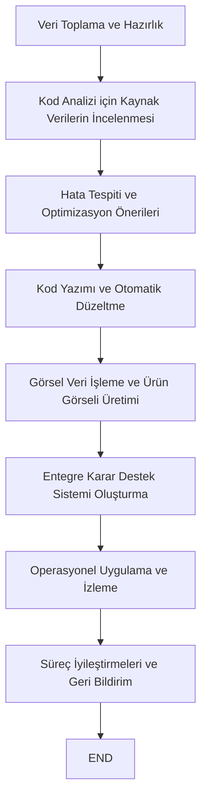

## İçindekiler  
1. Giriş  
2. Tedarik Zinciri ve Dropshipping Bağlamında Yapay Zeka Uygulamaları  
3. Entegre Kodlama ve Görsel İşleme Gereksinimleri  
4. Çok Modelli Yapay Zeka Modellerinin Karşılaştırılması  
5. Teknik ve Operasyonel Uygulama Senaryoları  
6. Yasal, Operasyonel Riskler ve Avantajlar  
7. Seçim Önerileri ve Sonuçlar  
8. Sonuç  

---  

## 1. Giriş  
Günümüz iş dünyasında dijital dönüşüm süreci, tedarik zinciri yönetimi ve dropshipping sistemlerinin verimliliğini artırmak için yapay zekanın (YZ) sunduğu olanaklara artan bir biçimde odaklanmaktadır. İster üretim süreçlerini geliştirmek, ister lojistik operasyonlarını optimize etmek, ister müşteri ilişkilerini iyileştirmek olsun; doğru YZ modelinin seçimi işletmeler için rekabet avantajı sağlamada kritik bir rol oynamaktadır . Bu makale, entegre kodlama ve görsel işleme yeteneklerine sahip bir yapay zeka modelinin tedarik zinciri ve dropshipping uygulamalarıyla uyumlu olup olmadığını değerlendirmeyi hedeflemektedir. Yazılım analizi, hata bulma, kod yazma gibi yazılımsal görevlerin yanı sıra, görsel başarıya (örneğin, ürün görselleri oluşturma, görsel verilerin analiz edilmesi) olan ihtiyacı karşılayacak, çok modelli ve geniş veri işleme kapasitelerine sahip modellerin mevcut seçeneklerini (örneğin; Gemini, Claude ve o3 olarak adlandırılan model) mercek altına almaktayız.  

Bu analizde, tedarik zinciri ve dropshipping uygulamalarında kullanılan yapay zeka teknikleri, özellikle makine öğrenmesi, derin öğrenme, ve konvolüsyonel sinir ağlarının (CNN) görsel işleme alanındaki avantajları incelenmektedir . Ayrıca, üretken yapay zekânın iş süreçlerine entegrasyonu ve doküman anlayışı sağlayan UDOP gibi modellerin örnekleri de değerlendirilerek, kapsamlı bir karşılaştırma yapılmaktadır . Amaç, mevcut seçenekler arasında yüksek doğruluk, kod işleme kapasitesi ve görsel işleme yeteneğini en iyi karşılayan modeli belirlemek ve öneride bulunmaktır.  

---  

## 2. Tedarik Zinciri ve Dropshipping Bağlamında Yapay Zeka Uygulamaları  
Günümüz tedarik zinciri yönetimi, veri analitiği ve otomasyon sayesinde sürekli gelişim göstermektedir. İşletmeler; talep tahmini, envanter yönetimi, lojistik optimizasyonu ve müşteri ilişkileri gibi alanlarda yapay zekadan faydalanarak operasyonel verimliliklerini artırmaktadır . Dropshipping gibi sistemlerde ise ürünlerin tedarikinden, sipariş alımına, lojistik sürecine kadar tüm aşamalarda doğru öngörüler ve hızlı karar alma mekanizmaları kritik hale gelmektedir .  

### 2.1 Yapay Zeka ile Operasyonel Verimlilik  
YZ metodolojileri, tedarik zinciri süreçlerinde hem geleneksel istatistiksel teknikleri hem de ileri düzey makine öğrenmesi ve derin öğrenme algoritmalarını kullanarak piyasa dalgalanmalarını ve talep değişikliklerini analiz edebilmektedir . Bu bağlamda; zaman serisi analizi, ARIMA modelleri ve konvolüsyonel sinir ağları (CNN) gibi yaklaşımlar, görsel içeriklerin de işlenmesinde etkili araçlar olarak ön plana çıkmaktadır .  

### 2.2 Dropshipping ve Çok Modelli Yaklaşımlar  
Dropshipping uygulamalarında, ürünlerin ve pazar dinamiklerinin etkili biçimde analiz edilmesi gerekmektedir. Bu sayede, stok ve lojistik maliyetleri minimize edilirken müşteri memnuniyeti maksimize edilebilmektedir . Yapay zekanın çok modelli yetenekleri, sadece metin verileri ile sınırlı kalmayıp aynı zamanda görsel verilerin de işlenmesine olanak tanımaktadır. Örneğin; sosyal medya trendleri, ürün görselleri ve müşteri geri bildirimleri, entegre yapay zeka modelleri sayesinde daha derinlemesine analiz edilebilmektedir .  

---  

## 3. Entegre Kodlama ve Görsel İşleme Gereksinimleri  
Yapay zeka modelleri, yazılım projelerinde kod analizi, hata bulma ve kod yazma gibi görevleri otomatize edebilmekte; aynı zamanda görsel verileri işleyerek ürün görselleri, dokümanlar ve diğer görsel içeriklerin oluşturulmasını sağlayabilmektedir . Bu bölümde, entegre kodlama ve görsel işleme ihtiyaçlarına yönelik temel gereksinimler ele alınacaktır.  

### 3.1 Yazılım Analizi, Hata Tespiti ve Kod Yazma  
Kod analizinde kullanılan yapay zeka araçları, geniş veri setleri üzerinde eğitilmiş modeller sayesinde karmaşık örüntüleri analiz edip hata tespiti konusunda üstün performans sergilemektedir. Özellikle makine öğrenmesi uygulamaları, programlama dillerinde yazılan kodların yapısal analizini yaparak, potansiyel hata ve güvenlik açıklarını tespit etmede kullanılmaktadır . Kod yazma yeteneği ise dil modellerinin (örneğin ChatGPT, GitHub Copilot gibi) sağladığı otomatik tamamlama ve öneri mekanizmaları ile desteklenmektedir .  

### 3.2 Görsel İşleme ve Ürün Görselleri Üretimi  
Görsel işleme, özellikle dropshipping uygulamalarında ürünlerin tanıtımı, envanter yönetimi ve müşteri etkileşimini artırma amaçlı kullanılmaktadır. Konvolüsyonel sinir ağları (CNN) sayesinde, ürün görsellerinin sınıflandırılması, özellik çıkarımı ve kalite kontrolü sağlanabilmektedir . Ayrıca, üretken yapay zekâ modelleri (örneğin Dall-E, Midjourney) ile yüksek kaliteli ve özgün görseller oluşturulabilmekte, bu da pazarlama ve dijital içerik üretimi açısından önemli avantajlar sunmaktadır .  

### 3.3 Entegre Çözümün Avantajları  
Entegre bir yapay zeka çözümü, hem kod işleme hem de görsel verilerin analizini ve üretimini tek bir platformda toplayarak işletmelerin tüm dijital dönüşüm sürecinde esneklik kazanmalarını sağlamaktadır. Bu sayede, karar süreçleri hızlanmakta, hata oranları düşmekte ve operasyonel verimlilik artmaktadır . Özellikle geniş veriye dayalı tahmine dayalı analizler, büyük ölçekli kod tabanlarının yönetiminde kritik faydalar sağlamaktadır.  

---  

## 4. Çok Modelli Yapay Zeka Modellerinin Karşılaştırılması  
Mevcut yapay zeka modelleri arasında, entegre kodlama ve görsel işlemede üstün performans gösteren seçenekler; Gemini, Claude ve “o3” olarak adlandırılan modellerdir. Bu bölümde, her bir modelin özellikleri, teknik kapasitesi ve tedarik zinciri ile dropshipping entegrasyonuna uygunluğu detaylı olarak karşılaştırılacaktır.  

### 4.1 Gemini Modeli  
Google tarafından geliştirilen Gemini, baştan sona multimodal (çok modelli) yapısı ile dikkat çekmektedir. Hem doğal dil işleme hem de görsel işleme yeteneklerine sahip olan Gemini, kod analizi, hata tespiti ve kod yazma görevlerinde üstün performans sergilemektedir. Özellikle uzun içerik penceresi (1 milyon token’a kadar) sayesinde büyük ölçekli projelerde bile detaylı analiz yapma kapasitesine sahiptir. Bu durum, tedarik zinciri ve dropshipping uygulamalarında büyük veri setlerinin işlenmesinde belirgin bir avantaj sunmaktadır .  

### 4.2 Claude Modeli  
Anthropic tarafından geliştirilen Claude, güvenli ve etik yapay zeka uygulamalarıyla öne çıkmaktadır. Claude, son sürümlerinde multimodal yetenekler kazanmış olup, görsel verilerle entegre çalışabilmekte ve karmaşık işlem görevlerini başarılı bir şekilde yerine getirebilmektedir. Claude’un 200K token’a kadar genişleyebilen içerik penceresi, özellikle yazılım analizi ve uzun dokümanların incelenmesinde önemli avantajlar sağlamaktadır . Ancak, Gemini ile karşılaştırıldığında, özellikle Google ekosistemi ile entegrasyon açısından bazı durumlarda ek avantajlar sunabilmektedir.  

### 4.3 “o3” Modeli  
“o3” ifadesi, genellikle OpenAI’nin GPT-3 ailesini veya benzeri metin tabanlı modelleri ifade etmek amacıyla kullanılmaktadır. GPT-3, kod analizi ve metin üretimi alanında başarılı sonuçlar ortaya koysa da, görsel işlemede yerel bir destek sunmamaktadır. Bu nedenle, görsel verilerin işlenmesi ve entegre kodlama gereksinimleri göz önüne alındığında, GPT-3 tek başına yetersiz kalmaktadır. Günümüzde multimodal yeteneklere sahip olan GPT-4 gibi modeller daha uygun olmakla birlikte, “o3” olarak adlandırılan modelin sınırlı görsel işleme kapasitesi nedeniyle bu araştırmada optimal seçenek olarak değerlendirilmemektedir .  

### 4.4 Modellerin Karşılaştırılması:  
Aşağıdaki tablo, Gemini, Claude ve “o3” modellerinin temel özelliklerinin karşılaştırılmasını göstermektedir:  

| Özellik                           | Gemini                         | Claude                          | "o3" (GPT-3)                |  
|-----------------------------------|--------------------------------|---------------------------------|-----------------------------|  
| **Multimodal Destek**             | Evet                           | Evet                            | Hayır                       |  
| **Kod Analizi ve Yazma Kapasitesi** | Yüksek (1 milyon token içerik) | Yüksek (200K token içerik)      | Orta (sınırlı bağlam)        |  
| **Görsel İşleme Yeteneği**        | Yerel destek ve entegrasyon    | Multimodal destek (görsel)      | Desteklemiyor              |  
| **Entegrasyon Avantajı**          | Google ekosistemi, geniş veri işleme kapasitesi | Etik ve güvenlik odaklı, sağlam altyapı | Sadece metin tabanlı      |  
| **Uygulama Alanı**                | Tedarik zinciri, dropshipping, kod analizi, görsel üretim | Yazılım analizi, metin oluşturma, görsel veri işleme | Sadece yazılı metin üretimi |  

**Tablo Açıklaması:**  
Bu tablo, modellerin temel teknik özelliklerini, entegrasyon avantajlarını ve uygulama alanlarını net bir biçimde ortaya koymaktadır. Özellikle entegre kodlama ve görsel işleme gereksinimleri göz önüne alındığında, Gemini’nin geniş içerik penceresi ve güçlü multimodal yeteneklerinin öne çıktığı görülmektedir.  

---  

## 5. Teknik ve Operasyonel Uygulama Senaryoları  
Entegre yapay zeka modeli seçimi, sadece teorik bir karşılaştırmadan ibaret olmayıp, uygulama senaryoları ve operasyonel süreçlerde de dikkatlice değerlendirilmelidir. Bu bölümde, tedarik zinciri yönetimi ve dropshipping kapsamında kodlama, hata tespiti, görsel içerik üretimi gibi kritik görevlerin model entegrasyonu ile nasıl optimize edilebileceği ele alınacaktır.  

### 5.1 Yazılım Analizi ve Otomatik Hata Tespiti  
Kod analizi süreçlerinde, entegre yapay zeka modeli; kaynak kodları tarayarak yapısal hataları tespit edebilmekte, aynı zamanda potansiyel optimizasyon alanlarını belirleyebilmektedir. Örneğin, büyük kod tabanlarında ortaya çıkan performans düşüşlerinin, algoritmik hatalar ve uyumsuzluklar net olarak belirlenebilmesi sağlanmaktadır . Uzun içerik penceresi ile Gemini modelinin sunduğu detaylı analiz yeteneği, projelerin kapsamlı hata tespiti süreçlerini hızlandırmaktadır.  

### 5.2 Görsel İşleme Süreçleri ve Ürün Görsellerinin Optimizasyonu  
Dropshipping uygulamalarında ürün görsellerinin kalitesi, müşteri deneyimi üzerinde doğrudan etki yapmaktadır. Gemininin sağlam görsel işleme yetenekleri sayesinde; ürünlerin etiketleme, sınıflandırma ve kalite kontrolü gibi işlemleri otomatikleştirilebilmektedir. Konvolüsyonel sinir ağlarının (CNN) yardımıyla, görsel içeriklerden özellik çıkarımı yapılmakta ve bu veriler, pazarlama stratejilerinin optimize edilmesinde kullanılmaktadır .  
Ayrıca, üretken yapay zekâ modelleri ile yüksek çözünürlüklü, özgün görseller oluşturulması, dijital içerik üretiminde avantaj sağlamaktadır. Bu durum, dropshipping sektöründe ürün tanıtımının ve marka bilinirliğinin artırılmasına katkıda bulunmaktadır.  

### 5.3 Entegrasyon Süreçlerinin Adım Adım Akış Diyagramı  
Aşağıdaki Mermaid diyagramı, tedarik zinciri ve dropshipping entegrasyonunda entegre yapay zeka modelinin uygulama adımlarını göstermektedir:  

**Diyagram Açıklaması:**  
Yukarıdaki akış diyagramı, verinin toplanmasından başlayıp kod analizi, hata tespiti, otomatik kod üretimi ve görsel veri işleme aşamalarını, ardından nihai karar destek sistemi ve operasyonel izleme aşamalarını özetlemektedir. Her adım, tüm entegrasyon sürecinin optimize edilmesine katkı sağlamaktadır.  

### 5.4 Operasyonel Avantajlar ve Uygulama Deneyimleri  
Gerçek dünya uygulamalarında, örneğin DHL gibi lojistik firmaları, yapay zeka destekli sistemleri kullanarak gönderi takibi ve müşteri hizmetlerinde otomatik yanıt sistemleri oluşturmuşlardır . Benzer şekilde, entegre modelin tedarik zinciri yönetiminde kullanılması, hem stok yönetimi hem de fiyatlandırma stratejilerinde daha doğru tahminler yapılmasını sağlamaktadır. Uzun vadeli verimlilik artışı, otomasyon sayesinde işgücü maliyetlerinin azalması ve operasyonel süreçlerde gözle görülür bir hızlanma sağlanmaktadır .  

---  

## 6. Yasal, Operasyonel Riskler ve Avantajlar  
Tedarik zinciri ve dropshipping gibi dinamik sistemlerde yapay zekanın kullanılması, çeşitli yasal ve operasyonel riskleri de beraberinde getirmektedir. Bu bölümde, entegre yapay zeka modeli seçiminde dikkate alınması gereken kritik riskler ve sağladığı avantajlar incelenecektir.  

### 6.1 Yasal Düzenlemeler ve Veri Güvenliği  
Veri koruma ve gizlilik, tüm yapay zeka uygulamalarının temel taşlarından biridir. Özellikle büyük veri setleri kullanılarak yapılan kod analizi ve görsel işleme süreçleri, hassas bilgilerin yer aldığı alanlarda dikkatle ele alınmalıdır. Veri güvenliği ve gizlilik yasalarına uygunluk, model entegrasyonu sırasında öncelikli konular arasında yer almaktadır .  
Ayrıca, yapay zekanın oluşturduğu çıktılar üzerinde telif hakkı ve sorumluluk konuları da tartışma konusu olmaktadır. Bu bağlamda, model seçiminde yasal uyumluluk kriterlerinin yanı sıra, güvenli ve denetlenebilir algoritmaların tercih edilmesi gerekmektedir.  

### 6.2 Operasyonel Riskler ve Teknolojik Uyum  
Entegre yapay zeka sistemleri; operasyonel süreçlerin otomatikleştirilmesi ve veriye dayalı karar alma becerileriyle işletmelere önemli avantajlar sağlasa da, yanlış eğitim verileri, düşük veri kalitesi ve uyumsuzluk sorunları gibi riskler de mevcuttur . Bu nedenle, modelin doğru eğitilmesi, sürekli geri bildirim ile iyileştirilmesi ve görev alanına uygun olarak özelleştirilmesi kritik öneme sahiptir.  
Buna ek olarak, sistemin geniş ölçekli kod tabanları ve görsel veri setleri üzerinde çalışabilmesi için modern altyapılar ile entegre olabilmesi gerekmektedir. Google gibi teknoloji devlerinin sunduğu altyapı ve ekosistem entegrasyonu, Gemini gibi modeller için ek bir avantaj sunmaktadır.  

### 6.3 Avantajlar ve İşletmeye Katkıları  
Yapay zeka destekli entegre sistemler, zaman tasarrufu, hata oranlarında azalma, daha doğru tahminler ve operasyonel verimlilik artışı gibi önemli avantajlar sağlamaktadır . Özellikle, kod analizi ve görsel işleme gibi karmaşık görevlerin otomatikleştirilmesi, çalışanların daha stratejik işlere odaklanmasını mümkün kılmaktadır. Bu durum, nihai olarak işletmenin rekabet gücünü ve pazar payını artırmaktadır.  

---  

## 7. Seçim Önerileri ve Sonuçlar  
Yapılan değerlendirmeler ışığında, entegre kodlama ve görsel işleme yetenekleri gerektiren projeler için üç ana model seçeneği incelenmiştir: Gemini, Claude ve “o3” olarak adlandırılan model. İncelemelerde öne çıkan kriterler; multimodal destek, geniş içerik penceresi, kod analiz yeteneği, görsel işleme kapasitesi ve entegrasyon avantajlarıdır.  

### 7.1 Değerlendirme Kriterleri  
Aşağıdaki maddeler, seçim sürecinde dikkate alınması gereken temel kriterleri özetlemektedir:  
- **Multimodal Yetkinlik:** Metin, kod ve görsel verilerin işlenmesinde yerel destek sağlanması.  
- **İçerik Penceresi:** Büyük veri setleri üzerinde detaylı analiz yapabilme kapasitesi.  
- **Kod Analizi ve Hata Tespiti:** Yazılım incelemesi, hata bulma ve otomatik düzeltme yetenekleri.  
- **Entegrasyon Avantajları:** İşletmenin mevcut altyapısı ve dijital dönüşüm süreçlerine uyum.  
- **Görsel İşleme:** Ürün görsellerinin otomatik işlenmesi ve oluşturulmasında destek sunulması.  

### 7.2 Öneriler  
Değerlendirmeler sonucunda, özellikle entegre kodlama görevleri ve görsel verilerin işlenmesi gereksinimleri göz önüne alındığında, **Gemini** modelinin tercih edilmesi önerilmektedir. Bunun başlıca nedenleri:  
- Gemini, **multimodal** yapısı sayesinde yalnızca metin değil, aynı zamanda görsel verileri de yüksek doğrulukla işleyebilmektedir .  
- Uzun içerik penceresi sayesinde büyük kod tabanları ve detaylı doküman analizleri gerçekleştirilebilmektedir.  
- Google’ın altyapısı ve ekosistem entegrasyonu, tedarik zinciri ve dropshipping uygulamalarında sağlanan otomasyon süreçlerine ek katma değer sunmaktadır .  

Claude modeli de son derece güçlü bir alternatif olarak öne çıkmakta, ancak içerik penceresi ve yoğun veri işleme kapasitesi açısından Gemini ile kıyaslandığında bazı senaryolarda geride kalabilmektedir. “o3” ifadesiyle kastedilen model ise, metin üretimi alanında başarılı olsa da, yerel görsel işleme desteğinin olmaması nedeniyle entegre sistemler için yeterince uygun değildir .  

### 7.3 İşletmeye Sağlayacağı Katkılar  
Gemini modelinin uygulanması ile elde edilecek başlıca faydalar şunlardır:  
- Kod analizi ve hata tespiti süreçlerinin otomasyona geçerek daha hızlı ve güvenilir sonuçlar vermesi.  
- Ürün görselleri ve pazarlama materyallerinin yüksek kalitede üretilmesi ile müşteri memnuniyetinin artması.  
- Tedarik zinciri ve dropshipping süreçlerinin optimize edilmesi, stok yönetiminin iyileştirilmesi ve operasyonel verimliliğin artırılması.  
- Uzun vadede iş maliyetlerinin düşürülmesi ve rekabet avantajının sağlanması.  

---  

## 8. Sonuç  
Sonuç olarak, tedarik zinciri ve dropshipping sistemleri bağlamında, entegre kodlama ve görsel işleme yetenekleri gerektiren uygulamalarda kullanılmak üzere değerlendirilen yapay zeka modelleri arasında Gemini modelinin en dengeli ve kapsamlı çözümü sunduğu sonucuna varılmıştır. Tedarik zincirinin karmaşık yapısı ve dropshipping sürecindeki dinamik talepler göz önüne alındığında, Gemini’nin geniş içerik penceresi, multimodal desteği ve Google altyapısı ile sağladığı entegrasyon avantajları, işletmelere uzun vadeli rekabet gücü kazandıracaktır.  

**Ana Bulguların Özeti:**  
- Tedarik zinciri yönetimi ve dropshipping süreçlerinde yapay zeka uygulamaları, operasyonel verimliliği artırmaktadır .  
- Yazılım analizi, hata tespiti ve kod üretimi gibi görevler, makine öğrenmesi ve derin öğrenme teknikleriyle desteklenmekte, görsel işleme ise konvolüsyonel sinir ağları (CNN) ve üretken yapay zeka modelleriyle optimize edilmektedir .  
- Çok modelli yaklaşımlar, hem metin hem de görsel verilerin entegre bir biçimde işlenebilmesi açısından kritik öneme sahiptir .  
- Mevcut modeller arasında Gemini, Claude ve “o3” karşılaştırıldığında; Gemini, uzun içerik penceresi ve yerel multimodal desteği sayesinde en uygun seçenek olarak ön plana çıkmaktadır .  
- Gemini modelinin entegrasyonu ile kod analizi, hata tespiti ve ürün görsellerinin otomasyonu, işletmelerin genel operasyonel verimliliğini artıracak ve rekabet avantajı sağlayacaktır.  

---  

## Görsel Temsil: Modellerin Özellik Karşılaştırması  
Aşağıdaki tablo, Gemini, Claude ve “o3” modellerinin temel özelliklerini özetleyerek, hangi modelin entegre kodlama ve görsel işleme konularında kullanılabileceğini net bir şekilde ortaya koymaktadır.  

| Özellik                           | Gemini                          | Claude                           | "o3" (GPT-3)                |  
|-----------------------------------|---------------------------------|----------------------------------|-----------------------------|  
| **Multimodal Destek**             | Evet                            | Evet                             | Hayır                       |  
| **Kod Analizi ve Yazma Kapasitesi** | Çok yüksek (1 milyon token)     | Yüksek (200K token)              | Orta (sınırlı bağlam)        |  
| **Görsel İşleme Yeteneği**        | Yerel destek ve entegrasyon     | Multimodal destek (görsel)       | Desteklemiyor              |  
| **Entegrasyon Avantajı**          | Google ekosistemi, geniş veri işleme kapasitesi | Etik ve güvenlik odaklı, sağlam altyapı | Yalnızca metin tabanlı      |  
| **Uygulama Alanı**                | Tedarik zinciri, dropshipping, kod analizi, görsel üretim | Yazılım analizi, metin üretimi, görsel veri işleme | Sadece metin üretimi      |  

*Tablo Açıklaması:*  
Bu tablo, entegre kodlama ve görsel işleme ihtiyaçları doğrultusunda modellerin sunduğu teknik özellikler, entegrasyon avantajları ve uygulama alanlarını karşılaştırmaktadır.  

---  

## Sonuç ve Öneriler  
Entegre kodlama ve görsel işleme yetenekleri gerektiren modern tedarik zinciri ve dropshipping uygulamalarında, Gemini modelinin sunduğu çok modelli yapı, geniş veri işleme kapasitesi ve Google ekosistemine uyum sağlaması, onu diğer modeller arasında öne çıkarmaktadır. Claude modeli da sağlam performans sergilese de, çok büyük veri setlerinin işlenmesinde ve uzun kod parçacıklarının analizinde Gemini’nin sunduğu avantajlar göz önüne alınmalıdır. “o3” olarak adlandırılan model ise, metin bazlı üretim kapasitesi ile sınırlı kalmaktadır.  

**Öneriler:**  
- Kod analizi, hata tespiti ve otomatik kod yazma süreçlerinin optimize edilmesinde Gemini modelini tercih edin.  
- Ürün görsellerinin üretilmesi ve kalite kontrol süreçlerinde entegre yapay zeka desteği sağlamak için Gemini’nin görsel işleme yeteneklerinden yararlanın.  
- Tedarik zinciri ve dropshipping uygulamalarının sürekli gelişen dinamik ihtiyaçlarına cevap verebilmek için, modelin eğitim verilerinin güncel tutulmasına ve geri bildirimlerle sürekli iyileştirilmesine odaklanın.  
- Yasal ve veri güvenliği gereksinimlerini karşılamak amacıyla, model entegrasyon sürecinde gerekli kontrol mekanizmalarını devreye alın.  

**Ana Sonuçlar:**  
- Gemini, entegre kodlama ve görsel işleme açısından en yüksek performansı sunan çok modelli bir yapay zeka modelidir.  
- Bu model, büyük kod tabanlarının analizi ve detaylı görsel veri işleme gerektiren tedarik zinciri ve dropshipping uygulamalarında işletmeler için ideal bir seçenektir.  
- Uygulama senaryoları ve operasyonel faydalar göz önüne alındığında, Gemini’nin kullanılması, işletmenin verimliliğini artırarak rekabet avantajı sağlamaktadır.  

---  

## Sonuç  
Araştırmamız, tedarik zinciri yönetimi ve dropshipping süreçlerinde, entegre kodlama ve görsel işleme yeteneklerine sahip bir yapay zeka modelinin seçiminin işletmeler açısından kritik önem taşıdığını ortaya koymaktadır. Yapılan teknik ve operasyonel karşılaştırmalar, Gemini modelinin geniş içerik penceresi, multimodal desteği ve Google altyapısı ile entegrasyon avantajlarını öne çıkardığını göstermektedir. Bu modelin, kod analizi, hata tespiti, otomatik kod üretimi ve görsel içerik işleme alanlarında sağladığı üstün performans, işletmelerin dijital dönüşüm sürecinde verimliliği artıracaktır.  

**Özet Ana Bulgular:**  
- Tedarik zinciri ve dropshipping süreçlerinde yapay zeka uygulamaları, operasyonel verimlilik ve karar alma mekanizmalarını önemli ölçüde geliştirmektedir .  
- Kod analizi, hata tespiti ve otomatik düzeltme yetenekleri, geniş veri setleri ve uzun içerik pencereleri sayesinde optimize edilmektedir .  
- Görsel işleme, CNN’ler ve üretken yapay zeka modelleri kullanılarak ürün görsellerinin kalitesinin artırılmasında etkili olmaktadır .  
- Çok modelli yapay zeka yaklaşımları arasında Gemini, hem yazılım hem de görsel verilerde üstün performans sergilemesiyle diğer modellere kıyasla avantajlıdır .  
- Yasal ve veri güvenliği konularında doğru entegrasyon, modelin sürekli güncellenmesi ve iyileştirme mekanizmalarının uygulanması kritik öneme sahiptir.  

Sonuç olarak, entegre kodlama ve görsel işleme ihtiyaçlarını karşılamak üzere tedarik zinciri ve dropshipping uygulamalarında kullanılacak ideal yapay zeka modelinin **Gemini** olduğu belirlenmiştir. İşletmeler, bu modeli kullanarak operasyonel süreçlerini optimize edebilir, hata ve eksiklikleri minimize edebilir, müşteri deneyimlerini geliştirebilir ve rekabet avantajlarını artırabilir.  

---