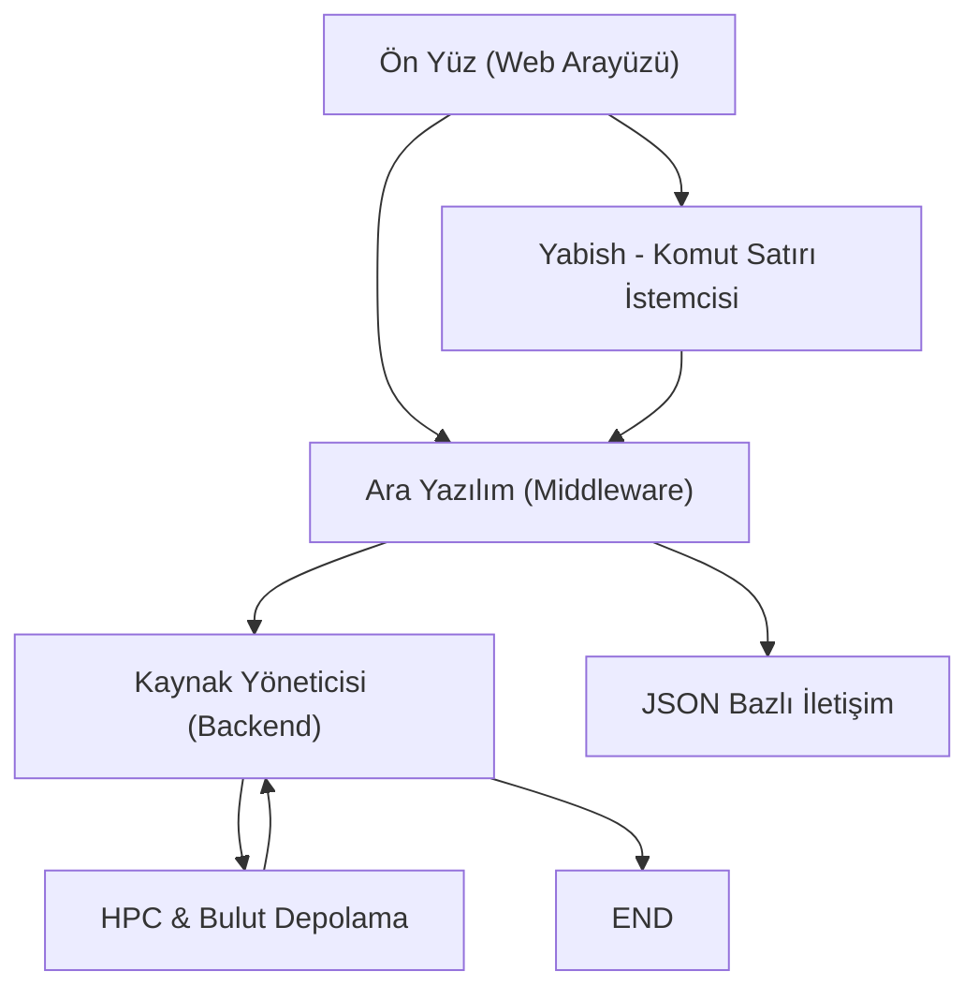
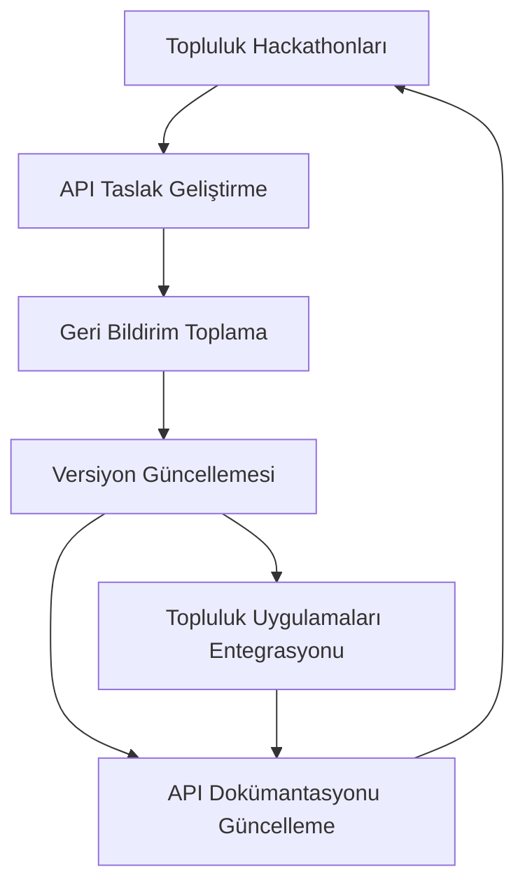

## İçindekiler  
1. Giriş  
2. Teknik Altyapı Analizi  
 2.1. SEED Sistemi Altyapısı  
 2.2. Yabi'nın Mimari Yapısı  
 2.3. BrAPI Altyapısı  
3. Güvenlik Önlemleri ve Yönetim Süreçleri  
 3.1. Yabi'de Güvenlik Yaklaşımları  
 3.2. BrAPI’de Kimlik Doğrulama ve Yetkilendirme  
4. Entegrasyon Süreçleri ve Uygulama Yaklaşımları  
 4.1. SEED’in Web Servisleri Üzerinden Entegrasyonu  
 4.2. Yabi ile Yüksek Performanslı Hesaplama Ortamlarına Entegrasyon  
 4.3. BrAPI ile Uygulama ve Veri Entegrasyonu  
5. Karşılaştırmalı Analiz ve Tartışma  
6. Sonuç ve Değerlendirme  
7. Ek Görselleştirmeler ve Tablo Analizleri  

---  

## 1. Giriş  

Web tabanlı yazılım geliştirme süreci, günümüzde teknolojik altyapı, veri güvenliği ve sistemler arası entegrasyon konularında kritik öneme sahiptir. Güçlü teknik altyapılar, modern web uygulamalarının sağlam, ölçeklenebilir ve verimli çalışmasını sağlarken; güvenlik önlemleri verilerin bütünlüğünü ve kullanıcı gizliliğini korumada belirleyici rol oynar. Entegrasyon süreçleri ise, farklı sistem ve uygulamaların birbiriyle uyumlu şekilde çalışabilmesi için standart arayüzler ve protokoller geliştirilmesini gerektirir.  

Bu rapor, konunun kapsamlı bir analizini sunmak amacıyla üç önemli sistem üzerinden ilerlemektedir:  
- **SEED**: Biyoinformatik alanında mikrobiyal genom dizilerini entegre eden, SOAP tabanlı Web servisleri aracılığıyla API erişimi sağlayan bir sistemdir.  
- **Yabi**: Grid, yüksek performanslı ve bulut bilişim ortamlarında karmaşık analiz iş akışlarını yönetmek üzere tasarlanmış, üç katmanlı mimariye sahip açık kaynaklı bir araştırma ortamıdır.  
- **BrAPI**: Bitki ıslahı verileri için geliştirilmiş, RESTful prensiplerine uygun, JSON formatında veri iletişimini sağlayan, topluluk temelli bir API’dir.  

Bu üç sistemin teknik altyapıları, güvenlik tedbirleri ve entegrasyon süreçleri, modern web tabanlı yazılım projelerinde dikkate alınması gereken temel gereksinimleri ortaya koymaktadır. Raporun ilerleyen bölümlerinde, her bir sistemin mimarisi detaylı biçimde analiz edilecek, karşılıklı benzerlikler ve farklılıklar ortaya konulacaktır.  

---  

## 2. Teknik Altyapı Analizi  

Web tabanlı yazılım geliştirme sürecinde teknik altyapı, uygulama performansı, ölçeklenebilirlik ve modülerlik açısından kritik bir rol oynar. Bu bölümde, üç farklı sistemin altyapısal özellikleri detaylı olarak incelenecektir.  

### 2.1. SEED Sistemi Altyapısı  

SEED sistemi, mikroorganizmaların genomik dizilerini tek bir kaynak altında toplayarak entegre eden kapsamlı bir veritabanıdır. Bu sistemin teknik altyapısı, aşağıdaki temel özelliklere sahiptir:  

- **Veri Entegrasyonu ve Kümeleme:**  
  SEED, kamuya açık genom dizilerini entegre ederek merkezi bir kaynak oluşturur. Bu yapı, farklı kaynaklardan gelen verilerin standartlaştırılmış bir biçime dönüştürülmesini ve sistematik olarak organize edilmesini sağlar.  

- **Web Servisleri Üzerinden Programatik Erişim:**  
  Sistem, büyük ölçekli veri indirmelerine gerek kalmadan, Web servisleri aracılığıyla, programcıların veriye doğrudan erişimini sağlar. API aracılığıyla diziler ve ilişkili veriler sistematik olarak alınabilir.  

- **SOAP Standartları ile API Geliştirme:**  
  SEED’in API’si, Simple Object Access Protocol (SOAP) standardı üzerine inşa edilmiştir. Bu sayede, farklı programlama dilleri (örneğin Python, Perl ve Java) desteği ile geniş çaplı entegrasyon olanağı sunulmaktadır.  

- **Veri Tanımlama ve Kimliklendirme:**  
  Sistemde kullanılan FIG (Fellowship Institutional Genome) tanımlayıcıları, genomların içsel olarak doğru şekilde tanımlanmasını ve sistem içi bağlantıların kurulmasını mümkün kılar.  

- **Mikrobiyal Genom Sayısı ve Güncellik:**  
  SEED, 850’den fazla bakteri genomunu içererek mikroorganizma analizinde kapsamlı bir veri kaynağı sunmaktadır. Bu durum, araştırmacılara geniş bir veri yelpazesi ile çalışabilme imkânı tanımaktadır.  

Bu altyapısal unsurlar, SEED sisteminin bilimsel araştırmalar ve biyoinformatik uygulamaları için sağlam, güvenilir ve esnek bir platform olmasını sağlamaktadır.  

### 2.2. Yabi'nın Mimari Yapısı  

Yabi, özellikle grid bilgiler, yüksek performanslı hesaplamalar ve bulut bilişim alanlarında karmaşık iş akışlarını yönetmeye yönelik bir web tabanlı araştırma ortamıdır. Yabi'nın mimarisi, aşağıdaki ana bileşenlerden oluşmaktadır:  

- **Üç Katmanlı Mimari:**  
  Yabi, üç katmandan oluşan esnek bir yapı sunar:  
  1. **Frontend Web Uygulaması:** Kullanıcıların grafik arayüzü aracılığıyla iş akışlarını oluşturduğu ve yönetim yaptığı katmandır. Kullanıcılar, sürükle-bırak yöntemiyle kolayca araçları bir araya getirerek karmaşık analiz iş akışları oluşturabilir.  
  2. **Middleware (Ara Yazılım):** Bu katman, işlerin yönetimi, araçların konfigürasyonu ve analiz yürütme işlemleri gibi kritik süreçleri kontrol eder. Ayrıca, JSON formatında iş bilgileri döndüren, kaynak yöneticisine iş durumu bildirimi yapan sistemdir.  
  3. **Backend / Kaynak Yöneticisi:** İş akışlarının yürütüldüğü, veri dosyalarının sahaya alınmasını, hesaplama işlerinin yönetilmesini ve geçici dosyaların temizlenmesini sağlayan katmandır.  

- **Pluggable (Eklenti) Mimari:**  
  Yabi’nin yapısı, farklı depolama ve hesaplama sistemlerine uyum sağlayacak şekilde tasarlanmıştır. Eklenti tabanlı mimarisi sayesinde, sistem mevcut HPC kaynaklarına, grid hesaplamalarına ve bulut ortamlarına entegrasyon sağlayarak veri kilitlenmesini önler.  

- **İki Yönlü Erişim (Web Tabanlı ve Komut Satırı):**  
  Yabi, kullanıcı dostu web arayüzünün yanı sıra, Yabish adlı komut satırı istemcisi ile de erişilebilmekte, böylece farklı teknik yeteneklere sahip kullanıcılar arasında esnek kullanım imkânı sunmaktadır.  

- **Görevlerin Yönetimi ve İzlenmesi:**  
  Yabi kaynak yöneticisi, yürütülen işlerin durumunu izler ve görevler arasında kesinti olması durumunda yeniden başlatma gibi özellikler ile iş sürekliliğini sağlar. Bunun yanı sıra, hata yönetimi ve geçici hata durumlarına yönelik “BlockingException” stratejileri ile sorunsuz bir iş akışı operasyonu sürdürmektedir.  

Bu yapı, Yabi’nın dinamik ve ölçeklenebilir bir web tabanlı araştırma ortamı olarak yüksek performanslı hesaplama ve iş akışı yönetiminde güvenilir sonuçlar elde etmesini mümkün kılar.  

### 2.3. BrAPI Altyapısı  

BrAPI, özellikle bitki ıslahı verilerinin yönetimi ve analizi amacıyla geliştirilmiş, RESTful prensiplerine uygun standart bir API'dir. Teknik altyapısı şu özellikleri içerir:  

- **RESTful Web Servis Yaklaşımı:**  
  API, HTTP protokolü ve URL yapısı üzerinden, sorgu parametreleri kullanılarak veri alışverişini sağlar. REST mimarisi, stateless (durumsuz) iletişimi destekler ve bu durum modern web uygulamalarında önemli avantajlar sunar.  

- **JSON Formatında Yanıtlar:**  
  Çoğu modern API gibi, BrAPI de Ajax ve JSON formatını kullanarak veri alışverişi gerçekleştirir. Standart bir JSON yanıt yapısının benimsenmesi, farklı platformlar arasında veri uyumunu ve entegrasyonunu kolaylaştırır.  

- **Topluluk Tabanlı Gelişim ve Versiyonlama:**  
  BrAPI’nin gelişimi, uluslararası ve çok sayıda katılımcının yer aldığı bir topluluk çerçevesinde yürütülmektedir. Versiyonlama şeması, API’nin farklı sürümlerinin uyumlu çalışmasını ve geliştiriciler arasında net iletişim sağlanmasını garanti eder.  

- **API Kategorileri ve Veri Operasyonları:**  
  BrAPI çağrıları, farklı veri yönetimi alanlarını kapsayacak şekilde kategorize edilmiştir. Örneğin, çekirdek ıslah verileri (germplasm, fenotip, marker verileri) gibi temel veri türlerini yönetmek için standart çağrılar tanımlanmıştır.  

BrAPI’nin altyapısı, bitki ıslahı verilerinin farklı sistemler arasında standartlaştırılmış şekilde paylaşılmasını ve entegrasyonunu mümkün kılarak, bilimsel ve tarımsal araştırmalar için sağlam bir temel sunar.  

---  

## 3. Güvenlik Önlemleri ve Yönetim Süreçleri  

Web tabanlı yazılım geliştirmede veri güvenliği, kullanıcı bilgilerinin korunması ve sistemlerin yetkisiz erişime karşı dayanıklı hale getirilmesi açısından kritik yer tutar. Bu bölümde, Yabi ve BrAPI sistemleri üzerinden güvenlik yaklaşımları ele alınacaktır.  

### 3.1. Yabi'de Güvenlik Yaklaşımları  

Yabi sistemi, hesaplama kaynaklarına kesintisiz erişim sağlarken aynı zamanda güvenliği de ön planda tutar. Yabi’de güvenlikyle ilgili bazı temel unsurlar şunlardır:  

- **Kimlik Doğrulama ve Oturum Yönetimi:**  
  Yabi web istemcisi, kullanıcıların güvenli, doğrulanmış bir bağlantı kurarak sisteme erişimini sağlar. Web arayüzü aracılığıyla yapılan Ajax çağrıları, arka uç bileşeni (frontend) ile güvenli bir şekilde iletişim kurar ve oturum doğrulaması yapılır.  

- **Şifreleme ve Yetkisiz Erişim Engellemesi:**  
  Sistem, verinin aktarım aşamasında güvenliğini sağlamak için çeşitli şifreleme teknikleri ve kimlik doğrulama yöntemlerini kullanmaktadır. Ayrıca, erişim hakları yalnızca yetkili kullanıcılar için düzenlenmektedir.  

- **Hata Yönetimi ve Geçici Hata Stratejileri:**  
  Yabi, görevler sırasında ortaya çıkabilecek geçici hata durumlarına karşı “BlockingException” adı verilen mekanizmalar kullanır. Bu strateji, özellikle kimlik bilgisi hataları, dosya erişim izinleri veya kaynakların geçici olarak kullanılamaması gibi durumlarda, iş akışının tamamen durmasını engeller ve hatalı durumun düzeltilmesinin ardından işlemin devamını sağlar.  

- **Görevlerin İzlenmesi ve Loglama:**  
  Kaynak yöneticisi, yürütülen her görevin durumunu düzenli olarak izler ve değişiklik durumlarını merkezi olarak raporlar. Bu durum, yetkisiz erişim veya olağandışı durumların anında tespit edilmesine olanak vermektedir.  

Bu güvenlik stratejileri, Yabi’nin hem yüksek performanslı hesaplama kaynaklarına erişim sırasında hem de verilerin transferi ve işlem yönetimi esnasında oluşabilecek güvenlik açıklarını minimize etmeyi amaçlamaktadır.  

### 3.2. BrAPI’de Kimlik Doğrulama ve Yetkilendirme  

BrAPI, özellikle veri paylaşımı sırasında hassas bilgilerin korunmasını sağlamak üzere tasarlanmıştır. BrAPI’nin güvenlik modeli genel olarak aşağıdaki unsurları içerir:  

- **Kimlik Doğrulama Protokolleri:**  
  API, kullanıcının güvenliği garanti altına almak için kimlik doğrulama ve yetkilendirme süreçlerini kapsamaktadır. Herhangi bir veri aktarımında, kullanıcının sistemde yetkili olup olmadığı kontrol edilmekte ve yetkisiz erişimler engellenmektedir.  

- **Veri Aktarımında Güvenlik ve Şeffaflık:**  
  Hareket halindeki verilerin korunması, API çağrıları sırasında veri şifrelemesi ve güvenli HTTP bağlantıları üzerinden gerçekleştirilir. Bu yaklaşım, hem kullanıcı verilerinin hem de sistemsel verilerin bütünlüğünü korumada önemli rol oynamaktadır.  

- **Standartlaştırılmış Versiyonlama ve Geri Bildirim:**  
  BrAPI’nin geliştirilen sürümleri, sürekli olarak topluluk geri bildirimlerine dayalı olarak yenilenmekte ve güvenlik açıklarını giderici güncellemeler içermektedir. Bu, uzun vadeli güvenlik ve istikrarın sağlanması açısından önemli bir mekanizmadır.  

BrAPI’nin güvenlik çerçevesi, modern web uygulamalarının gerektirdiği güvenlik standartlarını karşılamaya yönelik olarak tasarlanmış olup, sistemler arası veri alışverişinde karşılaşılabilecek potansiyel tehditleri etkili biçimde azaltmaktadır.  

---  

## 4. Entegrasyon Süreçleri ve Uygulama Yaklaşımları  

Web tabanlı uygulamalarda farklı sistem ve veritabanlarının entegrasyonu, özellikle veri uyumluluğu, veri alışverişi ve iş süreçlerinin senkronizasyonu açısından önem arz eder. Bu bölümde, SEED, Yabi ve BrAPI sistemlerinin entegrasyon süreçleri detaylı olarak ele alınacaktır.  

### 4.1. SEED’in Web Servisleri Üzerinden Entegrasyonu  

SEED sistemi, geniş bir genomik veri seti içermekle birlikte, bu verilerin üçüncü taraf uygulamalar tarafından kullanılabilmesini sağlayan bir Web servisleri API’sine sahiptir. Bu entegrasyon süreci şu temel bileşenlerden oluşmaktadır:  

- **Programatik Erişim ve API Çağrıları:**  
  SEED’in Web servisleri API’si, kullanıcıların ve geliştiricilerin sistemde bulunan genom dizilerini sorgulamalarına, değiştirmelerine ve yönetmelerine olanak tanımaktadır. Bu durum, büyük veri setlerinin indirilmesine gerek olmadan veriye anlık erişim imkânı sağlar.  

- **SOAP Protokolü ve Çoklu Dil Desteği:**  
  API, Simple Object Access Protocol (SOAP) standartları üzerine kurulmuştur; bu da, Perl, Python, Java gibi popüler programlama dillerinde entegre olmayı kolaylaştırmakta ve uygulamalar arası uyumu sağlamaktadır.  

- **Veri Çekme ve Filtreleme İşlemleri:**  
  API aracılığıyla, kullanıcılar belirli bir diziyi veya özellikleri filtreleyerek çekebilirler. Örneğin, bir düzenli ifade kullanılarak istenen verinin aranması gibi metodolojiler, verinin sistematik olarak işlenmesini sağlar.  

Bu entegrasyon süreçleri, biyoinformatik araştırmalarında veriye erişim süresini kısaltmakta, araçların daha hızlı geliştirilmesine ve sistemler arası uyumun sağlanmasına yardımcı olmaktadır.  

### 4.2. Yabi ile Yüksek Performanslı Hesaplama Ortamlarına Entegrasyon  

Yabi, grid, yüksek performanslı ve bulut bilişim ortamlarıyla entegre çalışan esnek bir platform sunarak, karmaşık analiz iş akışlarının yönetimini kolaylaştırır:  

- **Çok Katmanlı Yapı ile Çoklu Kaynaklara Erişim:**  
  Yabi’nin üç katmanlı mimarisi, farklı çalışma ortamlarını (üretim, test, geliştirme) birbirinden izole ederken, aynı zamanda veri ve hesaplama kaynaklarının entegrasyonunu da sağlar. Yabish komut satırı istemcisi, sistem yöneticilerine ve geliştiricilere komut satırı üzerinden doğrudan kontrol imkânı tanır.  

- **Eklenti Tabanlı Mimari ve Adaptasyon Yeteneği:**  
  Sistem, çeşitli depolama çözümleri ve hesaplama motorlarına uyum sağlayacak şekilde modüler olarak tasarlanmıştır. Bu sayede, mevcut HPC (Yüksek Performanslı Hesaplama) altyapıları ile sorunsuz bir entegrasyon gerçekleştirilebilmektedir.  

- **Görev Yöneticisi ve İzleme Mekanizması:**  
  Yabi’nin kaynak yöneticisi, görevlerin yürütülmesi sırasında oluşabilecek aksamaları izler, geçici hataların yönetimini sağlar ve görevlerin sürekliliğini destekler. Böylece, veri transferi, hesaplama işlemleri ve sonuçların raporlanması gibi entegrasyon süreci adımları güvence altına alınır.  

Aşağıdaki akış diyagramı, Yabi’nın üç katmanlı mimarisini ve entegrasyon sürecindeki temel bileşenleri özetlemektedir:  

**Mermaid Diyagramı: Yabi Üç Katmanlı Mimari Entegrasyon Süreci**  

Bu diyagram, Yabi’nin veri alışverişi ve kaynak yönetimi sürecinde nasıl katman katman entegre olduğunu göstermektedir.  

### 4.3. BrAPI ile Uygulama ve Veri Entegrasyonu  

BrAPI, bitki ıslahı gibi veri yoğun araştırmalarda farklı veri sağlayıcılar arasında standart bir arayüz oluşturarak entegrasyonu kolaylaştırmaktadır:  

- **RESTful Mimari Üzerinden Standartlaşma:**  
  BrAPI, HTTP tabanlı URL ve sorgu parametreleri aracılığıyla veri alışverişini gerçekleştirir. RESTful yaklaşımı, sistemler arası uyumu ve esnekliği artırırken, veri formatı olarak JSON’un kullanılması, modern web uygulamalarında entegre çözümler için ideal bir yapı sunar.  

- **Topluluk Temelli Gelişim ve Dokümantasyon:**  
  BrAPI’nin geliştirilmesi, uluslararası bir topluluk tarafından yürütülmekte olup, sürekli olarak güncellemeler ve geri bildirimlerle desteklenmektedir. Bu durum, API’nin versiyon uyumluluğunu ve entegrasyon süreçlerinin geçerliliğini artırmaktadır.  

- **Veri Kategorileri ve Operasyonel Çağrılar:**  
  BrAPI, germplasm, fenotip, marker verileri gibi belirli veri kategorileri etrafında organize edilmiştir. Bu yapı, veri alışverişinin standart bir çerçeve içerisinde yapılmasını ve farklı sistemlerin ortak dilde iletişim kurmasını sağlamaktadır.  

Aşağıdaki tablo, SEED, Yabi ve BrAPI sistemlerinin entegrasyon özelliklerini karşılaştırmalı olarak sunmaktadır:  

| Özellikler                         | SEED                                      | Yabi                                          | BrAPI                                      |  
|------------------------------------|-------------------------------------------|-----------------------------------------------|--------------------------------------------|  
| **Erişim Protokolü**               | SOAP tabanlı Web servisleri               | Üç katmanlı mimari, hem web arayüz hem CLI      | RESTful API (HTTP, URL tabanlı)             |  
| **Veri Formatı**                   | XML tabanlı (SOAP)                        | JSON tabanlı iletişim                         | JSON                                   |  
| **Programlama Dili Desteği**       | Perl, Python, Java                        | Web, komut satırı (Yabish)                      | Çeşitli diller (standart HTTP çağrıları)     |  
| **Entegrasyon Esnekliği**          | Üçüncü taraf araçlarla entegrasyon         | HPC kaynakları ve depolama sistemlerine uyum   | Standart veri alışverişi (API versiyonlama)  |  
| **Güvenlik Yaklaşımı**             | -                                         | Kimlik doğrulama, şifreleme, hata yönetimi      | Kimlik doğrulama ve yetkilendirme          |  

*Tablo 1: SEED, Yabi ve BrAPI Sistemlerinin Entegrasyon Özellikleri Açısından Karşılaştırılması*  

Bu karşılaştırmalı tablo, farklı sistemlerin entegrasyon yaklaşımlarını açıkça ortaya koymaktadır. Her bir sistem, kendi kullanım alanına göre farklı avantajlar sunarken, veri alışverişi ve tutarlılık açısından standartlaşmanın önemi vurgulanmaktadır.  

---  

## 5. Karşılaştırmalı Analiz ve Tartışma  

Günümüzün karmaşık ve veri yoğun web tabanlı uygulama ortamında, teknik altyapının sağlamlığı, güvenlik önlemlerinin etkinliği ve entegrasyon süreçlerinin verimliliği büyük önem taşımaktadır. SEED, Yabi ve BrAPI sistemlerinin karşılaştırmalı analizi, modern yazılım geliştirmede göz önüne alınması gereken ortak ve ayrışan noktaları ortaya koymaktadır.  

- **Teknik Altyapı Açısından:**  
  Her üç sistem de yüksek veri hacmi, modüler mimari ve farklı programlama dilleri ile çalışma esnekliği sunar. SEED’in SOAP tabanlı yapısı, bilimsel veriye ulaşımı kolaylaştırırken; Yabi’nin üç katmanlı yapısı, yüksek performanslı hesaplama ve iş akışı yönetimini desteklemektedir. BrAPI, RESTful yaklaşımı ile modern API geliştirme trendlerine uygundur ve JSON formatı sayesinde veri uyumluluğu sağlar.  

- **Güvenlik Perspektifinde:**  
  Yabi ve BrAPI, güvenli iletişim ve erişim kontrolü açısından kademeli yaklaşımlar benimser. Yabi’de oturum yönetimi ve hata kontrol mekanizmaları, veri transferinde güvenliği maksimize ederken, BrAPI’de kimlik doğrulama ve yetkilendirme süreçleri API çağrılarının güvenliğini temin etmektedir. SEED’in güvenlik detayları açıkça belirtilmemiş olmakla birlikte, bilimsel veri yönetimi açısından standart güvenlik uygulamalarının kabul edilmiş olması beklenmektedir.  

- **Entegrasyon Süreçleri Üzerine:**  
  Üç sistem de programatik erişim ve standart API çağrıları ile entegrasyonu mümkün kılar. SEED, SOAP web servisleri aracılığıyla, Yabi ise çok katmanlı mimarisi sayesinde HPC kaynakları ile entegrasyon sağlamaktadır. BrAPI’nin topluluk temelli gelişim süreci, farklı sistemler arasında veri alışverişinde ortak dil oluşturur ve bu sayede entegrasyon sürecinde esnekliği artırır.  

- **Modülerlik ve Esneklik:**  
  Yabi’nin özellikle eklenti tabanlı mimarisi ve komut satırı erişimi, teknik ekibin farklı hesaplama altyapıları ile uyum sağlamasını kolaylaştırırken, BrAPI’nin topluluk desteği ve açık kaynak dokümantasyonu, sürekli gelişen bir ekosistem oluşturulmasına olanak tanır. SEED ise bilimsel verinin standardizasyonu açısından önemli bir model sunar.  

Bu sistemlerin karşılaştırmalı analizi, yazılım geliştirme projelerinde hangi altyapısal modellerin, güvenlik stratejilerinin ve entegrasyon yaklaşımlarının kullanılacağını belirlemede yol gösterici niteliktedir. Her sistemin kendine özgü avantajları, projenin gereksinimleri, veri yapısı ve işlem hacmine bağlı olarak değerlendirilmelidir.  

---  

## 6. Sonuç ve Değerlendirme  

Araştırmamızda, web tabanlı yazılım geliştirmede teknik altyapı, güvenlik önlemleri ve entegrasyon süreçleri üç sistem örneği çerçevesinde ele alınmıştır. Genomik veritabanlarından yüksek performanslı hesaplama ortamlarına ve bitki ıslahı verilerinin yönetimine kadar geniş bir perspektifle incelenen bu sistemler, modern yazılım projelerinde temel gereksinimlerin nasıl karşılanması gerektiğine dair önemli ipuçları sunmaktadır.  

Özetle:  

- **Teknik Altyapı:**  
  - SEED, SOAP tabanlı API ile bilimsel verinin entegre yönetimini sağlar.  
  - Yabi, üç katmanlı mimarisi ve eklenti tabanlı yapısı ile yüksek performanslı hesaplama kaynaklarına erişimi kolaylaştırır.  
  - BrAPI, RESTful prensipleri ve JSON formatı ile standartlaştırılmış veri alışverişi sunar.  

- **Güvenlik Önlemleri:**  
  - Yabi, kimlik doğrulama, şifreleme ve hata yönetimi stratejileri ile güvenli bir çalışma ortamı sunar.  
  - BrAPI, API çağrılarında yetkilendirme ve kimlik doğrulama mekanizmalarıyla veri güvenliğini sağlar.  

- **Entegrasyon Süreçleri:**  
  - SEED, Web servisleri aracılığıyla veri çekme ve filtreleme işlemleriyle entegrasyonu kolaylaştırır.  
  - Yabi, hem web arayüzü hem de komut satırı araçları sayesinde farklı hesaplama kaynaklarına sorunsuz bir erişim imkânı tanır.  
  - BrAPI, topluluk temelli geliştirme ve standartlaştırılmış API çağrıları ile veri uyumluluğunu artırır.  

Bu değerlendirmeler ışığında, modern web tabanlı yazılım geliştirme projelerinde sistem seçimi yaparken, projenin veri yapısı, hesaplama gereksinimleri ve güvenlik ihtiyaçlarının detaylı olarak analiz edilmesi gerekmektedir. Seçilen altyapının modülerliği ve genişletilebilirliği, uzun vadede projelerin sürdürülebilirliği açısından kritik rol oynamaktadır.  

Ana bulgularımızı maddeler halinde sıralamak gerekirse:  

- **Altyapı Seçimi:**  
  - Bilimsel veri yönetimi için SEED sistemi, sağlam bir örnek sunmaktadır.  
  - Yabi, yüksek performanslı hesaplamalar için dinamik ve esnek bir çözüm sunar.  
  - BrAPI, farklı sistemler arasında veri entegrasyonu ve uyum sağlanması açısından topluluk tabanlı bir model sunmaktadır.  

- **Güvenlik Yaklaşımı:**  
  - Verilerin aktarım aşamasında şifreleme ve güvenli bağlantı yöntemlerinin benimsenmesi temel önceliktir.  
  - Hata yönetimi ve geçici durumlarda görevlerin devam ettirilebilmesi için esnek mekanizmaların kullanılması önemlidir.  

- **Entegrasyon Stratejileri:**  
  - Standart API çağrıları ve veri formatlarının (JSON, XML) kullanılması, sistemler arası entegrasyonu kolaylaştırır.  
  - Çok katmanlı mimari ve eklenti tabanlı yapı, farklı altyapıların sorunsuz entegrasyonunu destekler.  

Bu konularda elde edilen bilgiler, web tabanlı yazılım projelerinin daha sürdürülebilir, güvenli ve esnek bir şekilde geliştirilmesi için yol gösterici niteliktedir.  

---  

## 7. Ek Görselleştirmeler ve Tablo Analizleri  

Aşağıda, araştırmamızda ele alınan sistemlerin entegrasyon, mimari yapı ve karşılaştırmalı analizlerinin görselleştirilmiş örnekleri yer almaktadır.  

### Görsel 1: Yabi Üç Katmanlı Mimari Yapısı  

*Görsel 1 Açıklaması: Bu akış diyagramı, Yabi'nın web arayüzü, ara yazılım ve kaynak yöneticisi katmanları arasındaki ilişkiyi ve entegrasyon sürecini özetlemektedir.*  

### Görsel 2: Sistemlerin Entegrasyon Özelliklerinin Karşılaştırması  

| Sistem  | Erişim Protokolü                  | Veri Formatı         | Güvenlik Yaklaşımı                          | Modüler Entegrasyon Yapısı          |  
|---------|-----------------------------------|----------------------|---------------------------------------------|-------------------------------------|  
| SEED    | SOAP tabanlı Web servisleri       | XML                  | Standart güvenlik önlemleri (varsayılan)     | Üçüncü parti araçlarla entegrasyon  |  
| Yabi    | Üç katmanlı mimari (Web ve CLI)     | JSON (middleware)    | Kimlik doğrulama, oturum yönetimi, hata yönetimi | Eklenti tabanlı, HPC/Cloud entegrasyonu |  
| BrAPI   | RESTful API (HTTP, URL tabanlı)     | JSON                 | API kimlik doğrulama ve yetkilendirme        | Standart API çağrıları ile entegrasyon  |  

*Tablo Açıklaması: Bu tablo, SEED, Yabi ve BrAPI sistemlerinin entegrasyon, veri formatı, güvenlik ve mimari yapı açılarından karşılaştırmalı analizini göstermektedir.*  

### Görsel 3: BrAPI Geliştirme Süreci ve Topluluk Katkıları  
Aşağıdaki akış diyagramı, BrAPI’nin topluluk temelli geliştirme süreçlerini ve versiyon güncellemelerinin nasıl yönetildiğini özetlemektedir:  

*Görsel 3 Açıklaması: Bu diyagram, BrAPI’nin geliştirme sürecindeki adımları, topluluk hackathonları, taslak geliştirme, geri bildirim, versiyon güncellemesi ve dokümantasyon güncellemelerini göstermektedir.*  

---  

## Sonuç  

Bu rapor, web tabanlı yazılım geliştirmede teknik altyapı, güvenlik önlemleri ve entegrasyon süreçlerinin detaylı bir analizini sunmuştur. SEED, Yabi ve BrAPI sistemleri üzerinden yapılan analiz, modern web uygulamalarının çeşitli yönlerini kapsamlı bir şekilde ele alırken;  

- **Teknik altyapı açısından** farklı mimariler ve veri yönetim stratejilerinin projenin başarısına doğrudan etkisi olduğu;  
- **Güvenlik önlemleri** ve oturum yönetimi gibi kritik uygulamaların, kullanıcı verilerinin korunmasını ve sistem sürekliliğinin sağlanmasını mümkün kıldığı;  
- **Entegrasyon süreçlerinin** ise, farklı sistemlerin uyumlu çalışabilmesi için standardizasyonun, API çağrılarının ve veri formatlarının net bir biçimde tanımlanmasının önemini ortaya koyduğu;  

belirlenmiştir. Bu sistemlerin her biri, farklı kullanım alanları için optimize edilmiş olup, günümüz yazılım projelerinde yol gösterici nitelikte örnekler sunmaktadır.  

Aşağıda, raporumuzun ana bulguları maddeler halinde özetlenmiştir:  

- **Teknik Altyapı:**  
  - SEED, bilimsel verilerin entegrasyonu ve SOAP tabanlı API altyapısı ile öne çıkmaktadır.  
  - Yabi, üç katmanlı mimarisi, eklenti tabanlı yapısı ve hem web hem de komut satırı erişimi ile esnek bir çözüm sunar.  
  - BrAPI, RESTful prensipleri ve JSON veri formatı ile modern ve topluluk temelli bir yapı sergiler.  

- **Güvenlik:**  
  - Yabi’de kapsamlı kimlik doğrulama, şifreleme, oturum yönetimi ve hata yönetimi stratejileri uygulanmaktadır.  
  - BrAPI, API çağrılarında güvenlik önlemlerini temel alırken, yetkilendirme mekanizmaları ile veri bütünlüğünü sağlamaktadır.  

- **Entegrasyon:**  
  - SEED, web servisleri üzerinden sağladığı metodolojiler ile veriye hızlı erişim imkânı tanır.  
  - Yabi, HPC ve bulut kaynaklarının entegrasyonunu, komut satırı araçları ve modüler mimarisiyle destekler.  
  - BrAPI, standartlaştırılmış API çağrıları ve topluluk temelli geliştirme süreçleri ile veriler arası uyumu kolaylaştırır.  

Bu raporun ışığında, web tabanlı yazılım projelerinde geçerli olan altyapı, güvenlik ve entegrasyon yaklaşımları, uygulamanın ölçeklenebilirliği, esnekliği ve sürdürülebilirliği açısından kritik öneme sahiptir. Gerek ileriye dönük sistem güncellemelerinde gerek mevcut projelerde bu stratejilerin dikkate alınması, hem geliştirme sürecinin hızlanmasına hem de nihai ürünün kalitesinin artmasına katkı sağlayacaktır.  

---  

Bu detaylı analiz, modern web tabanlı yazılım geliştirme projelerinde dikkate alınması gereken temel teknik, güvenlik ve entegrasyon stratejilerini kapsamlı biçimde ortaya koymaktadır. Verilen örnekler, projelerin uygulanabilirliğini ve sürdürülebilirliğini artırırken, gelecekteki geliştirme süreçleri için de yol gösterici niteliktedir.  

---  

*Bu rapor, SEED, Yabi ve BrAPI sistemleri hakkındaki mevcut bilgilerin kapsamlı bir analizine dayanılarak hazırlanmıştır .*