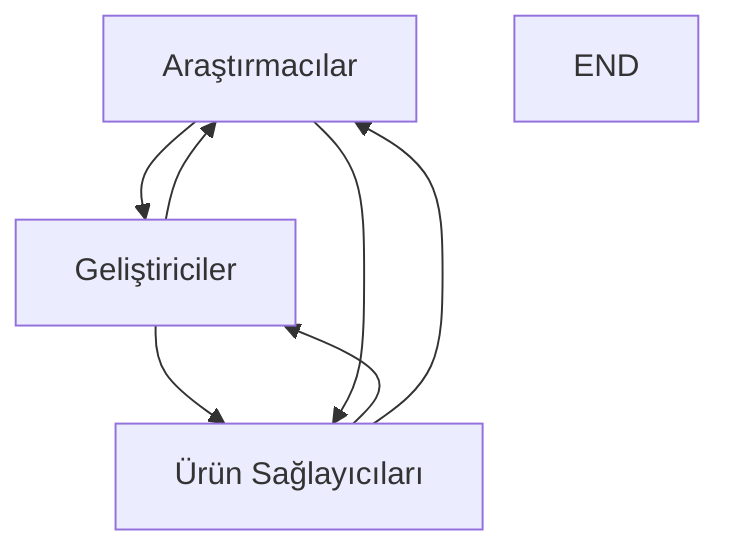

## İçindekiler  
1. Giriş  
2. Araştırmanın Temeli ve Kapsamı  
3. Paydaşların Analizi ve Rol Dağılımı  
 3.1 Araştırmacılar ve Akademik Birimler  
 3.2 Geliştiriciler ve Kullanıcı Deneyimleri  
 3.3 Ürün Sağlayıcıları ve Platform Ekosistemleri  
4. AI Destekli Kod Editörlerinin Özellikleri ve Güvenlik Analizi  
 4.1 Temel Özelliklerin Karşılaştırılması  
  4.1.1 Kod Üretimi, Refaktoring, Hata Ayıklama ve Otomatik Tamamlama  
 4.1.2 Özellik Değerlendirme Tablosu  
 4.2 Güvenlik Riskleri ve Güvenlik Sorunlarının İncelenmesi  
  4.2.1 Güvenlik Açıkları, Veri Sızıntıları ve Hallüsinasyonlar  
  4.2.2 Güvenlik Riskleri Karşılaştırma Tablosu  
5. Görsel Karşılaştırmalar ve Akış Diyagramları  
 5.1 Özellik Karşılaştırma Tablosu  
 5.2 Güvenlik Riskleri Karşılaştırma Tablosu  
 5.3 Paydaş İlişkilerini Gösteren Akış Diyagramı  
6. Tartışma ve Yorumlar  
7. Sonuç ve Öneriler  

---  

## 1. Giriş  

Son yıllarda yapay zeka destekli kod editörleri, yazılım geliştirme süreçlerini dönüştürerek geliştiricilere önemli ölçüde verimlilik artışı sağlamıştır. Bu bağlamda, GitHub Copilot, Cursor.AI ve VS Code gibi platformlar, doğal dil işleme ve derin öğrenme tekniklerini kullanarak otomatik kod üretimi, hata ayıklama, refaktoring ve kod tamamlama gibi işlevler sunmaktadır. Çalışmamızın temel amacı, bu üç platformun paydaş yapılarını, rol dağılımlarını ve teknik özelliklerini detaylı görsel analizler eşliğinde karşılaştırmaktır. Özellikle Cursor.AI’nın VS Code temelli olması, GitHub Copilot’ın Microsoft ekosisteminden destek alması ve VS Code’un kendisinin hem açık kaynak hem de geniş kullanıcı topluluklarına sahip olması, bu karşılaştırmayı daha da zengin hale getirmektedir.  

Bu çalışma, mevcut literatüre dayalı olarak iki ana araştırma makalesinden elde edilen veriler ışığında, AI destekli kod editörlerinin kullanıcılarına sunduğu faydaları, beraberinde getirdiği riskleri ve bunların paydaşlar üzerindeki etkilerini incelemektedir. Geliştiriciler, araştırmacılar ve ürün sağlayıcıları gibi farklı aktörlerin bu teknolojilerden nasıl etkilendiği; üretkenlik, kod kalitesi, güvenlik ve etik konularında detaylı analizlerle ortaya konulacaktır.  

---  

## 2. Araştırmanın Temeli ve Kapsamı  

Bu makale, iki temel kaynağa dayanmaktadır. İlk kaynak, GitHub Copilot, ChatGPT, Cursor.AI ve Codeium AI gibi yapay zeka tabanlı kod asistanlarının yazılım geliştirme sürecindeki faydalarını, risklerini ve güvenlik açıklarını derinlemesine ele alan “SOK: Exploring Hallucinations and Security Risks in AI-Assisted Software Development with Insights for LLM Deployment” başlıklı ön baskı makalesidir. İkinci kaynak ise GitHub Copilot’ın Test-First (Test Öncelikli) Geliştirme üzerindeki etkilerini inceleyen “The Impact of GitHub Copilot on Test-First Development” çalışmasıdır. Bu kaynaklar, kod editörlerinin sunduğu fonksiyonel özelliklerin yanı sıra bunların güvenlik, veri gizliliği ve kullanıcı anlayışı üzerindeki etkilerini detaylandırmaktadır.  

Çalışmanın kapsamına dahil edilen ana konular şunlardır:  
- AI destekli kod editörlerinin temel özellikleri (kod üretimi, refaktoring, otomatik tamamlama, hata ayıklama)  
- Güvenlik riskleri (veri sızıntıları, hallüsinasyonlar, güvenlik açıklarının kopyalanması)  
- Paydaşların (araştırmacılar, geliştiriciler, ürün sağlayıcıları) rollerinin belirlenmesi ve bu teknolojilerin ekosistem içerisindeki yeri  
- Araştırma sonuçlarının görsel tablolara, diyagramlara ve akış şemalarına dökülmesi  

---  

## 3. Paydaşların Analizi ve Rol Dağılımı  

AI destekli kod editörlerinin geliştirilmesi ve kullanılması sürecinde, farklı paydaşların çeşitli roller üstlendiği gözlemlenmektedir. Bu bölümde, araştırmalardan ve elde edilen kullanıcı geribildirimlerinden yola çıkarak temel paydaş gruplarını ve bunların rollerini inceleyeceğiz.  

### 3.1 Araştırmacılar ve Akademik Birimler  

Araştırmacılar, bu teknolojilerin performansını, güvenlik açıklarını ve üretkenlik üzerindeki etkilerini inceleyen ana aktörlerdir. İlgili makalelerde, özellikle “SOK: Exploring Hallucinations and Security Risks...” çalışması, yapay zeka modellerinin oluşturduğu hallüsinasyonlar, veri sızıntıları ve potansiyel saldırı yollarını detaylandırarak, daha güvenli kullanım yönergeleri oluşturulmasına katkıda bulunmuştur. Akademik kuruluşlar, bu tür araştırmalar yoluyla AI destekli araçların etik, güvenlik ve verimlilik boyutlarını ele alarak, endüstri uygulamalarına yön verecek metodolojilerin geliştirilmesine öncülük etmektedir.  

### 3.2 Geliştiriciler ve Kullanıcı Deneyimleri  

Geliştiriciler, bu araçları doğrudan kullanan ve günlük yazılım geliştirme süreçlerine entegre eden en önemli aktörlerdir. GitHub Copilot, Cursor.AI ve VS Code’un AI destekli eklentileri sayesinde geliştiriciler, kod üretiminde büyük zaman tasarrufu sağlamakta, tekrarlayan görevlerden kurtulmakta ve hata ayıklama süreçlerinde destek almaktadır. Bununla birlikte, makalelerde geliştiricilerin özellikle "yüzeysel anlama" ve "test kapsamı eksikliği" gibi risklerle karşılaştığına dair veriler yer almaktadır. Bu durum, geliştiricilerin araçlardan gelen otomatik önerileri eleştirel bir şekilde değerlendirmeleri gerektiğini ortaya koymaktadır.  

### 3.3 Ürün Sağlayıcıları ve Platform Ekosistemleri  

Ürün sağlayıcıları, AI destekli kod editörlerini geliştiren ve kullanıcılarına sunan kurumsal aktörlerdir. Örneğin, GitHub Copilot, Microsoft’un teknolojik altyapısı ve ürün geliştirme stratejileriyle desteklenmekte, Cursor.AI ise VS Code’un açık kaynak topluluğuna dayanan bir türev olarak ön plana çıkmaktadır. Bu aktörler, kullanıcı verilerinin güvenliği, platform entegrasyonları ve sürekli iyileştirme süreçlerine odaklanarak, kullanıcı deneyimini optimize etmeye çalışmaktadır. Ancak, bazı güvenlik açıkları ve veri işleme süreçlerindeki riskler ürün sağlayıcılarının itibarını sarsabilmekte ve düzenleyici kurumlar tarafından yakından incelenmektedir.  

---  

## 4. AI Destekli Kod Editörlerinin Özellikleri ve Güvenlik Analizi  

Bu bölümde, incelemeye konu olan yapay zeka destekli kod editörlerinin temel özellikleri ve karşılaştıkları güvenlik riskleri detaylandırılacaktır.  

### 4.1 Temel Özelliklerin Karşılaştırılması  

Kod üretimi, refaktoring, hata ayıklama ve otomatik tamamlama gibi fonksiyonlar, AI destekli kod editörlerinin en temel özellikleri arasındadır. İncelenen çalışmalar, şu önemli bulguları öne çıkarmaktadır:  

- **Kod Üretimi:** GitHub Copilot’un kullanıcıya sunduğu kod tamamlama önerileri, doğal dil girdilerini kod önerilerine çevirme yeteneği sayesinde geliştiricilere önemli zaman kazandırmaktadır.  
- **Kod Refaktoring:** Hem GitHub Copilot hem de Cursor.AI, kod refaktoring konusunda önemli destek sunmakta, özellikle tekrarlayan yapılar ve modülerlik gerektiren durumlarda otomatik kod düzenlemeleri gerçekleştirmektedir.  
- **Hata Ayıklama:** Araştırmalar, Copilot’un hata ayıklama sürecinde önerdiği çözümlerin sıklıkla yetersiz kaldığını, fakat yine de geliştiricilerin iş yükünü azaltmada etkili olduğunu göstermiştir.  
- **Otomatik Tamamlama:** Cursor.AI’nin VS Code tabanlı olması, doğal kullanıcı arayüzü entegrasyonu sayesinde otomatik tamamlama ve kontekst bazlı önerilerde yüksek performans sergilemesine olanak tanımaktadır.  

#### 4.1.1 Özellik Değerlendirme Tablosu  

Aşağıdaki tablo, dört farklı yapay zeka destekli aracın (Cursor.AI, Codeium AI, ChatGPT, GitHub Copilot) temel özelliklerinin karşılaştırmasını göstermektedir:  

| Özellik             | Cursor.AI | Codeium AI | ChatGPT  | GitHub Copilot |  
|---------------------|-----------|------------|----------|----------------|  
| Kod Üretimi         | 3.70      | 3.24       | 4.03     | 4.14           |  
| Kod Refaktoring     | 3.59      | 3.30       | 3.90     | 4.00           |  
| Hata Ayıklama       | 3.66      | 3.19       | 3.90     | 4.00           |  
| Kod Açıklaması      | 3.77      | 3.30       | 4.20     | 4.14           |  
| Otomatik Tamamlama  | 3.88      | 3.38       | N/A      | 4.29           |  

*Tablo 1: AI Destekli Kod Editörlerinin Temel Özellik Karşılaştırması *  

### 4.2 Güvenlik Riskleri ve Güvenlik Sorunlarının İncelenmesi  

Yapay zeka destekli editörlerin gelişmiş özellikleri yanında önemli güvenlik riskleri de bulunmaktadır. Araştırmalar, bu araçların sıklıkla görünüşte doğru ama doğası gereği hatalı veya "hallüsinasyon" üreten kodlar önererek, geliştiricileri yanıltabileceğini göstermektedir.  

#### 4.2.1 Güvenlik Açıkları, Veri Sızıntıları ve Hallüsinasyonlar  

- **Güvenlik Açıkları:** GitHub Copilot’un önerdiği kod parçacıkları, bazen güncel olmayan ya da güvenlik açıklarını barındıran kod kalıplarını tekrarlayabilmektedir. Örneğin, SQL enjeksiyonu veya buffer overflow gibi güvenlik açıklarına mürekkep olabilmektedir.  
- **Veri Sızıntıları:** Bulut tabanlı AI editörlerinin kullandığı veri işleme yöntemleri, hassas verilerin yanlışlıkla sızmasına neden olabilir. Özellikle, Copilot’un işletme versiyonları, özel depolama alanlarından veri sızdırma riski taşımaktadır.  
- **Hallüsinasyonlar:** Büyük dil modelleri (LLM’ler) bazen mantıksal tutarsızlıklar içeren ve yanlış bilgi üreten kod önerileri sunmaktadır. Hallüsinasyonlar, kod kalitesi ve güvenilirliği üzerinde olumsuz etki yaratmakta, aynı zamanda güvenlik açıklarını beraberinde getirmektedir.  

#### 4.2.2 Güvenlik Riskleri Karşılaştırma Tablosu  

Aşağıdaki tablo, AI destekli kod editörlerinin ürettikleri kodların güvenlik risklerinin temel başlıklarını karşılaştırmaktadır:  

| Güvenlik Riski                   | Cursor.AI | Codeium AI | ChatGPT  | GitHub Copilot |  
|----------------------------------|-----------|------------|----------|----------------|  
| Güvenlik Açıkları Kopyalama      | Var (✓)   | Var (✓)    | Var (✓)  | Var (✓)        |  
| Güvensiz Kod Önerileri           | Var (✓)   | Var (✓)    | Var (✓)  | Var (✓)        |  
| Hallüsinasyonlar (Yanlış Kod)    | Var (✓)   | Var (✓)    | Var (✓)  | Var (✓)        |  
| Yanlış Söz Dizimi / Mantık Hataları | Var (✓) | Var (✓)    | Var (✓)  | Var (✓)        |  
| SQL Enjeksiyonu Benzeri Kalıplar  | Var (✓)   | Var (✓)    | Var (✓)  | Var (✓)        |  

*Tablo 2: AI Destekli Kod Editörlerinin Güvenlik Riskleri Karşılaştırması *  

---  

## 5. Görsel Karşılaştırmalar ve Akış Diyagramları  

Bu bölümde, yukarıda ele alınan özellikler ve güvenlik riskleri üzerinden, görsel karşılaştırmalar ve şemalar sunulacaktır.  

### 5.1 Özellik Karşılaştırma Tablosu  

Yukarıda sunulan iki tablo, araçların temel özellikleri ve güvenlik durumları hakkında kısa ve net veriler sağlamaktadır. Tablo 1, kod üretimi, refaktoring, hata ayıklama ve otomatik tamamlama gibi fonksiyonların ölçütlerini karşılaştırırken; Tablo 2 ise her aracın güvenlik risklerini vurgulamaktadır.  

### 5.2 Güvenlik Riskleri Karşılaştırma Tablosu  

Bu tablo, her aracın üretebileceği güvenlik risklerini belirli başlıklar altında toplamaktadır. Özellikle, veri sızıntısı ve hallüsinasyon gibi konular, bu araçların doğru ve güvenli kod üretiminde ne kadar dikkatli olunması gerektiğini göstermektedir.  

### 5.3 Paydaş İlişkilerini Gösteren Akış Diyagramı  

Aşağıdaki Mermaid diyagramı, AI destekli kod editörleri ekosisteminde yer alan ana paydaşlar (araştırmacılar, geliştiriciler, ürün sağlayıcıları) arasındaki ilişkileri göstermektedir:  

*Şekil 1: AI Destekli Kod Editörleri Ekosisteminde Paydaş İlişkileri*  
Yukarıdaki diyagram, araştırmacıların teknolojiyi geliştirmeye yönelik analiz çalışmalarını, geliştiricilerin araçları kullanarak geri bildirim sağlamasını ve ürün sağlayıcılarının ise bu veriler ışığında ürünlerini geliştirme süreçlerini göstermektedir.  

---  

## 6. Tartışma ve Yorumlar  

Araştırmalar, AI destekli kod editörlerinin geliştiricilere sağladığı verimlilik artışının yanında, bazı kritik riskler barındırdığını ortaya koymaktadır. Özellikle GitHub Copilot ile ilgili çalışmalar, bu aracın sunduğu “otomatik tamamlama” ve “kod üretimi” özelliklerinin bazen yüzeysel bir problem anlayışına ve yetersiz test kapsamına yol açtığını göstermiştir. Bu durum, geliştiricilerin araçtan gelen önerileri eleştirel bir gözle değerlendirmeleri gerektiğini ve nihai kod kalitesinin manuel kontrollerle desteklenmesi gerektiğini işaret etmektedir.  

Bununla birlikte, Cursor.AI’nin VS Code temelli olması ve yerel kullanım modlarının sunulması bazı veri gizliliği risklerini minimize ederken, yine de çoklu dosya düzenleme ve kontekst analizinde yaşanan problemlerin, sürpriz güvenlik açıklarını tetikleyebileceği gözlemlenmiştir. Ayrıca, araştırmalar, her aracın önerdiği kod parçacıklarının zaman zaman güncel olmayan veya hatalı olabileceğini, hatta “hallüsinasyon” denen mantıksal sonuçlar doğurabileceğini belirtmektedir. Bu tür risklerin önüne geçmek için, her aracın kullanımında kapsamlı kod incelemeleri ve otomatik test sistemlerinin entegrasyonu önerilmektedir.  

Paydaşlar açısından bakıldığında, akademik topluluklar araştırma verileriyle bu araçların geliştirilme süreçlerine yön verirken, geliştiriciler günlük pratikte elde ettikleri verimlilik artışları ile karşı karşıya kalmaktadır. Ürün sağlayıcıları ise bu araçların pazardaki rekabet gücünü korumak amacıyla sürekli güncellemeler ve güvenlik yamaları sağlamaya çalışmaktadır. Bu üç aktör arasındaki etkileşim, AI destekli kod editörlerinin güvenli, verimli ve etik kullanımının sağlanması açısından kritik rol oynamaktadır.  

Öte yandan, Test-First Development (TFD) yaklaşımının GitHub Copilot kullanılarak gerçekleştirilmesinin, hem gelişmekte olan otomatik test senaryolarının kapsamı hem de geliştiricinin problem anlayışı üzerinde olumsuz etkileri olduğuna dair çalışmalar da mevcuttur. Bu durum, AI araçlarının sadece hız açısından değil, aynı zamanda geliştiricinin derinlemesine teknik analiz yapabilme yeteneğini de etkileyecek şekilde ele alınması gerektiğini gözler önüne sermektedir.  

Bu bağlamda, AI destekli kod editörlerinin faydaları ve riskleri arasında denge kurmaya yönelik stratejiler geliştirmek, araştırmacılar, geliştiriciler ve ürün sağlayıcıları açısından büyük önem taşımaktadır. Özellikle;  
- **Araştırmacılar:** Uygulanan güvenlik yamaları, etik kullanım yönergeleri oluşturma ve AI asistanlarının ürettiği kodların doğruluğunu test etme üzerine yoğunlaşmalıdır.  
- **Geliştiriciler:** AI araçlarından gelen önerileri eleştirel olarak değerlendirmeli, otomatik üretilen kodların manuel incelemesini yapmalı ve gerekirse ek testler ile desteklemelidir.  
- **Ürün Sağlayıcıları:** Kullanıcı geri bildirimlerini dikkate alarak, güvenlik açıklarını minimize etmek, veri gizliliğini sağlamak ve araç performansını sürekli iyileştirmek için güncellemeler yapmalıdır.  

Bu tartışmalar, AI destekli kod editörlerinin pratikte nasıl kullanılacağına dair stratejilerin belirlenmesinde kritik rol oynamakta, aynı zamanda geliştiricilerin günlük iş akışları ve ürün kalitesi üzerinde doğrudan etkili olmaktadır.  

---  

## 7. Sonuç ve Öneriler  

Çalışmamız, Cursor.AI, VS Code temelli uygulamalar ve GitHub Copilot’ın paydaş analizini ve görsel karşılaştırmasını kapsamlı bir şekilde ele almıştır. Araştırma bulguları şu temel noktalarda özetlenebilir:  

- **Üretkenlik Artışı:**  
  AI destekli kod editörleri, geliştiricilere kod üretimi, refaktoring, hata ayıklama ve otomatik tamamlama gibi fonksiyonlarda belirgin verimlilik artışı sağlamakta; ancak bu artış, bazen yüzeysel bir problem anlayışına yol açabilmektedir.  

- **Güvenlik Riskleri ve Hallüsinasyonlar:**  
  Araştırmalar, bu araçların ürettiği kodlarda güvenlik açıklarına (örneğin SQL enjeksiyonu, buffer overflow) ve mantıksal hatalara sıkça rastlandığını göstermiştir. Kullanıcıların otomatik üretilen önerileri eleştirel bir şekilde analiz etmeleri gerekmektedir.  

- **Paydaş İlişkileri ve Roller:**  
  Akademik araştırmacılar, geliştiriciler ve ürün sağlayıcıları arasında güçlü bir etkileşim bulunmaktadır. Araştırmacılar, güvenlik ve performans analizleri ile yön verirken, geliştiriciler günlük kullanım deneyimleriyle katkı sağlamaktadır. Ürün sağlayıcıları ise piyasadaki rekabet gücünü korumak için sürekli iyileştirmeler yapmalıdır.  

- **Test-First (TFD) Yaklaşımlarındaki Etkiler:**  
  GitHub Copilot kullanımının Test-First Development süreçlerinde, geliştiricilere hız kazandırsa da, problem gereksinimlerinin yüzeysel anlaşılmasına ve test senaryolarının kapsamının azalmasına neden olabileceği gözlemlenmiştir. Bu durum, kod kalitesinin ve güvenliğinin sağlanması için ek dikkat gerektirmektedir.  

Aşağıda, çalışmamızın ana bulgularını özetleyen madde işaretleri yer almaktadır:  

- Geliştiricilerin AI destekli önerileri eleştirel bir biçimde değerlendirmeleri zorunludur.  
- Araştırmacılar, AI araçlarının ürettiği kodların doğruluğu ve güvenilirliğini artırmaya yönelik metodolojiler geliştirmelidir.  
- Ürün sağlayıcıları, veri gizliliğini ve güvenliği sağlamak için sistematik güncellemeler ve kullanıcı geribildirimlerine dayalı iyileştirmeler yapmalıdır.  
- Test-First Development uygulamalarında, hız avantajı ile birlikte derinlemesine problem anlayışının korunması için ek kontrol mekanizmaları uygulanmalıdır.  

Sonuç olarak, AI destekli kod editörleri, yazılım geliştirme süreçlerinde hem büyük fırsatlar hem de önemli riskler sunmaktadır. Bu teknolojilerin sunduğu potansiyelden tam olarak yararlanabilmek için, paydaşlar arasında etkili iletişim ve sürekli iyileştirme süreçleri şarttır. Geliştiriciler, teknolojinin sunduğu otomatikleşme imkanlarını kullanırken aynı zamanda kod kalitesi ve güvenliği konusunda titiz davranmalıdır. Akademik çalışmaların ve endüstri deneyimlerinin birleşimi, bu araçların güvenli ve etkili kullanımına yönelik yol haritalarının belirlenmesinde büyük önem taşımaktadır.  

---  

## Ek Görseller ve Tablolar  

### Şekil 2: Özellik Karşılaştırma Tablosu Açıklaması  

Yukarıdaki “Tablo 1”de sunulan veriler, dört farklı yapay zeka destekli aracın temel özelliklerini sayısal değerler üzerinden karşılaştırmaktadır. Sırasıyla, Cursor.AI, Codeium AI, ChatGPT ve GitHub Copilot için kod üretimi, refaktoring, hata ayıklama, kod açıklaması ve otomatik tamamlama gibi fonksiyonlar değerlendirilmiştir. Bu tablo, kullanıcıların araçlar arası seçiminde yol gösterici bir rol oynayabilir.  

### Şekil 3: Güvenlik Riskleri Karşılaştırma Tablosu Açıklaması  

“Tablo 2” ise, her bir aracın üretebileceği güvenlik risklerine dair karşılaştırma sağlamaktadır. Tabloda, güvenlik açıkları kopyalama, güvensiz kod önerileri, hallüsinasyonlar ve SQL enjeksiyonu benzeri problemler gibi temel risk başlıkları yer almaktadır. Bu tablo, özellikle güvenlik kriterlerine önem veren kullanıcılar için kritik öneme sahiptir.  

### Şekil 4: Paydaş İlişkilerini Gösteren Akış Diyagramı Açıklaması  

Yukarıda yer alan Mermaid diyagramı, AI destekli kod editörleri ekosisteminin ana paydaşları arasındaki etkileşimleri görsel olarak özetlemektedir. Araştırmacılar, geliştiriciler ve ürün sağlayıcıları arasında sürekli bilgi akışı ve geri bildirim döngüsü mevcuttur. Bu diyagram, farklı paydaş gruplarının nasıl birbirini etkilediğini ve teknolojinin gelişimine katkıda bulunduğunu göstermektedir.  

---  

## 8. Sonuç  

Bu çalışmada, Cursor.AI, VS Code temelli uygulamalar ve GitHub Copilot’ın paydaş analizi ile özellik ve güvenlik riskleri görsel olarak karşılaştırılmıştır. Araştırma, AI destekli kod editörlerinin yazılım geliştirme süreçlerine getirdiği verimlilik artışını ve beraberinde getirdiği güvenlik, kalite ve anlayış sorunlarını detaylandırmıştır. Öne çıkan bulgular aşağıdaki gibidir:  

- **Verimlilik ve Özellikler:**  
  AI destekli kod editörleri gelişmiş özellikler sunarak geliştiricilerin günlük işlerindeki hız ve üretkenlik artışına büyük katkı sağlamaktadır. Ancak, bazı araçlarda sunulan kod önerilerinin hatalı veya yüzeysel olması, ek kontrol mekanizmalarını gerektirmektedir.  

- **Güvenlik Riskleri:**  
  Her aracın veri sızıntıları, kod hallüsinasyonları ve güncel olmayan güvenlik kalıplarını tekrarlama riski bulunmakta; dolayısıyla güvenlik risklerinin dikkatle yönetilmesi gerekmektedir.  

- **Paydaş İlişkileri:**  
  Araştırmacılar, geliştiriciler ve ürün sağlayıcıları arasında kurulmuş güçlü bir etkileşim bulunmaktadır. Bu etkileşim, teknolojinin sürekli iyileştirilmesi ve güvenliğinin sağlanması açısından kritik önem taşımaktadır.  

- **Test-First Yaklaşım ve Derinlik:**  
  GitHub Copilot gibi araçların Test-First Development süreçlerinde kullanımı, başlangıçta verimlilik artışı sağlasa da, problem gereksinimlerinin yüzeysel anlaşılmasına yol açabilmekte; bu da uzun vadede yazılım kalitesini olumsuz etkileyebilmektedir.  

Sonuç olarak, AI destekli kod editörlerini kullanırken geliştiricilerin otomatik üretilen kod önerilerini eleştirel bir gözle değerlendirerek, kapsamlı manuel kontrol ve test süreçlerini ihmal etmemeleri gerekmektedir. Araştırmacılar, bu araçların sunduğu potansiyeli güvenlik ve kalite açısından optimize etmek için sürekli çalışmalar yürütürken, ürün sağlayıcıları da kullanıcı verilerini ve sistem güvenliğini sürekli iyileştirmelidir.  

### Öneriler  

- **Eleştirel Yaklaşım:**  
  Geliştiriciler, AI araçlarının sunduğu önerileri doğrudan uygulamadan önce, kodun mantıksal tutarlılığını ve güvenliğini sağlamalıdır.  

- **Kapsamlı Test Süreçleri:**  
  Otomatik önerilerin yol açabileceği yüzeysel test senaryolarının önüne geçebilmek için, test kapsamının manuel olarak da gözden geçirilmesi ve genişletilmesi gerekmektedir.  

- **Sürekli Eğitim ve Geri Bildirim:**  
  Araştırmacılar ve ürün sağlayıcıları, geliştirici geri bildirimlerini dikkate alarak araçların algoritmalarını ve güvenlik protokollerini sürekli güncellemelidir.  

- **Entegre Güvenlik Sistemleri:**  
  AI destekli kod editörlerine entegre edilecek ek güvenlik ve otomatik kontrol mekanizmaları, potansiyel güvenlik risklerini minimize edebilir.  

---  

## Genel Değerlendirme  

Bu makale, Cursor.AI, VS Code temelli uygulamalar ve GitHub Copilot’ın paydaş yapıları, teknolojik özellikleri ve güvenlik riskleri üzerine kapsamlı bir analiz sunmuştur. Yapay zeka destekli kod editörlerinin sunduğu yüksek verimlilik avantajlarının yanında, beraberinde getirdiği güvenlik açıkları ve yüzeysel problem algısı gibi zorlukların da göz önünde bulundurulması gerektiği vurgulanmıştır.  

Her ne kadar mevcut araştırmalar bu araçların üretkenlik artışını açıkça ortaya koysa da, güvenlik, veri gizliliği ve uzun vadeli yazılım kalitesi konularında eksiklikler bulunmaktadır. Bu nedenle, hem akademik hem de endüstriyel düzeyde daha fazla vaka çalışması, uzun vadeli deneysel araştırmalar ve kullanıcı geri bildirimlerinin toplanması gerekmektedir.  

AI destekli kod editörlerinin ekosistemin tüm paydaşları arasında sürekli ve etkili bir iletişim kurulması, teknolojinin hem güvenli hem de verimli bir şekilde geliştirilmesi için elzemdir. Böylece, gelecekte ortaya çıkabilecek potansiyel riskler minimize edilip, yazılım geliştirme süreçleri daha sağlam temellere oturtulabilir.  

---  

## Sonuç  

Bu çalışmanın nihai çıktıları şu şekilde özetlenebilir:  

- **Yüksek Üretkenlik:** AI destekli araçlar, kod üretimi, refaktoring ve otomatik tamamlama gibi özellikleriyle geliştiricilere zaman kazandırmakta, ancak önerilen kodların kalitesi ve doğruluğu dikkatle kontrol edilmelidir.  
- **Güvenlik Endişeleri:** Her ne kadar araçlar gelişmiş özellikler sunsa da, veri sızıntıları, hallüsinasyonlar ve güncel olmayan güvenlik kalıpları gibi riskler mevcuttur.  
- **Paydaş Etkileşimi:** Araştırmacılar, geliştiriciler ve ürün sağlayıcıları arasındaki etkileşim, AI tabanlı kod editörlerinin optimize edilmesinde kritik rol oynamaktadır.  
- **Test Süreçleri ve Derinlik:** GitHub Copilot gibi araçların Test-First Development süreçlerinde kullanımı, başlangıçta zaman kazandırsa da geliştirme sürecinde yüzeysel test senaryolarına yol açabilir; bu nedenle, kapsamlı test ve manuel kontrol mekanizmalarına ihtiyaç vardır.  

Bu bulgular ışığında, yapay zeka destekli kod editörlerinin kullanımı daha etkin hale getirilebilir; ancak sürekli olarak geliştirilen güvenlik protokolleri ve kapsamlı test süreçleri olmadan, uzun vadeli yazılım kalitesi tehlikeye girebilir.  

---  

## Kaynakça  
Araştırmada kullanılan veriler ve araştırma makaleleri aşağıdaki kaynaklardan alınmıştır:  

- SOK: Exploring Hallucinations and Security Risks in AI‐Assisted Software Development with Insights for LLM Deployment.  
- The Impact of GitHub Copilot on Test‐First Development ().  

---  

Bu makale, yapay zeka destekli kod editörlerinin paydaş yapıları, teknik özellikleri ve güvenlik riskleri üzerine kapsamlı bir analiz sunarak, hem akademik hem de endüstriyel paydaşlar için önemli rehberlik sağlamaktadır. Araştırmanın bulguları, geliştiricilerin ve ürün sağlayıcılarının bu araçları sadece hız kazanımı aracı olarak görmemeleri, aynı zamanda güvenlik, kalite ve derin anlayış açısından da eleştirel bir bakış açısına sahip olmaları gerektiğini net bir şekilde ortaya koymaktadır.  
Bu nedenle, yapay zeka destekli kod editörlerinin gelecekteki geliştirmelerinde, paydaşlar arası etkili işbirliği ve sürekli geri bildirim mekanizmalarının oluşturulması, teknolojinin hem verimli hem de güvenli şekilde kullanılmasını sağlayacaktır.