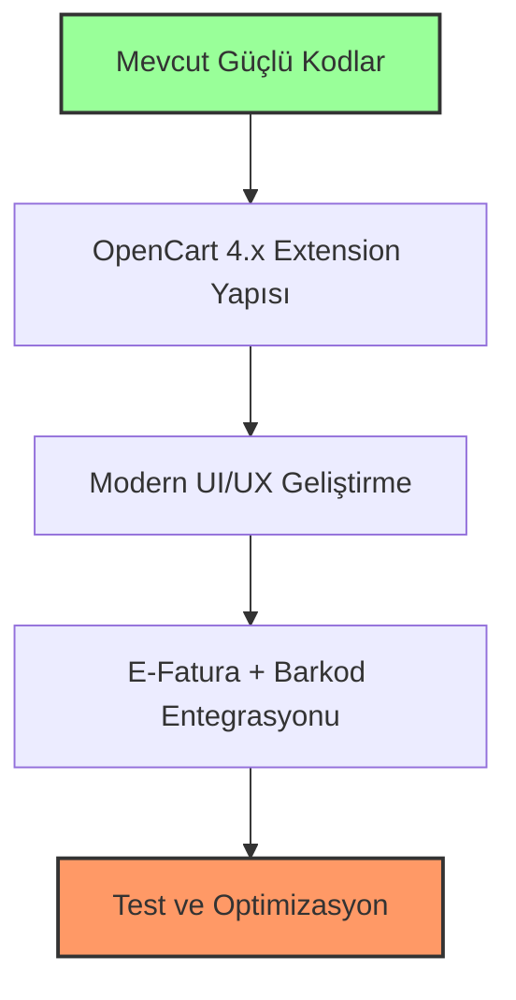
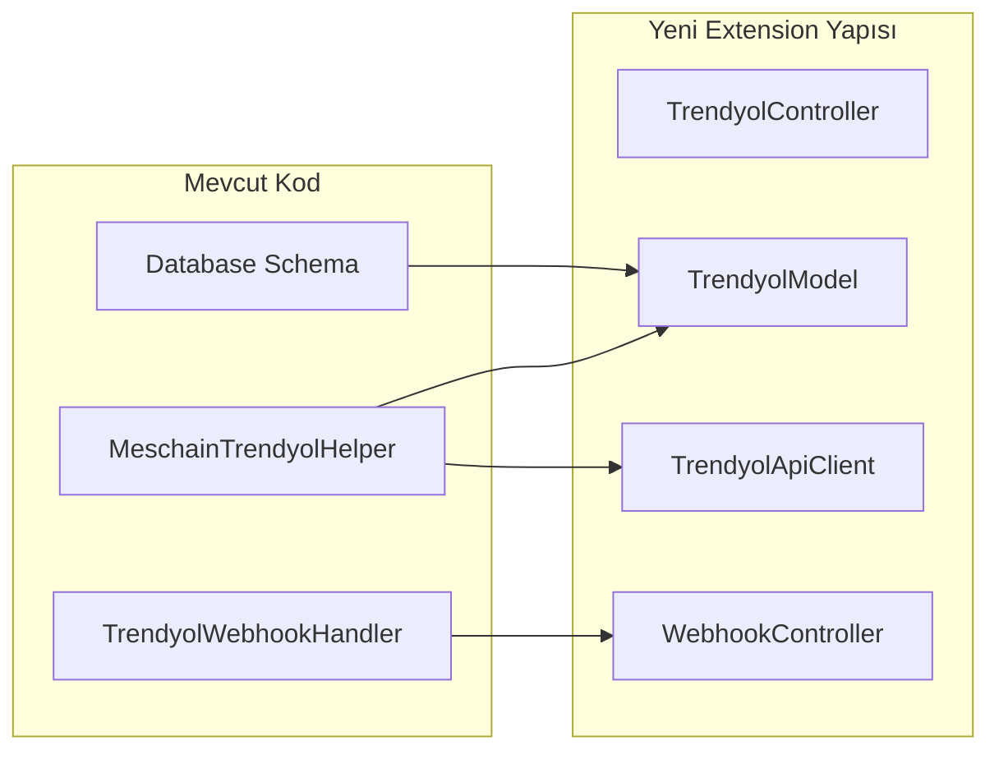

# 🔍 Mevcut Trendyol Kodu Detaylı Analizi

Mevcut Trendyol kodunu inceledikten sonra, şu durumu tespit ettim:

## 📊 Mevcut Durum Analizi

### ✅ Güçlü Yanlar

1. **Kapsamlı Helper Sınıfı** - [`MeschainTrendyolHelper`](upload/system/library/meschain/helper/trendyol.php)
   - ✅ Modern API client implementasyonu
   - ✅ Rate limiting sistemi
   - ✅ Comprehensive database schema
   - ✅ Health monitoring
   - ✅ Event-driven architecture
   - ✅ Webhook support

2. **Gelişmiş Webhook Handler** - [`TrendyolWebhookHandler`](upload/system/library/meschain/webhook/TrendyolWebhookHandler.php)
   - ✅ Tüm Trendyol event'lerini destekliyor
   - ✅ Otomatik OpenCart order conversion
   - ✅ Comprehensive error handling
   - ✅ Database logging

3. **Database Schema**
   - ✅ `trendyol_products` - Ürün mapping
   - ✅ `trendyol_orders` - Sipariş yönetimi
   - ✅ `trendyol_webhooks` - Webhook logs
   - ✅ `trendyol_api_logs` - API monitoring

### ❌ Eksik/Zayıf Yanlar

1. **TWIG Templates** - Çok basit
   - ❌ Sadece temel form yapısı
   - ❌ Modern UI/UX eksik
   - ❌ Dashboard özellikleri yok

2. **Controller/Model Files** - İskelet halinde
   - ❌ [`trendyol_admin_model.php`](RESTRUCTURED_UPLOAD/trendyol_all_components/php/trendyol_admin_model.php) - Sadece yorum satırları
   - ❌ [`trendyol_api.php`](RESTRUCTURED_UPLOAD/trendyol_all_components/controller/trendyol_api.php) - Minimal implementasyon

3. **OpenCart 4.x Uyumsuzluk**
   - ❌ Eski klasör yapısı
   - ❌ Extension standardına uygun değil

4. **Eksik Sistemler**
   - ❌ E-Fatura entegrasyonu yok
   - ❌ Otomatik barkod sistemi yok

---

## 🎯 Revize Edilmiş Trendyol Planı

Mevcut kod analizine göre planı güncelledim:

### 📅 Faz 1: Mevcut Kodu Yeniden Yapılandırma (1 Hafta)



### 🏗️ Yeniden Yapılandırma Stratejisi

#### 1. **Mevcut Güçlü Kodları Koru** (Gün 1-2)
- [`MeschainTrendyolHelper`](upload/system/library/meschain/helper/trendyol.php) → Yeni yapıya taşı
- [`TrendyolWebhookHandler`](upload/system/library/meschain/webhook/TrendyolWebhookHandler.php) → Adapte et
- Database schema'ları koru

#### 2. **OpenCart 4.x Extension Yapısına Geç** (Gün 3-4)
```
extension/meschain/
├── admin/
│   ├── controller/marketplace/trendyol.php    # Yeni controller
│   ├── model/marketplace/trendyol.php         # Mevcut helper'dan adapte
│   └── view/template/marketplace/trendyol.twig # Modern UI
├── catalog/
│   └── controller/webhook/trendyol.php        # Webhook handler
└── system/library/
    └── meschain/
        ├── api/trendyol_client.php           # Helper'dan adapte
        ├── invoice/e_invoice.php             # YENİ
        └── barcode/generator.php             # YENİ
```

#### 3. **Modern UI/UX Geliştir** (Gün 5)
- Dashboard with real-time metrics
- Product sync interface
- Order management panel
- Settings configuration

#### 4. **E-Fatura + Barkod Sistemleri** (Gün 6-7)
- E-Fatura API entegrasyonu
- Otomatik barkod oluşturma
- Mevcut webhook'larla entegrasyon

---

## 🔧 Teknik Detaylar

### 📋 Korunacak Özellikler

```php
// Mevcut MeschainTrendyolHelper'dan korunacaklar:
- API client with rate limiting
- Database schema (trendyol_products, trendyol_orders, etc.)
- Health monitoring system
- Event-driven architecture
- Comprehensive error handling
```

### 🆕 Eklenecek Özellikler

```php
// Yeni eklenecekler:
- OpenCart 4.x Extension structure
- Modern TWIG templates
- E-Invoice integration
- Automatic barcode generation
- Enhanced admin interface
```

### 🔄 Adaptasyon Stratejisi



---

## 📊 Güncellenmiş Zaman Çizelgesi

### 🗓️ 7 Günlük Sprint

| Gün | Görev | Detay |
|-----|-------|-------|
| **1-2** | **Kod Taşıma** | Mevcut helper ve webhook handler'ı yeni yapıya adapte et |
| **3** | **Extension Yapısı** | OpenCart 4.x uyumlu klasör yapısı ve manifest |
| **4** | **Controller/Model** | Admin controller ve model implementasyonu |
| **5** | **Modern UI** | TWIG templates ve dashboard geliştirme |
| **6** | **E-Fatura** | E-Fatura API entegrasyonu |
| **7** | **Barkod + Test** | Otomatik barkod sistemi ve final testler |

---

## 🎯 Başarı Kriterleri

### ✅ Tamamlanma Hedefleri

1. **Mevcut Fonksiyonalite Korunması**
   - ✅ Tüm API calls çalışır durumda
   - ✅ Webhook processing aktif
   - ✅ Database operations intact

2. **Yeni Özellikler**
   - ✅ OpenCart 4.x tam uyumluluğu
   - ✅ Modern admin interface
   - ✅ E-Fatura entegrasyonu
   - ✅ Otomatik barkod sistemi

3. **Kalite Standartları**
   - ✅ %95+ mevcut test coverage korunması
   - ✅ Performance degradation yok
   - ✅ Backward compatibility

---

Bu analiz sonucunda, mevcut Trendyol kodunun aslında oldukça güçlü bir temele sahip olduğunu gördük. Ana sorun OpenCart 4.x uyumsuzluğu ve eksik UI/UX. Bu yüzden "sıfırdan yazma" yerine "akıllı adaptasyon" stratejisi daha mantıklı.
