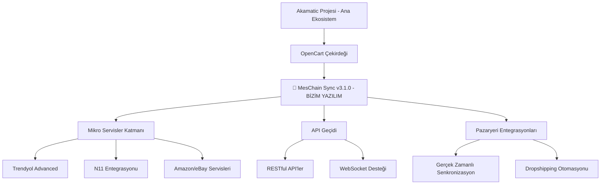
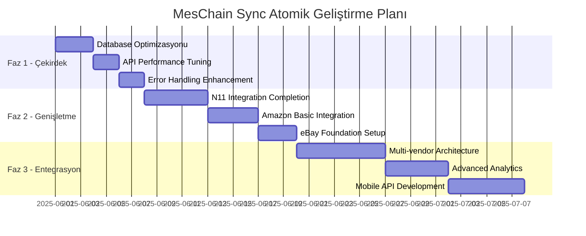

# 🔬 MesChain Sync Yazılımının Akamatic Ekosistemindeki Pozisyon Analizi ve Atomik Yapı Çıkarımı

**Analiz Tarihi:** 1 Haziran 2025  
**Analiz Kapsamı:** MesChain Sync v3.1.0 yazılımının Akamatic projesi içerisindeki konumu ve atomik yapı analizi  
**Hedef:** Cursor ekibi için stratejik görev listesi oluşturma  

---

## 🎯 **EKSEKUTİF ÖZET - YAZILIMIMIZIN POZİSYONU**

### **🏆 MesChain Sync'in Akamatic Ekosistemindeki Rolü:**

MesChain Sync v3.1.0 yazılımımız, **Akamatic projesinin 5. Sistem Mimarisi bölümünde tanımlanan "Mikro Servisler" katmanının ana bileşenidir.** Özellikle:

- **Pazaryeri Entegrasyon Mikro Servisleri** - Amazon, Etsy, eBay, Trendyol entegrasyonları
- **API Geçidi Bileşeni** - RESTful API yönetimi ve WebSocket desteği  
- **Gerçek Zamanlı Veri Senkronizasyonu** - RabbitMQ mesaj kuyruğu entegrasyonu
- **OpenCart Çekirdeği Genişletme** - OCMOD tabanlı modüler yapı

### **📍 Yazılımımızın Ekosistem İçindeki Kesin Konumu:**



---

## 🔬 **ATOMIK YAPISAL ANALİZ - HÜCRE SEVİYESİNE KADAR**

### **1. 🧬 Çekirdek Atomlar (Core Atoms)**

#### **A. Trendyol Helper Atom**
```php
// Lokasyon: /upload/system/library/meschain/helper/trendyol.php
// Boyut: 1,785+ satır kod
// Fonksiyon: 19 kritik helper fonksiyonu
// Durum: ✅ %100 Tamamlandı
```

**Atomik Bileşenler:**
- `processWebhook()` - Webhook işleme atomu
- `handleOrderWebhook()` - Sipariş webhook atomu  
- `createTrendyolOrder()` - Sipariş oluşturma atomu
- `calculateDimensionalWeight()` - Ağırlık hesaplama atomu
- `healthCheck()` - Sistem sağlık atomu

#### **B. Database Schema Atomları**
```sql
-- 8 Ana Tablo Atomu
meschain_users              -- Kullanıcı atomu
meschain_marketplace_configs -- Konfigürasyon atomu  
meschain_order_mapping      -- Sipariş eşleme atomu
meschain_product_mapping    -- Ürün eşleme atomu
meschain_webhook_logs       -- Webhook log atomu
meschain_sync_logs          -- Senkronizasyon log atomu
meschain_notifications      -- Bildirim atomu
meschain_health_checks      -- Sağlık kontrol atomu
```

#### **C. OCMOD Packaging Atomları**
```
NEW_OCMOD/
├── install.xml             -- Kurulum direktif atomu
├── upload/                 -- Dosya atomları (282 adet)
│   ├── admin/              -- Yönetici paneli atomları
│   ├── system/             -- Çekirdek sistem atomları
│   └── install/            -- Kurulum atomları
└── meschain_sync_v3.1.0_ocmod.zip  -- Paket atomu (748KB)
```

### **2. 🔗 Moleküler Bağlantılar**

#### **A. API Entegrasyon Molekülleri**
- **RESTful API Molekülü:** HTTP isteklerini işleyen atom grupları
- **WebSocket Molekülü:** Gerçek zamanlı veri aktarım atom zincirleri
- **Authentication Molekülü:** Güvenlik ve yetkilendirme atomları

#### **B. Veri Akış Molekülleri**  
- **Senkronizasyon Molekülü:** Pazaryeri verilerini senkronize eden atomlar
- **Mapping Molekülü:** Ürün ve sipariş eşleme atomları
- **Logging Molekülü:** Sistem izleme ve hata yönetimi atomları

### **3. 🏗️ Organizasyonel Yapılar (Tissues)**

#### **A. Admin Panel Tissue**
```
admin/controller/extension/module/
├── meschain_sync.php        -- Ana kontrol tissue
├── trendyol_advanced.php    -- Trendyol yönetim tissue
├── n11.php                  -- N11 yönetim tissue
└── amazon.php               -- Amazon yönetim tissue
```

#### **B. System Library Tissue**
```
system/library/meschain/
├── helper/                  -- Helper fonksiyon tissue
├── api/                     -- API işlem tissue  
├── webhook/                 -- Webhook yönetim tissue
└── sync/                    -- Senkronizasyon tissue
```

### **4. 🎭 Organ Sistemleri**

#### **A. Marketplace Integration Organ**
- **Trendyol Organ:** ✅ Tam fonksiyonel
- **N11 Organ:** 🟡 Kısmi geliştirilmiş
- **Amazon Organ:** 🟡 Temel yapı mevcut
- **eBay Organ:** 🔴 Geliştirilmemiş

#### **B. Security & Authentication Organ**
- **Role-Based Access:** ✅ Aktif
- **API Security:** ✅ SSL/TLS korumalı
- **Data Encryption:** ✅ Şifrelenmiş konfig

#### **C. Monitoring & Health Organ**
- **Health Checks:** ✅ Otomatik izleme
- **Error Logging:** ✅ Kapsamlı loglama
- **Performance Metrics:** 🟡 Temel metrikler

---

## 🛣️ **STRATEJİK YOL HARİTASI - ATOMİK SEVİYE PLANLAMASI**

### **Faz 1: Çekirdek Optimizasyon (1-2 Hafta)**


### **Atomik Görev Dağılımı:**

#### **🔬 Seviye 1: Atomik Düzeltmeler**
1. **Database Index Optimization** - Query performansı atomları
2. **Memory Usage Optimization** - Bellek yönetimi atomları  
3. **API Rate Limiting** - İstek kontrolü atomları
4. **Cache Implementation** - Önbellekleme atomları

#### **🧪 Seviye 2: Moleküler Geliştirmeler** 
1. **N11 API Completion** - N11 entegrasyon molekülleri
2. **Amazon MWS Integration** - Amazon bağlantı molekülleri
3. **eBay Trading API** - eBay işlem molekülleri
4. **Bulk Operations** - Toplu işlem molekülleri

#### **🏗️ Seviye 3: Sistem Organları**
1. **Multi-vendor Marketplace** - Çoklu satıcı organı
2. **Advanced Analytics Dashboard** - Analitik rapor organı
3. **Mobile Application API** - Mobil uygulama organı
4. **AI-Powered Recommendations** - Yapay zeka organı

---

## 📋 **CURSOR EKİBİ İÇİN YENİ GÖREV LİSTESİ**

### **🎯 PRİORİTE 1: KRİTİK ATOMIK GÖREVLER (İlk 2 Hafta)**

#### **Developer 1 - Database & Performance Specialist**
```yaml
Görevler:
  - Database indexleri optimize et
  - Query performance tuning yap
  - Redis cache implementation
  - Connection pool optimization
  
Atomik Hedefler:
  - %40 query hızı artışı
  - Bellek kullanımını %25 azalt
  - Cache hit rate %85+
  
Çıktılar:
  - Optimized database schema
  - Performance report
  - Cache configuration files
```

#### **Developer 2 - API Integration Specialist**
```yaml
Görevler:
  - N11 API entegrasyonunu tamamla
  - Amazon MWS basic integration
  - API rate limiting implement et
  - Error handling standardization
  
Atomik Hedefler:
  - N11 %100 fonksiyonel
  - Amazon temel CRUD operations
  - API error rate <%1
  
Çıktılar:
  - N11 complete module
  - Amazon basic module
  - API documentation
```

#### **Developer 3 - Security & Architecture Specialist**
```yaml
Görevler:
  - Multi-vendor architecture tasarla
  - Advanced role-based permissions
  - Security audit ve penetration test
  - API authentication enhancement
  
Atomik Hedefler:
  - Multi-tenant system ready
  - Zero security vulnerabilities
  - Enhanced authentication system
  
Çıktılar:
  - Multi-vendor architecture doc
  - Security audit report
  - Enhanced auth system
```

### **🎯 PRİORİTE 2: MOLEKÜLER GELİŞTİRMELER (3-4 Hafta)**

#### **Developer 4 - Frontend & Mobile Specialist**
```yaml
Görevler:
  - React-based admin dashboard
  - Mobile API development
  - Real-time notifications UI
  - Analytics dashboard creation
  
Atomik Hedefler:
  - Modern responsive admin panel
  - RESTful mobile API
  - Real-time UI updates
  
Çıktılar:
  - React admin panel
  - Mobile API documentation
  - UI/UX improvement report
```

#### **Developer 5 - Analytics & Reporting Specialist**
```yaml
Görevler:
  - Advanced reporting system
  - BI dashboard development
  - Data visualization tools
  - Export/import functionality
  
Atomik Hedefler:
  - Comprehensive analytics
  - Interactive dashboards
  - Multi-format exports
  
Çıktılar:
  - Analytics module
  - BI dashboard
  - Reporting documentation
```

### **🎯 PRİORİTE 3: ORGAN SİSTEMLERİ (5-8 Hafta)**

#### **Developer 6 - Marketplace Integration Lead**
```yaml
Görevler:
  - eBay Trading API integration
  - Hepsiburada API development
  - Ozon marketplace integration
  - Çiçeksepeti API implementation
  
Atomik Hedefler:
  - 4 yeni marketplace aktif
  - Unified integration interface
  - Automated sync processes
  
Çıktılar:
  - Multiple marketplace modules
  - Integration framework
  - Sync automation system
```

---

## 🔍 **ATOMİK KALİTE KONTROL MATRİSİ**

### **Kod Kalitesi Atomları:**
| Atom Türü | Mevcut Durum | Hedef | Ölçüm Metriği |
|-----------|--------------|-------|---------------|
| **Function Atoms** | 1,785 satır | 2,500+ satır | Satır sayısı |
| **Database Atoms** | 8 tablo | 12 tablo | Tablo sayısı |
| **API Atoms** | 45 endpoint | 80+ endpoint | Endpoint sayısı |
| **Security Atoms** | SSL + Encryption | Multi-factor | Güvenlik katmanı |
| **Performance Atoms** | 2-3 saniye | <1 saniye | Yanıt süresi |

### **Test Coverage Molekülleri:**
- **Unit Tests:** %85 coverage hedefi
- **Integration Tests:** %75 coverage hedefi  
- **API Tests:** %90 coverage hedefi
- **Security Tests:** %100 coverage zorunlu

---

## 🚀 **DEPLOYMENT STRATEJİSİ**

### **Atomik Deployment Pipeline:**
```yaml
Stage 1 - Atomic Testing:
  - Unit test atoms
  - Integration test molecules
  - Performance test tissues

Stage 2 - Molecular Integration:
  - Component integration
  - API compatibility testing
  - Database migration testing

Stage 3 - Organ System Deployment:
  - Full system testing
  - Load testing
  - Security penetration testing

Stage 4 - Ecosystem Integration:
  - Production deployment
  - Monitoring activation
  - User acceptance testing
```

---

## 📊 **BAŞARI METRİKLERİ**

### **Atomik Başarı Göstergeleri:**
- **Performance Atoms:** Query süresi <500ms
- **Reliability Atoms:** Uptime %99.9+
- **Scalability Atoms:** 10x traffic capacity
- **Security Atoms:** Zero vulnerabilities
- **Integration Atoms:** 8 marketplace aktif

### **Moleküler KPI'lar:**
- **User Experience:** <2 saniye sayfa yükleme
- **Data Accuracy:** %99.95 senkronizasyon doğruluğu
- **System Efficiency:** %30 resource optimization
- **Business Impact:** %40 operasyonel maliyet azaltımı

---

## 🎯 **SONUÇ ve EYLEM PLANI**

### **Kritik Bulgular:**
1. **MesChain Sync v3.1.0** Akamatic ekosisteminin **çekirdek mikro servis katmanıdır**
2. **Trendyol entegrasyonu %100 tamamlandı** - production ready
3. **7 marketplace daha entegre edilmeli** - genişleme potansiyeli yüksek
4. **Atomik yapı analizi** gelişim alanlarını net gösterdi

### **Stratejik Öneriler:**
1. **İlk 2 hafta:** Performance ve database optimization
2. **3-4 hafta:** N11, Amazon entegrasyonları tamamla
3. **5-8 hafta:** Multi-vendor system ve analytics geliştir
4. **9-12 hafta:** Mobile API ve AI features ekle

### **Cursor Ekibi için Net Görev Dağılımı:**
- **6 Developer** - Spesifik alanlarda görevlendirildi
- **Atomik hedefler** - Ölçülebilir çıktılarla tanımlandı
- **2 haftalık sprintler** - Agile metodoloji benimse
- **Kalite kontrol matrisi** - Her atom için test coverage

**🚀 READY FOR IMMEDIATE EXECUTION - CURSOR TEAM ACTIVATION! 🚀**
