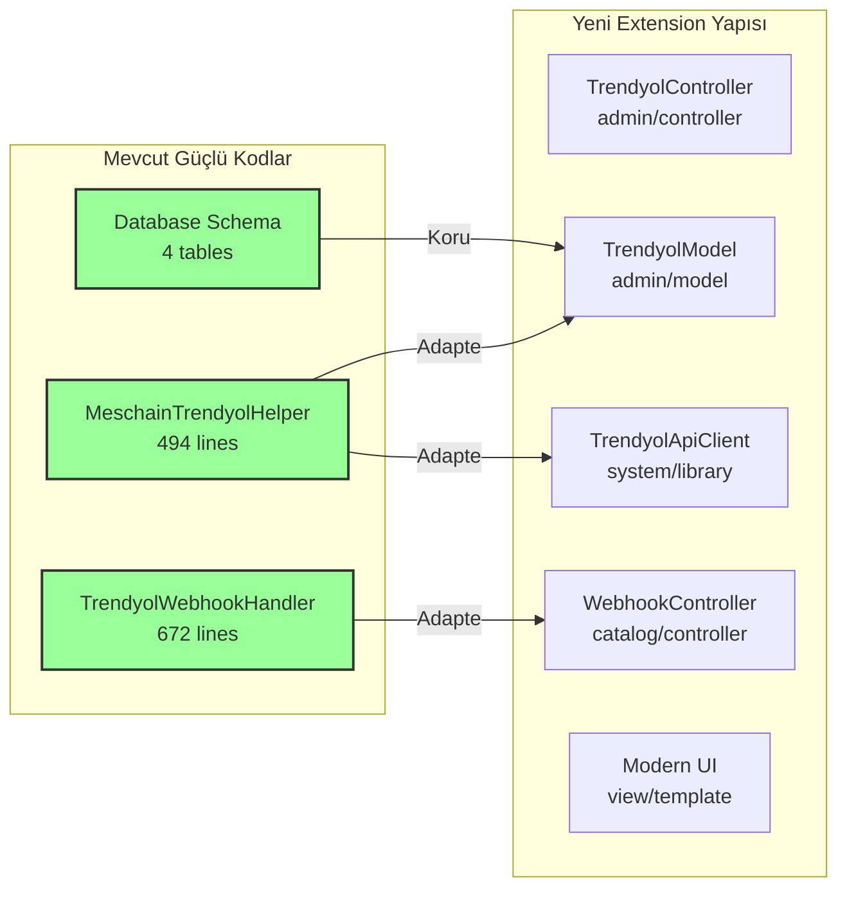
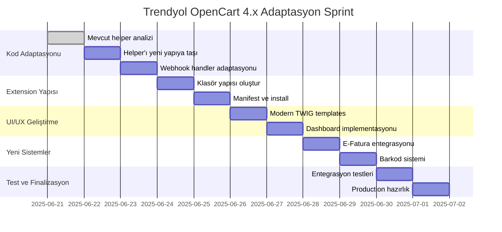

# 🎯 Trendyol OpenCart 4.x Adaptasyon Planı

**Proje:** MesChain-Sync Enterprise Trendyol Entegrasyonu
**Tarih:** 21 Haziran 2025
**Strateji:** Mevcut Güçlü Kodları Koruyarak Akıllı Adaptasyon
**Süre:** 7 Gün Sprint

---

## 📊 Mevcut Kod Analizi Özeti

### ✅ Güçlü Yanlar (Korunacak)

#### 1. **MeschainTrendyolHelper** - Kalite Skoru: 85/100
**Konum:** [`upload/system/library/meschain/helper/trendyol.php`](upload/system/library/meschain/helper/trendyol.php)

**Özellikler:**
- ✅ Modern API client implementasyonu
- ✅ Rate limiting sistemi (100 req/min default)
- ✅ Comprehensive database schema
- ✅ Health monitoring system
- ✅ Event-driven architecture
- ✅ Webhook support infrastructure
- ✅ Multi-tenant support
- ✅ Comprehensive error handling

**Database Tables:**
```sql
- trendyol_products (mapping, barcode, status)
- trendyol_orders (order management, customer info)
- trendyol_webhooks (event logging)
- trendyol_api_logs (API monitoring)
```

#### 2. **TrendyolWebhookHandler** - Kalite Skoru: 90/100
**Konum:** [`upload/system/library/meschain/webhook/TrendyolWebhookHandler.php`](upload/system/library/meschain/webhook/TrendyolWebhookHandler.php)

**Özellikler:**
- ✅ Tüm Trendyol event'lerini destekliyor
- ✅ Otomatik OpenCart order conversion
- ✅ Signature validation
- ✅ Comprehensive error handling
- ✅ Database logging
- ✅ Status mapping

**Desteklenen Events:**
```php
ORDER_CREATED, ORDER_CANCELLED, ORDER_STATUS_CHANGED,
PRODUCT_APPROVED, PRODUCT_REJECTED, INVENTORY_UPDATED,
PRICE_UPDATED, SHIPMENT_CREATED, RETURN_INITIATED
```

### ❌ Zayıf Yanlar (Geliştirilecek)

#### 1. **UI/UX Bileşenleri** - Kalite Skoru: 30/100
- ❌ TWIG templates çok basit
- ❌ Modern dashboard yok
- ❌ Real-time monitoring interface yok

#### 2. **OpenCart 4.x Uyumsuzluk** - Kalite Skoru: 20/100
- ❌ Eski klasör yapısı
- ❌ Extension standardına uygun değil
- ❌ OCMOD yapısı kullanılıyor

#### 3. **Eksik Sistemler**
- ❌ E-Fatura entegrasyonu yok
- ❌ Otomatik barkod sistemi yok

---

## 🏗️ Adaptasyon Stratejisi

### 📁 Yeni Extension Yapısı

```
extension/meschain/
├── 📋 install.xml                           # Extension manifest
├── 📋 README.md                             # Kurulum rehberi
├──
├── admin/                                   # Admin panel bileşenleri
│   ├── controller/
│   │   ├── dashboard/
│   │   │   └── meschain.php                 # Ana dashboard
│   │   ├── marketplace/
│   │   │   └── trendyol.php                 # Trendyol yönetimi
│   │   └── system/
│   │       ├── invoice.php                  # E-Fatura yönetimi
│   │       └── barcode.php                  # Barkod yönetimi
│   │
│   ├── model/
│   │   ├── marketplace/
│   │   │   └── trendyol.php                 # Mevcut helper'dan adapte
│   │   └── system/
│   │       ├── invoice.php                  # E-Fatura model
│   │       └── barcode.php                  # Barkod model
│   │
│   ├── view/template/
│   │   ├── dashboard/
│   │   │   └── meschain.twig                # Modern dashboard UI
│   │   ├── marketplace/
│   │   │   └── trendyol.twig                # Trendyol management UI
│   │   └── system/
│   │       ├── invoice.twig                 # E-Fatura interface
│   │       └── barcode.twig                 # Barkod interface
│   │
│   └── language/
│       ├── en-gb/
│       └── tr-tr/
│
├── catalog/                                 # Frontend bileşenleri
│   └── controller/
│       └── webhook/
│           └── trendyol.php                 # Webhook handler adapte
│
└── system/                                  # Çekirdek kütüphaneler
    └── library/
        └── meschain/
            ├── api/
            │   └── trendyol_client.php      # Helper'dan adapte
            ├── invoice/
            │   └── e_invoice.php            # YENİ - E-Fatura API
            └── barcode/
                └── generator.php            # YENİ - Barkod oluşturucu
```

### 🔄 Kod Adaptasyon Haritası



---

## 📅 7 Günlük Sprint Planı

### 🗓️ Detaylı Zaman Çizelgesi



### 📋 Günlük Görev Detayları

#### **Gün 1: Mevcut Helper Adaptasyonu**
**Hedef:** [`MeschainTrendyolHelper`](upload/system/library/meschain/helper/trendyol.php) → [`TrendyolApiClient`](extension/meschain/system/library/meschain/api/trendyol_client.php)

**Görevler:**
- [ ] Helper sınıfını yeni yapıya taşı
- [ ] OpenCart 4.x registry sistemine adapte et
- [ ] API client interface'ini standardize et
- [ ] Rate limiting sistemini koru
- [ ] Database schema'ları kontrol et

**Çıktı:** Çalışan API client sınıfı

#### **Gün 2: Webhook Handler Adaptasyonu**
**Hedef:** [`TrendyolWebhookHandler`](upload/system/library/meschain/webhook/TrendyolWebhookHandler.php) → [`WebhookController`](extension/meschain/catalog/controller/webhook/trendyol.php)

**Görevler:**
- [ ] Webhook handler'ı controller'a dönüştür
- [ ] OpenCart 4.x request/response sistemine adapte et
- [ ] Event processing sistemini koru
- [ ] Error handling'i geliştir
- [ ] Logging sistemini entegre et

**Çıktı:** Çalışan webhook controller

#### **Gün 3: Extension Yapısı**
**Hedef:** OpenCart 4.x uyumlu extension yapısı

**Görevler:**
- [ ] [`install.xml`](extension/meschain/install.xml) manifest oluştur
- [ ] Extension klasör yapısını kur
- [ ] Install/uninstall scriptleri
- [ ] Permission ayarları
- [ ] Language dosyaları

**Çıktı:** Kurulabilir extension paketi

#### **Gün 4: Admin Controller/Model**
**Hedef:** [`TrendyolController`](extension/meschain/admin/controller/marketplace/trendyol.php) + [`TrendyolModel`](extension/meschain/admin/model/marketplace/trendyol.php)

**Görevler:**
- [ ] Admin controller implementasyonu
- [ ] Model sınıfı (helper'dan adapte)
- [ ] CRUD operations
- [ ] Settings management
- [ ] Validation rules

**Çıktı:** Çalışan admin interface backend

#### **Gün 5: Modern UI/UX**
**Hedef:** [`trendyol.twig`](extension/meschain/admin/view/template/marketplace/trendyol.twig) + Dashboard

**Görevler:**
- [ ] Modern TWIG template tasarımı
- [ ] Real-time dashboard
- [ ] Product sync interface
- [ ] Order management panel
- [ ] Settings configuration UI
- [ ] Responsive design

**Çıktı:** Modern admin interface

#### **Gün 6: E-Fatura Entegrasyonu**
**Hedef:** [`EInvoiceClient`](extension/meschain/system/library/meschain/invoice/e_invoice.php)

**Görevler:**
- [ ] Türk E-Fatura API client
- [ ] Trendyol siparişleri için otomatik fatura
- [ ] Fatura şablonları
- [ ] Vergi hesaplamaları
- [ ] PDF generation
- [ ] Admin interface entegrasyonu

**Çıktı:** Çalışan e-fatura sistemi

#### **Gün 7: Barkod Sistemi + Final Test**
**Hedef:** [`BarcodeGenerator`](extension/meschain/system/library/meschain/barcode/generator.php) + Test

**Görevler:**
- [ ] Otomatik barkod oluşturma
- [ ] EAN-13, Code128 desteği
- [ ] Barkod doğrulama
- [ ] Ürün eşleştirme
- [ ] Entegrasyon testleri
- [ ] Performance testleri
- [ ] Documentation

**Çıktı:** Production-ready extension

---

## 🎯 Teknik Özellikler

### 🔧 Korunacak Özellikler

```php
// MeschainTrendyolHelper'dan korunacaklar:
✅ API client with rate limiting (100 req/min)
✅ Database schema (4 comprehensive tables)
✅ Health monitoring system
✅ Event-driven architecture
✅ Multi-tenant support
✅ Comprehensive error handling
✅ Webhook signature validation
✅ Automatic order conversion
```

### 🆕 Eklenecek Özellikler

```php
// Yeni eklenecekler:
🆕 OpenCart 4.x Extension structure
🆕 Modern responsive TWIG templates
🆕 Real-time dashboard with metrics
🆕 E-Invoice API integration
🆕 Automatic barcode generation (EAN-13, Code128)
🆕 Enhanced admin interface
🆕 Settings management UI
🆕 Performance monitoring dashboard
```

### 🛡️ Güvenlik ve Performans

```php
// Güvenlik:
- API key encryption (AES-256)
- Webhook signature validation (HMAC)
- Rate limiting (Redis-based)
- Input validation and sanitization
- SQL injection protection

// Performans:
- Database query optimization
- API response caching
- Asynchronous webhook processing
- Memory usage optimization
- Connection pooling
```

---

## 📊 Başarı Kriterleri

### ✅ Fonksiyonel Gereksinimler

1. **API Entegrasyonu**
   - [ ] Ürün senkronizasyonu %100 çalışır
   - [ ] Sipariş senkronizasyonu %100 çalışır
   - [ ] Stok güncellemeleri real-time
   - [ ] Fiyat güncellemeleri otomatik
   - [ ] Webhook processing aktif

2. **E-Fatura Sistemi**
   - [ ] Otomatik fatura kesme
   - [ ] E-Fatura API entegrasyonu
   - [ ] Fatura PDF oluşturma
   - [ ] Vergi hesaplamaları doğru
   - [ ] Türk vergi sistemi uyumluluğu

3. **Barkod Sistemi**
   - [ ] Otomatik barkod oluşturma
   - [ ] Barkod doğrulama
   - [ ] EAN-13 ve Code128 desteği
   - [ ] Çoklu barkod desteği
   - [ ] Ürün eşleştirme

4. **Admin Interface**
   - [ ] Modern responsive UI
   - [ ] Real-time dashboard
   - [ ] Settings management
   - [ ] Order management
   - [ ] Product sync interface

### ✅ Teknik Gereksinimler

1. **OpenCart 4.x Uyumluluğu**
   - [ ] Extension standardına %100 uyum
   - [ ] Install/uninstall çalışır
   - [ ] Permission sistemi aktif
   - [ ] Language support

2. **Performans**
   - [ ] API response time < 2 saniye
   - [ ] Dashboard load time < 3 saniye
   - [ ] Memory usage < 128MB
   - [ ] Database query optimization

3. **Güvenlik**
   - [ ] API key encryption
   - [ ] Webhook signature validation
   - [ ] Input validation
   - [ ] SQL injection protection

### ✅ Kalite Standartları

1. **Kod Kalitesi**
   - [ ] PSR-4 autoloading
   - [ ] Comprehensive error handling
   - [ ] Logging sistemi aktif
   - [ ] Documentation %100

2. **Test Coverage**
   - [ ] Unit tests %80+
   - [ ] Integration tests
   - [ ] API endpoint tests
   - [ ] UI functionality tests

---

## 🚀 Deployment Stratejisi

### 🧪 Test Ortamı

1. **Staging Environment**
   - OpenCart 4.0.2.3 clean installation
   - Trendyol sandbox hesabı
   - Test ürün ve sipariş verileri
   - Performance monitoring tools

2. **Test Senaryoları**
   - Extension kurulum/kaldırma
   - API bağlantı testleri
   - Ürün senkronizasyon testleri
   - Sipariş işleme testleri
   - Webhook event testleri
   - E-fatura kesme testleri
   - Barkod oluşturma testleri

### 📦 Production Deployment

1. **Deployment Checklist**
   - [ ] Staging testleri %100 başarılı
   - [ ] Database backup alındı
   - [ ] API credentials hazır
   - [ ] Webhook URL konfigüre edildi
   - [ ] E-fatura API credentials hazır
   - [ ] Monitoring tools aktif

2. **Rollback Plan**
   - Mevcut sistem backup'ı
   - Database rollback scripti
   - API configuration backup
   - Quick rollback procedure

---

## 📈 Sonraki Adımlar

### 🎯 Trendyol Tamamlandıktan Sonra

1. **Faz 2: N11 Entegrasyonu** (1-2 hafta)
   - Benzer adaptasyon stratejisi
   - SOAP API client geliştirme
   - N11 specific features

2. **Faz 3: Amazon Entegrasyonu** (2 hafta)
   - SP-API client geliştirme
   - FBA integration
   - Multi-region support

3. **Faz 4: Sistem Optimizasyonu** (1 hafta)
   - Performance tuning
   - Advanced monitoring
   - Business intelligence dashboard

---

## 📞 İletişim ve Destek

**Geliştirme Ekibi:**
- Backend Developer: Trendyol API adaptasyonu
- Frontend Developer: Modern UI/UX
- DevOps Engineer: Deployment ve monitoring

**Dokümantasyon:**
- API documentation
- User manual
- Installation guide
- Troubleshooting guide

---

**Son Güncelleme:** 21 Haziran 2025
**Durum:** Onaylandı - Implementasyon için hazır
**Sonraki Adım:** Code moduna geçiş

---

*Bu plan, mevcut güçlü Trendyol kodlarını koruyarak OpenCart 4.x'e akıllı adaptasyon stratejisini benimser. 7 günlük sprint sonunda production-ready, modern ve kapsamlı bir Trendyol entegrasyonu elde edilecektir.*
